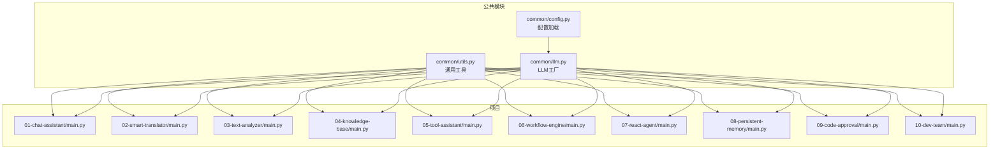
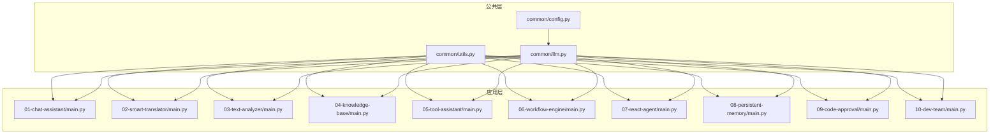
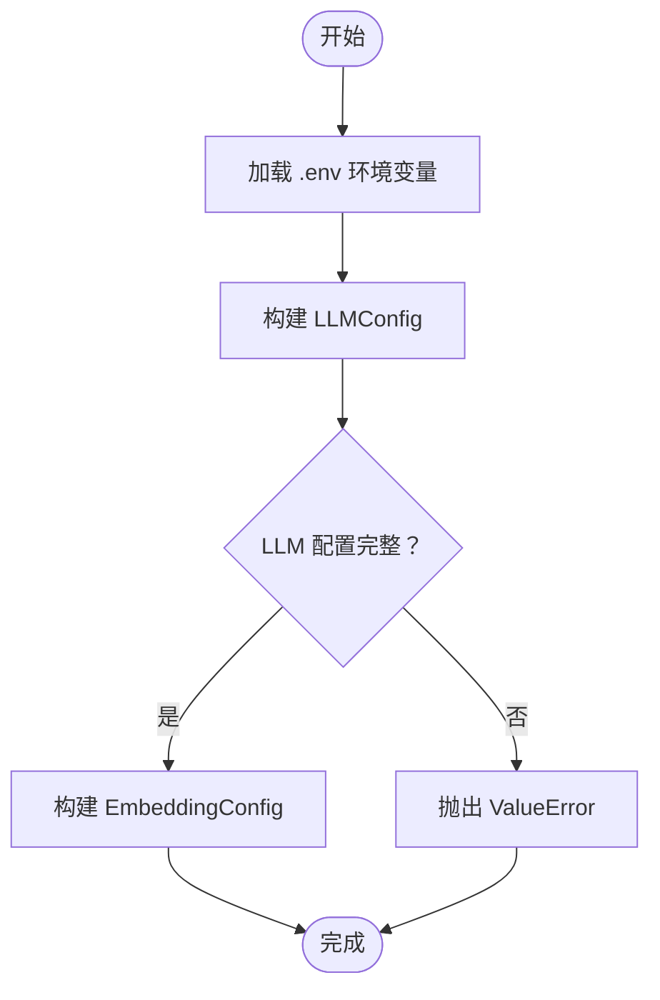
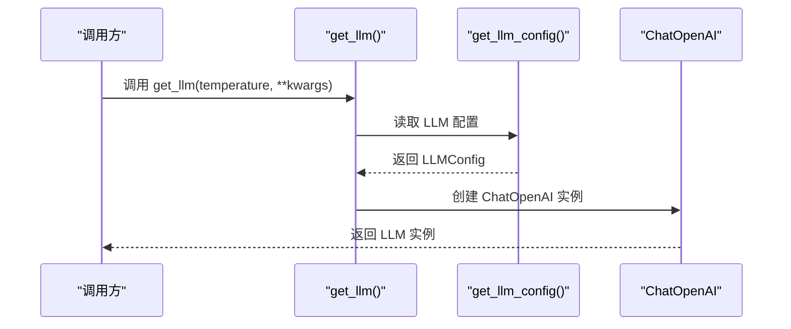
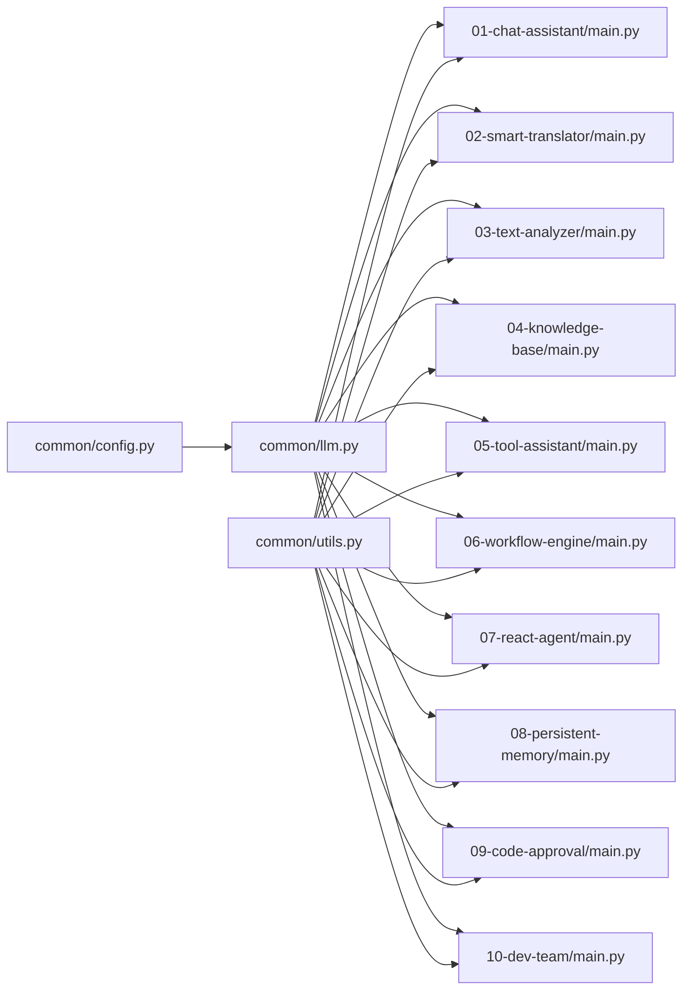

# API参考与工具

<cite>
**本文引用的文件**   
- [common/__init__.py](file://common/__init__.py)
- [common/config.py](file://common/config.py)
- [common/llm.py](file://common/llm.py)
- [common/utils.py](file://common/utils.py)
- [README.md](file://README.md)
- [01-chat-assistant/main.py](file://01-chat-assistant/main.py)
- [02-smart-translator/main.py](file://02-smart-translator/main.py)
- [03-text-analyzer/main.py](file://03-text-analyzer/main.py)
- [04-knowledge-base/main.py](file://04-knowledge-base/main.py)
- [05-tool-assistant/main.py](file://05-tool-assistant/main.py)
- [06-workflow-engine/main.py](file://06-workflow-engine/main.py)
- [07-react-agent/main.py](file://07-react-agent/main.py)
- [08-persistent-memory/main.py](file://08-persistent-memory/main.py)
- [09-code-approval/main.py](file://09-code-approval/main.py)
- [10-dev-team/main.py](file://10-dev-team/main.py)
</cite>

## 目录
1. [简介](#简介)
2. [项目结构](#项目结构)
3. [核心组件](#核心组件)
4. [架构总览](#架构总览)
5. [详细组件分析](#详细组件分析)
6. [依赖分析](#依赖分析)
7. [性能考虑](#性能考虑)
8. [故障排除指南](#故障排除指南)
9. [结论](#结论)
10. [附录](#附录)

## 简介
本文件为“AI Playground”项目的API参考与工具文档，聚焦公共模块与各项目自定义组件的公开接口、参数规范、返回值类型、使用示例、类型注解、错误码与异常处理指导，并提供常见使用模式、集成示例与故障排除建议。文档严格依据仓库内实际代码实现编写，确保API文档与代码一致。

## 项目结构
公共模块位于 common 目录，提供配置加载、LLM工厂与通用工具；其余项目按阶段划分，分别演示LangChain与LangGraph的不同能力，均通过 from common.xxx import yyy 复用公共能力。

**图表来源**
- [common/config.py:1-77](file://common/config.py#L1-L77)
- [common/llm.py:1-59](file://common/llm.py#L1-L59)
- [common/utils.py:1-33](file://common/utils.py#L1-L33)
- [01-chat-assistant/main.py:1-87](file://01-chat-assistant/main.py#L1-L87)
- [02-smart-translator/main.py:1-179](file://02-smart-translator/main.py#L1-L179)
- [03-text-analyzer/main.py:1-240](file://03-text-analyzer/main.py#L1-L240)
- [04-knowledge-base/main.py:1-189](file://04-knowledge-base/main.py#L1-L189)
- [05-tool-assistant/main.py:1-200](file://05-tool-assistant/main.py#L1-L200)
- [06-workflow-engine/main.py:1-238](file://06-workflow-engine/main.py#L1-L238)
- [07-react-agent/main.py:1-173](file://07-react-agent/main.py#L1-L173)
- [08-persistent-memory/main.py:1-308](file://08-persistent-memory/main.py#L1-L308)
- [09-code-approval/main.py:1-219](file://09-code-approval/main.py#L1-L219)
- [10-dev-team/main.py:1-284](file://10-dev-team/main.py#L1-L284)

**章节来源**
- [README.md:89-108](file://README.md#L89-L108)

## 核心组件
本节梳理公共模块的API，包括配置管理、LLM工厂与通用工具。

### 配置管理API
- 模块：common/config.py
- 目标：从环境变量读取并返回类型安全的LLM与Embedding配置对象，提供统一的配置访问入口。

接口清单
- LLMConfig
  - 字段
    - base_url: str
    - api_key: str
    - model_name: str
  - 用途：封装LLM服务端点、密钥与模型名
  - 复杂度：O(1)
  - 异常：若缺失必要字段，将在构造函数处抛出错误（见“异常处理”）

- EmbeddingConfig
  - 字段
    - base_url: str
    - api_key: str
    - model_name: str
  - 用途：封装Embedding服务端点、密钥与模型名
  - 复杂度：O(1)

- get_llm_config() -> LLMConfig
  - 说明：从环境变量读取LLM配置；若缺少关键字段，抛出清晰错误
  - 默认值
    - LLM_BASE_URL: http://localhost:11434/v1
    - LLM_API_KEY: ollama
    - LLM_MODEL_NAME: qwen2.5:7b
  - 返回：LLMConfig实例
  - 异常：ValueError（当缺少必要配置时）
  - 复杂度：O(1)

- get_embedding_config() -> EmbeddingConfig
  - 说明：从环境变量读取Embedding配置；若未单独配置则回退至LLM配置
  - 默认值
    - EMBEDDING_BASE_URL: 若未设置则回退LLM_BASE_URL或默认端点
    - EMBEDDING_API_KEY: 若未设置则回退LLM_API_KEY或默认值
    - EMBEDDING_MODEL_NAME: nomic-embed-text
  - 返回：EmbeddingConfig实例
  - 异常：无（若端点为空，调用方需自行处理）
  - 复杂度：O(1)

使用示例（路径）
- [common/config.py:33-56](file://common/config.py#L33-L56)
- [common/config.py:59-76](file://common/config.py#L59-L76)

**章节来源**
- [common/config.py:17-76](file://common/config.py#L17-L76)

### LLM工厂接口
- 模块：common/llm.py
- 目标：提供统一的ChatOpenAI与Embeddings实例创建入口，屏蔽底层细节，支持任意OpenAI兼容API。

接口清单
- get_llm(temperature: float = 0.7, **kwargs) -> ChatOpenAI
  - 说明：返回已配置的ChatOpenAI实例，优先使用显式参数，其次使用配置模块读取的环境变量
  - 参数
    - temperature: 生成温度（0.0严谨/0.7平衡/1.0创意）
    - **kwargs: 透传给ChatOpenAI的额外参数
  - 返回：ChatOpenAI实例
  - 行为：启用流式输出（streaming=True）
  - 复杂度：O(1)
  - 使用示例（路径）
    - [common/llm.py:13-40](file://common/llm.py#L13-L40)

- get_embeddings() -> OpenAIEmbeddings
  - 说明：返回已配置的Embeddings实例，用于RAG等场景
  - 返回：OpenAIEmbeddings实例
  - 复杂度：O(1)
  - 使用示例（路径）
    - [common/llm.py:43-58](file://common/llm.py#L43-L58)

**章节来源**
- [common/llm.py:13-58](file://common/llm.py#L13-L58)

### 通用工具函数库
- 模块：common/utils.py
- 目标：提供跨项目复用的辅助功能，包括命令行输出美化与步骤打印。

接口清单
- print_separator(title: str = "", char: str = "=", width: int = 60)
  - 说明：打印分隔线，用于美化命令行输出
  - 参数
    - title: 标题文本（可选）
    - char: 分隔字符
    - width: 宽度
  - 返回：None
  - 复杂度：O(width)

- print_step(step: str, content: str = "")
  - 说明：打印步骤信息，支持附加内容
  - 参数
    - step: 步骤标题
    - content: 步骤内容（可选）
  - 返回：None
  - 复杂度：O(1)

使用示例（路径）
- [common/utils.py:16-32](file://common/utils.py#L16-L32)

**章节来源**
- [common/utils.py:16-32](file://common/utils.py#L16-L32)

## 架构总览
公共模块与各项目之间的关系如下：

**图表来源**
- [common/config.py:1-77](file://common/config.py#L1-L77)
- [common/llm.py:1-59](file://common/llm.py#L1-L59)
- [common/utils.py:1-33](file://common/utils.py#L1-L33)
- [01-chat-assistant/main.py:1-87](file://01-chat-assistant/main.py#L1-L87)
- [02-smart-translator/main.py:1-179](file://02-smart-translator/main.py#L1-L179)
- [03-text-analyzer/main.py:1-240](file://03-text-analyzer/main.py#L1-L240)
- [04-knowledge-base/main.py:1-189](file://04-knowledge-base/main.py#L1-L189)
- [05-tool-assistant/main.py:1-200](file://05-tool-assistant/main.py#L1-L200)
- [06-workflow-engine/main.py:1-238](file://06-workflow-engine/main.py#L1-L238)
- [07-react-agent/main.py:1-173](file://07-react-agent/main.py#L1-L173)
- [08-persistent-memory/main.py:1-308](file://08-persistent-memory/main.py#L1-L308)
- [09-code-approval/main.py:1-219](file://09-code-approval/main.py#L1-L219)
- [10-dev-team/main.py:1-284](file://10-dev-team/main.py#L1-L284)

## 详细组件分析

### 配置管理API详解
- 配置加载流程
  - 从.env文件读取环境变量
  - 通过dataclass封装配置，提供类型安全访问
  - LLM与Embedding配置相互独立，Embedding可回退至LLM配置

- 错误处理
  - LLM配置缺失关键字段时抛出ValueError，提示在根目录创建.env并填写必要字段

- 使用模式
  - 在各项目中统一通过get_llm_config()/get_embedding_config()获取配置
  - LLM工厂优先使用显式参数，其次使用配置模块读取的环境变量

**图表来源**
- [common/config.py:13-14](file://common/config.py#L13-L14)
- [common/config.py:33-56](file://common/config.py#L33-L56)
- [common/config.py:59-76](file://common/config.py#L59-L76)

**章节来源**
- [common/config.py:33-76](file://common/config.py#L33-L76)

### LLM工厂接口详解
- 工厂职责
  - 统一创建ChatOpenAI实例，支持任意OpenAI兼容API
  - 统一创建Embeddings实例，用于RAG场景

- 参数优先级
  - 显式传入的参数优先于配置模块读取的环境变量
  - 默认启用流式输出，便于实时展示

- 使用模式
  - 在各项目中通过from common.llm import get_llm导入
  - 通过with_structured_output等LangChain特性实现结构化输出

**图表来源**
- [common/llm.py:13-40](file://common/llm.py#L13-L40)
- [common/config.py:33-56](file://common/config.py#L33-L56)

**章节来源**
- [common/llm.py:13-58](file://common/llm.py#L13-L58)

### 通用工具函数库详解
- print_separator
  - 用途：打印分隔线，美化命令行输出
  - 参数：标题、分隔字符、宽度
  - 复杂度：O(width)

- print_step
  - 用途：打印步骤信息，支持附加内容
  - 参数：步骤标题、内容
  - 复杂度：O(1)

- 使用模式
  - 在各项目main函数中调用print_separator/print_step组织输出
  - 保持统一的输出风格，提升可读性

**章节来源**
- [common/utils.py:16-32](file://common/utils.py#L16-L32)

### 各项目自定义组件API说明

#### P1: LLM对话助手
- 关键接口
  - main(): 交互式对话循环，维护消息历史
- 参数与返回
  - 无显式函数参数；内部通过get_llm_config()/get_llm()获取配置与实例
- 使用示例（路径）
  - [01-chat-assistant/main.py:27-83](file://01-chat-assistant/main.py#L27-L83)

**章节来源**
- [01-chat-assistant/main.py:27-83](file://01-chat-assistant/main.py#L27-L83)

#### P2: 智能翻译器
- 关键接口
  - demo_string_output(): 字符串输出翻译
  - demo_structured_output(): 结构化输出翻译（with_structured_output）
  - demo_interactive(): 交互式翻译
- 参数与返回
  - 输入：文本、目标语言
  - 输出：字符串或结构化对象（TranslationResult）
- 使用示例（路径）
  - [02-smart-translator/main.py:29-107](file://02-smart-translator/main.py#L29-L107)
  - [02-smart-translator/main.py:109-157](file://02-smart-translator/main.py#L109-L157)

**章节来源**
- [02-smart-translator/main.py:29-157](file://02-smart-translator/main.py#L29-L157)

#### P3: 文本分析管道
- 关键接口
  - demo_single_chain(): 单链情感分析
  - demo_structured_chain(): 结构化输出情感分析
  - demo_assign_chain(): 多步分析汇总（RunnablePassthrough.assign）
  - demo_full_report(): 完整分析报告（结构化）
  - demo_interactive(): 交互式文本分析
- 参数与返回
  - 输入：文本
  - 输出：字符串或结构化对象（SentimentResult/AnalysisReport）
- 使用示例（路径）
  - [03-text-analyzer/main.py:33-148](file://03-text-analyzer/main.py#L33-L148)
  - [03-text-analyzer/main.py:151-221](file://03-text-analyzer/main.py#L151-L221)

**章节来源**
- [03-text-analyzer/main.py:33-221](file://03-text-analyzer/main.py#L33-L221)

#### P4: 知识库问答（RAG）
- 关键接口
  - build_rag_chain(): 构建RAG链
  - demo_rag_with_sources(): 带来源引用的RAG
  - demo_interactive(): 交互式问答
- 参数与返回
  - 输入：问题
  - 输出：答案字符串
- 使用示例（路径）
  - [04-knowledge-base/main.py:47-91](file://04-knowledge-base/main.py#L47-L91)
  - [04-knowledge-base/main.py:94-163](file://04-knowledge-base/main.py#L94-L163)

**章节来源**
- [04-knowledge-base/main.py:47-163](file://04-knowledge-base/main.py#L47-L163)

#### P5: 智能工具助手
- 关键接口
  - run_agent(llm, tools, user_input): 手动工具调用循环
  - demo_*(): 各种演示（单次/多次/知识库搜索/交互式）
- 参数与返回
  - 输入：LLM实例、工具列表、用户输入
  - 输出：最终回复文本
- 使用示例（路径）
  - [05-tool-assistant/main.py:42-114](file://05-tool-assistant/main.py#L42-L114)
  - [05-tool-assistant/main.py:117-195](file://05-tool-assistant/main.py#L117-L195)

**章节来源**
- [05-tool-assistant/main.py:42-195](file://05-tool-assistant/main.py#L42-L195)

#### P6: 文档审批工作流（StateGraph）
- 关键接口
  - build_workflow(): 构建StateGraph
  - run_workflow(topic): 运行工作流
  - demo_stream(): 流式执行
  - demo_interactive(): 交互式工作流
- 参数与返回
  - 输入：主题/初始状态
  - 输出：最终状态
- 使用示例（路径）
  - [06-workflow-engine/main.py:44-110](file://06-workflow-engine/main.py#L44-L110)
  - [06-workflow-engine/main.py:113-211](file://06-workflow-engine/main.py#L113-L211)

**章节来源**
- [06-workflow-engine/main.py:44-211](file://06-workflow-engine/main.py#L44-L211)

#### P7: ReAct研究助手（create_react_agent）
- 关键接口
  - demo_simple_query(): 简单查询（单次工具调用）
  - demo_multi_tool_query(): 多轮工具调用
  - demo_stream(): 流式执行
  - demo_interactive(): 交互式Agent
- 参数与返回
  - 输入：LLM实例、工具列表、用户消息
  - 输出：最终回复
- 使用示例（路径）
  - [07-react-agent/main.py:35-128](file://07-react-agent/main.py#L35-L128)
  - [07-react-agent/main.py:131-152](file://07-react-agent/main.py#L131-L152)

**章节来源**
- [07-react-agent/main.py:35-152](file://07-react-agent/main.py#L35-L152)

#### P8: 持久化记忆助手（Checkpoints）
- 关键接口
  - build_memory_agent(): 构建带记忆的图
  - demo_memory()/demo_multi_session()/demo_get_state()/demo_interactive()
- 参数与返回
  - 输入：thread_id、消息列表
  - 输出：最终回复与状态
- 使用示例（路径）
  - [08-persistent-memory/main.py:39-151](file://08-persistent-memory/main.py#L39-L151)
  - [08-persistent-memory/main.py:154-285](file://08-persistent-memory/main.py#L154-L285)

**章节来源**
- [08-persistent-memory/main.py:39-285](file://08-persistent-memory/main.py#L39-L285)

#### P9: 代码审批系统（Human-in-the-Loop）
- 关键接口
  - run_approval_flow(requirement): 完整审批流程
- 参数与返回
  - 输入：需求描述
  - 输出：执行结果
- 使用示例（路径）
  - [09-code-approval/main.py:35-178](file://09-code-approval/main.py#L35-L178)

**章节来源**
- [09-code-approval/main.py:35-178](file://09-code-approval/main.py#L35-L178)

#### P10: 多智能体开发团队
- 关键接口
  - build_team_graph(): 构建主图
  - run_team(request): 运行团队
  - demo_stream_messages()/demo_interactive()
- 参数与返回
  - 输入：用户需求
  - 输出：最终状态与结果
- 使用示例（路径）
  - [10-dev-team/main.py:43-106](file://10-dev-team/main.py#L43-L106)
  - [10-dev-team/main.py:109-180](file://10-dev-team/main.py#L109-L180)
  - [10-dev-team/main.py:182-246](file://10-dev-team/main.py#L182-L246)

**章节来源**
- [10-dev-team/main.py:43-246](file://10-dev-team/main.py#L43-L246)

## 依赖分析
- 模块耦合
  - common/config.py与common/llm.py强耦合：LLM工厂依赖配置模块
  - 各项目仅依赖common模块，降低重复与耦合
- 外部依赖
  - langchain_openai：ChatOpenAI与OpenAIEmbeddings
  - langchain_core：消息类型、Runnable、Prompt模板、输出解析器等
  - langgraph：StateGraph、节点、条件边、检查点等

**图表来源**
- [common/config.py:1-77](file://common/config.py#L1-L77)
- [common/llm.py:1-59](file://common/llm.py#L1-L59)
- [common/utils.py:1-33](file://common/utils.py#L1-L33)
- [01-chat-assistant/main.py:1-87](file://01-chat-assistant/main.py#L1-L87)
- [02-smart-translator/main.py:1-179](file://02-smart-translator/main.py#L1-L179)
- [03-text-analyzer/main.py:1-240](file://03-text-analyzer/main.py#L1-L240)
- [04-knowledge-base/main.py:1-189](file://04-knowledge-base/main.py#L1-L189)
- [05-tool-assistant/main.py:1-200](file://05-tool-assistant/main.py#L1-L200)
- [06-workflow-engine/main.py:1-238](file://06-workflow-engine/main.py#L1-L238)
- [07-react-agent/main.py:1-173](file://07-react-agent/main.py#L1-L173)
- [08-persistent-memory/main.py:1-308](file://08-persistent-memory/main.py#L1-L308)
- [09-code-approval/main.py:1-219](file://09-code-approval/main.py#L1-L219)
- [10-dev-team/main.py:1-284](file://10-dev-team/main.py#L1-L284)

**章节来源**
- [common/config.py:1-77](file://common/config.py#L1-L77)
- [common/llm.py:1-59](file://common/llm.py#L1-L59)
- [common/utils.py:1-33](file://common/utils.py#L1-L33)

## 性能考虑
- 流式输出
  - LLM工厂默认启用流式输出，适合实时展示与交互式应用
- 消息历史管理
  - 长对话可通过摘要节点压缩历史，降低上下文开销
- 检查点与内存
  - InMemorySaver适用于演示与短时会话；生产环境建议使用持久化存储
- 工具调用循环
  - 限制最大迭代次数，防止无限循环

## 故障排除指南
- 配置相关
  - 缺少LLM配置：检查.env文件是否正确设置LLM_BASE_URL与LLM_MODEL_NAME
  - Embedding端点未配置：可回退至LLM配置，或显式设置EMBEDDING_*变量
- LLM调用失败
  - 确认base_url与api_key正确
  - 检查模型名称是否可用
- RAG链异常
  - 确认向量索引已生成（P4）
- 工具调用循环
  - 检查工具名称与参数是否匹配
  - 确保ToolMessage携带正确的tool_call_id
- 多智能体与工作流
  - 检查thread_id是否一致以共享状态
  - 确认条件路由函数返回有效节点名

**章节来源**
- [common/config.py:46-50](file://common/config.py#L46-L50)
- [04-knowledge-base/main.py:171-176](file://04-knowledge-base/main.py#L171-L176)
- [05-tool-assistant/main.py:96-114](file://05-tool-assistant/main.py#L96-L114)
- [08-persistent-memory/main.py:165](file://08-persistent-memory/main.py#L165)

## 结论
本API参考与工具文档系统性梳理了公共模块与各项目组件的接口与使用方式，强调了配置管理、LLM工厂与通用工具的重要性，并结合各阶段项目展示了典型使用模式与集成示例。建议在实际开发中遵循统一的配置与工厂入口，以获得更好的可维护性与一致性。

## 附录
- 环境变量参考
  - LLM_BASE_URL、LLM_API_KEY、LLM_MODEL_NAME
  - EMBEDDING_BASE_URL、EMBEDDING_API_KEY、EMBEDDING_MODEL_NAME
- 快速验证
  - 运行python -c "from common.llm import get_llm; print(get_llm().invoke('你好').content)" 验证连通性

**章节来源**
- [README.md:75-87](file://README.md#L75-L87)
- [README.md:22-24](file://README.md#L22-L24)