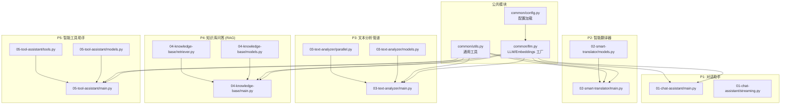
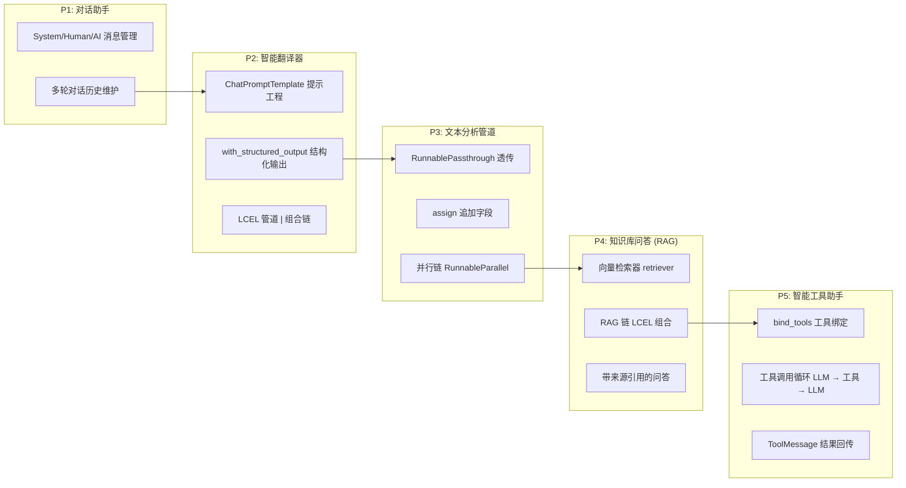
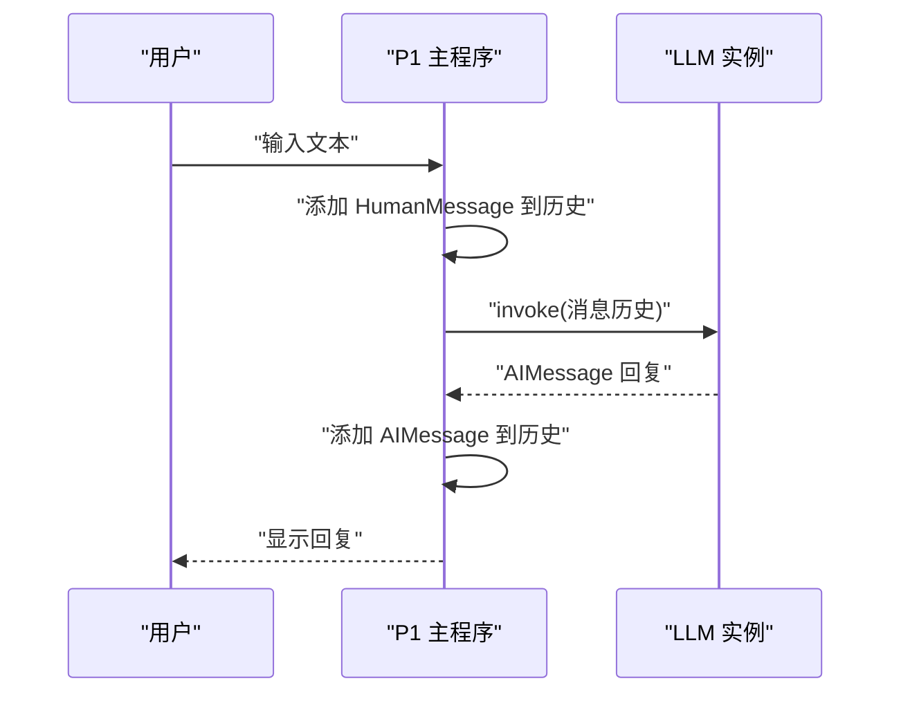
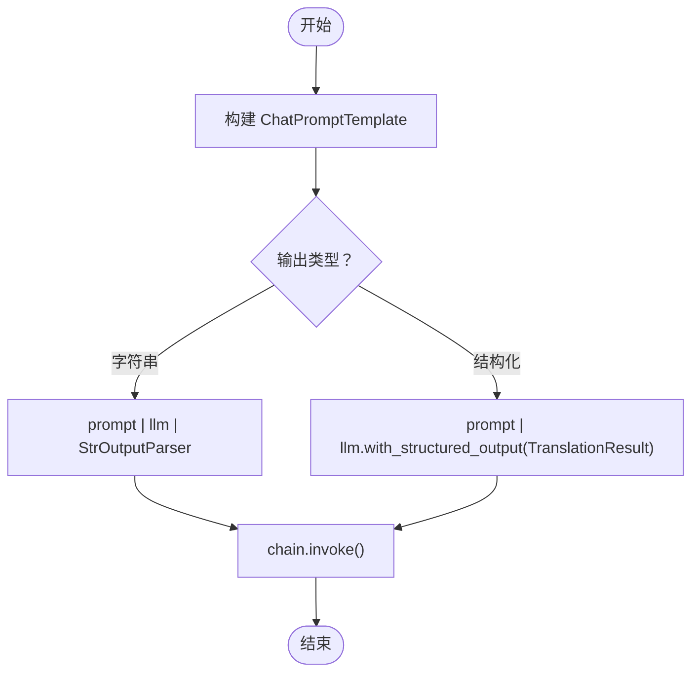
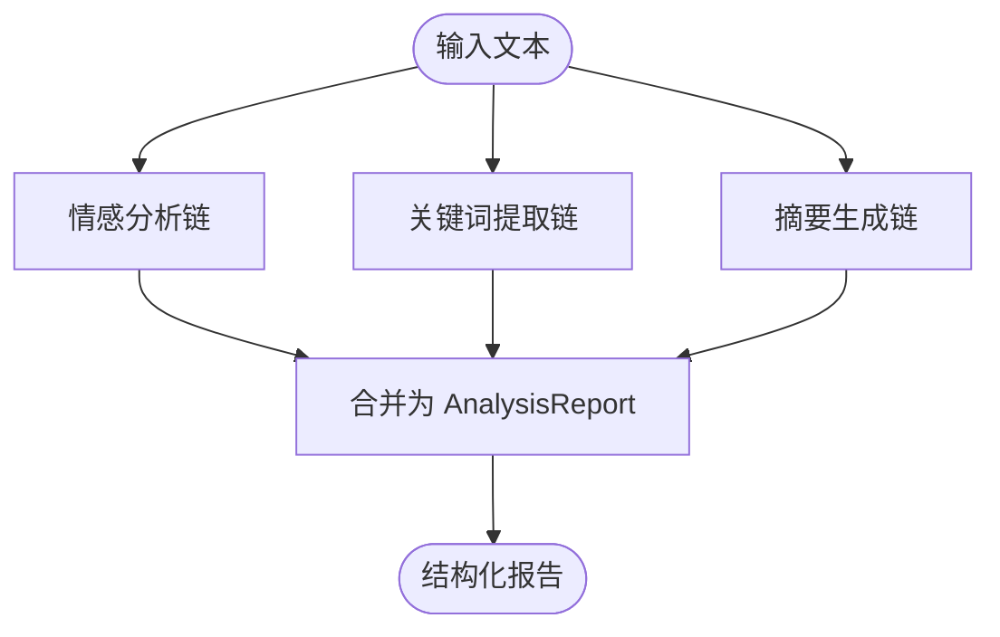
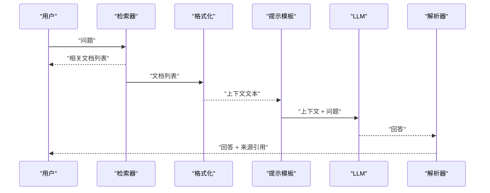
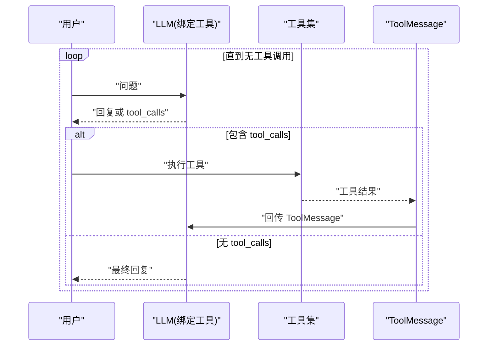
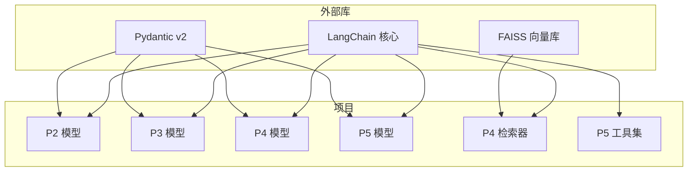

# LangChain基础项目

<cite>
**本文引用的文件**
- [README.md](file://README.md)
- [pyproject.toml](file://pyproject.toml)
- [common/config.py](file://common/config.py)
- [common/llm.py](file://common/llm.py)
- [common/utils.py](file://common/utils.py)
- [01-chat-assistant/main.py](file://01-chat-assistant/main.py)
- [01-chat-assistant/streaming.py](file://01-chat-assistant/streaming.py)
- [02-smart-translator/main.py](file://02-smart-translator/main.py)
- [02-smart-translator/models.py](file://02-smart-translator/models.py)
- [03-text-analyzer/main.py](file://03-text-analyzer/main.py)
- [03-text-analyzer/models.py](file://03-text-analyzer/models.py)
- [03-text-analyzer/parallel.py](file://03-text-analyzer/parallel.py)
- [04-knowledge-base/main.py](file://04-knowledge-base/main.py)
- [04-knowledge-base/models.py](file://04-knowledge-base/models.py)
- [04-knowledge-base/retriever.py](file://04-knowledge-base/retriever.py)
- [05-tool-assistant/main.py](file://05-tool-assistant/main.py)
- [05-tool-assistant/models.py](file://05-tool-assistant/models.py)
- [05-tool-assistant/tools.py](file://05-tool-assistant/tools.py)
</cite>

## 目录
1. [简介](#简介)
2. [项目结构](#项目结构)
3. [核心组件](#核心组件)
4. [架构概览](#架构概览)
5. [详细组件分析](#详细组件分析)
6. [依赖分析](#依赖分析)
7. [性能考虑](#性能考虑)
8. [故障排除指南](#故障排除指南)
9. [结论](#结论)
10. [附录](#附录)

## 简介
本指南面向希望系统掌握 LangChain 与 LangGraph 的学习者，提供从 P1 到 P5 的五期渐进式项目实战。项目覆盖 LLM 对话管理、Prompt 工程、LCEL 链式调用、RAG 系统与工具集成的完整知识体系。通过 10 个循序渐进的项目，建立从 LLM 基础到工作流、代理、持久化与多智能体的完整技能树。

- 学习路径总览与阶段划分
  - Phase 1: LangChain 基础（P1-P5）
  - Phase 2: LangGraph 基础（P6-P7）
  - Phase 3: LangGraph 高级（P8-P10）

- 配置与环境准备
  - 通过 .env 文件配置 LLM 与 Embedding，支持多种 OpenAI 兼容服务（本地 Ollama、DeepSeek、通义千问、智谱 GLM、OpenAI 等）
  - 使用公共模块统一初始化 LLM 与 Embeddings，便于跨项目复用

**章节来源**
- [README.md:1-108](file://README.md#L1-L108)

## 项目结构
项目采用“按阶段分层”的组织方式，每个阶段包含若干子项目，逐步引入新的概念与技术栈。公共模块（common）提供配置、LLM 初始化与通用工具，所有子项目均可复用。

**图表来源**
- [common/config.py:1-77](file://common/config.py#L1-L77)
- [common/llm.py:1-59](file://common/llm.py#L1-L59)
- [common/utils.py:1-33](file://common/utils.py#L1-L33)
- [01-chat-assistant/main.py:1-87](file://01-chat-assistant/main.py#L1-L87)
- [02-smart-translator/main.py:1-179](file://02-smart-translator/main.py#L1-L179)
- [03-text-analyzer/main.py:1-240](file://03-text-analyzer/main.py#L1-L240)
- [04-knowledge-base/main.py:1-189](file://04-knowledge-base/main.py#L1-L189)
- [05-tool-assistant/main.py:1-200](file://05-tool-assistant/main.py#L1-L200)

**章节来源**
- [README.md:89-108](file://README.md#L89-L108)

## 核心组件
本项目的核心在于“公共模块 + 项目化实践”的组合：
- 配置模块：集中管理 LLM 与 Embedding 的 base_url、api_key、model_name，支持类型安全访问与默认值
- LLM 工厂：统一创建 ChatOpenAI/Embeddings 实例，支持温度、流式输出等参数
- 通用工具：提供跨项目复用的输出美化与步骤提示

这些组件贯穿 P1-P5，确保各项目在配置与初始化上保持一致，降低学习成本并提升可维护性。

**章节来源**
- [common/config.py:17-77](file://common/config.py#L17-L77)
- [common/llm.py:13-59](file://common/llm.py#L13-L59)
- [common/utils.py:16-33](file://common/utils.py#L16-L33)

## 架构概览
下面以 P1-P5 为主线，展示从“对话管理”到“工具调用”的知识迁移路径与技术演进：

**图表来源**
- [01-chat-assistant/main.py:27-83](file://01-chat-assistant/main.py#L27-L83)
- [02-smart-translator/main.py:29-107](file://02-smart-translator/main.py#L29-L107)
- [03-text-analyzer/main.py:33-149](file://03-text-analyzer/main.py#L33-L149)
- [04-knowledge-base/main.py:47-91](file://04-knowledge-base/main.py#L47-L91)
- [05-tool-assistant/main.py:42-115](file://05-tool-assistant/main.py#L42-L115)

## 详细组件分析

### P1: LLM 对话助手（消息类型与多轮对话）
- 核心概念
  - 使用 SystemMessage、HumanMessage、AIMessage 构建消息历史
  - invoke() 调用实现同步回复；streaming 可在后续项目中启用
  - 通过维护消息列表实现上下文延续
- 关键实现要点
  - 从公共模块获取 LLM 配置与实例
  - 交互式循环支持 quit/exit 退出与 clear 清空历史
- 学习要点
  - 理解消息类型与角色设定对输出的影响
  - 掌握多轮对话的历史维护与长度控制

**图表来源**
- [01-chat-assistant/main.py:27-83](file://01-chat-assistant/main.py#L27-L83)

**章节来源**
- [01-chat-assistant/main.py:1-87](file://01-chat-assistant/main.py#L1-L87)

### P2: 智能翻译器（Prompt 工程与结构化输出）
- 核心概念
  - ChatPromptTemplate 构建提示模板，with_structured_output 返回 Pydantic 对象
  - LCEL 管道通过 | 组合 prompt → llm → parser
- 关键实现要点
  - 定义 TranslationResult 模型，约束字段与范围
  - 支持字符串输出与结构化输出两种模式
  - 交互式翻译器解析“文本 | 目标语言”格式
- 学习要点
  - 结构化输出的优势：类型安全、自动校验、减少解析开销
  - Prompt 工程对输出格式与质量的影响

**图表来源**
- [02-smart-translator/main.py:29-107](file://02-smart-translator/main.py#L29-L107)
- [02-smart-translator/models.py:11-46](file://02-smart-translator/models.py#L11-L46)

**章节来源**
- [02-smart-translator/main.py:1-179](file://02-smart-translator/main.py#L1-L179)
- [02-smart-translator/models.py:1-46](file://02-smart-translator/models.py#L1-L46)

### P3: 文本分析管道（LCEL 链式调用与并行链）
- 核心概念
  - RunnablePassthrough 透传输入；assign 追加字段；with_structured_output 输出结构化对象
  - RunnableParallel 并行执行多个链，显著降低总耗时
- 关键实现要点
  - 多步分析：情感 → 关键词 → 摘要，逐步 assign 合并
  - 并行链对比：串行逐个调用 vs 并行同时调用
  - 交互式分析器支持持续输入与异常处理
- 学习要点
  - 数据流在链中的传递与合并
  - 并行执行对 LLM 调用的优化

**图表来源**
- [03-text-analyzer/main.py:81-149](file://03-text-analyzer/main.py#L81-L149)
- [03-text-analyzer/parallel.py:92-157](file://03-text-analyzer/parallel.py#L92-L157)

**章节来源**
- [03-text-analyzer/main.py:1-240](file://03-text-analyzer/main.py#L1-L240)
- [03-text-analyzer/models.py:1-30](file://03-text-analyzer/models.py#L1-L30)
- [03-text-analyzer/parallel.py:1-220](file://03-text-analyzer/parallel.py#L1-L220)

### P4: 知识库问答（RAG 系统）
- 核心概念
  - 使用 retriever 检索相关文档，format_docs 格式化为上下文
  - LCEL 构建 RAG 链：{context: retriever|format, question: passthrough} → prompt → llm → parser
- 关键实现要点
  - 检索策略：similarity 与 MMR（最大边际相关性）对比
  - 带来源引用的问答：同时返回 answer 与 sources
  - 交互式问答：先检索再回答，支持异常处理
- 学习要点
  - 上下文注入与“只基于上下文回答”的提示工程
  - 检索策略对召回质量与多样性的权衡

**图表来源**
- [04-knowledge-base/main.py:47-91](file://04-knowledge-base/main.py#L47-L91)
- [04-knowledge-base/retriever.py:128-139](file://04-knowledge-base/retriever.py#L128-L139)

**章节来源**
- [04-knowledge-base/main.py:1-189](file://04-knowledge-base/main.py#L1-L189)
- [04-knowledge-base/retriever.py:1-160](file://04-knowledge-base/retriever.py#L1-L160)
- [04-knowledge-base/models.py:1-13](file://04-knowledge-base/models.py#L1-L13)

### P5: 智能工具助手（工具绑定与调用循环）
- 核心概念
  - bind_tools 将工具列表绑定到 LLM；检查 AIMessage.tool_calls 决定是否调用工具
  - 手动实现工具调用循环：LLM → 工具 → ToolMessage → LLM，直至无工具调用
- 关键实现要点
  - 工具定义：@tool 装饰器自动生成描述与参数 schema
  - 工具集：天气查询、数学计算、知识库搜索、时间查询
  - 交互式助手：支持持续对话与工具链式调用
- 学习要点
  - 工具调用循环是理解 Agent 的关键前置知识
  - ToolMessage 的 tool_call_id 必须与调用一一对应

**图表来源**
- [05-tool-assistant/main.py:42-115](file://05-tool-assistant/main.py#L42-L115)
- [05-tool-assistant/tools.py:30-125](file://05-tool-assistant/tools.py#L30-L125)

**章节来源**
- [05-tool-assistant/main.py:1-200](file://05-tool-assistant/main.py#L1-L200)
- [05-tool-assistant/tools.py:1-145](file://05-tool-assistant/tools.py#L1-L145)
- [05-tool-assistant/models.py:1-14](file://05-tool-assistant/models.py#L1-L14)

## 依赖分析
- 模块耦合与复用
  - 所有项目均依赖 common/llm.py 与 common/config.py，保证 LLM/Embeddings 初始化一致性
  - P3 并行链与 P4 RAG 都使用 RunnableParallel/RunnablePassthrough，体现 LCEL 的可组合性
  - P5 工具助手复用 P4 的检索器作为工具之一，展示模块间协作
- 外部依赖
  - LangChain 核心组件：ChatOpenAI、ChatPromptTemplate、StrOutputParser、Runnable* 等
  - 向量存储：FAISS（用于 P4 检索器）
  - Pydantic v2（用于结构化输出的数据模型）

**图表来源**
- [02-smart-translator/models.py:8](file://02-smart-translator/models.py#L8)
- [03-text-analyzer/models.py:7](file://03-text-analyzer/models.py#L7)
- [04-knowledge-base/models.py:5](file://04-knowledge-base/models.py#L5)
- [05-tool-assistant/models.py:5](file://05-tool-assistant/models.py#L5)
- [04-knowledge-base/retriever.py:21](file://04-knowledge-base/retriever.py#L21)
- [05-tool-assistant/tools.py:16](file://05-tool-assistant/tools.py#L16)

**章节来源**
- [02-smart-translator/models.py:1-46](file://02-smart-translator/models.py#L1-L46)
- [03-text-analyzer/models.py:1-30](file://03-text-analyzer/models.py#L1-L30)
- [04-knowledge-base/models.py:1-13](file://04-knowledge-base/models.py#L1-L13)
- [05-tool-assistant/models.py:1-14](file://05-tool-assistant/models.py#L1-L14)
- [04-knowledge-base/retriever.py:1-160](file://04-knowledge-base/retriever.py#L1-L160)
- [05-tool-assistant/tools.py:1-145](file://05-tool-assistant/tools.py#L1-L145)

## 性能考虑
- 并行链优化
  - P3 的并行链将多个独立 LLM 调用同时发送，总耗时接近最慢单次调用，显著缩短响应时间
- 检索策略
  - P4 的 MMR 策略在相关性与多样性之间取得平衡，避免返回高度重复的文档块
- 工具调用循环
  - P5 的工具调用循环限制最大迭代次数，防止无限循环；合理设计工具参数可减少往返次数

**章节来源**
- [03-text-analyzer/parallel.py:92-157](file://03-text-analyzer/parallel.py#L92-L157)
- [04-knowledge-base/retriever.py:91-126](file://04-knowledge-base/retriever.py#L91-L126)
- [05-tool-assistant/main.py:74-115](file://05-tool-assistant/main.py#L74-L115)

## 故障排除指南
- 环境变量缺失
  - 症状：启动时报错提示缺少 LLM 配置
  - 处理：复制 .env.example 为 .env，填写 LLM_BASE_URL 与 LLM_MODEL_NAME
- 向量索引不存在（P4）
  - 症状：提示需要先运行数据入库脚本
  - 处理：在 P4 目录运行数据入库脚本，生成向量索引后再运行主程序
- 工具调用失败
  - 症状：工具执行报错或返回错误信息
  - 处理：检查工具参数合法性与工具实现；确认 ToolMessage 的 tool_call_id 与调用匹配
- 结构化输出异常
  - 症状：模型未能严格遵循 JSON Schema
  - 处理：提高提示模板的明确性，必要时提升模型温度或更换更强模型

**章节来源**
- [common/config.py:33-56](file://common/config.py#L33-L56)
- [04-knowledge-base/main.py:171-176](file://04-knowledge-base/main.py#L171-L176)
- [05-tool-assistant/main.py:96-111](file://05-tool-assistant/main.py#L96-L111)

## 结论
通过 P1-P5 的渐进式项目，学习者能够系统掌握 LangChain 的核心能力：从基础对话管理到 Prompt 工程、LCEL 链式调用、RAG 检索增强与工具集成。这些项目不仅提供了可运行的示例，更重要的是建立了知识迁移路径，为后续 LangGraph 阶段（P6-P10）打下坚实基础。

## 附录
- 快速开始
  - 克隆仓库、创建虚拟环境、安装依赖、配置 .env、验证连通性
- 配置参考
  - LLM 与 Embedding 的 base_url、api_key、model_name
  - 支持的提供商与示例（本地 Ollama、DeepSeek、通义千问、智谱 GLM、OpenAI）

**章节来源**
- [README.md:5-24](file://README.md#L5-L24)
- [README.md:75-87](file://README.md#L75-L87)