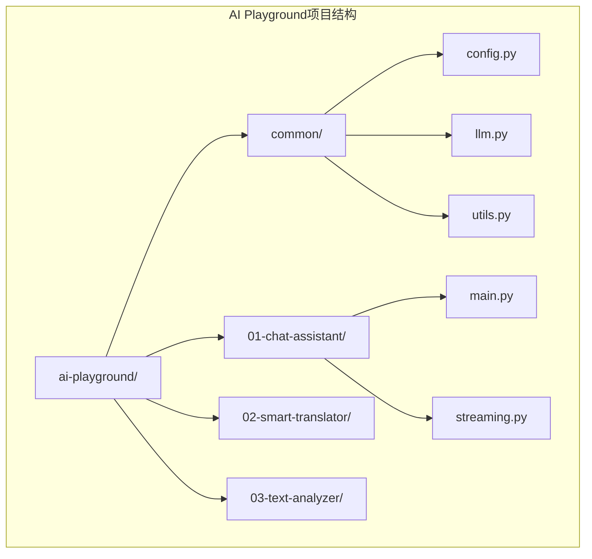
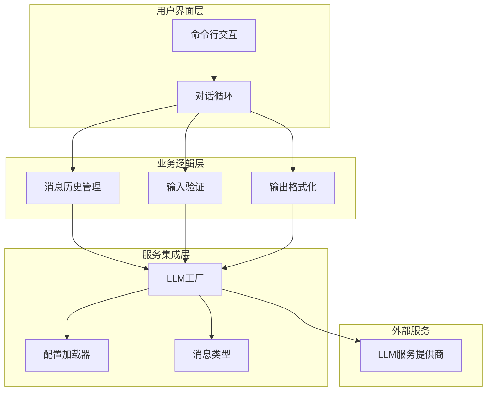
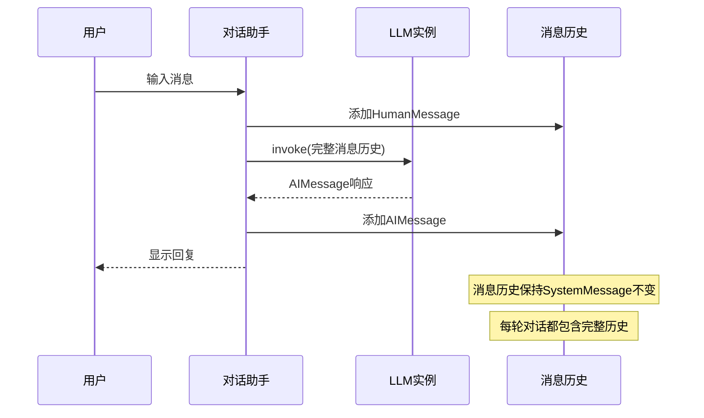
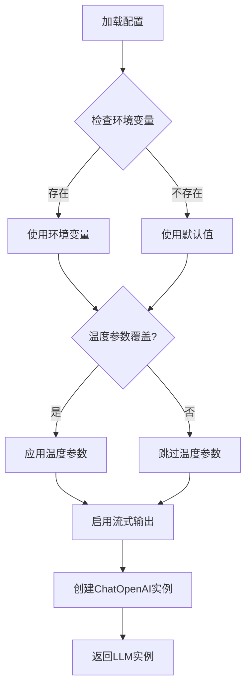
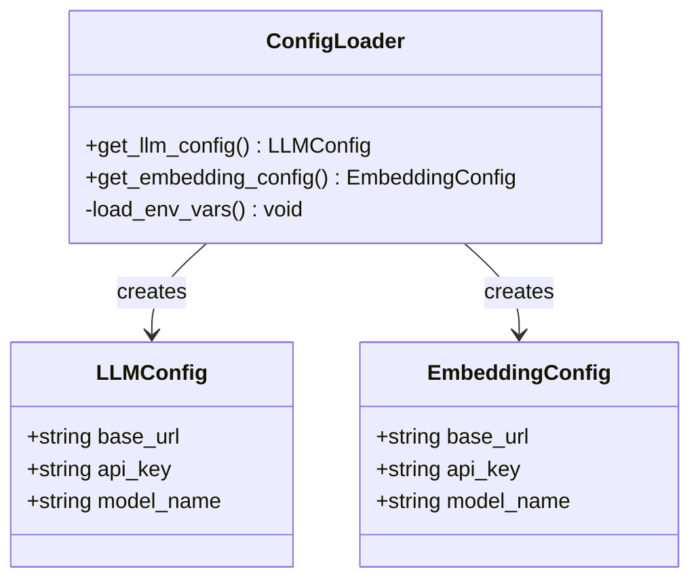
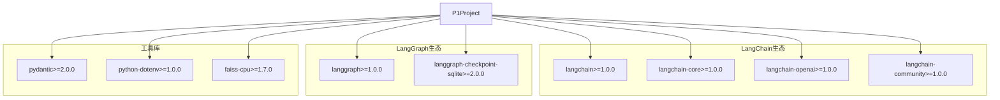
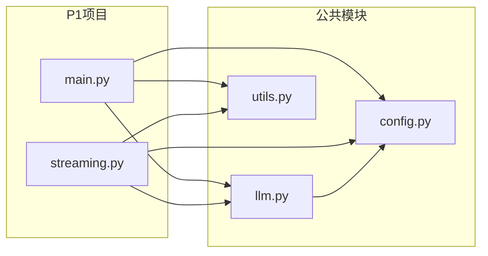

# P1: LLM对话助手

<cite>
**本文引用的文件**
- [main.py](file://01-chat-assistant/main.py)
- [streaming.py](file://01-chat-assistant/streaming.py)
- [llm.py](file://common/llm.py)
- [config.py](file://common/config.py)
- [utils.py](file://common/utils.py)
- [README.md](file://README.md)
- [pyproject.toml](file://pyproject.toml)
</cite>

## 目录
1. [简介](#简介)
2. [项目结构](#项目结构)
3. [核心组件](#核心组件)
4. [架构概览](#架构概览)
5. [详细组件分析](#详细组件分析)
6. [依赖分析](#依赖分析)
7. [性能考虑](#性能考虑)
8. [故障排除指南](#故障排除指南)
9. [结论](#结论)
10. [附录](#附录)

## 简介

P1项目是AI Playground学习路径中的LangChain基础入门项目，专注于构建一个LLM对话助手。该项目展示了如何使用LangChain的核心概念，包括消息类型、LLM实例初始化、配置管理和流式输出等关键技术。

通过本项目，开发者可以深入理解：
- 基础消息类型（SystemMessage、HumanMessage、AIMessage）的使用
- 如何通过维护消息历史实现多轮对话
- LLM实例初始化、配置加载和invoke()方法调用
- 流式输出实现、用户交互循环和错误处理机制
- 作为LangChain入门的基础作用

## 项目结构

AI Playground采用渐进式学习路径设计，包含10个逐步递进的项目。P1作为LangChain基础入门，位于01-chat-assistant目录中。



**图表来源**
- [README.md:89-107](file://README.md#L89-L107)
- [pyproject.toml:1-29](file://pyproject.toml#L1-L29)

**章节来源**
- [README.md:28-73](file://README.md#L28-L73)
- [pyproject.toml:1-29](file://pyproject.toml#L1-L29)

## 核心组件

### 基础消息类型

P1项目展示了LangChain的三种核心消息类型：

1. **SystemMessage**: 系统消息，设定AI的人设和行为规则
2. **HumanMessage**: 用户消息，代表用户的输入内容  
3. **AIMessage**: AI消息，代表AI的回复内容

这些消息类型构成了对话的基础单元，通过维护消息历史实现多轮对话。

### LLM实例初始化

项目使用统一的LLM工厂模式，通过`get_llm()`函数创建配置好的ChatOpenAI实例。该函数支持：
- 从.env文件读取配置
- 温度参数控制生成创造性
- 流式输出支持
- 自定义参数覆盖

### 配置管理系统

配置系统采用数据类设计，提供类型安全的配置访问：
- LLMConfig：存储LLM服务端点、API密钥和模型名称
- EmbeddingConfig：存储嵌入模型配置
- 自动从环境变量加载配置

**章节来源**
- [main.py:23-24](file://01-chat-assistant/main.py#L23-L24)
- [llm.py:13-40](file://common/llm.py#L13-L40)
- [config.py:17-31](file://common/config.py#L17-L31)

## 架构概览

P1项目的整体架构采用分层设计，实现了清晰的关注点分离：



**图表来源**
- [main.py:27-86](file://01-chat-assistant/main.py#L27-L86)
- [llm.py:13-40](file://common/llm.py#L13-L40)
- [config.py:33-56](file://common/config.py#L33-L56)

## 详细组件分析

### 主对话助手组件

主对话助手实现了完整的多轮对话功能：

#### 消息历史管理



**图表来源**
- [main.py:44-79](file://01-chat-assistant/main.py#L44-L79)

#### 用户交互循环

对话助手提供了丰富的用户交互功能：
- 支持"quit"/"exit"退出命令
- 支持"clear"清空历史命令
- 实时显示消息历史长度
- 友好的命令行界面

#### 错误处理机制

系统实现了多层次的错误处理：
- 配置缺失时的清晰错误提示
- 空输入的优雅处理
- 退出命令的正确响应

**章节来源**
- [main.py:27-86](file://01-chat-assistant/main.py#L27-L86)

### 流式输出组件

流式输出组件展示了两种不同的LLM调用方式：

#### invoke() vs stream() 对比

```mermaid
flowchart TD
Start([开始]) --> ChooseMethod{选择调用方式}
ChooseMethod --> |invoke()| InvokeMethod[一次性调用]
ChooseMethod --> |stream()| StreamMethod[流式调用]
InvokeMethod --> WaitComplete[等待完整响应]
WaitComplete --> ReturnFull[返回完整内容]
StreamMethod --> IterateChunks[迭代token]
IterateChunks --> PrintImmediate[立即打印]
PrintImmediate --> BuildText[累积文本]
BuildText --> ReturnStream[返回流对象]
ReturnFull --> End([结束])
ReturnStream --> End
```

**图表来源**
- [streaming.py:29-78](file://01-chat-assistant/streaming.py#L29-L78)

#### 流式输出优势

流式输出相比一次性输出具有以下优势：
- **首字延迟显著降低**：用户在第一个token到达时就能看到输出
- **更好的用户体验**：模拟真实对话的打字机效果
- **实时反馈**：用户可以感知到LLM的思考过程

**章节来源**
- [streaming.py:1-124](file://01-chat-assistant/streaming.py#L1-L124)

### LLM工厂组件

LLM工厂提供了统一的LLM实例创建接口：

#### 配置优先级机制



**图表来源**
- [llm.py:13-40](file://common/llm.py#L13-L40)

#### 配置加载策略

LLM工厂采用灵活的配置加载策略：
- 优先使用显式传入的参数
- 其次使用配置模块提供的设置
- 最后使用硬编码的默认值

**章节来源**
- [llm.py:13-59](file://common/llm.py#L13-L59)

### 配置管理组件

配置管理组件提供了类型安全的配置访问：

#### 配置数据结构



**图表来源**
- [config.py:17-76](file://common/config.py#L17-L76)

#### 环境变量处理

配置系统支持多种环境变量来源：
- LLM_BASE_URL：LLM服务端点
- LLM_API_KEY：API密钥
- LLM_MODEL_NAME：模型名称
- EMBEDDING_*：嵌入模型相关配置

**章节来源**
- [config.py:33-76](file://common/config.py#L33-L76)

## 依赖分析

### 外部依赖关系

P1项目依赖于LangChain生态系统的核心组件：



**图表来源**
- [pyproject.toml:7-21](file://pyproject.toml#L7-L21)

### 内部模块依赖

项目内部模块之间的依赖关系清晰明确：



**图表来源**
- [main.py:19-24](file://01-chat-assistant/main.py#L19-L24)
- [streaming.py:22-26](file://01-chat-assistant/streaming.py#L22-L26)

**章节来源**
- [pyproject.toml:1-29](file://pyproject.toml#L1-L29)

## 性能考虑

### 流式输出性能优势

流式输出在性能方面具有显著优势：

1. **降低感知延迟**：用户在第一个token到达时就能看到输出
2. **改善用户体验**：避免长时间的空白等待
3. **资源利用优化**：不需要等待完整响应即可开始处理

### 内存管理

消息历史管理需要注意内存使用：
- 每轮对话都会增加消息历史长度
- 长时间对话可能导致历史过长
- 建议实现历史长度限制机制

### 并发处理

当前实现为单线程同步调用，如需支持并发：
- 可以考虑异步流式输出
- 需要实现消息队列管理
- 要处理并发访问的消息历史

## 故障排除指南

### 常见配置问题

#### LLM配置缺失

**问题症状**：启动时抛出配置错误异常

**解决方案**：
1. 创建.env文件并填写必要配置
2. 确保LLM_BASE_URL和LLM_MODEL_NAME正确设置
3. 验证网络连接和API密钥有效性

#### 模型不可用

**问题症状**：调用LLM时出现连接错误

**解决方案**：
1. 检查LLM服务端点是否可达
2. 验证模型名称是否正确
3. 确认API密钥权限

### 运行时错误处理

#### 空输入处理

系统会自动忽略空输入，这是预期行为。如果需要特殊处理，可以在输入验证阶段添加自定义逻辑。

#### 退出命令

支持"quit"、"exit"等退出命令，确保程序能够优雅退出。

**章节来源**
- [config.py:46-50](file://common/config.py#L46-L50)
- [main.py:55-64](file://01-chat-assistant/main.py#L55-L64)

## 结论

P1项目成功地展示了LangChain的基础概念和实践应用。通过构建LLM对话助手，开发者可以深入理解：

1. **LangChain核心概念**：消息类型、LLM实例、配置管理
2. **实际应用场景**：多轮对话、流式输出、用户交互
3. **最佳实践模式**：工厂模式、配置管理、错误处理

该项目作为AI Playground学习路径的起点，为后续的智能翻译器、文本分析管道、RAG知识库等高级项目奠定了坚实基础。通过循序渐进的学习方式，开发者可以从简单的对话助手逐步掌握复杂的LangChain和LangGraph应用开发技能。

## 附录

### 扩展建议

基于P1项目，可以进行以下扩展：

#### 功能扩展
1. **消息历史持久化**：将对话历史保存到数据库
2. **上下文窗口管理**：实现消息历史长度限制
3. **多模态支持**：添加图片、音频等多模态输入
4. **插件系统**：支持第三方工具集成

#### 性能优化
1. **缓存机制**：实现LLM响应缓存
2. **批量处理**：支持多个对话同时进行
3. **资源池管理**：优化LLM实例生命周期

#### 用户体验改进
1. **图形界面**：开发Web或桌面应用程序
2. **语音交互**：集成语音识别和合成
3. **主题定制**：支持不同风格的AI人设

### 学习路径衔接

P1项目为后续学习奠定基础：

```mermaid
graph LR
P1[LLM对话助手] --> P2[智能翻译器]
P2 --> P3[文本分析管道]
P3 --> P4[知识库问答(RAG)]
P4 --> P5[智能工具助手]
P1 --> P6[文档审批工作流]
P6 --> P7[ReAct研究助手]
P7 --> P8[持久化记忆助手]
P8 --> P9[代码审批系统]
P9 --> P10[多智能体开发团队]
```

**图表来源**
- [README.md:28-73](file://README.md#L28-L73)