# P2: 智能翻译器

<cite>
**本文档引用的文件**
- [main.py](file://02-smart-translator/main.py)
- [models.py](file://02-smart-translator/models.py)
- [fewshot.py](file://02-smart-translator/fewshot.py)
- [llm.py](file://common/llm.py)
- [config.py](file://common/config.py)
- [utils.py](file://common/utils.py)
- [.env.example](file://.env.example)
- [README.md](file://README.md)
</cite>

## 目录
1. [简介](#简介)
2. [项目结构](#项目结构)
3. [核心组件](#核心组件)
4. [架构概览](#架构概览)
5. [详细组件分析](#详细组件分析)
6. [Prompt模板设计原理](#prompt模板设计原理)
7. [Few-shot学习实现](#few-shot学习实现)
8. [结构化输出处理](#结构化输出处理)
9. [翻译质量提升策略](#翻译质量提升策略)
10. [多语言支持与输出格式控制](#多语言支持与输出格式控制)
11. [模型配置与提示词工程](#模型配置与提示词工程)
12. [性能优化技巧](#性能优化技巧)
13. [错误处理方案](#错误处理方案)
14. [自定义扩展方法](#自定义扩展方法)
15. [从基础对话到复杂任务的技能跃迁](#从基础对话到复杂任务的技能跃迁)
16. [结论](#结论)

## 简介

P2智能翻译器是AI Playground项目中的第二个渐进式学习项目，专注于展示LangChain框架的核心能力：Prompt模板设计、Few-shot学习和结构化输出处理。该项目通过三个层次的演示，从基础字符串输出到高级结构化数据处理，再到交互式应用，逐步展示了现代AI应用开发的关键技术栈。

该翻译器不仅能够进行基本的文本翻译，还能提供语言分析、置信度评估和专业术语处理等高级功能。通过Pydantic数据模型，实现了类型安全的结构化输出，确保了数据的一致性和可靠性。

## 项目结构

P2智能翻译器采用清晰的模块化架构，主要包含以下核心文件：

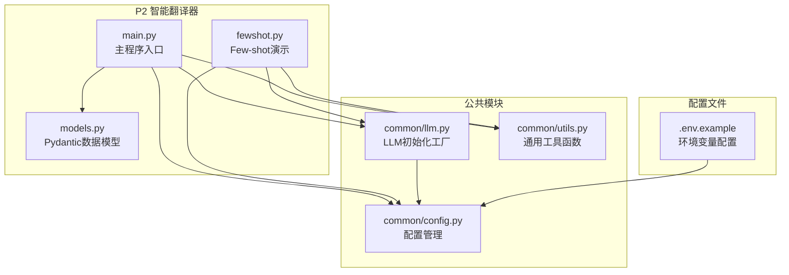

**图表来源**
- [main.py:1-179](file://02-smart-translator/main.py#L1-L179)
- [models.py:1-46](file://02-smart-translator/models.py#L1-L46)
- [fewshot.py:1-177](file://02-smart-translator/fewshot.py#L1-L177)
- [llm.py:1-59](file://common/llm.py#L1-L59)
- [config.py:1-77](file://common/config.py#L1-L77)

**章节来源**
- [main.py:1-179](file://02-smart-translator/main.py#L1-L179)
- [models.py:1-46](file://02-smart-translator/models.py#L1-L46)
- [fewshot.py:1-177](file://02-smart-translator/fewshot.py#L1-L177)

## 核心组件

### 主程序组件

主程序包含三个核心演示功能，每个都展示了不同的技术能力：

1. **基础字符串输出翻译器**：展示传统的提示词模板和字符串解析器组合
2. **结构化输出翻译器**：利用LangChain的结构化输出功能，直接返回Pydantic对象
3. **交互式翻译器**：提供用户友好的交互界面，支持实时翻译

### 数据模型组件

通过Pydantic定义了两个核心数据模型：

- **TranslationResult**：翻译结果的完整结构，包含源语言、目标语言、原文、译文、置信度和说明
- **TranslationRequest**：翻译请求的简化结构，用于输入验证

### Few-shot组件

专门演示了少样本学习的概念和实现，通过提供示例来引导模型学习特定的翻译风格和术语处理方式。

**章节来源**
- [main.py:29-179](file://02-smart-translator/main.py#L29-L179)
- [models.py:11-46](file://02-smart-translator/models.py#L11-L46)
- [fewshot.py:33-177](file://02-smart-translator/fewshot.py#L33-L177)

## 架构概览

智能翻译器的整体架构基于LangChain的Runnable协议，采用管道化的数据处理流程：

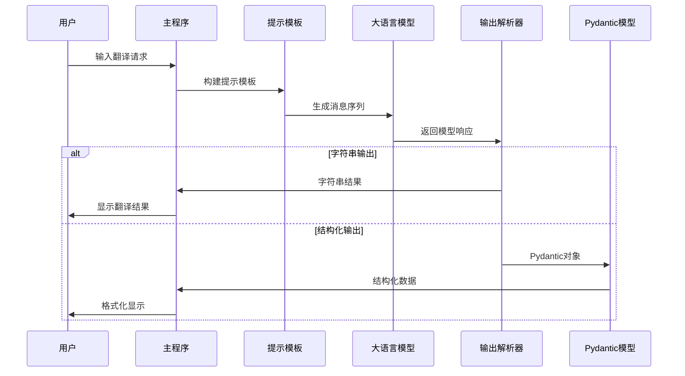

**图表来源**
- [main.py:41-93](file://02-smart-translator/main.py#L41-L93)
- [models.py:11-39](file://02-smart-translator/models.py#L11-L39)

## 详细组件分析

### 主程序组件分析

主程序采用了模块化的设计，每个功能都被封装在独立的函数中，便于理解和维护。

#### 基础字符串输出翻译器

该组件展示了传统的大语言模型调用方式：

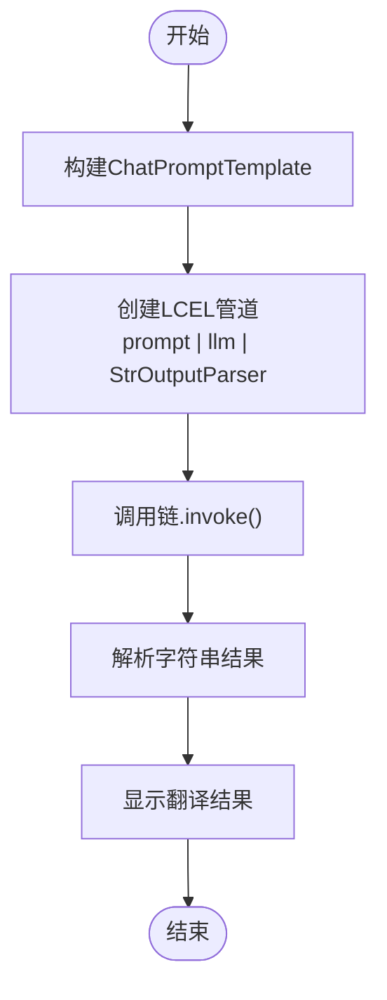

**图表来源**
- [main.py:29-60](file://02-smart-translator/main.py#L29-L60)

#### 结构化输出翻译器

这是项目的核心创新，利用了LangChain的with_structured_output功能：

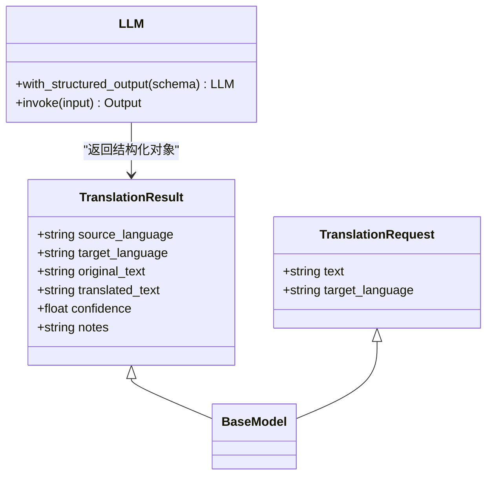

**图表来源**
- [models.py:11-46](file://02-smart-translator/models.py#L11-L46)
- [main.py:61-107](file://02-smart-translator/main.py#L61-L107)

**章节来源**
- [main.py:29-107](file://02-smart-translator/main.py#L29-L107)
- [models.py:11-46](file://02-smart-translator/models.py#L11-L46)

### Few-shot学习组件分析

Few-shot学习通过提供示例来引导模型学习特定的模式和风格：

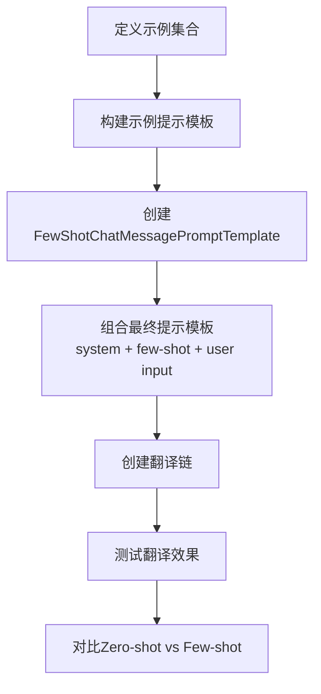

**图表来源**
- [fewshot.py:33-113](file://02-smart-translator/fewshot.py#L33-L113)

**章节来源**
- [fewshot.py:33-177](file://02-smart-translator/fewshot.py#L33-L177)

## Prompt模板设计原理

### ChatPromptTemplate设计

LangChain的ChatPromptTemplate提供了强大的模板构建能力，支持多种消息类型的组合：

| 消息类型 | 用途 | 示例 |
|---------|------|------|
| system | 系统指令和角色设定 | "你是一个专业翻译专家" |
| human | 用户输入 | "{text}" |
| ai | 模型回复（用于Few-shot示例） | "{translation}" |

### 模板变量绑定

模板变量通过字典参数进行绑定，支持复杂的嵌套结构：

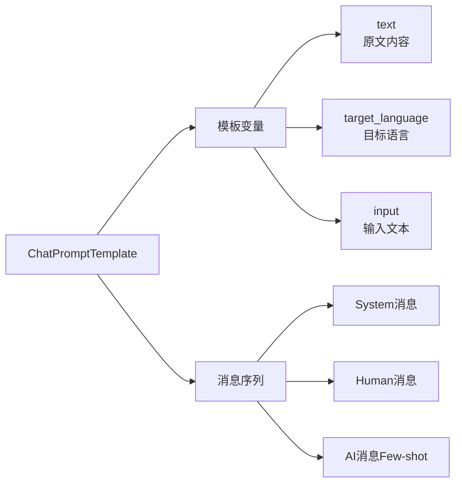

**图表来源**
- [main.py:41-44](file://02-smart-translator/main.py#L41-L44)
- [fewshot.py:83-94](file://02-smart-translator/fewshot.py#L83-L94)

### 提示词工程最佳实践

1. **明确的角色设定**：为模型定义清晰的专业角色
2. **具体的指令约束**：限制输出格式和内容范围
3. **适当的上下文信息**：提供必要的背景知识
4. **清晰的输出格式要求**：避免歧义性的输出

**章节来源**
- [main.py:41-44](file://02-smart-translator/main.py#L41-L44)
- [fewshot.py:84-89](file://02-smart-translator/fewshot.py#L84-L89)

## Few-shot学习实现

### 示例设计原则

Few-shot学习通过精心设计的示例来引导模型行为：

| 示例要素 | 设计要点 | 实际应用 |
|---------|---------|---------|
| 代表性 | 覆盖常见场景 | IT术语翻译 |
| 格式一致性 | 保持统一的输出格式 | 英文术语+中文翻译 |
| 复杂度递增 | 从简单到复杂的示例 | 基础概念→复杂架构 |
| 领域特定 | 包含专业术语 | API、微服务、容器等 |

### 示例模板构建

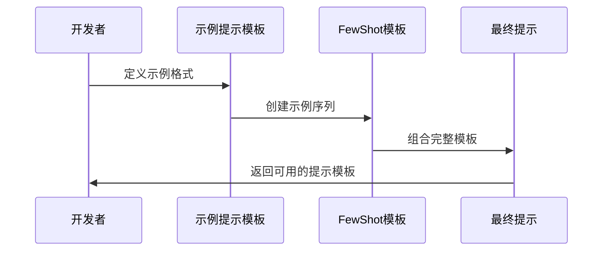

**图表来源**
- [fewshot.py:47-78](file://02-smart-translator/fewshot.py#L47-L78)

### 效果对比分析

| 方法 | 优势 | 局限性 | 适用场景 |
|------|------|--------|----------|
| Zero-shot | 简单易用 | 风格控制弱 | 一般性翻译 |
| Few-shot | 风格控制强 | 示例设计成本高 | 专业术语翻译 |
| Zero-shot + 指令 | 平衡效果 | 需要大量指令 | 复杂任务 |

**章节来源**
- [fewshot.py:115-162](file://02-smart-translator/fewshot.py#L115-L162)

## 结构化输出处理

### Pydantic模型设计

结构化输出的核心是Pydantic数据模型，提供了类型安全和自动验证：

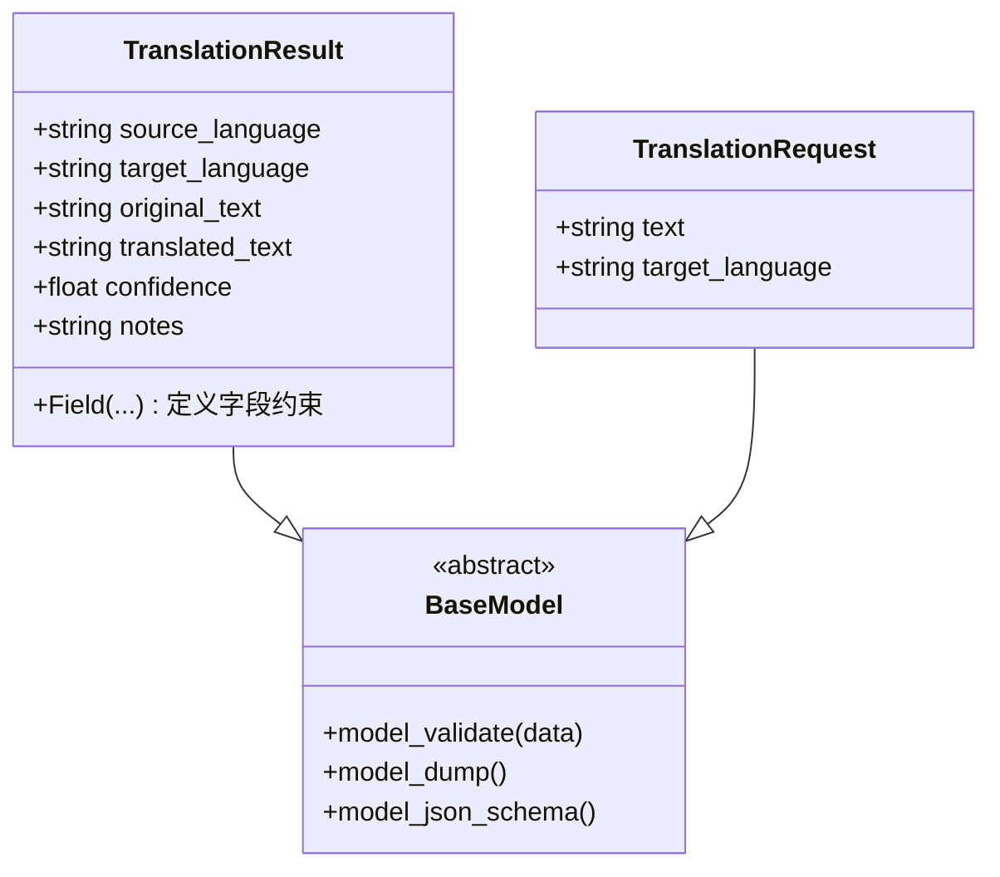

**图表来源**
- [models.py:11-46](file://02-smart-translator/models.py#L11-L46)

### 类型安全机制

结构化输出通过以下机制确保数据质量：

1. **字段类型验证**：自动检查字段类型
2. **数值范围约束**：如置信度的0-1范围
3. **必需字段检查**：确保关键信息不缺失
4. **默认值处理**：为可选字段提供合理默认值

### LCEL管道集成

结构化输出与LCEL管道的无缝集成：

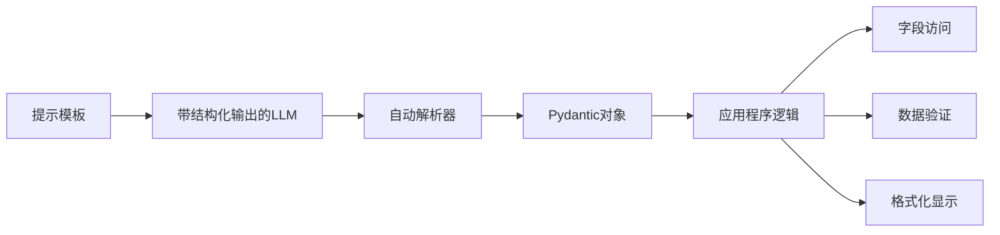

**图表来源**
- [main.py:73-87](file://02-smart-translator/main.py#L73-L87)

**章节来源**
- [models.py:11-46](file://02-smart-translator/models.py#L11-L46)
- [main.py:61-107](file://02-smart-translator/main.py#L61-L107)

## 翻译质量提升策略

### 置信度评估

翻译置信度是衡量翻译质量的重要指标：

| 置信度范围 | 质量等级 | 建议 |
|-----------|----------|------|
| 0.9-1.0 | 优秀 | 直接使用 |
| 0.7-0.9 | 良好 | 人工复核 |
| 0.5-0.7 | 一般 | 需要修改 |
| 0.0-0.5 | 差 | 重新翻译 |

### 多义词处理

对于存在多种含义的词汇，系统提供了详细的说明机制：

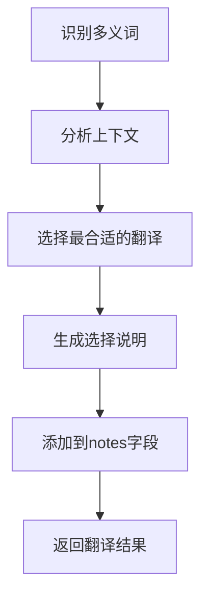

**图表来源**
- [models.py:36-39](file://02-smart-translator/models.py#L36-L39)

### 专业术语标准化

通过Few-shot学习实现专业术语的标准化处理：

1. **术语库建立**：收集领域内的标准翻译
2. **风格统一**：确保术语翻译的一致性
3. **上下文适应**：根据具体语境调整翻译

**章节来源**
- [models.py:30-39](file://02-smart-translator/models.py#L30-L39)
- [fewshot.py:47-60](file://02-smart-translator/fewshot.py#L47-L60)

## 多语言支持与输出格式控制

### 语言检测与标识

系统支持多种语言的输入和输出：

| 语言类别 | 支持示例 | 标识方式 |
|---------|---------|---------|
| 自然语言 | 中文、English、日本語 | 语言名称 |
| 编程语言 | Python、JavaScript、Go | 语言名称 |
| 专业术语 | API、JSON、Kubernetes | 专业标识 |

### 输出格式控制

通过严格的字段定义控制输出格式：

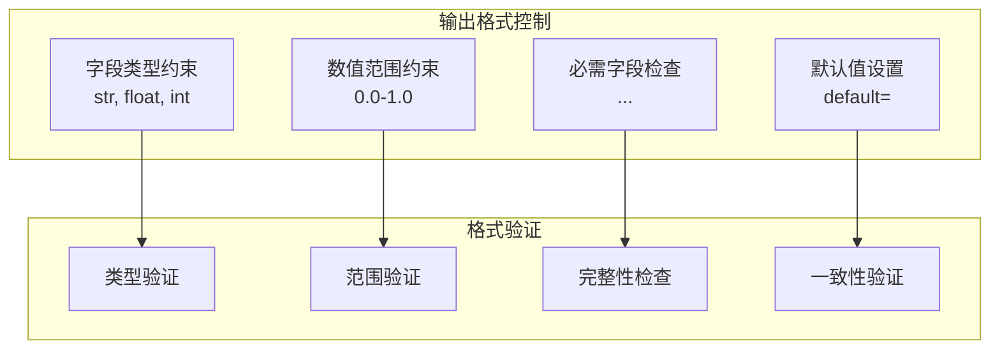

**图表来源**
- [models.py:14-39](file://02-smart-translator/models.py#L14-L39)

### 交互式格式化

用户界面提供了友好的格式化显示：

| 信息类型 | 显示格式 | 用途 |
|---------|---------|------|
| 源语言 | 🌐 符号 + 语言名 | 视觉识别 |
| 译文 | ✅ 符号 + 内容 | 重点突出 |
| 置信度 | 📊 百分比显示 | 数值比较 |
| 说明 | 💡 符号 + 文本 | 补充信息 |

**章节来源**
- [main.py:149-155](file://02-smart-translator/main.py#L149-L155)

## 模型配置与提示词工程

### LLM配置管理

通过统一的配置管理模块实现灵活的模型配置：

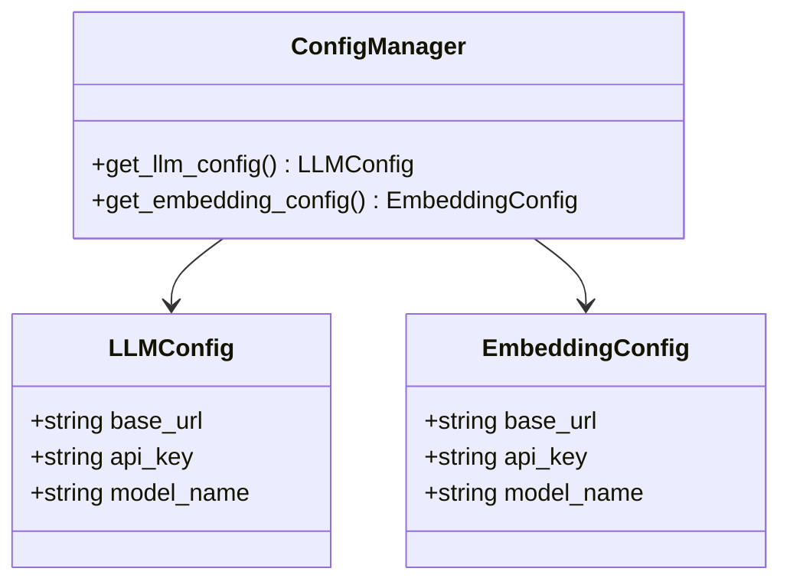

**图表来源**
- [config.py:17-31](file://common/config.py#L17-L31)

### 提示词工程策略

高质量的提示词需要遵循以下原则：

1. **明确性**：指令要清晰具体
2. **完整性**：提供足够的上下文
3. **一致性**：保持风格和格式统一
4. **可验证性**：输出结果可以被验证

### 温度参数调优

不同应用场景下温度参数的选择：

| 应用场景 | 温度值 | 特点 | 适用性 |
|---------|--------|------|--------|
| 翻译 | 0.2-0.3 | 准确稳定 | ✅ 推荐 |
| 创作 | 0.7-1.0 | 创意丰富 | ✅ 推荐 |
| 分析 | 0.1-0.2 | 严谨准确 | ✅ 推荐 |
| 对话 | 0.5-0.7 | 自然流畅 | ✅ 推荐 |

**章节来源**
- [config.py:33-56](file://common/config.py#L33-L56)
- [llm.py:13-40](file://common/llm.py#L13-L40)

## 性能优化技巧

### 流式输出优化

通过启用流式输出提高用户体验：

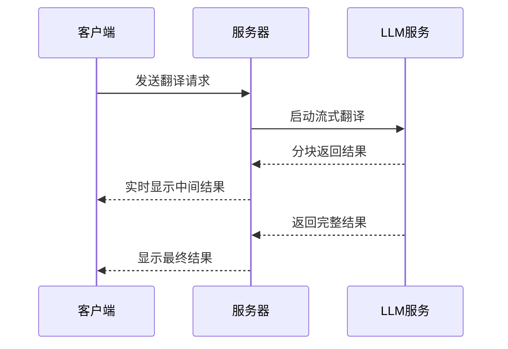

**图表来源**
- [llm.py:38-38](file://common/llm.py#L38-L38)

### 缓存策略

对于重复的翻译请求，可以考虑实现缓存机制：

1. **内容哈希缓存**：基于原文内容的哈希值
2. **时间戳失效**：设置合理的缓存过期时间
3. **内存管理**：控制缓存大小防止内存溢出

### 批量处理优化

对于大量相似的翻译任务，可以采用批量处理：

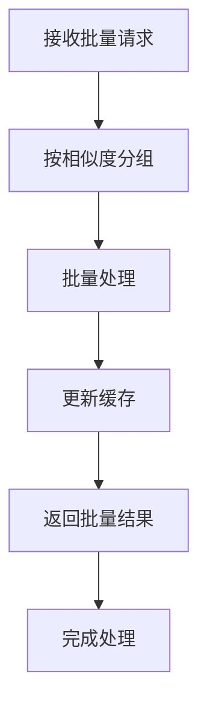

## 错误处理方案

### 异常处理策略

系统实现了多层次的异常处理：

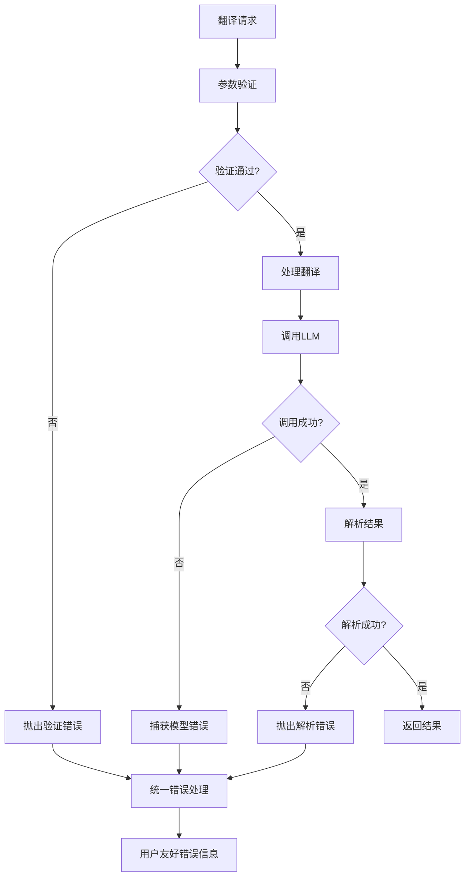

**图表来源**
- [main.py:156-157](file://02-smart-translator/main.py#L156-L157)

### 错误恢复机制

针对不同类型的错误提供相应的恢复策略：

| 错误类型 | 恢复策略 | 用户反馈 |
|---------|---------|---------|
| 网络连接错误 | 重试机制 | "网络连接失败，请稍后重试" |
| 模型调用错误 | 降级处理 | "模型暂时不可用，使用备用方案" |
| 参数验证错误 | 详细提示 | "输入参数无效，请检查格式" |
| 结果解析错误 | 降级为字符串 | "解析失败，返回原始文本" |

### 日志记录与监控

建议实现完整的日志记录机制：

1. **请求日志**：记录每次翻译请求的详细信息
2. **错误日志**：记录所有异常和错误信息
3. **性能日志**：记录响应时间和资源使用情况
4. **审计日志**：记录重要的业务操作

**章节来源**
- [main.py:156-157](file://02-smart-translator/main.py#L156-L157)

## 自定义扩展方法

### 数据模型扩展

可以通过继承和扩展现有模型来满足特殊需求：

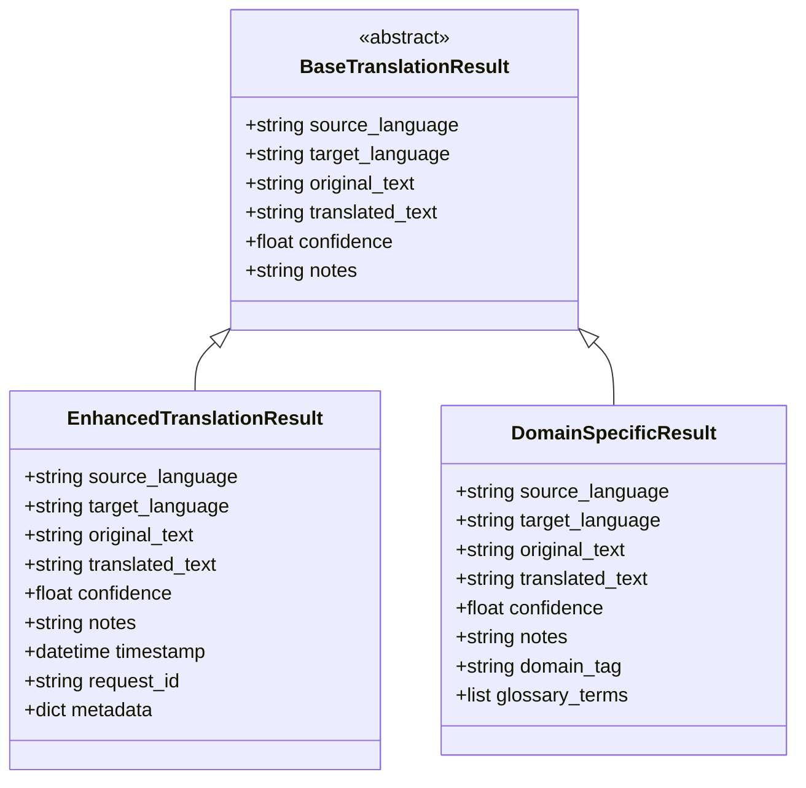

**图表来源**
- [models.py:11-46](file://02-smart-translator/models.py#L11-L46)

### 提示词模板扩展

可以根据不同的应用场景定制提示词模板：

1. **领域特定模板**：针对医疗、法律、金融等专业领域
2. **风格特定模板**：学术论文、新闻报道、创意写作等
3. **格式特定模板**：技术文档、用户手册、API文档等

### 功能模块化

将翻译器的功能模块化，便于扩展和维护：

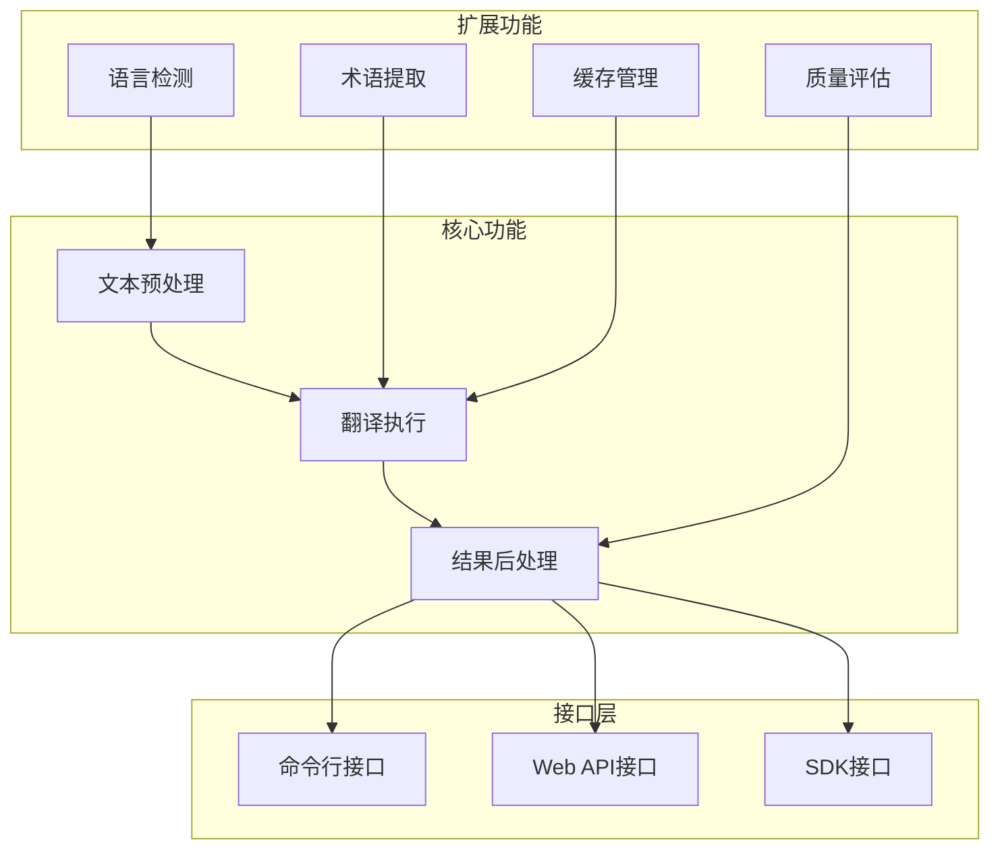

## 从基础对话到复杂任务的技能跃迁

### 技能发展路径

P2智能翻译器展示了从基础到高级的技能跃迁过程：

```mermaid
stateDiagram-v2
[*] --> 基础对话
基础对话 --> 字符串输出 : 学习提示词模板
字符串输出 --> 结构化输出 : 掌握Pydantic模型
结构化输出 --> Few-shot学习 : 理解示例驱动
Few-shot学习 --> 交互式应用 : 实现用户界面
交互式应用 --> 性能优化 : 添加缓存和流式处理
性能优化 --> 错误处理 : 实现健壮性
错误处理 --> 扩展开发 : 模块化设计
扩展开发 --> [*]
```

### 关键技能要点

| 技能阶段 | 核心技能 | 实现方式 | 应用价值 |
|---------|---------|---------|---------|
| 基础对话 | 提示词模板 | ChatPromptTemplate | 简单任务自动化 |
| 字符串输出 | LCEL管道 | | 数据处理流程化 |
| 结构化输出 | Pydantic模型 | 类型安全 | 数据质量保证 |
| Few-shot学习 | 示例驱动 | | 专业领域适配 |
| 交互式应用 | 用户界面 | | 产品化体验 |
| 性能优化 | 流式处理 | | 用户体验提升 |
| 错误处理 | 异常管理 | | 系统稳定性 |
| 扩展开发 | 模块化设计 | | 可维护性 |

### 学习建议

1. **循序渐进**：按照技能跃迁路径逐步学习
2. **实践结合**：每个阶段都要动手实践
3. **总结反思**：定期回顾和总结学习成果
4. **扩展应用**：将学到的技能应用到其他项目

**章节来源**
- [README.md:26-73](file://README.md#L26-L73)

## 结论

P2智能翻译器项目成功展示了现代AI应用开发的核心技术栈，包括Prompt模板设计、Few-shot学习和结构化输出处理。通过三个层次的演示，从基础字符串输出到高级结构化数据处理，再到交互式应用，体现了从简单到复杂的技能跃迁过程。

该项目的主要贡献包括：

1. **技术整合**：成功整合了LangChain的各种核心功能
2. **实践验证**：通过实际案例验证了各种技术的有效性
3. **学习路径**：为开发者提供了清晰的学习路径
4. **最佳实践**：展示了生产级别的代码组织和错误处理

对于希望深入学习LangChain框架的开发者来说，P2智能翻译器是一个极佳的起点，它不仅提供了丰富的技术细节，更重要的是展示了如何将这些技术应用到实际的业务场景中。

未来可以在以下几个方面进一步改进：

1. **多模态支持**：扩展到图像、音频等多模态翻译
2. **实时协作**：支持多人协作翻译项目
3. **质量评估**：集成自动质量评估系统
4. **个性化定制**：支持用户个性化的翻译偏好设置

通过持续的学习和实践，相信每个开发者都能掌握这些核心技术，并将其应用到更广泛的AI应用开发中。