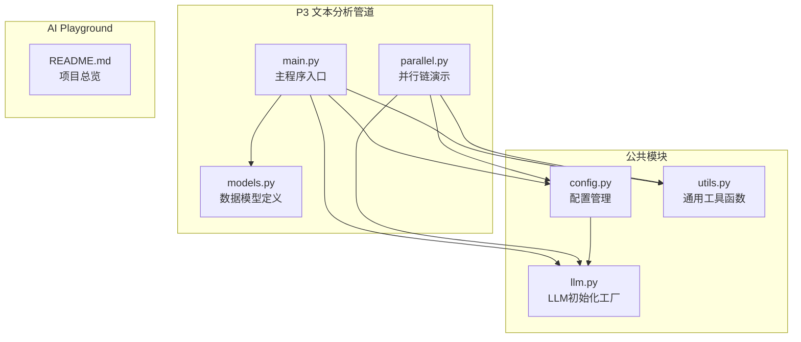
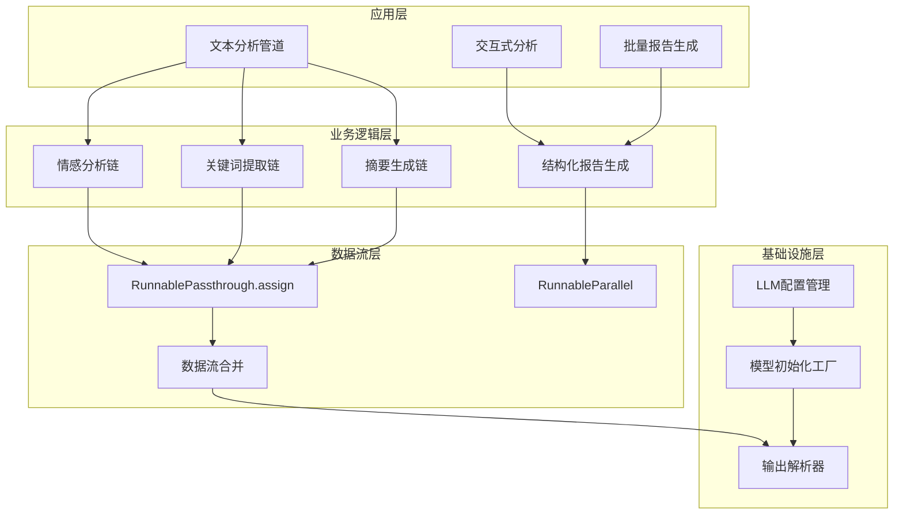
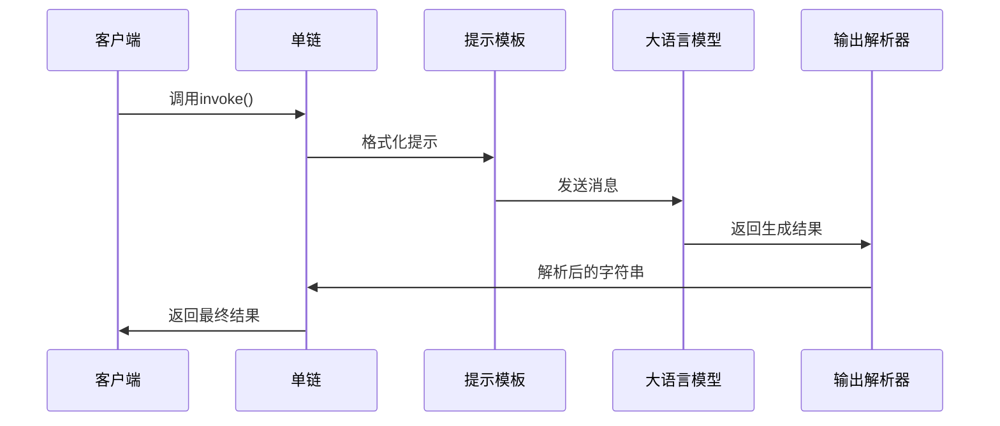
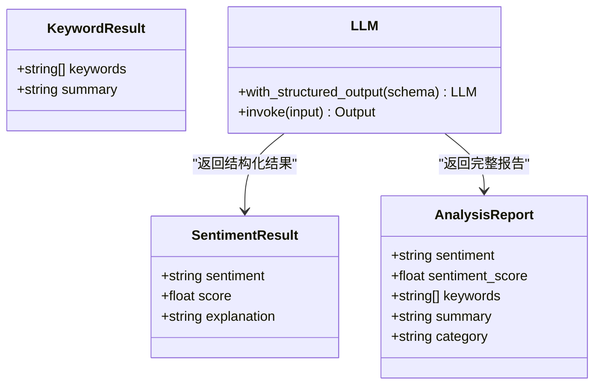
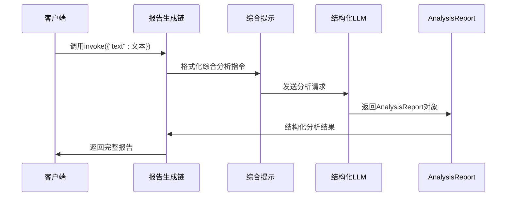
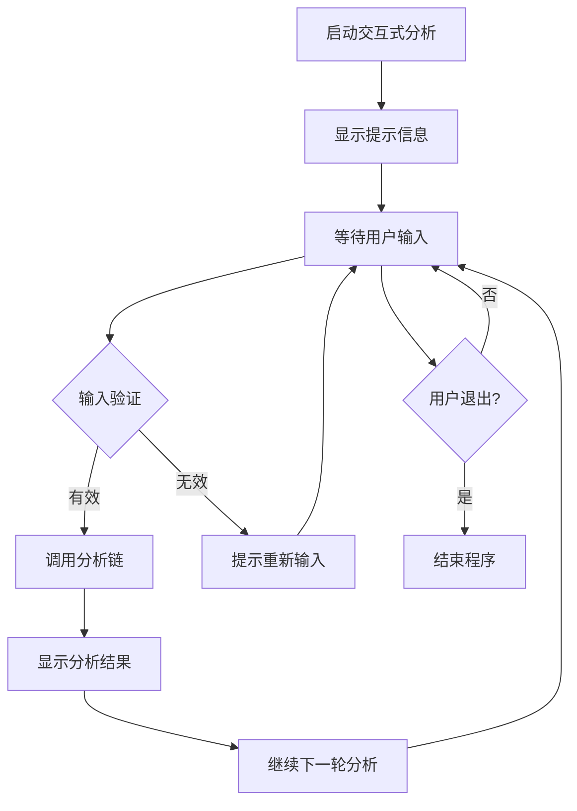
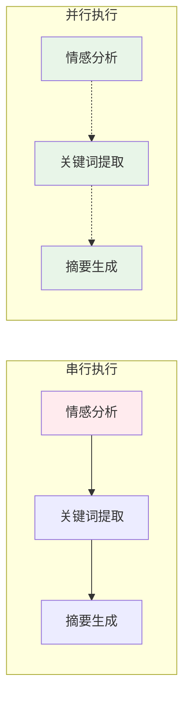
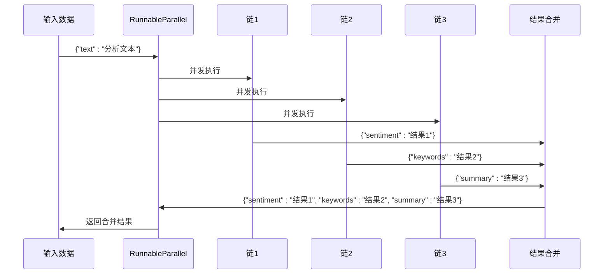
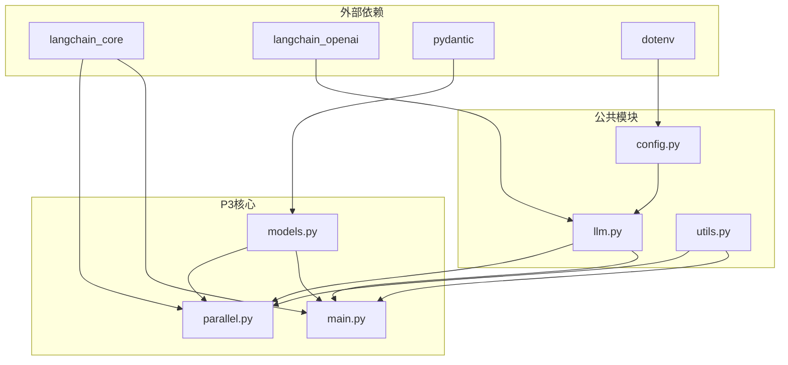
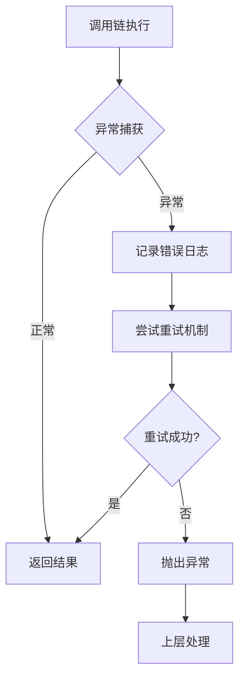

# P3: 文本分析管道

<cite>
**本文档引用的文件**
- [README.md](file://03-text-analyzer/README.md)
- [main.py](file://03-text-analyzer/main.py)
- [models.py](file://03-text-analyzer/models.py)
- [parallel.py](file://03-text-analyzer/parallel.py)
- [config.py](file://common/config.py)
- [llm.py](file://common/llm.py)
- [utils.py](file://common/utils.py)
- [README.md](file://README.md)
</cite>

## 目录
1. [简介](#简介)
2. [项目结构](#项目结构)
3. [核心组件](#核心组件)
4. [架构概览](#架构概览)
5. [详细组件分析](#详细组件分析)
6. [依赖关系分析](#依赖关系分析)
7. [性能考虑](#性能考虑)
8. [故障排除指南](#故障排除指南)
9. [结论](#结论)

## 简介

P3项目"文本分析管道"是AI Playground学习路径中的第三个渐进式项目，专注于LangChain表达式语言（LCEL）和Runnable协议的核心概念。该项目展示了如何使用`|`操作符构建链式调用，实现文本预处理、情感分析、关键词提取和摘要生成等完整的分析流程。

通过本项目的学习，开发者将掌握：
- LCEL链式调用的构建原理和数据流处理机制
- Runnable协议的使用方法，包括RunnableSequence、RunnablePassthrough和RunnableParallel
- 从简单调用到复杂管道的架构演进过程
- 并行链实现和状态传递机制
- 结构化输出和错误处理的最佳实践

## 项目结构

P3项目采用模块化设计，将核心功能分解为独立的组件，便于理解和扩展：



**图表来源**
- [main.py:1-240](file://03-text-analyzer/main.py#L1-L240)
- [models.py:1-30](file://03-text-analyzer/models.py#L1-L30)
- [parallel.py:1-220](file://03-text-analyzer/parallel.py#L1-L220)
- [config.py:1-77](file://common/config.py#L1-L77)
- [llm.py:1-59](file://common/llm.py#L1-L59)

**章节来源**
- [README.md:1-108](file://README.md#L1-L108)
- [README.md:89-108](file://README.md#L89-L108)

## 核心组件

### LCEL链式调用系统

LCEL（LangChain Expression Language）是本项目的核心设计理念，它使用`|`操作符将组件串联成管道，类似于Unix管道的工作方式。


**图表来源**
- [main.py:39-46](file://03-text-analyzer/main.py#L39-L46)

### Runnable协议实现

项目实现了三种关键的Runnable组件：

1. **RunnableSequence** (`|`): 顺序执行组件，A → B → C
2. **RunnablePassthrough**: 透传输入，常用于保留原始数据
3. **RunnableParallel**: 并行执行多个链，结果合并为字典

**章节来源**
- [README.md:17-26](file://03-text-analyzer/README.md#L17-L26)

## 架构概览

P3项目采用分层架构设计，从底层的LLM配置到顶层的应用逻辑，形成了清晰的职责分离：



**图表来源**
- [main.py:81-149](file://03-text-analyzer/main.py#L81-L149)
- [parallel.py:92-157](file://03-text-analyzer/parallel.py#L92-L157)

## 详细组件分析

### 单链式调用演示

单链式调用是最基础的LCEL实现，展示了标准的prompt → LLM → parser模式：



**图表来源**
- [main.py:33-52](file://03-text-analyzer/main.py#L33-L52)

**章节来源**
- [main.py:33-52](file://03-text-analyzer/main.py#L33-L52)

### 结构化输出链

结构化输出链使用`with_structured_output()`方法，直接返回Pydantic对象，避免了额外的解析步骤：



**图表来源**
- [models.py:10-30](file://03-text-analyzer/models.py#L10-L30)
- [main.py:54-79](file://03-text-analyzer/main.py#L54-L79)

**章节来源**
- [models.py:10-30](file://03-text-analyzer/models.py#L10-L30)
- [main.py:54-79](file://03-text-analyzer/main.py#L54-L79)

### RunnablePassthrough.assign()数据流

`RunnablePassthrough.assign()`是实现多步分析汇总的关键组件，它允许在数据流中逐步追加字段：

```mermaid
flowchart TD
A[输入: {"text": "..."}] --> B[第一步: assign(sentiment=情感分析链)]
B --> C[输出: {"text": "...", "sentiment": "..."}]
C --> D[第二步: assign(keywords=关键词链)]
D --> E[输出: {"text": "...", "sentiment": "...", "keywords": "..."}]
E --> F[第三步: assign(summary=摘要链)]
F --> G[最终输出: {"text": "...", "sentiment": "...", "keywords": "...", "summary": "..."}]
style A fill:#e8f5e8
style G fill:#fff3e0
```

**图表来源**
- [main.py:81-149](file://03-text-analyzer/main.py#L81-L149)

**章节来源**
- [main.py:81-149](file://03-text-analyzer/main.py#L81-L149)

### 完整分析报告生成

完整分析报告展示了如何使用单个链生成综合性的分析结果：



**图表来源**
- [main.py:151-183](file://03-text-analyzer/main.py#L151-L183)

**章节来源**
- [main.py:151-183](file://03-text-analyzer/main.py#L151-L183)

### 交互式文本分析

交互式分析提供了用户友好的界面，支持持续的文本分析：



**图表来源**
- [main.py:185-222](file://03-text-analyzer/main.py#L185-L222)

**章节来源**
- [main.py:185-222](file://03-text-analyzer/main.py#L185-L222)

### 并行链实现

并行链是P3项目的核心创新，展示了如何同时执行多个独立的分析任务：



**图表来源**
- [parallel.py:41-89](file://03-text-analyzer/parallel.py#L41-L89)
- [parallel.py:92-157](file://03-text-analyzer/parallel.py#L92-L157)

**章节来源**
- [parallel.py:41-89](file://03-text-analyzer/parallel.py#L41-L89)
- [parallel.py:92-157](file://03-text-analyzer/parallel.py#L92-L157)

### 并行链数据流处理

并行链使用`RunnableParallel`实现真正的并发执行，每个链的结果合并为字典：



**图表来源**
- [parallel.py:125-156](file://03-text-analyzer/parallel.py#L125-L156)

**章节来源**
- [parallel.py:125-156](file://03-text-analyzer/parallel.py#L125-L156)

## 依赖关系分析

P3项目展现了清晰的依赖层次结构，从公共配置到具体实现：



**图表来源**
- [main.py:22-30](file://03-text-analyzer/main.py#L22-L30)
- [parallel.py:31-38](file://03-text-analyzer/parallel.py#L31-L38)
- [config.py:8-14](file://common/config.py#L8-L14)

**章节来源**
- [main.py:22-30](file://03-text-analyzer/main.py#L22-L30)
- [parallel.py:31-38](file://03-text-analyzer/parallel.py#L31-L38)

## 性能考虑

### 并行执行优化

并行链相比串行链具有显著的性能优势，特别是在处理多个独立的LLM调用时：

| 执行方式 | 调用次数 | 总耗时 | 性能特点 |
|---------|---------|--------|----------|
| 串行执行 | 3次 | T1 + T2 + T3 | 线性累加 |
| 并行执行 | 3次 | max(T1, T2, T3) | 接近最慢单次 |

### 内存和资源管理

1. **LLM实例复用**: 通过`common.llm.get_llm()`工厂函数统一管理LLM实例
2. **配置缓存**: LLM配置在进程启动时加载，避免重复I/O操作
3. **流式输出**: 启用`streaming=True`以提高响应速度

### 错误处理策略



**章节来源**
- [main.py:220-222](file://03-text-analyzer/main.py#L220-L222)

## 故障排除指南

### 常见问题诊断

1. **LLM连接失败**
   - 检查`.env`文件中的配置项
   - 验证网络连接和API端点可达性
   - 确认API密钥的有效性

2. **结构化输出解析错误**
   - 验证Pydantic模型定义的正确性
   - 检查LLM输出格式是否符合预期
   - 确认模型支持结构化输出功能

3. **并行执行超时**
   - 调整超时参数设置
   - 检查服务器负载情况
   - 考虑减少并发数量

### 调试技巧

1. **启用详细日志**: 使用`print_step()`函数输出执行步骤
2. **分步调试**: 将复杂链拆分为独立的简单链进行测试
3. **输入验证**: 在每个链的边界检查输入数据格式
4. **性能监控**: 使用时间戳跟踪各阶段的执行耗时

**章节来源**
- [utils.py:16-33](file://common/utils.py#L16-L33)
- [config.py:46-50](file://common/config.py#L46-L50)

## 结论

P3项目"文本分析管道"成功地展示了LCEL链式调用和Runnable协议的强大功能。通过从简单的单链式调用到复杂的并行分析管道，开发者可以逐步掌握：

- LCEL的核心理念和实际应用
- Runnable协议的三种实现方式及其适用场景
- 数据流在不同Runnable组件间的传递机制
- 并行链的性能优势和最佳实践
- 结构化输出和错误处理的完整解决方案

这个项目为后续的RAG（检索增强生成）和智能代理项目奠定了坚实的基础，特别是P4的知识库问答系统将直接应用本项目学到的LCEL组合技巧。

通过本项目的实践，开发者不仅能够构建高效的文本分析管道，还能理解如何将这些概念扩展到更复杂的AI应用中，为构建生产级别的AI系统做好准备。