# P4: 知识库问答 (RAG)

<cite>
**本文档引用的文件**
- [main.py](file://04-knowledge-base/main.py)
- [models.py](file://04-knowledge-base/models.py)
- [retriever.py](file://04-knowledge-base/retriever.py)
- [ingest.py](file://04-knowledge-base/ingest.py)
- [llm.py](file://common/llm.py)
- [config.py](file://common/config.py)
- [utils.py](file://common/utils.py)
- [sample.txt](file://04-knowledge-base/data/sample.txt)
- [README.md](file://04-knowledge-base/README.md)
- [README.md](file://README.md)
- [pyproject.toml](file://pyproject.toml)
</cite>

## 目录
1. [简介](#简介)
2. [项目结构](#项目结构)
3. [核心组件](#核心组件)
4. [架构概览](#架构概览)
5. [详细组件分析](#详细组件分析)
6. [依赖关系分析](#依赖关系分析)
7. [性能考虑](#性能考虑)
8. [故障排除指南](#故障排除指南)
9. [结论](#结论)
10. [附录](#附录)

## 简介

P4 项目是一个完整的知识库问答系统，基于 RAG（检索增强生成）技术构建。该系统实现了从文档加载、向量化处理到智能问答的完整技术闭环，为用户提供准确、可靠的问答体验。

### 核心特性

- **完整的 RAG 工作流**：从文档摄入到智能问答的端到端实现
- **灵活的检索策略**：支持相似度搜索和最大边际相关性（MMR）检索
- **可扩展的架构**：基于 LangChain 的模块化设计，便于扩展和定制
- **生产就绪**：支持多种向量数据库和嵌入模型配置

## 项目结构

P4 项目采用清晰的模块化组织结构，将核心功能分解为独立的组件：

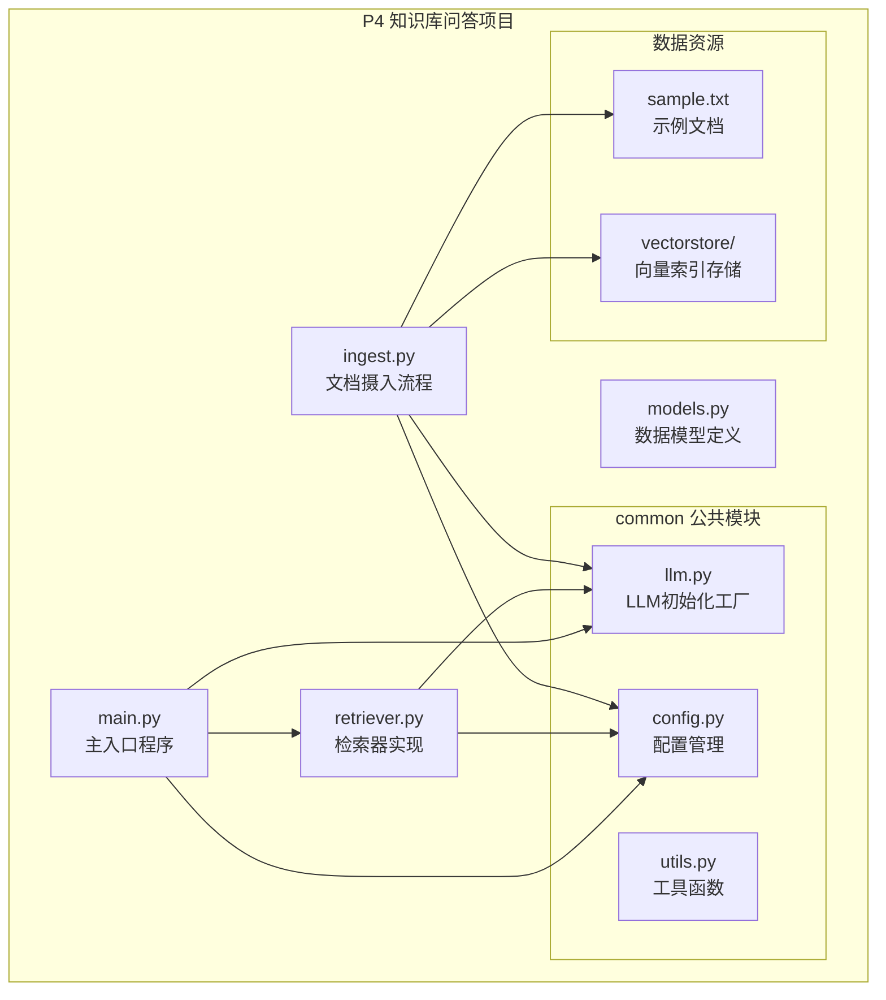

**图表来源**
- [main.py:1-189](file://04-knowledge-base/main.py#L1-L189)
- [retriever.py:1-160](file://04-knowledge-base/retriever.py#L1-L160)
- [ingest.py:1-132](file://04-knowledge-base/ingest.py#L1-L132)

**章节来源**
- [main.py:1-189](file://04-knowledge-base/main.py#L1-L189)
- [README.md:1-52](file://04-knowledge-base/README.md#L1-L52)

## 核心组件

### RAG 链构建

系统的核心是基于 LangChain Expression Language (LCEL) 构建的 RAG 链，实现了高效的问答处理流程：

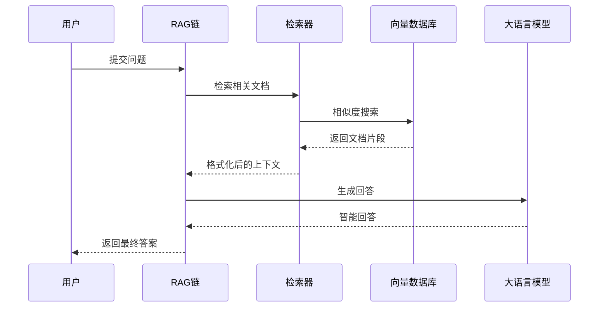

**图表来源**
- [main.py:47-91](file://04-knowledge-base/main.py#L47-L91)
- [retriever.py:128-139](file://04-knowledge-base/retriever.py#L128-L139)

### 数据模型定义

系统使用 Pydantic 定义了标准化的数据模型，确保数据的一致性和验证：

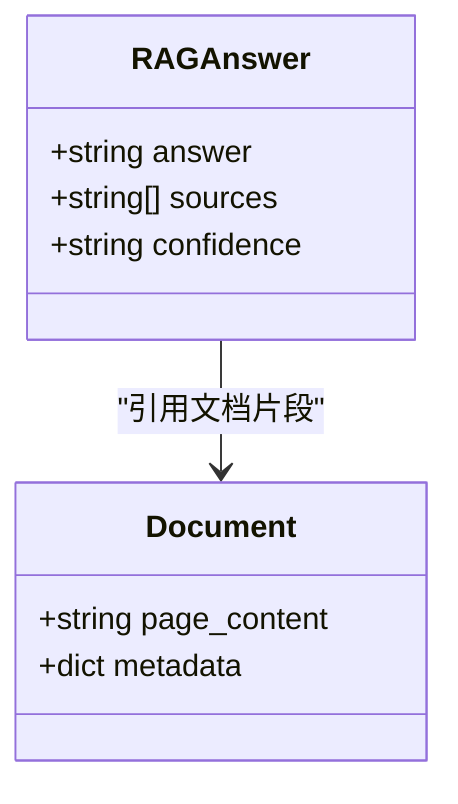

**图表来源**
- [models.py:8-13](file://04-knowledge-base/models.py#L8-L13)

**章节来源**
- [main.py:39-91](file://04-knowledge-base/main.py#L39-L91)
- [models.py:1-13](file://04-knowledge-base/models.py#L1-L13)

## 架构概览

### 整体架构设计

P4 项目采用分层架构设计，将功能清晰分离：

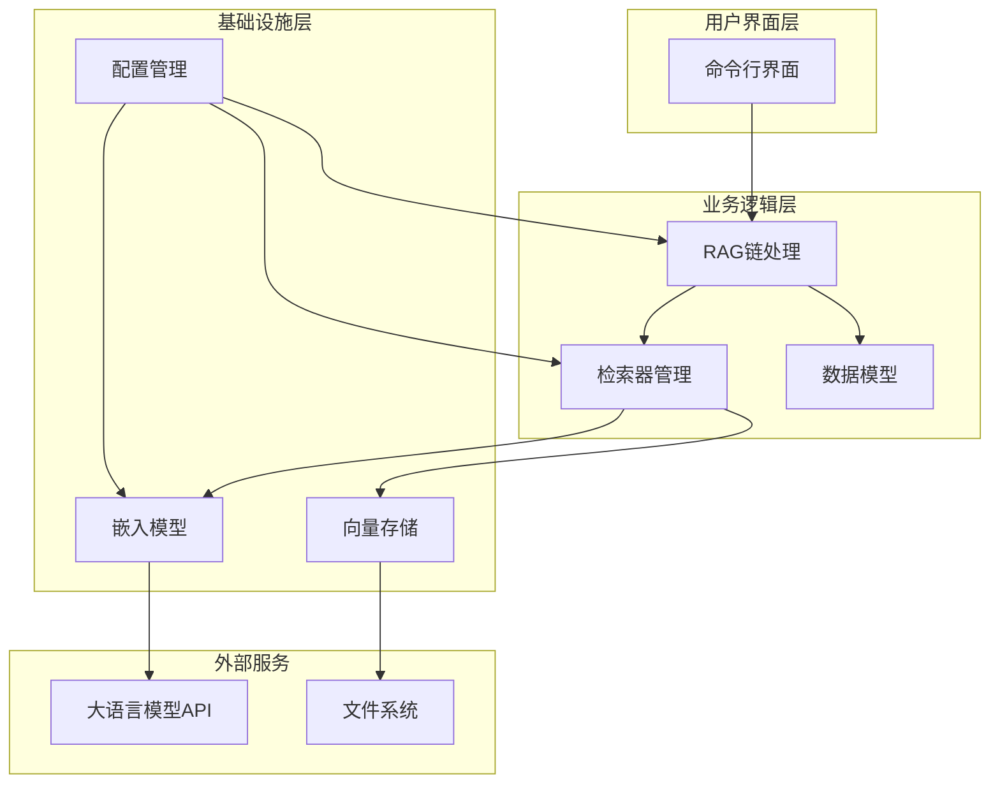

**图表来源**
- [main.py:26-91](file://04-knowledge-base/main.py#L26-L91)
- [llm.py:13-59](file://common/llm.py#L13-L59)
- [config.py:33-77](file://common/config.py#L33-L77)

### 数据处理流程

系统实现了完整的文档处理流水线：

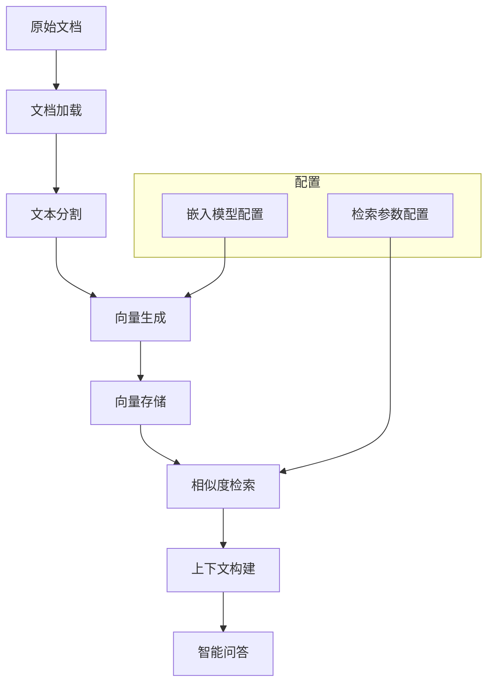

**图表来源**
- [ingest.py:31-112](file://04-knowledge-base/ingest.py#L31-L112)
- [retriever.py:26-40](file://04-knowledge-base/retriever.py#L26-L40)

**章节来源**
- [ingest.py:1-132](file://04-knowledge-base/ingest.py#L1-L132)
- [retriever.py:1-160](file://04-knowledge-base/retriever.py#L1-L160)

## 详细组件分析

### 文档摄入系统

#### 文档加载模块

文档摄入系统支持多种文档格式的加载：

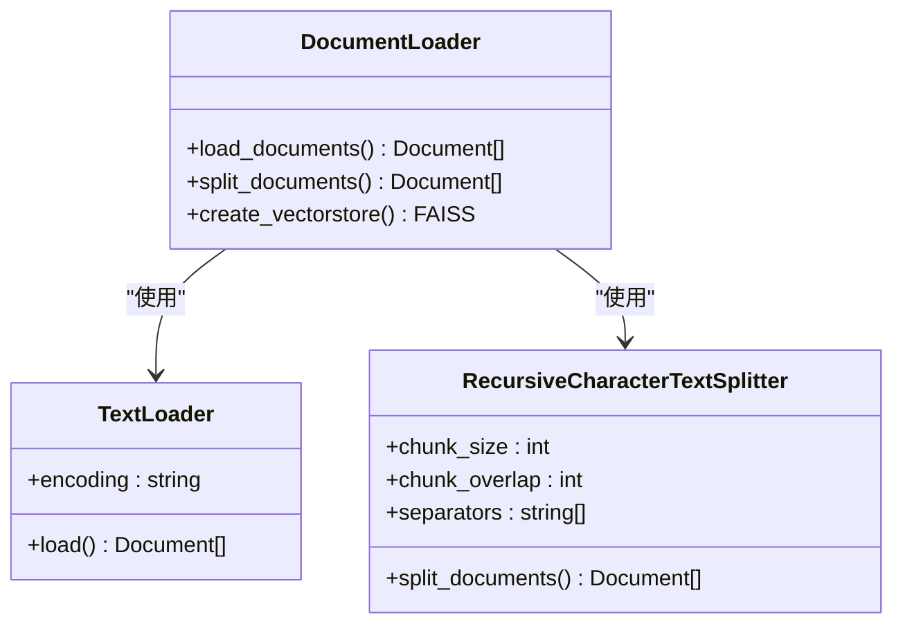

**图表来源**
- [ingest.py:31-82](file://04-knowledge-base/ingest.py#L31-L82)

#### 文本分割策略

系统采用了智能的文本分割算法，确保文档块的质量和连贯性：

| 参数 | 默认值 | 说明 |
|------|--------|------|
| chunk_size | 500 | 每个文本块的最大字符数 |
| chunk_overlap | 50 | 相邻块的重叠字符数 |
| separators | ["\n\n", "\n", "。", "，", " ", ""] | 中文友好的分隔符 |

**章节来源**
- [ingest.py:53-82](file://04-knowledge-base/ingest.py#L53-L82)

### 向量存储与检索

#### FAISS 索引管理

FAISS 是 Facebook 开源的高效向量相似度搜索库，特别适合大规模向量数据的存储和检索：

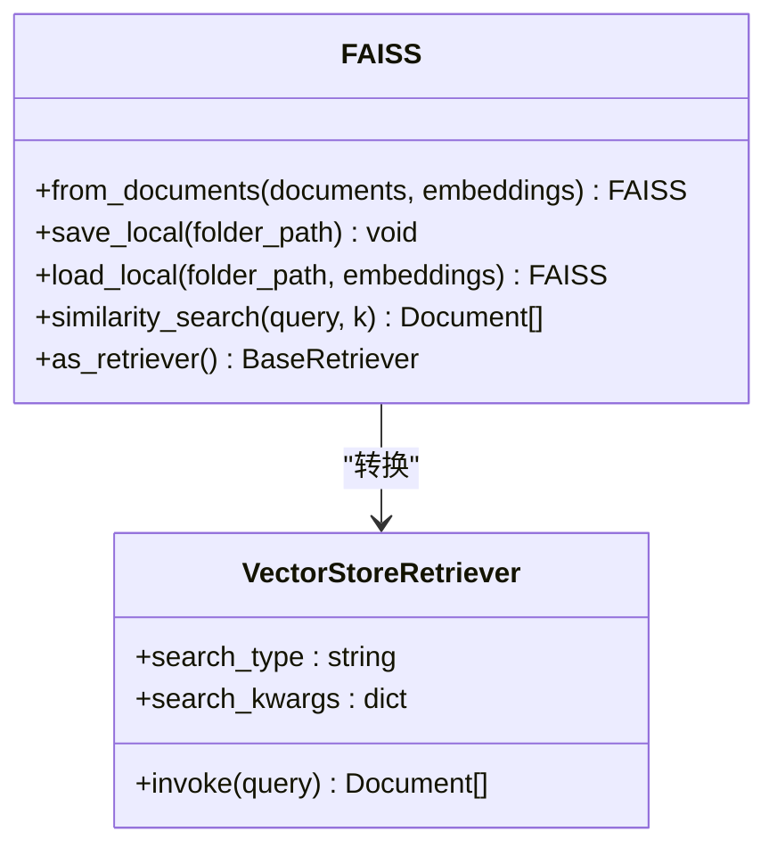

**图表来源**
- [retriever.py:26-40](file://04-knowledge-base/retriever.py#L26-L40)
- [retriever.py:128-139](file://04-knowledge-base/retriever.py#L128-L139)

#### 检索策略对比

系统支持多种检索策略，每种都有其特定的应用场景：

| 检索策略 | 描述 | 适用场景 | 参数配置 |
|----------|------|----------|----------|
| similarity | 纯相似度搜索 | 基础问答，追求准确性 | k=3 |
| mmr | 最大边际相关性 | 需要多样性的场景 | k=3, fetch_k=10, lambda_mult=0.5 |

**章节来源**
- [retriever.py:43-126](file://04-knowledge-base/retriever.py#L43-L126)

### RAG 链构建

#### LCEL 链式处理

系统使用 LangChain Expression Language 构建高效的 RAG 链：

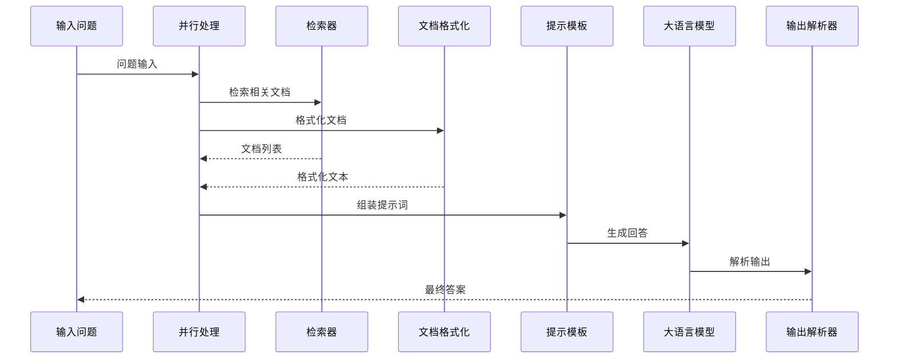

**图表来源**
- [main.py:81-89](file://04-knowledge-base/main.py#L81-L89)

#### 提示模板设计

系统设计了专门的提示模板，确保 LLM 基于检索到的上下文进行回答：

| 模板类型 | 系统消息 | 人类消息 | 功能说明 |
|----------|----------|----------|----------|
| 基础问答 | 基于上下文回答，不编造信息 | 用户问题 | 标准问答流程 |
| 来源引用 | 包含引用片段编号 | 用户问题 | 带出处的问答 |

**章节来源**
- [main.py:56-66](file://04-knowledge-base/main.py#L56-L66)
- [main.py:101-108](file://04-knowledge-base/main.py#L101-L108)

### 配置管理系统

#### 环境变量配置

系统支持灵活的配置管理，通过环境变量控制各种参数：

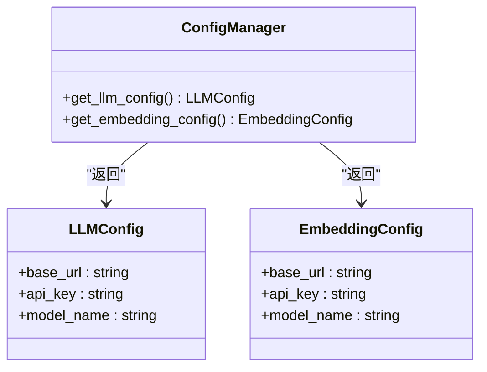

**图表来源**
- [config.py:33-77](file://common/config.py#L33-L77)

**章节来源**
- [config.py:1-77](file://common/config.py#L1-L77)
- [llm.py:13-59](file://common/llm.py#L13-L59)

## 依赖关系分析

### 外部依赖

P4 项目依赖于多个关键的第三方库：

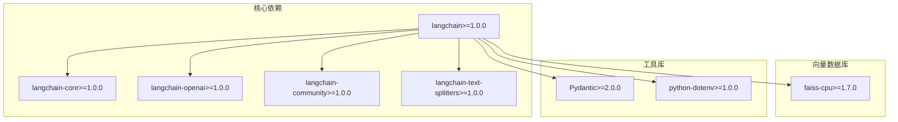

**图表来源**
- [pyproject.toml:7-21](file://pyproject.toml#L7-L21)

### 内部模块依赖

系统内部模块之间的依赖关系清晰明确：

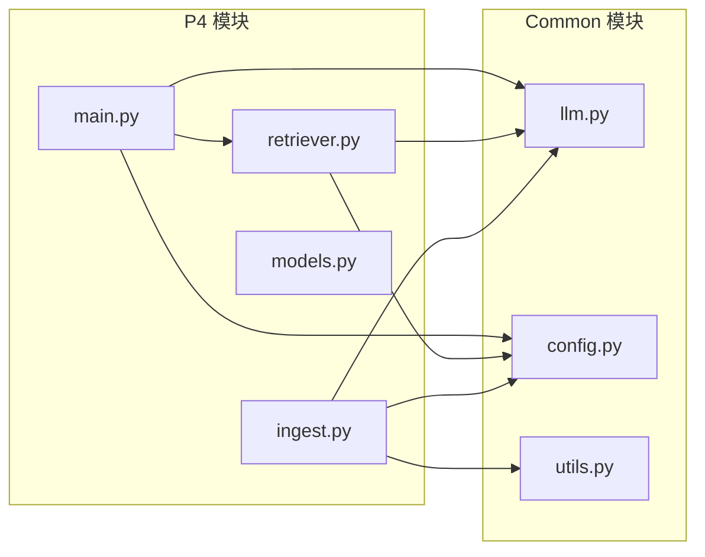

**图表来源**
- [main.py:26-36](file://04-knowledge-base/main.py#L26-L36)
- [retriever.py:17-19](file://04-knowledge-base/retriever.py#L17-L19)
- [ingest.py:18-19](file://04-knowledge-base/ingest.py#L18-L19)

**章节来源**
- [pyproject.toml:1-29](file://pyproject.toml#L1-L29)

## 性能考虑

### 向量检索优化

系统在向量检索方面采用了多项优化策略：

1. **索引类型选择**：FAISS 提供了多种索引类型，可根据数据规模选择合适的索引
2. **批量处理**：支持批量向量生成和检索，提高处理效率
3. **缓存机制**：向量索引持久化存储，避免重复计算

### 检索参数调优

| 参数 | 默认值 | 调优建议 | 性能影响 |
|------|--------|----------|----------|
| k | 3 | 1-5 | 影响召回率和响应时间 |
| chunk_size | 500 | 250-1000 | 影响上下文质量和内存使用 |
| chunk_overlap | 50 | 10-100 | 平衡上下文连续性和存储空间 |
| lambda_mult | 0.5 | 0.1-0.9 | 控制相关性和多样性的平衡 |

### 内存和存储优化

- **向量维度**：根据嵌入模型选择合适的维度
- **索引压缩**：对于大规模数据可考虑索引压缩技术
- **增量更新**：支持向量索引的增量更新和维护

## 故障排除指南

### 常见问题及解决方案

#### 环境配置问题

**问题**：LLM 配置错误
**症状**：运行时报错，无法连接到 LLM 服务
**解决方案**：
1. 检查 .env 文件中的配置项
2. 验证 LLM_BASE_URL 和 LLM_MODEL_NAME 的正确性
3. 确认网络连接正常

#### 向量索引问题

**问题**：向量索引加载失败
**症状**：启动时提示向量索引不存在
**解决方案**：
1. 确保已先运行 `python ingest.py`
2. 检查 vectorstore 目录是否存在
3. 验证嵌入模型配置正确

#### 检索效果不佳

**问题**：检索结果质量差
**解决方案**：
1. 调整检索参数（k 值、lambda_mult）
2. 优化文本分割策略
3. 检查嵌入模型质量

**章节来源**
- [main.py:171-176](file://04-knowledge-base/main.py#L171-L176)
- [retriever.py:147-149](file://04-knowledge-base/retriever.py#L147-L149)

### 调试技巧

1. **逐步验证**：分别测试文档加载、向量化、检索各环节
2. **日志输出**：利用系统内置的调试信息
3. **参数对比**：通过调整参数观察效果变化

## 结论

P4 项目成功实现了完整的 RAG 知识库问答系统，展现了现代 LLM 应用的最佳实践。系统具有以下优势：

- **架构清晰**：模块化设计便于理解和维护
- **功能完整**：覆盖了 RAG 的所有关键环节
- **性能优秀**：通过合理的参数配置和优化策略
- **易于扩展**：为后续的功能扩展奠定了良好基础

该系统不仅适用于教学和演示，也为实际的生产应用提供了可靠的参考模板。

## 附录

### 快速开始指南

```bash
# 1. 安装依赖
pip install -e .

# 2. 配置环境变量
cp .env.example .env
# 编辑 .env 文件

# 3. 运行文档摄入
python 04-knowledge-base/ingest.py

# 4. 启动问答系统
python 04-knowledge-base/main.py
```

### 配置文件示例

系统支持多种 LLM 提供商的配置：

| 提供商 | LLM_BASE_URL | LLM_MODEL_NAME |
|--------|-------------|----------------|
| 本地 Ollama | `http://localhost:11434/v1` | `qwen2.5:7b` |
| DeepSeek | `https://api.deepseek.com/v1` | `deepseek-chat` |
| 通义千问 | `https://dashscope.aliyuncs.com/compatible-mode/v1` | `qwen-plus` |
| OpenAI | `https://api.openai.com/v1` | `gpt-4o` |

### 扩展建议

1. **多模态支持**：集成图片、音频等多模态内容
2. **实时更新**：实现文档的实时增量更新机制
3. **监控告警**：添加系统性能监控和异常告警
4. **缓存优化**：实现多级缓存提升响应速度