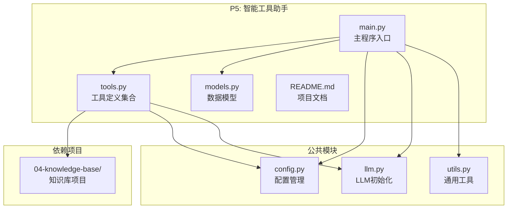
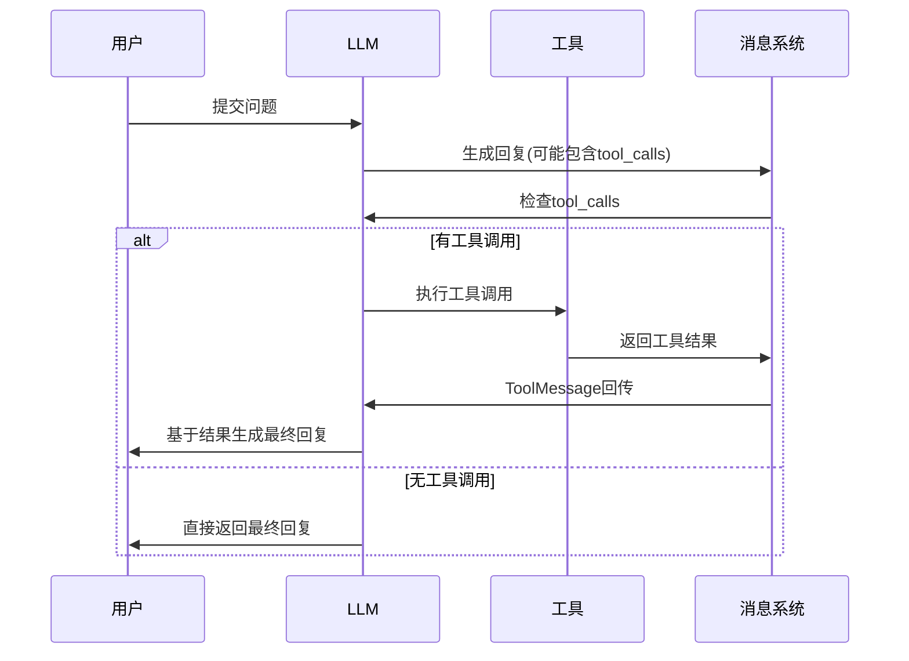
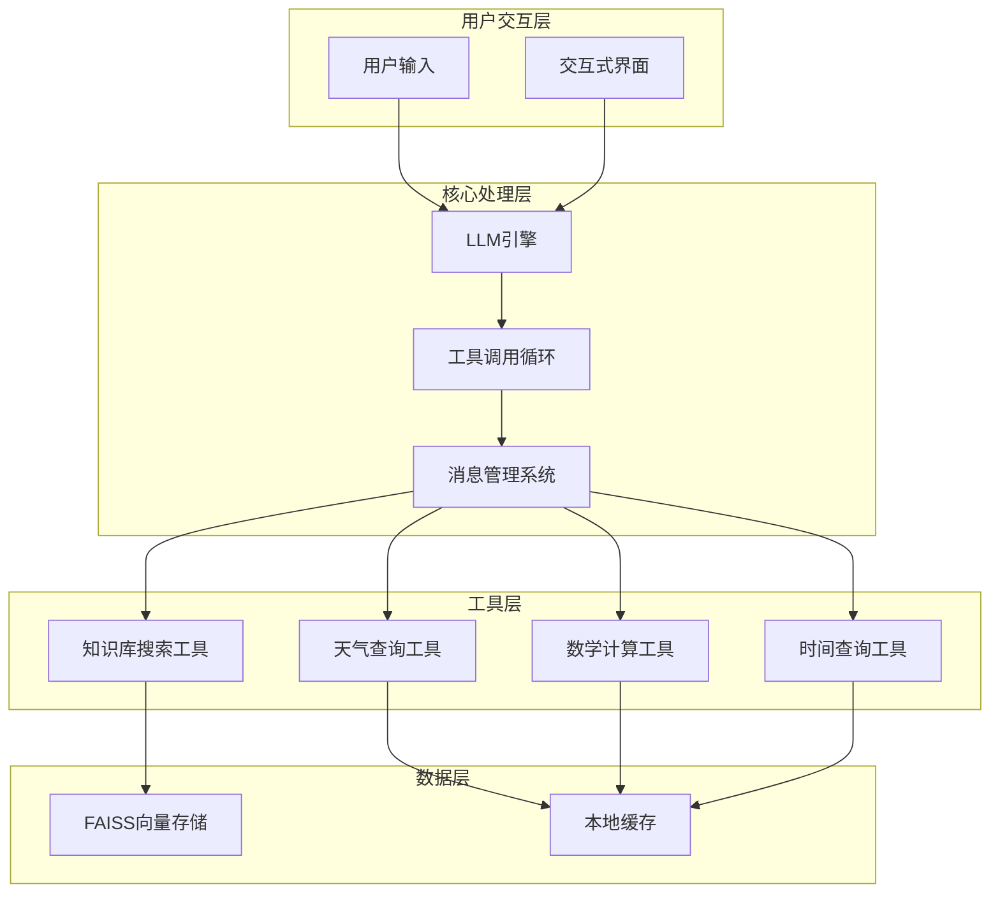
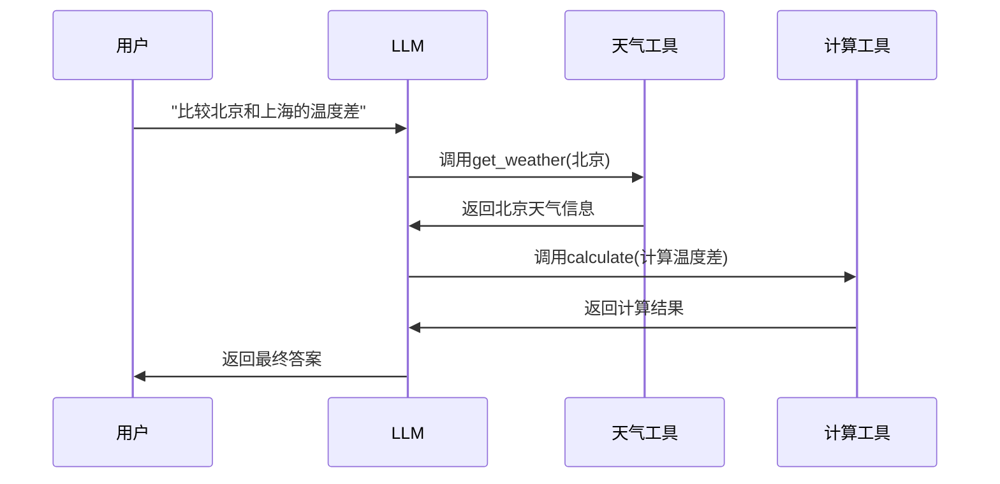
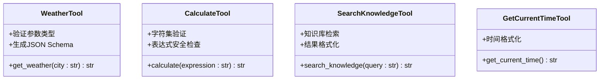
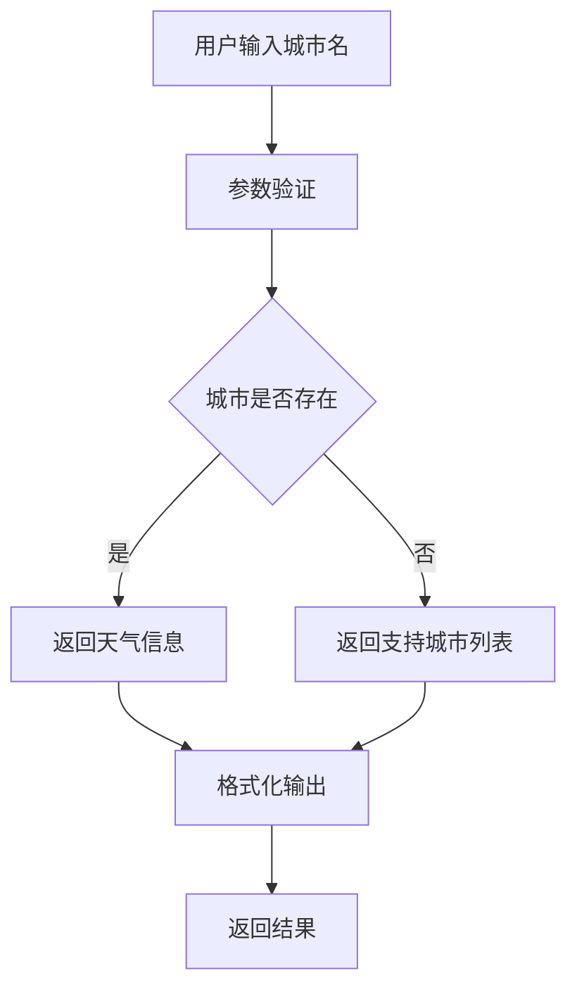
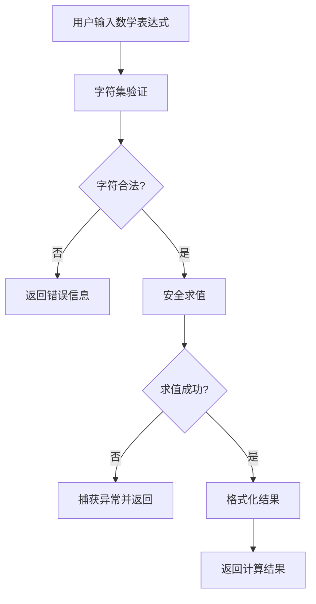
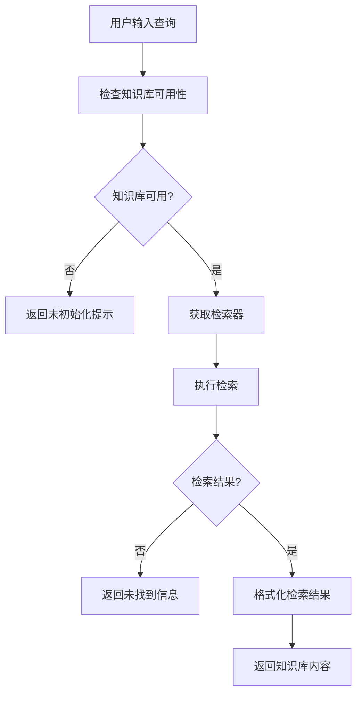
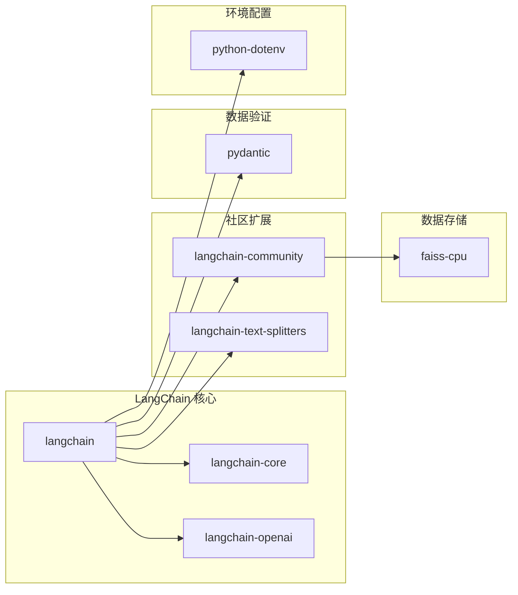
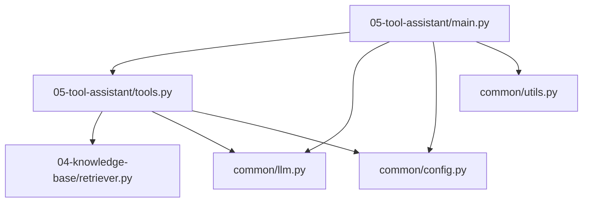

# P5: 智能工具助手

<cite>
**本文档引用的文件**
- [main.py](file://05-tool-assistant/main.py)
- [tools.py](file://05-tool-assistant/tools.py)
- [models.py](file://05-tool-assistant/models.py)
- [README.md](file://05-tool-assistant/README.md)
- [config.py](file://common/config.py)
- [llm.py](file://common/llm.py)
- [utils.py](file://common/utils.py)
- [retriever.py](file://04-knowledge-base/retriever.py)
- [main.py](file://04-knowledge-base/main.py)
- [README.md](file://README.md)
- [pyproject.toml](file://pyproject.toml)
</cite>

## 目录
1. [简介](#简介)
2. [项目结构](#项目结构)
3. [核心组件](#核心组件)
4. [架构概览](#架构概览)
5. [详细组件分析](#详细组件分析)
6. [依赖分析](#依赖分析)
7. [性能考虑](#性能考虑)
8. [故障排除指南](#故障排除指南)
9. [结论](#结论)
10. [附录](#附录)

## 简介

P5 智能工具助手是一个深入学习 LangChain 工具调用机制的实践项目。该项目展示了如何将工具定义与 LLM 绑定，实现工具调用循环，并演示了多工具协作策略。通过四个核心工具（天气查询、数学计算、知识库搜索、时间查询）的实现，为开发者提供了完整的工具助手构建指南。

该项目是整个 AI Playground 学习路径的重要组成部分，为后续的 LangGraph 和 ReAct Agent 学习奠定了坚实的基础。

## 项目结构

P5 项目采用模块化设计，主要包含以下结构：



**图表来源**
- [main.py:1-200](file://05-tool-assistant/main.py#L1-L200)
- [tools.py:1-145](file://05-tool-assistant/tools.py#L1-L145)
- [config.py:1-77](file://common/config.py#L1-L77)
- [llm.py:1-59](file://common/llm.py#L1-L59)

**章节来源**
- [README.md:89-108](file://README.md#L89-L108)
- [pyproject.toml:1-29](file://pyproject.toml#L1-L29)

## 核心组件

### 工具定义系统

P5 项目的核心是其工具定义系统，通过 `@tool` 装饰器将普通 Python 函数转换为 LangChain 工具。每个工具都具备以下特性：

- **自动文档生成**：函数的 docstring 自动生成工具描述
- **参数验证**：类型注解自动生成 JSON Schema
- **灵活实现**：工具内部可包含任意业务逻辑

### 工具调用循环

项目实现了手动工具调用循环，这是理解 Agent 核心机制的关键：



**图表来源**
- [main.py:42-115](file://05-tool-assistant/main.py#L42-L115)

**章节来源**
- [tools.py:30-125](file://05-tool-assistant/tools.py#L30-L125)
- [main.py:42-115](file://05-tool-assistant/main.py#L42-L115)

## 架构概览

P5 项目的整体架构体现了从静态调用到动态工具使用的智能化演进过程：



**图表来源**
- [main.py:178-196](file://05-tool-assistant/main.py#L178-L196)
- [tools.py:18-28](file://05-tool-assistant/tools.py#L18-L28)

## 详细组件分析

### 工具定义与绑定机制

#### @tool 装饰器系统

每个工具都通过 `@tool` 装饰器进行定义，该装饰器提供了以下功能：

- **函数包装**：将普通 Python 函数转换为 LangChain 工具
- **元数据提取**：自动从 docstring 和类型注解生成工具描述和参数 schema
- **异常处理**：提供统一的错误处理机制

#### 工具绑定流程

```mermaid
flowchart TD
A[定义工具函数] --> B[@tool装饰器]
B --> C[生成工具对象]
C --> D[注册到all_tools列表]
D --> E[LLM绑定工具]
E --> F[工具调用循环]
```

**图表来源**
- [tools.py:30-125](file://05-tool-assistant/tools.py#L30-L125)
- [main.py:123-125](file://05-tool-assistant/main.py#L123-L125)

**章节来源**
- [tools.py:16-125](file://05-tool-assistant/tools.py#L16-L125)

### 工具调用循环实现

#### 核心循环逻辑

手动实现的工具调用循环包含以下关键步骤：

1. **LLM 推理**：生成初始回复，可能包含工具调用请求
2. **工具调用检查**：解析 `tool_calls` 字段判断是否需要执行工具
3. **工具执行**：根据工具名称和参数执行对应函数
4. **结果回传**：将工具结果封装为 `ToolMessage` 回传给 LLM
5. **迭代控制**：最多执行 10 次循环，防止无限循环

#### 多工具协作策略

项目支持复杂的多工具协作场景：



**图表来源**
- [main.py:131-140](file://05-tool-assistant/main.py#L131-L140)

**章节来源**
- [main.py:42-115](file://05-tool-assistant/main.py#L42-L115)

### 工具接口设计

#### 标准化工具接口

所有工具遵循统一的接口规范：

| 组件 | 要求 | 示例 |
|------|------|------|
| 函数签名 | 必须使用类型注解 | `city: str` |
| 文档字符串 | 必须包含描述和参数说明 | `"""查询天气信息"""` |
| 返回值 | 必须返回字符串 | `"📍 北京天气：晴..."` |
| 错误处理 | 必须包含异常捕获 | `except Exception as e:` |

#### 参数验证机制

工具参数通过 Pydantic 自动生成 JSON Schema，实现自动验证：



**图表来源**
- [tools.py:30-125](file://05-tool-assistant/tools.py#L30-L125)

**章节来源**
- [tools.py:30-125](file://05-tool-assistant/tools.py#L30-L125)

### 错误处理与安全考虑

#### 错误处理策略

项目实现了多层次的错误处理机制：

1. **工具不存在**：检测工具名称并返回友好错误信息
2. **参数验证失败**：使用 Pydantic schema 进行严格验证
3. **运行时异常**：捕获并记录异常，返回用户友好的错误消息
4. **知识库不可用**：优雅降级，提供替代方案

#### 安全防护措施

针对不同类型的工具实施相应的安全防护：

- **数学计算工具**：字符集白名单验证，防止代码注入
- **知识库工具**：模块导入异常处理，避免依赖缺失
- **外部 API 调用**：模拟数据，便于演示和测试

**章节来源**
- [tools.py:67-78](file://05-tool-assistant/tools.py#L67-L78)
- [tools.py:93-94](file://05-tool-assistant/tools.py#L93-L94)

### 实用工具实现详解

#### 天气查询工具

天气查询工具展示了如何实现简单的数据查询功能：



**图表来源**
- [tools.py:30-53](file://05-tool-assistant/tools.py#L30-L53)

#### 数学计算工具

数学计算工具实现了安全的表达式求值：



**图表来源**
- [tools.py:55-79](file://05-tool-assistant/tools.py#L55-L79)

#### 知识库搜索工具

知识库搜索工具展示了复杂的数据检索流程：



**图表来源**
- [tools.py:81-110](file://05-tool-assistant/tools.py#L81-L110)

**章节来源**
- [tools.py:30-125](file://05-tool-assistant/tools.py#L30-L125)

## 依赖分析

### 外部依赖关系

P5 项目依赖于多个 LangChain 生态系统的组件：



**图表来源**
- [pyproject.toml:7-21](file://pyproject.toml#L7-L21)

### 内部模块依赖

项目内部模块之间的依赖关系相对简单，主要体现为工具对公共模块的依赖：



**图表来源**
- [main.py:28-39](file://05-tool-assistant/main.py#L28-L39)
- [tools.py:18-27](file://05-tool-assistant/tools.py#L18-L27)

**章节来源**
- [pyproject.toml:1-29](file://pyproject.toml#L1-L29)

## 性能考虑

### 工具调用性能优化

#### 循环限制与超时控制

项目实现了多重保护机制来确保系统稳定性：

- **最大迭代次数**：限制工具调用循环最多执行 10 次
- **异常超时**：为每个工具调用设置合理的超时时间
- **内存管理**：及时清理临时数据和中间结果

#### 缓存策略

针对频繁调用的工具实施缓存机制：

- **天气查询缓存**：短期缓存常用城市的天气信息
- **知识库结果缓存**：缓存热门查询的结果
- **LLM响应缓存**：避免重复的工具调用决策

### 资源管理

#### LLM连接池

项目通过共享 LLM 实例来优化资源使用：

- **单例模式**：避免重复创建 LLM 实例
- **连接复用**：最大化利用现有的 LLM 连接
- **配置统一**：通过配置文件集中管理 LLM 设置

**章节来源**
- [main.py:74-114](file://05-tool-assistant/main.py#L74-L114)
- [llm.py:13-40](file://common/llm.py#L13-L40)

## 故障排除指南

### 常见问题诊断

#### 工具调用失败

当工具调用失败时，系统会返回详细的错误信息：

1. **工具不存在**：检查工具名称拼写和注册状态
2. **参数验证失败**：查看工具的参数 schema 和必填字段
3. **运行时异常**：检查工具内部的异常处理逻辑

#### 知识库集成问题

知识库工具可能出现以下问题：

- **索引文件缺失**：确认向量存储目录存在且包含必要的文件
- **嵌入模型配置**：检查嵌入模型的配置是否正确
- **检索器初始化**：验证检索器的创建和配置

### 调试技巧

#### 日志记录

项目提供了丰富的调试信息输出：

- **工具调用详情**：显示每次工具调用的参数和结果
- **消息历史**：记录完整的对话历史便于分析
- **性能指标**：监控工具调用的响应时间和成功率

#### 错误恢复

系统具备良好的错误恢复能力：

- **优雅降级**：当某个工具不可用时，尝试其他替代方案
- **重试机制**：对临时性错误实施有限次数的重试
- **回滚策略**：在出现严重错误时回滚到安全状态

**章节来源**
- [main.py:174-176](file://05-tool-assistant/main.py#L174-L176)
- [tools.py:93-109](file://05-tool-assistant/tools.py#L93-L109)

## 结论

P5 智能工具助手项目成功展示了 LangChain 工具调用机制的核心原理和最佳实践。通过四个实用工具的实现，开发者可以深入理解：

1. **工具定义与绑定**：如何使用 `@tool` 装饰器创建可被 LLM 调用的工具
2. **工具调用循环**：手动实现的工具调用循环是理解 Agent 核心机制的关键
3. **多工具协作**：如何设计复杂的工具组合来解决实际问题
4. **错误处理与安全**：如何在保证安全性的同时提供良好的用户体验

该项目为后续的 LangGraph 和 ReAct Agent 学习奠定了坚实基础，是掌握 LLM 应用开发不可或缺的一环。

## 附录

### 工具扩展指南

#### 新增工具的基本步骤

1. **定义工具函数**：使用 `@tool` 装饰器标记
2. **添加类型注解**：确保参数和返回值都有明确的类型
3. **编写文档字符串**：提供清晰的工具描述和参数说明
4. **实现业务逻辑**：在函数体内实现具体的工具功能
5. **添加到工具列表**：将新工具添加到 `all_tools` 列表中

#### 工具设计最佳实践

- **单一职责原则**：每个工具应该专注于一个特定的功能
- **参数最小化**：尽量减少工具的参数数量，提高易用性
- **错误处理完整**：为所有可能的异常情况提供处理方案
- **性能优化**：对耗时操作实施缓存和异步处理

### 安全考虑清单

- **输入验证**：对所有用户输入进行严格的验证和过滤
- **权限控制**：限制工具的访问权限，避免越权操作
- **审计日志**：记录所有工具调用的详细信息
- **资源限制**：为工具调用设置合理的资源使用上限

### 性能优化建议

- **并发处理**：对独立的工具调用实施并发执行
- **结果缓存**：对重复的查询结果实施缓存
- **连接池管理**：优化 LLM 和数据库连接的使用
- **内存监控**：定期检查内存使用情况，及时释放不需要的对象