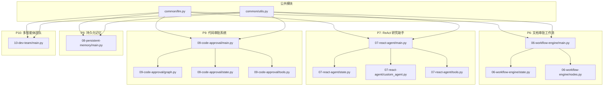
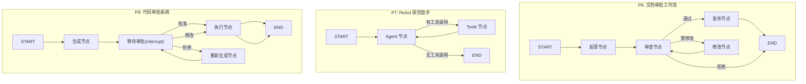
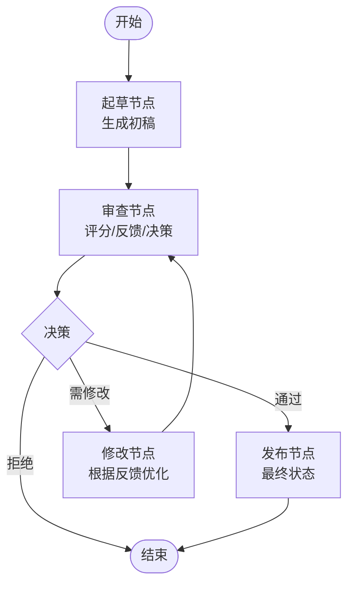
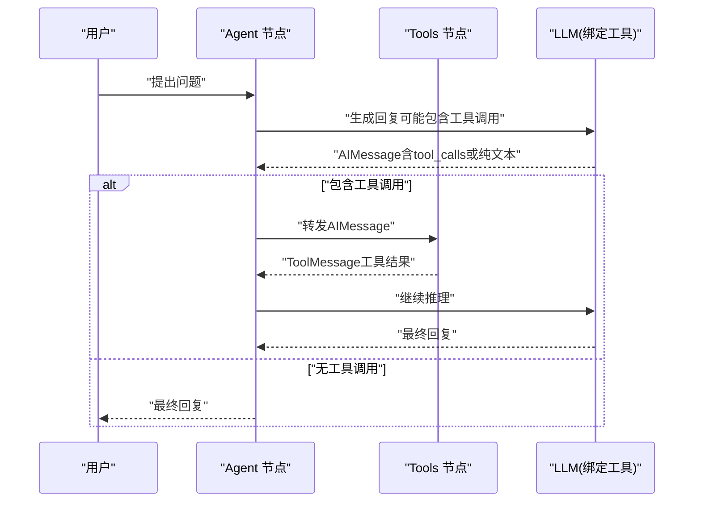
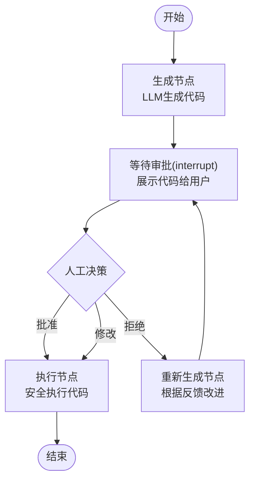
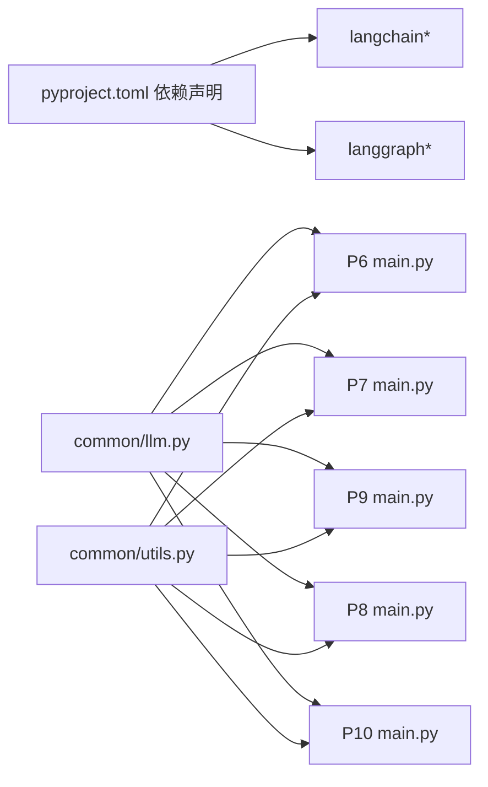

# LangGraph基础项目

<cite>
**本文引用的文件**
- [README.md](file://README.md)
- [pyproject.toml](file://pyproject.toml)
- [common/llm.py](file://common/llm.py)
- [common/utils.py](file://common/utils.py)
- [06-workflow-engine/main.py](file://06-workflow-engine/main.py)
- [06-workflow-engine/state.py](file://06-workflow-engine/state.py)
- [06-workflow-engine/nodes.py](file://06-workflow-engine/nodes.py)
- [07-react-agent/main.py](file://07-react-agent/main.py)
- [07-react-agent/state.py](file://07-react-agent/state.py)
- [07-react-agent/custom_agent.py](file://07-react-agent/custom_agent.py)
- [07-react-agent/tools.py](file://07-react-agent/tools.py)
- [09-code-approval/graph.py](file://09-code-approval/graph.py)
- [09-code-approval/state.py](file://09-code-approval/state.py)
- [09-code-approval/main.py](file://09-code-approval/main.py)
- [09-code-approval/tools.py](file://09-code-approval/tools.py)
- [08-persistent-memory/main.py](file://08-persistent-memory/main.py)
- [10-dev-team/main.py](file://10-dev-team/main.py)
</cite>

## 目录
1. [引言](#引言)
2. [项目结构](#项目结构)
3. [核心组件](#核心组件)
4. [架构概览](#架构概览)
5. [详细组件分析](#详细组件分析)
6. [依赖分析](#依赖分析)
7. [性能考虑](#性能考虑)
8. [故障排除指南](#故障排除指南)
9. [结论](#结论)
10. [附录](#附录)

## 引言
本文件面向希望系统掌握 LangGraph 的开发者，围绕“状态图（StateGraph）设计、工作流编排与 Agent 系统”三大主题，结合仓库中的 P6（文档审批工作流）、P7（ReAct 研究助手）、P9（代码审批系统）等项目，深入讲解状态管理、节点设计、条件路由与循环控制机制，并提供最佳实践与可视化图示，帮助读者从入门到进阶。

## 项目结构
该项目采用“渐进式学习路径”，将 LangChain/LangGraph 的核心能力拆分为 10 个循序渐进的项目，每个项目聚焦一个关键能力点：
- P1-P5：LangChain 基础（对话、Prompt、LCEL、RAG、工具调用）
- P6-P7：LangGraph 基础（StateGraph、Agent 循环）
- P8-P10：LangGraph 高级（持久化、人工介入、多智能体）

图表来源
- [README.md:26-52](file://README.md#L26-L52)
- [pyproject.toml:1-29](file://pyproject.toml#L1-L29)
- [common/llm.py:1-59](file://common/llm.py#L1-L59)
- [common/utils.py:1-33](file://common/utils.py#L1-L33)
- [06-workflow-engine/main.py:1-238](file://06-workflow-engine/main.py#L1-L238)
- [06-workflow-engine/state.py:1-51](file://06-workflow-engine/state.py#L1-L51)
- [06-workflow-engine/nodes.py:1-146](file://06-workflow-engine/nodes.py#L1-L146)
- [07-react-agent/main.py:1-173](file://07-react-agent/main.py#L1-L173)
- [07-react-agent/state.py:1-43](file://07-react-agent/state.py#L1-L43)
- [07-react-agent/custom_agent.py:1-238](file://07-react-agent/custom_agent.py#L1-L238)
- [07-react-agent/tools.py:1-105](file://07-react-agent/tools.py#L1-L105)
- [09-code-approval/graph.py:1-225](file://09-code-approval/graph.py#L1-L225)
- [09-code-approval/state.py:1-31](file://09-code-approval/state.py#L1-L31)
- [09-code-approval/main.py:1-219](file://09-code-approval/main.py#L1-L219)
- [09-code-approval/tools.py:1-65](file://09-code-approval/tools.py#L1-L65)
- [08-persistent-memory/main.py:1-308](file://08-persistent-memory/main.py#L1-L308)
- [10-dev-team/main.py:1-284](file://10-dev-team/main.py#L1-L284)

章节来源
- [README.md:26-52](file://README.md#L26-L52)
- [pyproject.toml:1-29](file://pyproject.toml#L1-L29)

## 核心组件
- 状态容器（State）：在节点间传递的数据载体，LangGraph 自动合并部分更新。
- 节点（Node）：函数式处理单元，接收完整状态并返回部分更新字典。
- 条件边（Conditional Edges）：根据状态动态选择下一节点，实现分支与循环。
- 图编译（compile）：将图结构编译为可执行对象，支持 invoke/stream。
- 预构建 Agent（create_react_agent）：一键创建具备工具调用循环的 ReAct Agent。
- 人工介入（interrupt/resume）：在特定节点暂停，等待人工决策并恢复。
- 检查点（Checkpointer）：持久化图状态，支持断点恢复与多会话隔离。

章节来源
- [06-workflow-engine/state.py:19-51](file://06-workflow-engine/state.py#L19-L51)
- [06-workflow-engine/nodes.py:25-146](file://06-workflow-engine/nodes.py#L25-L146)
- [07-react-agent/main.py:29-31](file://07-react-agent/main.py#L29-L31)
- [09-code-approval/graph.py:28-31](file://09-code-approval/graph.py#L28-L31)
- [08-persistent-memory/main.py:29-31](file://08-persistent-memory/main.py#L29-L31)

## 架构概览
下图展示了 P6、P7、P9 的核心架构关系与数据流：

图表来源
- [06-workflow-engine/main.py:44-111](file://06-workflow-engine/main.py#L44-L111)
- [07-react-agent/custom_agent.py:37-125](file://07-react-agent/custom_agent.py#L37-L125)
- [09-code-approval/graph.py:180-225](file://09-code-approval/graph.py#L180-L225)

## 详细组件分析

### P6 文档审批工作流（StateGraph）
- 状态设计：使用 TypedDict 定义文档主题、文档内容、草稿版本、评分、反馈、状态与修订历史；其中修订历史使用 reducer 追加。
- 节点职责：
  - 起草：生成初稿并推进版本号与状态。
  - 审查：评分、反馈与决策（通过/需修改/拒绝），记录历史。
  - 修改：根据反馈优化文档。
  - 发布：最终状态标记。
- 条件路由：审查后根据决策跳转至发布、修改或结束。
- 执行模式：支持一次性 invoke 与流式 stream，便于观察中间状态。

图表来源
- [06-workflow-engine/main.py:34-103](file://06-workflow-engine/main.py#L34-L103)
- [06-workflow-engine/nodes.py:25-146](file://06-workflow-engine/nodes.py#L25-L146)
- [06-workflow-engine/state.py:19-51](file://06-workflow-engine/state.py#L19-L51)

章节来源
- [06-workflow-engine/main.py:113-153](file://06-workflow-engine/main.py#L113-L153)
- [06-workflow-engine/main.py:155-193](file://06-workflow-engine/main.py#L155-L193)
- [06-workflow-engine/state.py:19-51](file://06-workflow-engine/state.py#L19-L51)
- [06-workflow-engine/nodes.py:25-146](file://06-workflow-engine/nodes.py#L25-L146)

### P7 ReAct 研究助手（Agent 循环）
- 预构建 Agent：create_react_agent 一行创建具备工具调用循环的 Agent，内部自动连接 agent 节点与 tools 节点，并设置条件边。
- 手动构建 Agent：展示如何手动实现 Agent 循环，包括：
  - 绑定工具的 LLM 作为 agent 节点。
  - ToolNode 批量执行工具。
  - 条件边：根据最后一条消息是否包含工具调用决定流转。
  - 循环：tools 执行后回到 agent 节点。
- 工具集：网络搜索、知识库检索、数学计算，便于多轮工具调用演示。

图表来源
- [07-react-agent/main.py:35-68](file://07-react-agent/main.py#L35-L68)
- [07-react-agent/custom_agent.py:54-124](file://07-react-agent/custom_agent.py#L54-L124)
- [07-react-agent/tools.py:24-105](file://07-react-agent/tools.py#L24-L105)

章节来源
- [07-react-agent/main.py:1-173](file://07-react-agent/main.py#L1-L173)
- [07-react-agent/custom_agent.py:1-238](file://07-react-agent/custom_agent.py#L1-L238)
- [07-react-agent/state.py:29-43](file://07-react-agent/state.py#L29-L43)
- [07-react-agent/tools.py:1-105](file://07-react-agent/tools.py#L1-L105)

### P9 代码审批系统（HITL）
- 人工介入：await_review 节点调用 interrupt() 暂停执行，等待人工决策（批准/拒绝/修改），通过 Command.resume() 恢复。
- 条件路由：根据审批结果决定执行或重新生成，防止无限循环设置迭代上限。
- 安全执行：执行节点对代码进行安全检查与受限执行，避免危险操作。
- 检查点：必须配置 checkpointer 才能使用 interrupt/resume。

图表来源
- [09-code-approval/graph.py:35-178](file://09-code-approval/graph.py#L35-L178)
- [09-code-approval/main.py:35-180](file://09-code-approval/main.py#L35-L180)
- [09-code-approval/state.py:9-31](file://09-code-approval/state.py#L9-L31)

章节来源
- [09-code-approval/graph.py:1-225](file://09-code-approval/graph.py#L1-L225)
- [09-code-approval/main.py:1-219](file://09-code-approval/main.py#L1-L219)
- [09-code-approval/state.py:1-31](file://09-code-approval/state.py#L1-L31)
- [09-code-approval/tools.py:1-65](file://09-code-approval/tools.py#L1-L65)

### P8 持久化记忆（Checkpointing）
- 检查点：compile 时传入 checkpointer，使图具备持久化能力。
- 会话隔离：thread_id 实现多用户或多轮会话的独立状态。
- 摘要压缩：消息超过阈值时自动生成摘要并删除旧消息，保持上下文可控。
- 状态查看：get_state() 可随时查看当前检查点状态，便于调试与监控。

章节来源
- [08-persistent-memory/main.py:39-152](file://08-persistent-memory/main.py#L39-L152)
- [08-persistent-memory/main.py:154-308](file://08-persistent-memory/main.py#L154-L308)

### P10 多智能体团队（Supervisor 编排）
- Supervisor 模式：LLM 决定任务分配，将工作流分解为 PM → Dev → Tester 的子图协作。
- 子图嵌套：每个智能体作为子图嵌入主图，执行完毕后回到 Supervisor。
- 流式输出：stream_mode 支持实时查看每个智能体的工作进度。
- 断点恢复：结合检查点实现断点恢复与多轮协作。

章节来源
- [10-dev-team/main.py:43-107](file://10-dev-team/main.py#L43-L107)
- [10-dev-team/main.py:109-181](file://10-dev-team/main.py#L109-L181)
- [10-dev-team/main.py:182-284](file://10-dev-team/main.py#L182-L284)

## 依赖分析
- 语言与框架：Python 3.10+，依赖 langchain、langchain-core、langchain-openai、langgraph、langgraph-checkpoint-sqlite 等。
- 公共模块：common/llm.py 提供统一的 LLM 初始化工厂，common/utils.py 提供跨项目通用工具。
- 项目内依赖：各项目通过 from common.xxx import yyy 复用公共能力；P7 的工具集复用 P4 的知识库检索器（若存在）。

图表来源
- [pyproject.toml:7-21](file://pyproject.toml#L7-L21)
- [common/llm.py:13-40](file://common/llm.py#L13-L40)
- [common/utils.py:16-33](file://common/utils.py#L16-L33)
- [06-workflow-engine/main.py:24-26](file://06-workflow-engine/main.py#L24-L26)
- [07-react-agent/main.py:25-27](file://07-react-agent/main.py#L25-L27)
- [09-code-approval/main.py:25-27](file://09-code-approval/main.py#L25-L27)
- [08-persistent-memory/main.py:28-31](file://08-persistent-memory/main.py#L28-L31)
- [10-dev-team/main.py:28-31](file://10-dev-team/main.py#L28-L31)

章节来源
- [pyproject.toml:1-29](file://pyproject.toml#L1-L29)
- [common/llm.py:1-59](file://common/llm.py#L1-L59)
- [common/utils.py:1-33](file://common/utils.py#L1-L33)

## 性能考虑
- LLM 调用成本：工具调用与多轮推理会增加 token 消耗，建议合理设置 temperature 与提示词长度。
- 状态体量控制：使用 P8 的摘要压缩策略减少消息数量，避免上下文过长导致性能下降。
- 流式输出：stream_mode 能降低等待时间，提升交互体验，但需注意日志输出开销。
- 检查点存储：生产环境建议使用持久化检查点（如 SQLite），避免内存检查点在进程重启后丢失。

## 故障排除指南
- P7 工具调用循环未生效
  - 确认 agent 节点返回的消息包含工具调用字段，且 Tools 节点正确解析。
  - 检查条件边是否正确识别“有工具调用/无工具调用”的分支。
- P9 interrupt 报错
  - 必须在编译时传入 checkpointer，否则 interrupt 无法保存状态。
  - 恢复时使用 Command.resume 注入人工决策，确保格式与预期一致。
- P8 会话状态不同步
  - 确保每次调用使用相同的 thread_id，不同会话使用不同的 thread_id。
  - 使用 get_state() 检查当前检查点状态，定位异常。
- P10 子图状态映射
  - 子图编译后作为节点使用时，LangGraph 自动处理状态映射，避免手动拼接复杂字段。

章节来源
- [07-react-agent/custom_agent.py:79-93](file://07-react-agent/custom_agent.py#L79-L93)
- [09-code-approval/graph.py:221-225](file://09-code-approval/graph.py#L221-L225)
- [09-code-approval/main.py:78-156](file://09-code-approval/main.py#L78-L156)
- [08-persistent-memory/main.py:242-251](file://08-persistent-memory/main.py#L242-L251)
- [10-dev-team/main.py:68-71](file://10-dev-team/main.py#L68-L71)

## 结论
通过本项目集，读者可以系统掌握：
- 使用 StateGraph 设计工作流，理解状态、节点与条件路由的关系；
- 构建可扩展的 Agent 循环，支持工具调用与多轮推理；
- 在关键节点引入人工介入，实现人机协作；
- 通过检查点实现持久化与断点恢复，支撑真实业务场景；
- 以 Supervisor 模式组织多智能体团队，实现复杂任务的编排与协作。

这些能力构成了从基础到高级的完整学习路径，既适合入门练习，也便于在生产环境中落地应用。

## 附录
- 快速开始与环境配置参考 README 与 .env 示例，确保 LLM base_url 与模型名正确。
- 项目结构与学习路径可在 README 的“学习路径总览”与“知识图谱”中查看。

章节来源
- [README.md:5-87](file://README.md#L5-L87)