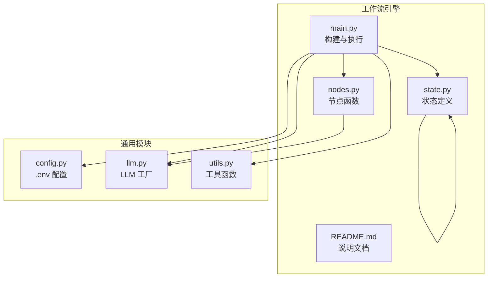
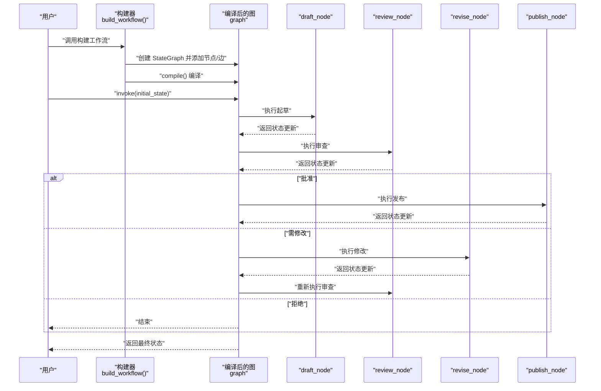
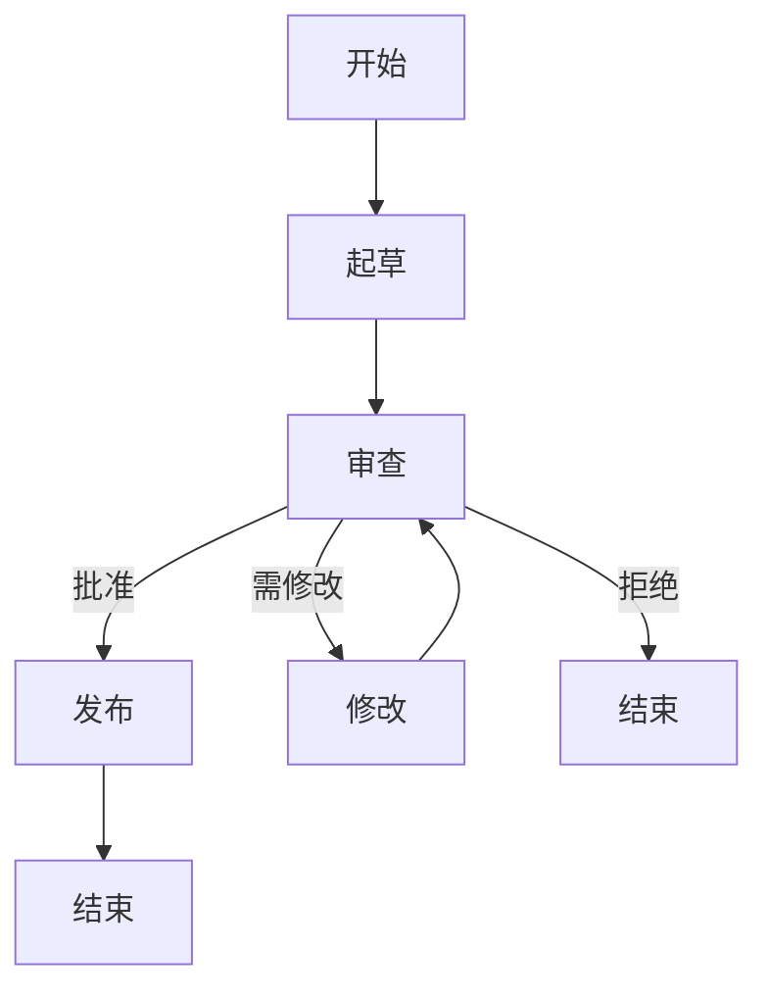
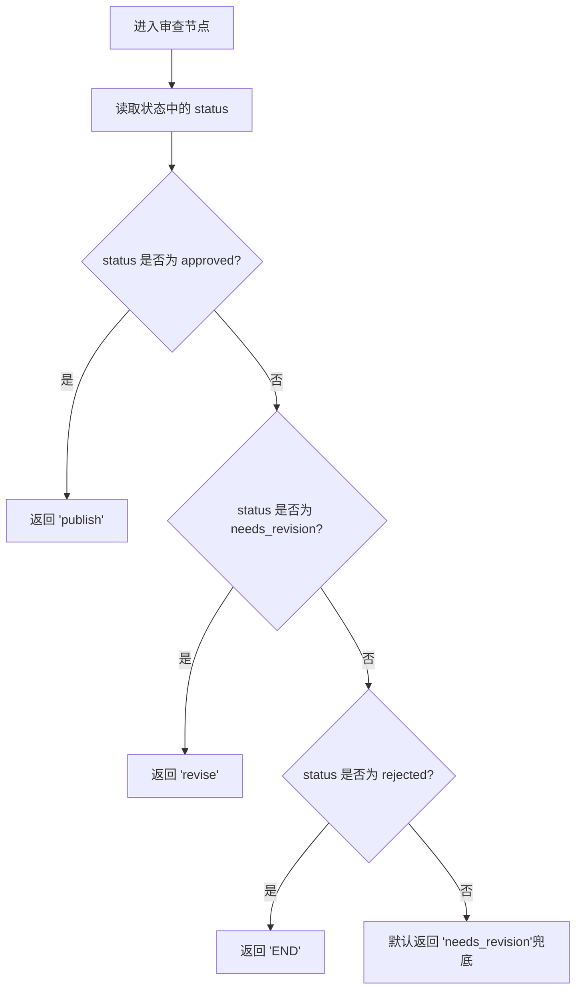
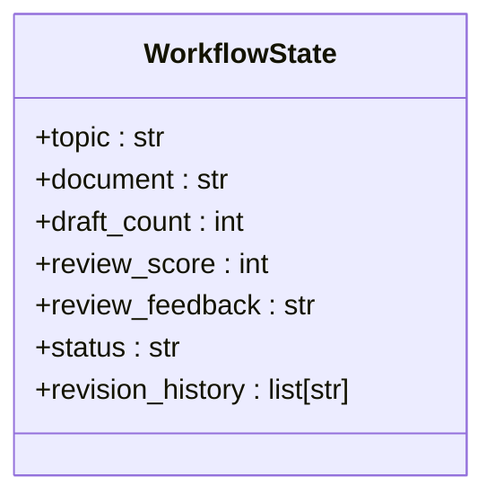
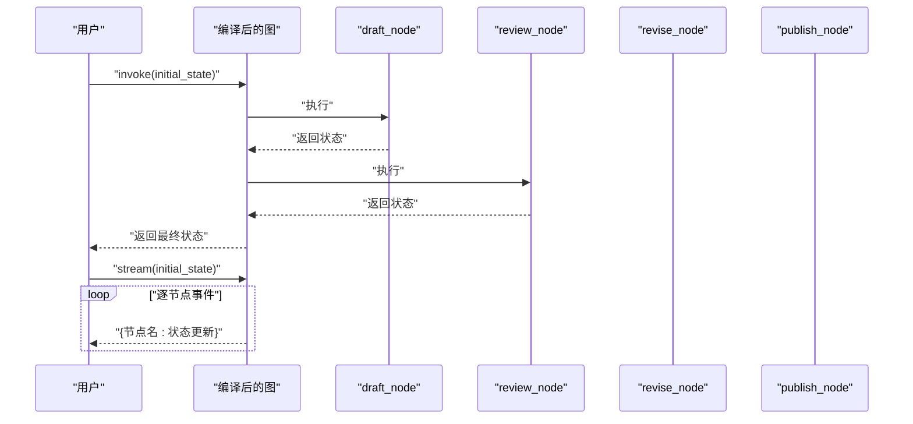
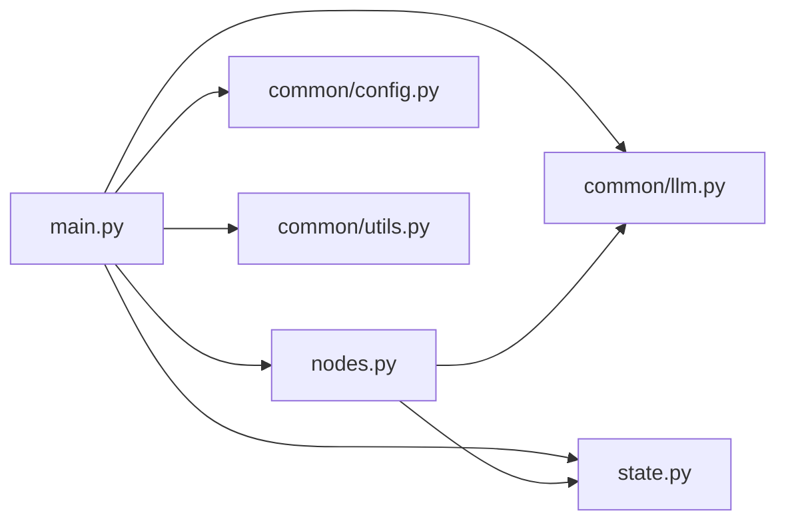

# P6: 文档审批工作流

<cite>
**本文引用的文件**
- [main.py](file://06-workflow-engine/main.py)
- [nodes.py](file://06-workflow-engine/nodes.py)
- [state.py](file://06-workflow-engine/state.py)
- [README.md](file://06-workflow-engine/README.md)
- [llm.py](file://common/llm.py)
- [config.py](file://common/config.py)
- [utils.py](file://common/utils.py)
</cite>

## 目录
1. [简介](#简介)
2. [项目结构](#项目结构)
3. [核心组件](#核心组件)
4. [架构总览](#架构总览)
5. [详细组件分析](#详细组件分析)
6. [依赖关系分析](#依赖关系分析)
7. [性能考量](#性能考量)
8. [故障排查指南](#故障排查指南)
9. [结论](#结论)
10. [附录](#附录)

## 简介
本项目展示了如何使用 LangGraph 的 StateGraph 构建“文档审批”工作流。通过 TypedDict 定义状态，节点函数处理状态并返回部分更新，利用固定边与条件边实现线性流程与循环控制，并通过编译后的图对象支持同步执行（invoke）与流式执行（stream）。本文将深入解析状态图设计原理、节点函数实现、状态更新逻辑、条件路由策略以及两种执行模式的差异与适用场景。

## 项目结构
- 06-workflow-engine：工作流引擎与示例
  - main.py：工作流构建、执行与演示
  - nodes.py：四个核心节点函数（draft、review、revise、publish）
  - state.py：TypedDict 定义的工作流状态
  - README.md：项目说明与知识点总结
- common：通用模块
  - llm.py：LLM 初始化工厂
  - config.py：配置加载（.env）
  - utils.py：通用工具函数

图表来源
- [main.py:1-238](file://06-workflow-engine/main.py#L1-L238)
- [nodes.py:1-146](file://06-workflow-engine/nodes.py#L1-L146)
- [state.py:1-51](file://06-workflow-engine/state.py#L1-L51)
- [README.md:1-55](file://06-workflow-engine/README.md#L1-L55)
- [llm.py:1-59](file://common/llm.py#L1-L59)
- [config.py:1-77](file://common/config.py#L1-L77)
- [utils.py:1-33](file://common/utils.py#L1-L33)

章节来源
- [main.py:1-238](file://06-workflow-engine/main.py#L1-L238)
- [README.md:1-55](file://06-workflow-engine/README.md#L1-L55)

## 核心组件
- 状态定义（WorkflowState）
  - 使用 TypedDict 描述工作流状态字段，包含主题、文档、草稿次数、评分、反馈、状态标识与修订历史。
  - 修订历史采用 Annotated[list, add]，确保节点返回的新条目追加到历史列表，而非替换。
- 节点函数
  - draft_node：根据主题生成文档草稿，更新文档内容、草稿次数与状态。
  - review_node：LLM 作为审查员评估文档，返回评分、反馈与决策（approved/needs_revision/rejected），并记录审查历史。
  - revise_node：根据反馈修改文档，更新文档内容、草稿次数与状态。
  - publish_node：标记最终发布状态并记录发布历史。
- 条件路由
  - route_after_review：基于状态中的 status 字段返回下一步节点名，实现“通过/需修改/拒绝”的分支。
- 图构建与执行
  - 使用 StateGraph(WorkflowState) 创建有向图，add_node/add_edge/add_conditional_edges 定义节点与边，compile() 编译后支持 invoke/stream。

章节来源
- [state.py:19-51](file://06-workflow-engine/state.py#L19-L51)
- [nodes.py:25-146](file://06-workflow-engine/nodes.py#L25-L146)
- [main.py:34-111](file://06-workflow-engine/main.py#L34-L111)

## 架构总览
下图展示了从构建到执行的完整流程：构建阶段定义节点与边，编译阶段生成可执行图，执行阶段支持同步与流式两种模式。

图表来源
- [main.py:44-111](file://06-workflow-engine/main.py#L44-L111)
- [nodes.py:25-146](file://06-workflow-engine/nodes.py#L25-L146)

## 详细组件分析

### 状态图设计与节点/边管理
- 节点添加
  - 使用 add_node 注册四个节点函数，分别负责起草、审查、修改与发布。
- 固定边（add_edge）
  - START → draft：工作流入口。
  - draft → review：固定顺序推进。
  - publish → END：发布完成后结束。
  - revise → review：修改后回到审查，形成循环。
- 条件边（add_conditional_edges）
  - review 节点根据 route_after_review 的返回值进行分支：
    - approved → publish
    - needs_revision → revise
    - rejected → END
- 循环控制
  - 通过 revise → review 的固定边与条件边的组合，实现“多次修改直至批准”的闭环。

图表来源
- [main.py:61-102](file://06-workflow-engine/main.py#L61-L102)

章节来源
- [main.py:44-111](file://06-workflow-engine/main.py#L44-L111)

### 条件路由函数：route_after_review 设计思路
- 输入：当前 WorkflowState
- 输出：字符串（对应目标节点名或 END）
- 设计要点
  - 直接读取状态中的 status 字段作为决策依据。
  - 返回值与 add_conditional_edges 的 mapping 键一致，实现精确路由。
- 与评分的关联
  - review_node 内部会根据评分对决策进行修正，最终以状态中的 status 为准，保证路由一致性。

图表来源
- [main.py:34-42](file://06-workflow-engine/main.py#L34-L42)
- [nodes.py:45-109](file://06-workflow-engine/nodes.py#L45-L109)

章节来源
- [main.py:34-42](file://06-workflow-engine/main.py#L34-L42)
- [nodes.py:45-109](file://06-workflow-engine/nodes.py#L45-L109)

### 节点函数实现与状态更新逻辑

#### draft_node（起草）
- 功能：根据主题生成文档草稿，更新文档内容、草稿次数与状态。
- 状态更新：
  - document：新生成的文档内容
  - draft_count：+1
  - status：drafting
- 复杂度：O(1)，主要为 LLM 调用与字段赋值。

章节来源
- [nodes.py:25-43](file://06-workflow-engine/nodes.py#L25-L43)

#### review_node（审查）
- 功能：LLM 评估文档质量，返回评分、反馈与决策；同时根据评分修正决策。
- 状态更新：
  - review_score：0-100 的评分
  - review_feedback：简短反馈
  - status：approved/needs_revision/rejected
  - revision_history：追加一条审查记录
- 决策规则（简化）：
  - 评分 ≥ 85 → approved
  - 60 ≤ 评分 < 85 → needs_revision
  - 评分 < 60 → rejected
- 复杂度：O(1)，主要为 LLM 调用与文本解析。

章节来源
- [nodes.py:45-109](file://06-workflow-engine/nodes.py#L45-L109)

#### revise_node（修改）
- 功能：根据审查反馈修改文档。
- 状态更新：
  - document：修改后的完整文档
  - draft_count：+1
  - status：revising
- 复杂度：O(1)，主要为 LLM 调用与字段赋值。

章节来源
- [nodes.py:111-136](file://06-workflow-engine/nodes.py#L111-L136)

#### publish_node（发布）
- 功能：标记最终发布状态并记录发布历史。
- 状态更新：
  - status：published
  - revision_history：追加发布记录
- 复杂度：O(1)。

章节来源
- [nodes.py:138-146](file://06-workflow-engine/nodes.py#L138-L146)

### 状态管理与合并策略
- TypedDict 定义的 WorkflowState 在节点间传递，节点仅返回需要更新的部分字段。
- 默认合并策略：新值覆盖旧值。
- 特殊字段（revision_history）使用 Annotated[list, add]，实现列表追加而非替换，确保历史记录累积。

图表来源
- [state.py:19-51](file://06-workflow-engine/state.py#L19-L51)

章节来源
- [state.py:19-51](file://06-workflow-engine/state.py#L19-L51)

### 执行模式对比：invoke vs stream
- invoke
  - 一次性执行完整工作流，返回最终状态。
  - 适合批处理、自动化任务。
- stream
  - 逐步返回每个节点执行后的状态更新事件，便于观察中间状态与调试。
  - 适合交互式演示、实时可视化与调试。
- 两者共享同一编译后的图对象，差异在于消费事件的方式。

图表来源
- [main.py:135-192](file://06-workflow-engine/main.py#L135-L192)

章节来源
- [main.py:135-192](file://06-workflow-engine/main.py#L135-L192)

## 依赖关系分析
- main.py 依赖
  - nodes.py：导入四个节点函数
  - state.py：导入 WorkflowState 类型
  - common.llm：获取 LLM 实例
  - common.config：读取 LLM 配置
  - common.utils：打印分隔线与步骤信息
- nodes.py 依赖
  - common.llm：LLM 调用
  - state.py：类型提示
- common 模块
  - llm.py：统一 LLM 初始化
  - config.py：.env 配置加载
  - utils.py：通用输出格式化

图表来源
- [main.py:24-31](file://06-workflow-engine/main.py#L24-L31)
- [nodes.py:20-22](file://06-workflow-engine/nodes.py#L20-L22)

章节来源
- [main.py:24-31](file://06-workflow-engine/main.py#L24-L31)
- [nodes.py:20-22](file://06-workflow-engine/nodes.py#L20-L22)

## 性能考量
- LLM 调用成本
  - 每个节点均涉及一次或多次 LLM 调用，建议合理设置 temperature 与提示词长度，避免不必要的重复计算。
- 状态更新开销
  - 仅返回必要字段，LangGraph 自动合并，减少数据传输与序列化成本。
- 流式执行的内存占用
  - stream 模式会产生更多中间事件，长时间运行时需关注内存与日志输出。
- 优化建议
  - 对于高频调用的节点，考虑缓存 LLM 实例与提示词模板。
  - 使用结构化输出（如 JSON）替代文本解析，提升稳定性与速度。
  - 在 review_node 中，若 LLM 输出稳定，可直接信任其决策，减少二次判定。

[本节为通用性能讨论，无需特定文件来源]

## 故障排查指南
- LLM 配置缺失
  - 现象：启动时报错提示缺少 LLM 配置。
  - 处理：在项目根目录创建 .env 文件，参考 .env.example 填写 LLM_BASE_URL、LLM_MODEL_NAME 等。
- LLM 初始化异常
  - 现象：调用 LLM 时出现连接错误。
  - 处理：检查 LLM_BASE_URL 与 LLM_API_KEY 是否正确；确认本地服务（如 Ollama）已启动。
- 节点执行失败
  - 现象：某节点抛出异常。
  - 处理：在 main() 中捕获异常并打印错误信息；检查该节点的输入状态字段是否齐全。
- 状态合并异常
  - 现象：revision_history 未按预期追加。
  - 处理：确认该字段使用了 Annotated[list, add]；节点返回的应为列表而非单值。
- 条件路由不生效
  - 现象：review 节点返回的 status 与期望不符。
  - 处理：检查 review_node 的评分判定逻辑与最终状态赋值；确保 route_after_review 读取的是最终状态。

章节来源
- [config.py:33-56](file://common/config.py#L33-L56)
- [llm.py:13-40](file://common/llm.py#L13-L40)
- [main.py:207-211](file://06-workflow-engine/main.py#L207-L211)
- [state.py:48-51](file://06-workflow-engine/state.py#L48-L51)
- [nodes.py:92-108](file://06-workflow-engine/nodes.py#L92-L108)

## 结论
本项目以最小代价展示了如何用 StateGraph 构建可维护的文档审批工作流。通过 TypedDict 定义清晰的状态、节点函数返回部分更新、add_conditional_edges 实现动态路由，以及 invoke/stream 两种执行模式，既满足自动化需求，又便于调试与可视化。建议在生产环境中结合结构化输出、缓存与监控，进一步提升稳定性与可观测性。

[本节为总结，无需特定文件来源]

## 附录

### 最佳实践
- 状态设计
  - 使用 TypedDict 明确字段含义与类型，避免隐式依赖。
  - 对需要累积的历史数据使用 Annotated[list, add]。
- 节点职责
  - 每个节点只负责单一职责，返回必要的字段更新。
  - 在节点内部进行幂等性校验，避免重复处理。
- 路由策略
  - 条件路由函数应尽量简单且可测试，必要时拆分为多个小函数。
  - 对关键决策（如评分阈值）集中管理，便于调整。
- 执行模式选择
  - 批量任务使用 invoke，交互演示使用 stream。
  - 在 stream 模式下，注意事件消费与日志输出的节奏。

### 常见问题与解决方案
- 如何扩展新的审批状态？
  - 在 WorkflowState 中新增字段，在节点函数中更新，并在条件路由中处理新状态。
- 如何实现多轮修改？
  - 保持 revise → review 的循环边不变，可在 review_node 中增加最大重试次数限制。
- 如何记录更详细的审计信息？
  - 在 revision_history 中增加时间戳、操作人等字段，丰富历史记录。

[本节为通用指导，无需特定文件来源]