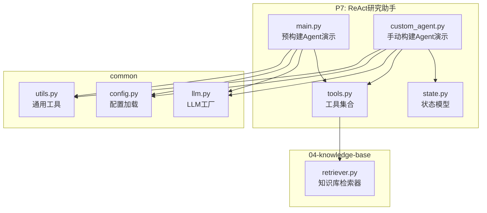
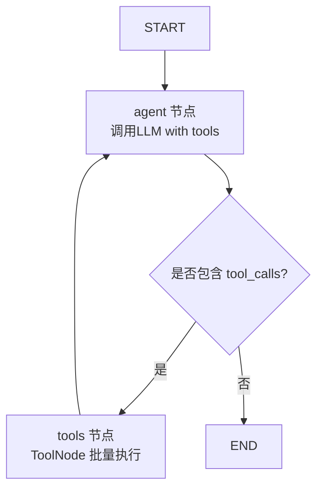
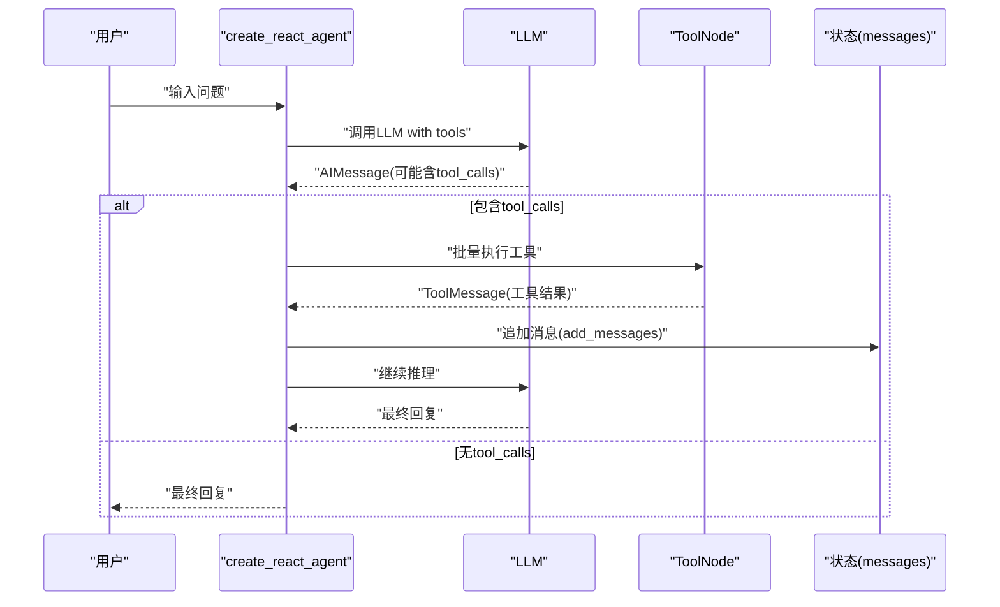
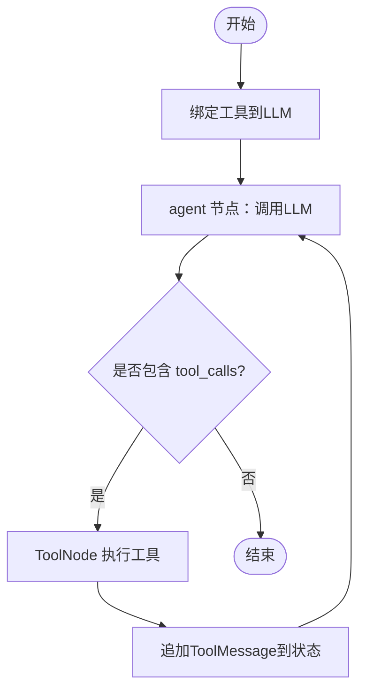
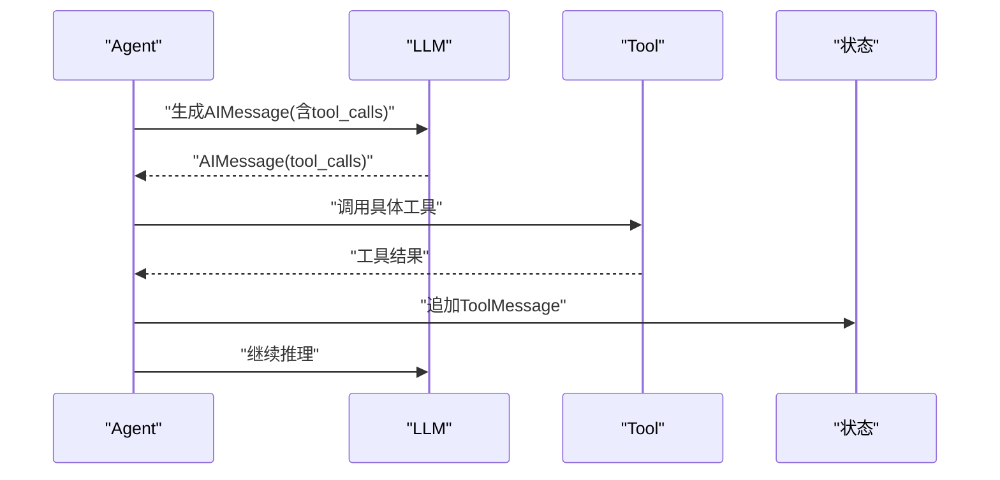
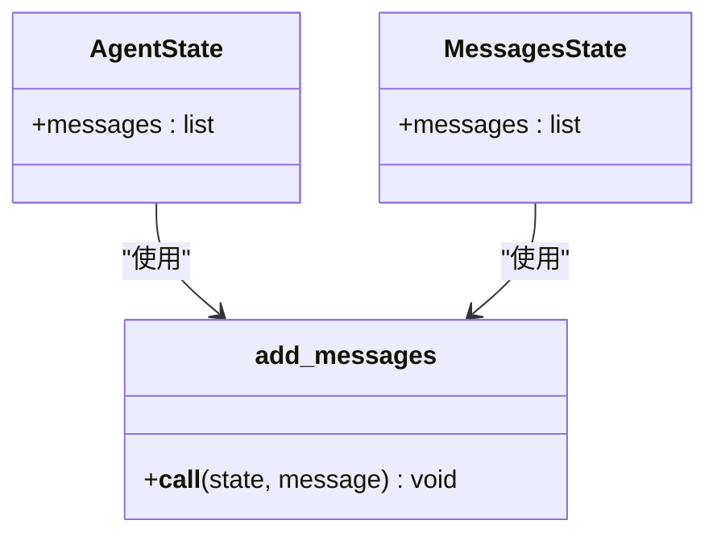
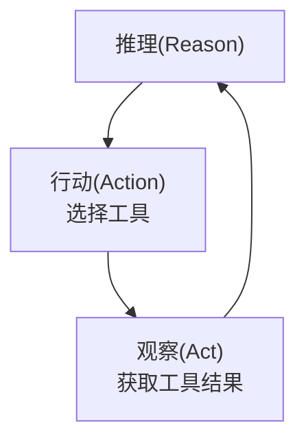
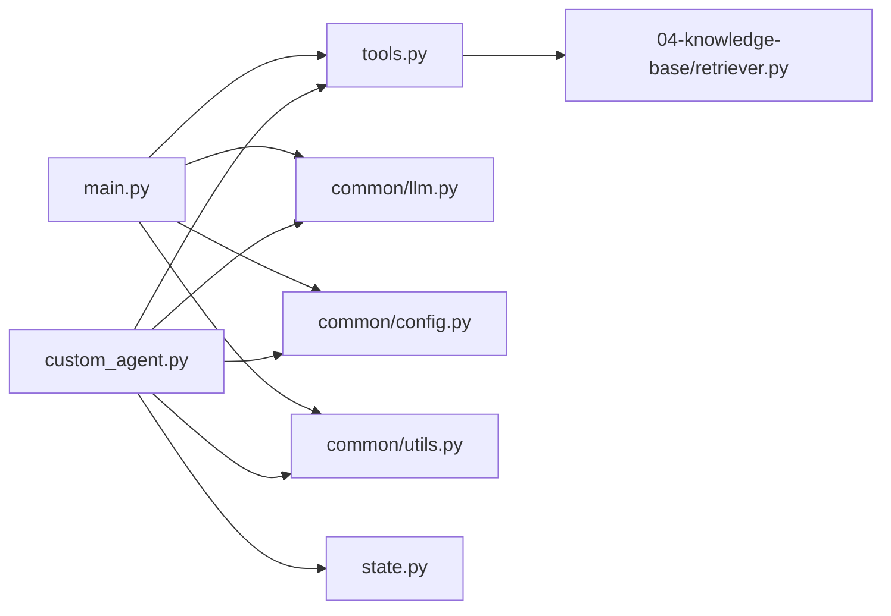

# P7: ReAct研究助手

<cite>
**本文引用的文件**
- [README.md](file://07-react-agent/README.md)
- [main.py](file://07-react-agent/main.py)
- [custom_agent.py](file://07-react-agent/custom_agent.py)
- [state.py](file://07-react-agent/state.py)
- [tools.py](file://07-react-agent/tools.py)
- [config.py](file://common/config.py)
- [llm.py](file://common/llm.py)
- [utils.py](file://common/utils.py)
- [retriever.py](file://04-knowledge-base/retriever.py)
</cite>

## 目录
1. [简介](#简介)
2. [项目结构](#项目结构)
3. [核心组件](#核心组件)
4. [架构总览](#架构总览)
5. [详细组件分析](#详细组件分析)
6. [依赖关系分析](#依赖关系分析)
7. [性能考虑](#性能考虑)
8. [故障排查指南](#故障排查指南)
9. [结论](#结论)
10. [附录](#附录)

## 简介
本项目围绕 ReAct（推理 + 行动）模式构建研究型智能体，提供两种Agent实现路径：
- 预构建Agent：通过一行代码快速创建具备工具调用能力的Agent
- 手动构建Agent：展示底层图结构与节点编排，便于深度定制

项目重点在于：
- 解释ReAct三阶段循环：思考（推理）、行动（工具调用）、观察（结果反馈）
- 对比预构建与手动构建的复杂度与灵活性
- 分析工具调用机制、状态管理与多轮对话处理
- 提供自定义Agent实现思路与最佳实践

## 项目结构
P7位于07-react-agent目录，采用“功能模块化 + 公共模块复用”的组织方式：
- 07-react-agent：ReAct研究助手主程序与工具定义
  - main.py：预构建Agent演示
  - custom_agent.py：手动构建Agent演示
  - state.py：Agent状态模型
  - tools.py：工具集合（网络搜索、知识库检索、数学计算）
- common：跨项目通用模块
  - config.py：配置加载
  - llm.py：LLM实例工厂
  - utils.py：通用工具函数
- 04-knowledge-base：知识库检索器（被tools.py按需引用）

图表来源
- [main.py:1-173](file://07-react-agent/main.py#L1-L173)
- [custom_agent.py:1-238](file://07-react-agent/custom_agent.py#L1-L238)
- [state.py:1-43](file://07-react-agent/state.py#L1-L43)
- [tools.py:1-105](file://07-react-agent/tools.py#L1-L105)
- [config.py:1-77](file://common/config.py#L1-L77)
- [llm.py:1-59](file://common/llm.py#L1-L59)
- [utils.py:1-33](file://common/utils.py#L1-L33)
- [retriever.py:1-160](file://04-knowledge-base/retriever.py#L1-L160)

章节来源
- [README.md:1-55](file://07-react-agent/README.md#L1-L55)
- [main.py:1-173](file://07-react-agent/main.py#L1-L173)
- [custom_agent.py:1-238](file://07-react-agent/custom_agent.py#L1-L238)
- [state.py:1-43](file://07-react-agent/state.py#L1-L43)
- [tools.py:1-105](file://07-react-agent/tools.py#L1-L105)
- [config.py:1-77](file://common/config.py#L1-L77)
- [llm.py:1-59](file://common/llm.py#L1-L59)
- [utils.py:1-33](file://common/utils.py#L1-L33)
- [retriever.py:1-160](file://04-knowledge-base/retriever.py#L1-L160)

## 核心组件
- 预构建Agent（create_react_agent）
  - 一键创建具备工具调用能力的Agent，内部自动完成节点与边的编排
  - 支持多轮工具调用与流式执行
- 手动构建Agent
  - 展示Agent图结构：START → agent → 条件边 → tools → agent → ...
  - 可自定义状态字段、路由逻辑与节点行为
- 工具集合
  - 网络搜索：模拟网络检索
  - 知识库检索：基于FAISS向量库的本地检索
  - 数学计算：表达式求值
- 状态模型
  - 基于MessagesState的消息累加机制，确保消息历史连续性
- LLM工厂与配置
  - 统一的LLM实例创建与配置加载，支持多种OpenAI兼容服务

章节来源
- [README.md:26-51](file://07-react-agent/README.md#L26-L51)
- [main.py:9-18](file://07-react-agent/main.py#L9-L18)
- [custom_agent.py:37-125](file://07-react-agent/custom_agent.py#L37-L125)
- [tools.py:24-105](file://07-react-agent/tools.py#L24-L105)
- [state.py:19-43](file://07-react-agent/state.py#L19-L43)
- [llm.py:13-41](file://common/llm.py#L13-L41)
- [config.py:33-56](file://common/config.py#L33-L56)

## 架构总览
ReAct Agent采用状态图（StateGraph）实现循环控制：
- Agent节点：调用LLM并可能返回工具调用请求
- ToolNode：批量执行工具并将结果作为ToolMessage返回
- 条件边：根据是否包含tool_calls决定进入工具执行或结束
- 状态模型：messages字段使用add_messages reducer实现消息累加

图表来源
- [custom_agent.py:79-117](file://07-react-agent/custom_agent.py#L79-L117)
- [state.py:29-43](file://07-react-agent/state.py#L29-L43)

章节来源
- [README.md:15-24](file://07-react-agent/README.md#L15-L24)
- [custom_agent.py:13-16](file://07-react-agent/custom_agent.py#L13-L16)

## 详细组件分析

### 预构建Agent（create_react_agent）
- 优势
  - 代码量少、上手快，适合快速原型与生产部署
  - 内置消息历史管理与循环控制，无需手动编排
- 使用方法
  - 通过传入LLM与工具列表创建Agent
  - 支持invoke与stream两种执行模式
  - 流式模式支持"values"与"updates"两种视图
- 多轮工具调用
  - Agent根据上下文自动决定工具调用顺序与次数
  - 通过消息历史维持连贯的推理链

图表来源
- [main.py:51-68](file://07-react-agent/main.py#L51-L68)
- [main.py:75-91](file://07-react-agent/main.py#L75-L91)
- [main.py:98-129](file://07-react-agent/main.py#L98-L129)

章节来源
- [main.py:35-129](file://07-react-agent/main.py#L35-L129)

### 手动构建Agent
- 节点与边
  - agent节点：绑定工具后的LLM调用，返回AIMessage
  - tools节点：ToolNode自动解析tool_calls并执行
  - 条件边：根据AIMessage是否包含tool_calls路由
- 状态模型
  - 自定义AgentState，messages字段使用add_messages reducer
  - 支持扩展其他状态字段（如计数、上下文标记等）
- 与预构建对比
  - 功能等价，但手动构建可完全自定义每个环节
  - 更适合需要精细控制的场景（如特殊路由、预处理/后处理逻辑）

图表来源
- [custom_agent.py:54-124](file://07-react-agent/custom_agent.py#L54-L124)
- [state.py:29-43](file://07-react-agent/state.py#L29-L43)

章节来源
- [custom_agent.py:37-125](file://07-react-agent/custom_agent.py#L37-L125)
- [state.py:29-43](file://07-react-agent/state.py#L29-L43)

### 工具定义、绑定与调用
- 工具集合
  - 网络搜索：关键词匹配模拟搜索结果
  - 知识库检索：动态引用04-knowledge-base的retriever
  - 数学计算：表达式合法性校验与eval执行
- 工具绑定
  - 使用llm.bind_tools将工具绑定到LLM
  - LLM在生成AIMessage时携带tool_calls
- 工具执行
  - ToolNode自动解析AIMessage中的tool_calls
  - 执行对应工具并返回ToolMessage
  - 状态messages自动追加工具结果

图表来源
- [tools.py:24-105](file://07-react-agent/tools.py#L24-L105)
- [custom_agent.py:52-73](file://07-react-agent/custom_agent.py#L52-L73)

章节来源
- [tools.py:24-105](file://07-react-agent/tools.py#L24-L105)
- [custom_agent.py:52-73](file://07-react-agent/custom_agent.py#L52-L73)

### 状态模型设计
- MessagesState与add_messages
  - messages字段使用add_messages reducer实现消息累加
  - 新消息追加而非替换，保证历史连续性
- 自定义AgentState
  - 可在messages之外扩展其他状态字段
  - 适用于需要跨轮次保持额外上下文的场景

图表来源
- [state.py:29-43](file://07-react-agent/state.py#L29-L43)

章节来源
- [state.py:19-43](file://07-react-agent/state.py#L19-L43)

### ReAct算法核心思想
- 推理（Reasoning）：Agent基于历史消息与工具结果进行思考
- 行动（Action）：根据推理决定调用哪些工具
- 观察（Act）：接收工具执行结果并更新状态
- 循环：上述三步在Agent内部自动循环直至得到最终答案

图表来源
- [README.md:9-13](file://07-react-agent/README.md#L9-L13)

章节来源
- [README.md:7-13](file://07-react-agent/README.md#L7-L13)

## 依赖关系分析
- 模块耦合
  - main.py与custom_agent.py均依赖tools.py与common模块
  - tools.py按需引用04-knowledge-base的retriever
- 外部依赖
  - LangGraph：StateGraph、ToolNode、create_react_agent
  - LangChain：ChatOpenAI、工具装饰器、消息类型
- 配置与运行
  - 通过.env文件提供LLM与Embedding配置
  - utils.py统一输出格式与分隔符

图表来源
- [main.py:25-32](file://07-react-agent/main.py#L25-L32)
- [custom_agent.py:25-34](file://07-react-agent/custom_agent.py#L25-L34)
- [tools.py:14-21](file://07-react-agent/tools.py#L14-L21)

章节来源
- [main.py:25-32](file://07-react-agent/main.py#L25-L32)
- [custom_agent.py:25-34](file://07-react-agent/custom_agent.py#L25-L34)
- [tools.py:14-21](file://07-react-agent/tools.py#L14-L21)

## 性能考虑
- 流式执行
  - 使用stream_mode="updates"可降低内存占用，适合长对话
  - 使用stream_mode="values"便于调试与可视化
- 工具调用优化
  - 合理设计工具粒度，避免过度拆分导致往返开销过大
  - 对高频工具增加缓存策略（如结果缓存）
- LLM调用成本
  - 控制消息长度与上下文窗口
  - 适当提高temperature以提升稳定性，但注意生成质量与成本权衡
- 状态管理
  - 使用add_messages避免重复序列化与深拷贝
  - 对超长历史进行截断或摘要化处理

## 故障排查指南
- 知识库不可用
  - 现象：knowledge_search返回未初始化提示
  - 处理：先在04-knowledge-base目录运行数据导入脚本
- 工具调用异常
  - 现象：工具执行报错或返回空结果
  - 处理：检查工具参数合法性与外部服务可用性
- LLM配置错误
  - 现象：连接失败或认证错误
  - 处理：检查.env文件中的基础URL、API Key与模型名称
- Agent循环卡住
  - 现象：无法结束或多轮循环无进展
  - 处理：检查条件边逻辑与AIMessage是否正确携带tool_calls

章节来源
- [tools.py:63-78](file://07-react-agent/tools.py#L63-L78)
- [config.py:46-50](file://common/config.py#L46-L50)
- [custom_agent.py:79-93](file://07-react-agent/custom_agent.py#L79-L93)

## 结论
P7通过预构建与手动构建两条路径，系统性展示了ReAct Agent的设计与实现：
- 预构建Agent适合快速落地，强调简洁与稳定
- 手动构建Agent强调可定制性，适合复杂业务场景
- 工具调用与状态管理是实现多轮推理的关键
- 通过合理的状态模型与流式执行，可在性能与体验间取得平衡

## 附录
- 运行方式
  - 预构建：python main.py
  - 手动构建：python custom_agent.py
- 知识库准备
  - 在04-knowledge-base目录运行数据导入脚本后再使用知识库工具

章节来源
- [README.md:33-41](file://07-react-agent/README.md#L33-L41)
- [README.md:52-54](file://07-react-agent/README.md#L52-L54)