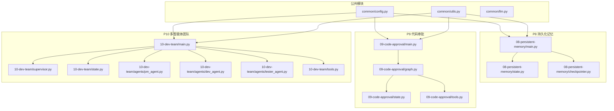
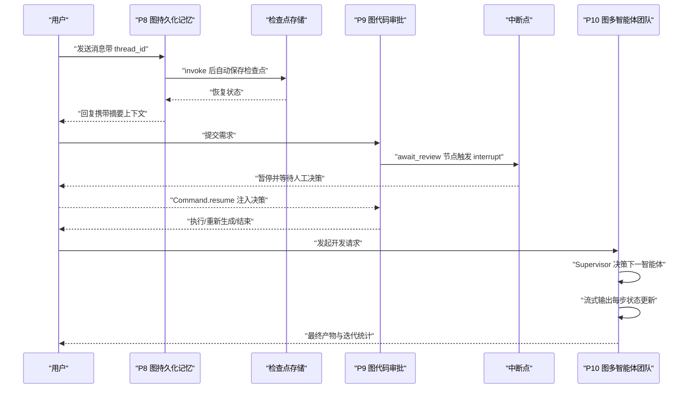
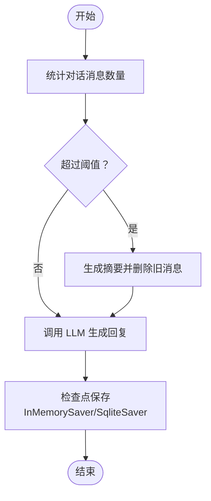
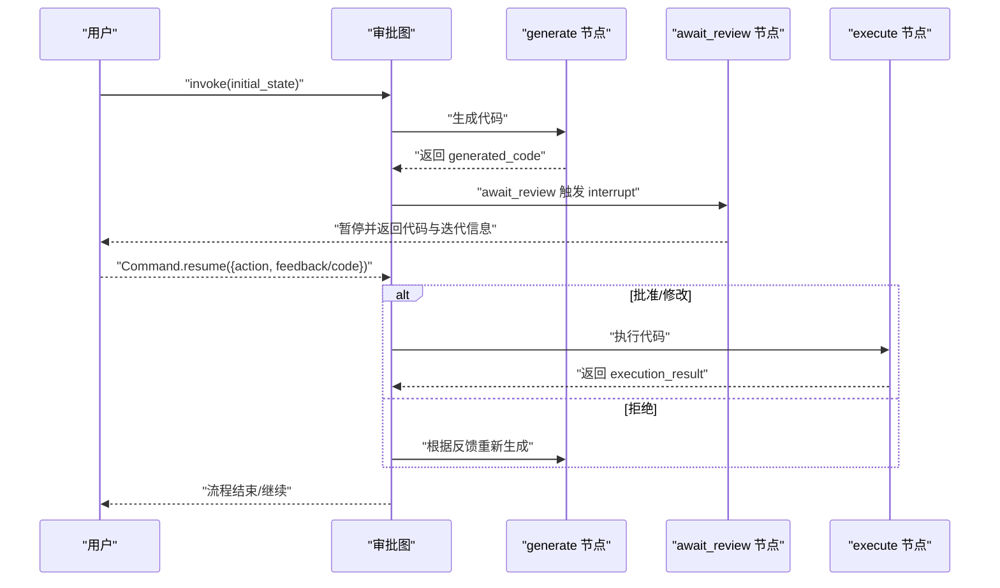
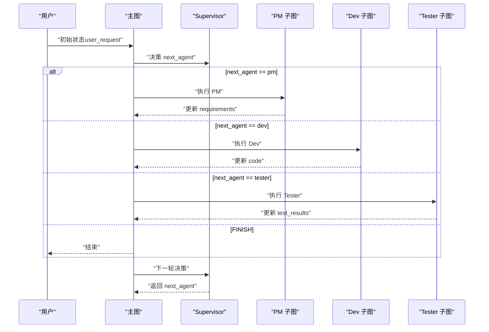
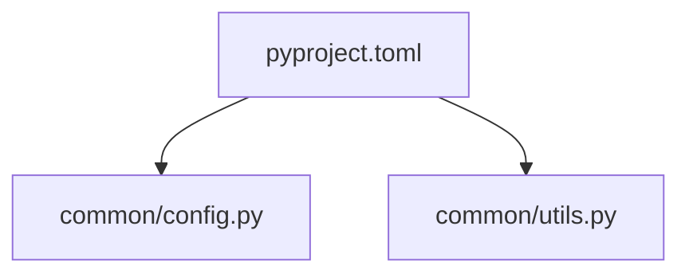

# LangGraph高级项目

<cite>
**本文引用的文件**
- [08-persistent-memory/main.py](file://08-persistent-memory/main.py)
- [08-persistent-memory/checkpointer.py](file://08-persistent-memory/checkpointer.py)
- [08-persistent-memory/state.py](file://08-persistent-memory/state.py)
- [09-code-approval/main.py](file://09-code-approval/main.py)
- [09-code-approval/graph.py](file://09-code-approval/graph.py)
- [09-code-approval/state.py](file://09-code-approval/state.py)
- [10-dev-team/main.py](file://10-dev-team/main.py)
- [10-dev-team/supervisor.py](file://10-dev-team/supervisor.py)
- [10-dev-team/state.py](file://10-dev-team/state.py)
- [10-dev-team/agents/pm_agent.py](file://10-dev-team/agents/pm_agent.py)
- [10-dev-team/agents/dev_agent.py](file://10-dev-team/agents/dev_agent.py)
- [10-dev-team/agents/tester_agent.py](file://10-dev-team/agents/tester_agent.py)
- [10-dev-team/tools.py](file://10-dev-team/tools.py)
- [common/config.py](file://common/config.py)
- [common/utils.py](file://common/utils.py)
- [README.md](file://README.md)
- [pyproject.toml](file://pyproject.toml)
</cite>

## 目录
1. [引言](#引言)
2. [项目结构](#项目结构)
3. [核心组件](#核心组件)
4. [架构总览](#架构总览)
5. [详细组件分析](#详细组件分析)
6. [依赖分析](#依赖分析)
7. [性能考虑](#性能考虑)
8. [故障排查指南](#故障排查指南)
9. [结论](#结论)
10. [附录](#附录)

## 引言
本文件面向希望深入掌握 LangGraph 高级能力的学习者与开发者，围绕三个重点案例进行系统化技术解析：P8 持久化记忆（检查点机制与会话恢复）、P9 代码审批系统（人机在环交互与中断处理）、P10 多智能体开发团队（Supervisor 编排模式与复杂工作流管理）。文档不仅解释实现原理与数据流，还提供性能优化建议与生产部署要点，帮助读者将所学落地到真实业务场景。

## 项目结构
本仓库采用“渐进式学习路径”组织，每个项目聚焦一个核心主题，并通过 common 模块复用配置、LLM 初始化与通用工具。P8/P9/P10 作为 LangGraph 高级实践，分别覆盖检查点、人机在环与多智能体编排。

图表来源
- [08-persistent-memory/main.py:1-308](file://08-persistent-memory/main.py#L1-L308)
- [08-persistent-memory/state.py:1-25](file://08-persistent-memory/state.py#L1-L25)
- [08-persistent-memory/checkpointer.py:1-58](file://08-persistent-memory/checkpointer.py#L1-L58)
- [09-code-approval/main.py:1-219](file://09-code-approval/main.py#L1-L219)
- [09-code-approval/graph.py:1-225](file://09-code-approval/graph.py#L1-L225)
- [09-code-approval/state.py:1-31](file://09-code-approval/state.py#L1-L31)
- [10-dev-team/main.py:1-284](file://10-dev-team/main.py#L1-L284)
- [10-dev-team/supervisor.py:1-120](file://10-dev-team/supervisor.py#L1-L120)
- [10-dev-team/state.py:1-47](file://10-dev-team/state.py#L1-L47)
- [10-dev-team/agents/pm_agent.py:1-72](file://10-dev-team/agents/pm_agent.py#L1-L72)
- [10-dev-team/agents/dev_agent.py:1-89](file://10-dev-team/agents/dev_agent.py#L1-L89)
- [10-dev-team/agents/tester_agent.py:1-101](file://10-dev-team/agents/tester_agent.py#L1-L101)
- [10-dev-team/tools.py:1-90](file://10-dev-team/tools.py#L1-L90)

章节来源
- [README.md:1-108](file://README.md#L1-L108)
- [pyproject.toml:1-29](file://pyproject.toml#L1-L29)

## 核心组件
- P8 持久化记忆：通过检查点（checkpoint）实现状态持久化，结合 thread_id 实现多会话隔离；在消息超限时自动生成摘要压缩历史，提升上下文效率。
- P9 代码审批：基于 interrupt/resume 的人机在环交互，支持批准、拒绝（附反馈）、修改三种决策路径，配合检查点实现断点恢复。
- P10 多智能体团队：Supervisor 编排模式，将 PM/Dev/Tester 三个子图嵌入主图，通过条件路由与流式输出实现实时协作与进度可视化。

章节来源
- [08-persistent-memory/main.py:1-308](file://08-persistent-memory/main.py#L1-L308)
- [09-code-approval/main.py:1-219](file://09-code-approval/main.py#L1-L219)
- [10-dev-team/main.py:1-284](file://10-dev-team/main.py#L1-L284)

## 架构总览
下面以序列图展示三个高级特性在调用与状态流转上的关键交互：

图表来源
- [08-persistent-memory/main.py:148-151](file://08-persistent-memory/main.py#L148-L151)
- [09-code-approval/graph.py:83-107](file://09-code-approval/graph.py#L83-L107)
- [10-dev-team/main.py:133-180](file://10-dev-team/main.py#L133-L180)

## 详细组件分析

### P8 持久化记忆（检查点与会话恢复）
- 检查点机制
  - 在编译图时注入 InMemorySaver（或可选 SqliteSaver），实现节点执行后的状态持久化与重启恢复。
  - get_state() 可随时查看当前检查点的完整状态（messages 与 summary）。
- 会话隔离
  - 通过 config 中的 configurable.thread_id 区分不同用户或会话，避免状态串扰。
- 对话摘要压缩
  - 当对话消息超过阈值时，进入摘要节点，由 LLM 生成摘要并使用 RemoveMessage 删除旧消息，仅保留近期上下文。
- 关键实现位置
  - 图构建与编译：[08-persistent-memory/main.py:148-151](file://08-persistent-memory/main.py#L148-L151)
  - 状态定义：[08-persistent-memory/state.py:13-25](file://08-persistent-memory/state.py#L13-L25)
  - 检查点工厂：[08-persistent-memory/checkpointer.py:33-49](file://08-persistent-memory/checkpointer.py#L33-L49)

图表来源
- [08-persistent-memory/main.py:108-124](file://08-persistent-memory/main.py#L108-L124)
- [08-persistent-memory/main.py:68-106](file://08-persistent-memory/main.py#L68-L106)

章节来源
- [08-persistent-memory/main.py:1-308](file://08-persistent-memory/main.py#L1-L308)
- [08-persistent-memory/state.py:1-25](file://08-persistent-memory/state.py#L1-L25)
- [08-persistent-memory/checkpointer.py:1-58](file://08-persistent-memory/checkpointer.py#L1-L58)

### P9 代码审批系统（人机在环交互与中断处理）
- 中断与恢复
  - await_review 节点调用 interrupt() 暂停执行，将生成的代码与迭代信息传递给调用方；调用方收集人工决策后通过 Command.resume() 恢复执行。
  - 必须配置检查点（InMemorySaver）以保存暂停状态。
- 决策分支
  - 批准：直接执行代码。
  - 拒绝：记录反馈并重新生成。
  - 修改：接受用户提供的修改代码并执行。
- 安全执行
  - 执行前进行安全检查，禁止危险操作；使用受限内置函数执行代码，捕获输出并汇总结果。
- 关键实现位置
  - 工作流图与节点：[09-code-approval/graph.py:180-225](file://09-code-approval/graph.py#L180-L225)
  - 状态定义：[09-code-approval/state.py:9-31](file://09-code-approval/state.py#L9-L31)
  - 交互主流程：[09-code-approval/main.py:35-180](file://09-code-approval/main.py#L35-L180)

图表来源
- [09-code-approval/graph.py:64-107](file://09-code-approval/graph.py#L64-L107)
- [09-code-approval/graph.py:110-162](file://09-code-approval/graph.py#L110-L162)
- [09-code-approval/main.py:78-156](file://09-code-approval/main.py#L78-L156)

章节来源
- [09-code-approval/main.py:1-219](file://09-code-approval/main.py#L1-L219)
- [09-code-approval/graph.py:1-225](file://09-code-approval/graph.py#L1-L225)
- [09-code-approval/state.py:1-31](file://09-code-approval/state.py#L1-L31)

### P10 多智能体开发团队（Supervisor 编排与复杂工作流）
- Supervisor 编排
  - 作为 LLM 节点，根据当前状态（需求、代码、测试结果）与迭代次数，决定将控制权交给 PM、Dev、Tester 或结束流程。
  - 支持规则引擎与 LLM 混合决策，防止无限循环。
- 子图嵌套与状态共享
  - PM/Dev/Tester 各自作为子图嵌入主图，共享 TeamState；每个子图负责特定职责并更新相应字段。
- 流式输出与进度可视化
  - 使用 stream_mode="updates" 实时展示每一步的节点名称与状态更新；必要时回退到 "messages" 模式。
- 关键实现位置
  - 主图与运行流程：[10-dev-team/main.py:43-181](file://10-dev-team/main.py#L43-L181)
  - Supervisor 决策逻辑：[10-dev-team/supervisor.py:31-120](file://10-dev-team/supervisor.py#L31-L120)
  - 状态定义：[10-dev-team/state.py:13-47](file://10-dev-team/state.py#L13-L47)
  - 智能体子图：[10-dev-team/agents/pm_agent.py:24-57](file://10-dev-team/agents/pm_agent.py#L24-L57), [10-dev-team/agents/dev_agent.py:27-67](file://10-dev-team/agents/dev_agent.py#L27-L67), [10-dev-team/agents/tester_agent.py:24-91](file://10-dev-team/agents/tester_agent.py#L24-L91)
  - 工具集：[10-dev-team/tools.py:15-90](file://10-dev-team/tools.py#L15-L90)

图表来源
- [10-dev-team/main.py:43-106](file://10-dev-team/main.py#L43-L106)
- [10-dev-team/supervisor.py:31-120](file://10-dev-team/supervisor.py#L31-L120)

章节来源
- [10-dev-team/main.py:1-284](file://10-dev-team/main.py#L1-L284)
- [10-dev-team/supervisor.py:1-120](file://10-dev-team/supervisor.py#L1-L120)
- [10-dev-team/state.py:1-47](file://10-dev-team/state.py#L1-L47)
- [10-dev-team/agents/pm_agent.py:1-72](file://10-dev-team/agents/pm_agent.py#L1-L72)
- [10-dev-team/agents/dev_agent.py:1-89](file://10-dev-team/agents/dev_agent.py#L1-L89)
- [10-dev-team/agents/tester_agent.py:1-101](file://10-dev-team/agents/tester_agent.py#L1-L101)
- [10-dev-team/tools.py:1-90](file://10-dev-team/tools.py#L1-L90)

## 依赖分析
- 语言与框架
  - Python >= 3.10，核心依赖包括 langchain、langchain-core、langchain-openai、langgraph、langgraph-checkpoint-sqlite 等。
- 项目内依赖关系
  - 所有项目均通过 common/config.py 与 common/utils.py 提供统一的 LLM 配置与工具函数。
  - P8/P9/P10 通过 common/llm.py 初始化 LLM（具体实现未在本文展开）。

图表来源
- [pyproject.toml:7-21](file://pyproject.toml#L7-L21)
- [common/config.py:33-56](file://common/config.py#L33-L56)
- [common/utils.py:16-32](file://common/utils.py#L16-L32)

章节来源
- [pyproject.toml:1-29](file://pyproject.toml#L1-L29)
- [common/config.py:1-77](file://common/config.py#L1-L77)
- [common/utils.py:1-33](file://common/utils.py#L1-L33)

## 性能考虑
- 检查点存储
  - 开发/演示：InMemorySaver，速度快但进程重启即丢失。
  - 生产：优先使用 SqliteSaver（需安装 langgraph-checkpoint-sqlite），具备持久化能力；若不可用，回退至 InMemorySaver。
- 上下文长度控制
  - P8 使用摘要压缩长对话历史，减少 token 消耗；合理设置摘要阈值与保留最近消息数量。
- 并发与会话隔离
  - 通过 thread_id 实现多会话隔离，避免状态竞争；在高并发场景下建议引入外部缓存/数据库层以扩展检查点容量。
- 流式输出
  - P10 使用 stream_mode="updates" 实时展示进度，降低前端等待时间；对不支持 "messages" 的环境自动回退。
- 安全执行
  - P9/P10 在执行代码前进行安全检查与受限内置函数执行，避免高危操作；建议在生产中接入更强的沙箱环境。

## 故障排查指南
- 检查点相关
  - 未配置检查点导致 interrupt 报错：确认图编译时传入 checkpointer（InMemorySaver/SqliteSaver）。
  - get_state() 返回异常：检查 config 中 thread_id 是否正确，以及检查点是否已保存。
- 中断与恢复
  - resume 值格式不正确：确保 Command.resume 注入的值包含 action(feedback/code) 字段。
  - 无限循环：P9 设置最大迭代次数（如 3），P10 设置最大迭代上限（如 4）。
- 安全执行失败
  - 代码包含禁用关键字：在生成/修改环节增加前置校验，或在执行前调用 code_review 工具。
- 流式输出异常
  - "messages" 模式不支持：回退到 "updates" 模式并按节点名称聚合消息。

章节来源
- [09-code-approval/graph.py:221-222](file://09-code-approval/graph.py#L221-L222)
- [09-code-approval/main.py:78-156](file://09-code-approval/main.py#L78-L156)
- [10-dev-team/supervisor.py:41-45](file://10-dev-team/supervisor.py#L41-L45)
- [10-dev-team/main.py:214-222](file://10-dev-team/main.py#L214-L222)

## 结论
通过 P8/P9/P10 三个高级案例，我们系统掌握了 LangGraph 的三大关键能力：持久化记忆（检查点与会话隔离）、人机在环交互（interrupt/resume）与多智能体编排（Supervisor 模式）。这些能力共同构成了构建复杂、可控、可观测的智能体应用的基础。建议在生产环境中优先采用 SqliteSaver、严格的安全执行策略与合理的流式输出策略，以获得稳定且高效的用户体验。

## 附录
- 快速启动
  - 安装依赖：pip install -e .
  - 配置 .env：复制 .env.example 并填写 LLM_BASE_URL 与 LLM_MODEL_NAME
  - 验证连通性：python -c "from common.llm import get_llm; print(get_llm().invoke('你好').content)"
- 运行示例
  - P8：python 08-persistent-memory/main.py
  - P9：python 09-code-approval/main.py
  - P10：python 10-dev-team/main.py

章节来源
- [README.md:7-24](file://README.md#L7-L24)
- [README.md:75-87](file://README.md#L75-L87)