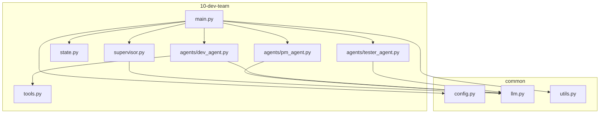
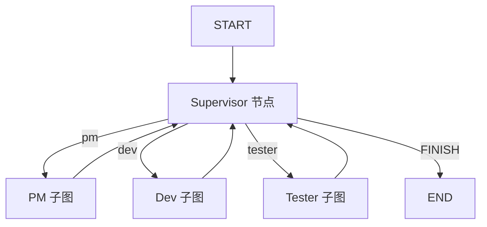
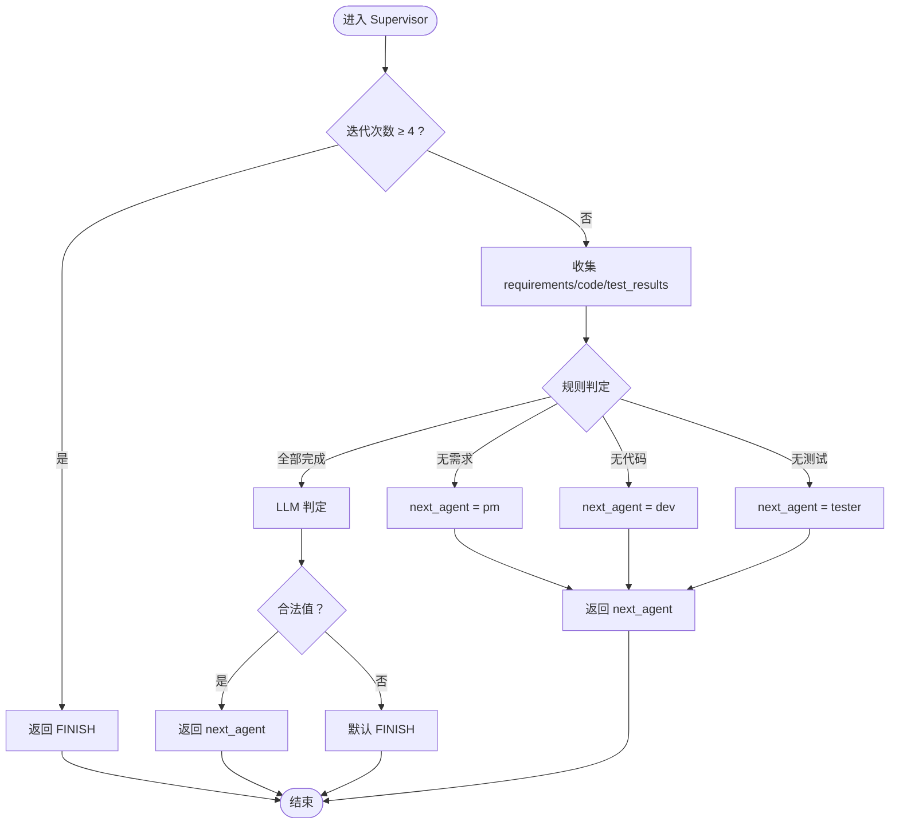
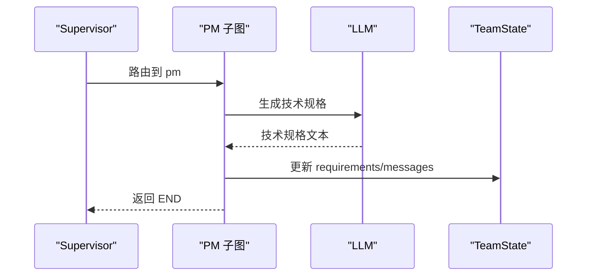
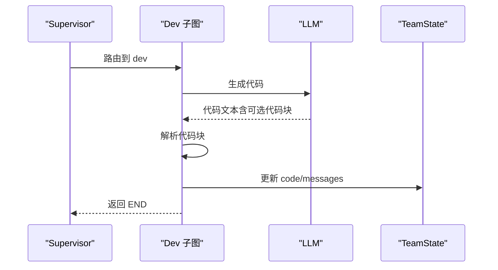
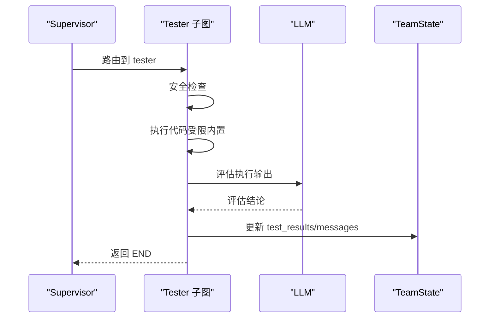
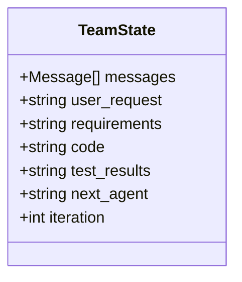
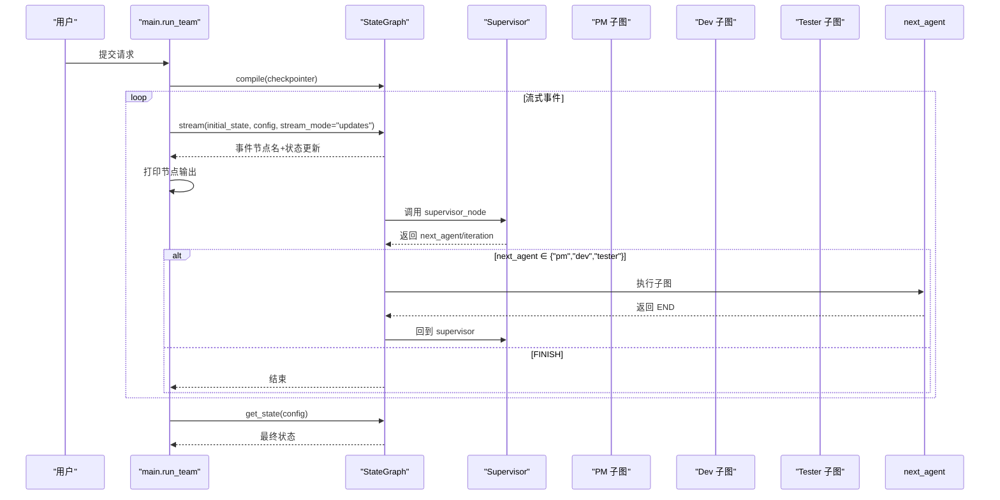
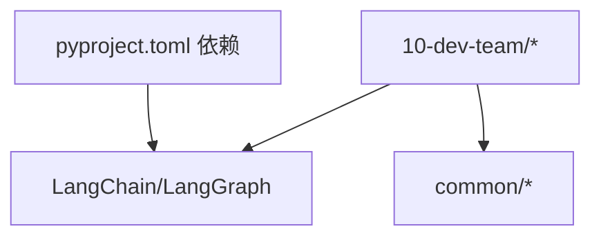

# P10: 多智能体开发团队

<cite>
**本文引用的文件**
- [README.md](file://10-dev-team/README.md)
- [main.py](file://10-dev-team/main.py)
- [supervisor.py](file://10-dev-team/supervisor.py)
- [state.py](file://10-dev-team/state.py)
- [tools.py](file://10-dev-team/tools.py)
- [pm_agent.py](file://10-dev-team/agents/pm_agent.py)
- [dev_agent.py](file://10-dev-team/agents/dev_agent.py)
- [tester_agent.py](file://10-dev-team/agents/tester_agent.py)
- [config.py](file://common/config.py)
- [llm.py](file://common/llm.py)
- [utils.py](file://common/utils.py)
- [pyproject.toml](file://pyproject.toml)
- [README.md](file://README.md)
</cite>

## 目录
1. [简介](#简介)
2. [项目结构](#项目结构)
3. [核心组件](#核心组件)
4. [架构总览](#架构总览)
5. [详细组件分析](#详细组件分析)
6. [依赖分析](#依赖分析)
7. [性能考虑](#性能考虑)
8. [故障排查指南](#故障排查指南)
9. [结论](#结论)
10. [附录](#附录)

## 简介
本项目展示了基于 LangGraph 的多智能体开发团队系统，采用 Supervisor 编排模式，通过子图嵌套实现 PM、Dev、Tester 三类智能体的协作。系统以“需求—实现—测试”的闭环流程为核心，结合规则引擎与 LLM 混合决策，支持流式输出与断点恢复，覆盖从需求分析到代码生成再到测试验证的完整开发流程。

## 项目结构
- 顶层入口与演示：main.py
- 编排核心：supervisor.py（Supervisor 节点与路由）
- 状态定义：state.py（TeamState 多字段共享状态）
- 工具集：tools.py（Dev Agent 可调用的工具）
- 智能体子图：agents/pm_agent.py、agents/dev_agent.py、agents/tester_agent.py
- 通用模块：common/config.py、common/llm.py、common/utils.py
- 项目依赖：pyproject.toml
- 项目总览与学习路径：README.md

图表来源
- [main.py:1-284](file://10-dev-team/main.py#L1-L284)
- [supervisor.py:1-120](file://10-dev-team/supervisor.py#L1-L120)
- [state.py:1-47](file://10-dev-team/state.py#L1-L47)
- [tools.py:1-90](file://10-dev-team/tools.py#L1-L90)
- [pm_agent.py:1-72](file://10-dev-team/agents/pm_agent.py#L1-L72)
- [dev_agent.py:1-89](file://10-dev-team/agents/dev_agent.py#L1-L89)
- [tester_agent.py:1-101](file://10-dev-team/agents/tester_agent.py#L1-L101)
- [config.py:1-77](file://common/config.py#L1-L77)
- [llm.py:1-59](file://common/llm.py#L1-L59)
- [utils.py:1-33](file://common/utils.py#L1-L33)

章节来源
- [README.md:1-108](file://README.md#L1-L108)
- [pyproject.toml:1-29](file://pyproject.toml#L1-L29)

## 核心组件
- Supervisor 编排节点：根据当前状态与迭代次数，决定下一执行智能体；当所有阶段完成时，由 LLM 判定是否需要重做。
- 子图智能体：
  - PM Agent：将用户需求细化为技术规格。
  - Dev Agent：依据技术规格生成代码，具备安全与格式约束。
  - Tester Agent：执行代码并评估结果，输出测试结论。
- 共享状态 TeamState：统一承载 messages、user_request、requirements、code、test_results、next_agent、iteration 等字段。
- 工具集：generate_code、code_review、test_code，供 Dev Agent 使用。
- 流式输出与断点恢复：通过 StateGraph 的 stream_mode 与 InMemorySaver 实现。

章节来源
- [supervisor.py:31-120](file://10-dev-team/supervisor.py#L31-L120)
- [pm_agent.py:24-72](file://10-dev-team/agents/pm_agent.py#L24-L72)
- [dev_agent.py:27-89](file://10-dev-team/agents/dev_agent.py#L27-L89)
- [tester_agent.py:24-101](file://10-dev-team/agents/tester_agent.py#L24-L101)
- [state.py:13-47](file://10-dev-team/state.py#L13-L47)
- [tools.py:15-90](file://10-dev-team/tools.py#L15-L90)
- [main.py:43-106](file://10-dev-team/main.py#L43-L106)

## 架构总览
系统采用“Supervisor 路由 + 子图嵌套”的主图结构，形成 PM → Dev → Tester 的闭环协作，每轮结束后回到 Supervisor，由其根据状态与迭代次数决定下一步。

图表来源
- [main.py:56-98](file://10-dev-team/main.py#L56-L98)
- [supervisor.py:109-120](file://10-dev-team/supervisor.py#L109-L120)

## 详细组件分析

### Supervisor 编排节点
- 设计理念：将 Supervisor 视作“LLM 决策节点”，结合简单规则与 LLM 判定，实现稳定且灵活的路由。
- 关键逻辑：
  - 迭代上限保护：超过最大迭代次数自动结束。
  - 状态收集：requirements、code、test_results。
  - 规则优先：无需求→PM；无代码→Dev；无测试→Tester；否则由 LLM 判定。
  - 输出：next_agent、iteration 增量、消息记录。
- 路由函数：route_from_supervisor 将 next_agent 映射到具体子图或 END。

图表来源
- [supervisor.py:31-106](file://10-dev-team/supervisor.py#L31-L106)

章节来源
- [supervisor.py:31-120](file://10-dev-team/supervisor.py#L31-L120)

### PM Agent（产品经理）
- 职责：将用户原始需求细化为技术规格，必要时根据上一轮测试反馈进行调整。
- 内部流程：单节点子图，直接调用 LLM 生成技术规格并更新 requirements 与 messages。
- 扩展性：当前为单节点，未来可在子图内增加多轮对话或评审环节。

图表来源
- [pm_agent.py:24-72](file://10-dev-team/agents/pm_agent.py#L24-L72)

章节来源
- [pm_agent.py:24-72](file://10-dev-team/agents/pm_agent.py#L24-L72)

### Dev Agent（开发者）
- 职责：根据技术规格生成代码，遵循安全与格式约束。
- 内部流程：单节点子图，调用 LLM 生成代码，去除代码块标记后写入 code 与 messages。
- 工具集成：预留工具接口（generate_code、code_review、test_code），便于后续接入 ReAct Agent。

图表来源
- [dev_agent.py:27-89](file://10-dev-team/agents/dev_agent.py#L27-L89)

章节来源
- [dev_agent.py:27-89](file://10-dev-team/agents/dev_agent.py#L27-L89)

### Tester Agent（测试员）
- 职责：执行代码并评估结果，输出测试结论，驱动后续迭代。
- 内部流程：单节点子图，先进行安全检查，再执行代码，最后由 LLM 评估输出并写入 test_results 与 messages。
- 安全策略：严格限制内置函数集合，避免危险操作。

图表来源
- [tester_agent.py:24-101](file://10-dev-team/agents/tester_agent.py#L24-L101)

章节来源
- [tester_agent.py:24-101](file://10-dev-team/agents/tester_agent.py#L24-L101)

### 共享状态 TeamState
- 字段设计：messages（对话历史）、user_request（用户需求）、requirements（技术规格）、code（代码）、test_results（测试结果）、next_agent（下一智能体）、iteration（迭代次数）。
- 更新策略：通过各节点对相应字段的更新实现协作；messages 使用 add_messages 进行合并。

图表来源
- [state.py:13-47](file://10-dev-team/state.py#L13-L47)

章节来源
- [state.py:13-47](file://10-dev-team/state.py#L13-L47)

### 工具集与安全执行
- 工具定义：generate_code、code_review、test_code，供 Dev Agent 使用。
- 安全执行：Tester 在受限内置函数集合中执行代码，避免危险操作；test_code 对代码进行安全检查。

章节来源
- [tools.py:15-90](file://10-dev-team/tools.py#L15-L90)
- [tester_agent.py:34-91](file://10-dev-team/agents/tester_agent.py#L34-L91)

### 主图构建与流式输出
- 主图构建：添加 Supervisor 节点与三个子图节点，设置 START→supervisor 边与条件边 route_from_supervisor，以及 agent→supervisor 的回路。
- 断点恢复：使用 InMemorySaver，通过 thread_id 实现会话隔离。
- 流式输出：支持 stream_mode="updates" 实时查看每步增量更新；支持 stream_mode="messages" 实时查看 LLM token 流。

图表来源
- [main.py:43-106](file://10-dev-team/main.py#L43-L106)
- [main.py:109-180](file://10-dev-team/main.py#L109-L180)
- [main.py:182-222](file://10-dev-team/main.py#L182-L222)

章节来源
- [main.py:43-106](file://10-dev-team/main.py#L43-L106)
- [main.py:109-180](file://10-dev-team/main.py#L109-L180)
- [main.py:182-222](file://10-dev-team/main.py#L182-L222)

## 依赖分析
- LangChain/LangGraph 生态：ChatOpenAI、StateGraph、InMemorySaver、add_messages。
- 通用模块复用：common/config.py、common/llm.py、common/utils.py。
- 项目依赖：pyproject.toml 中声明 LangChain、LangGraph、pydantic、dotenv、faiss 等。

图表来源
- [pyproject.toml:7-21](file://pyproject.toml#L7-L21)
- [llm.py:8-40](file://common/llm.py#L8-L40)

章节来源
- [pyproject.toml:1-29](file://pyproject.toml#L1-L29)
- [README.md:75-87](file://README.md#L75-L87)

## 性能考虑
- LLM 调用成本控制：合理设置 temperature 与提示长度，避免冗余上下文；在 PM/Dev/Test 节点中仅注入必要信息。
- 状态更新最小化：仅更新必要字段，减少消息合并开销。
- 流式输出粒度：根据场景选择 stream_mode="updates" 或 "messages"，平衡可观测性与性能。
- 迭代上限：Supervisor 的迭代上限防止无限循环，保障系统稳定性。
- 安全执行：Tester 的受限执行环境降低异常导致的额外开销与风险。

## 故障排查指南
- LLM 连接失败：检查 .env 配置（LLM_BASE_URL、LLM_MODEL_NAME），确认网络可达与 API Key 正确。
- 模型不可用或不稳定：建议使用 14B+ 模型或 API 级模型，以提升工具调用与结构化输出的稳定性。
- 流式输出异常：若 messages 模式不支持，系统会自动回退到 updates 模式；可检查 LangGraph 版本兼容性。
- 代码执行失败：Tester 的安全检查会拦截危险操作；若出现异常，查看 test_results 中的错误信息并回溯到 Dev 修复。
- 断点恢复：确保 thread_id 设置正确，避免并发会话冲突。

章节来源
- [config.py:33-56](file://common/config.py#L33-L56)
- [README.md:75-87](file://README.md#L75-L87)
- [main.py:182-222](file://10-dev-team/main.py#L182-L222)
- [tester_agent.py:34-91](file://10-dev-team/agents/tester_agent.py#L34-L91)

## 结论
本项目以 Supervisor 编排为核心，通过子图嵌套实现了 PM、Dev、Tester 的高效协作，结合规则引擎与 LLM 混合决策，既保证了流程的确定性，又具备一定的灵活性。系统支持流式输出与断点恢复，具备良好的可观测性与可扩展性，为构建更复杂的多智能体应用提供了坚实基础。

## 附录
- 运行方式：在项目根目录执行 python main.py。
- 环境变量：参考 .env.example，填写 LLM_BASE_URL 与 LLM_MODEL_NAME。
- 学习路径整合：P10 整合了 P1-P9 的知识，涵盖 Prompt 模板、LCEL 链、工具调用、StateGraph、ReAct Agent、持久化等。

章节来源
- [README.md:49-51](file://10-dev-team/README.md#L49-L51)
- [README.md:60-69](file://10-dev-team/README.md#L60-L69)
- [README.md:25-73](file://README.md#L25-L73)