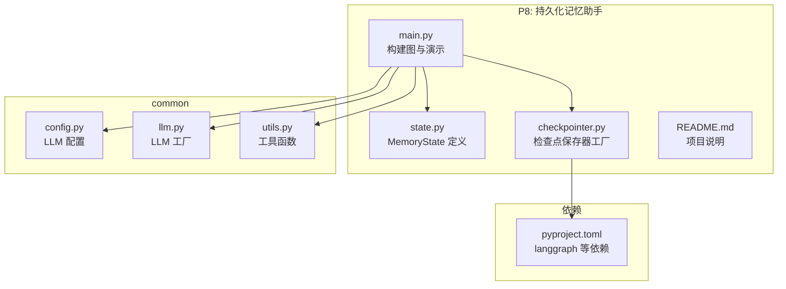
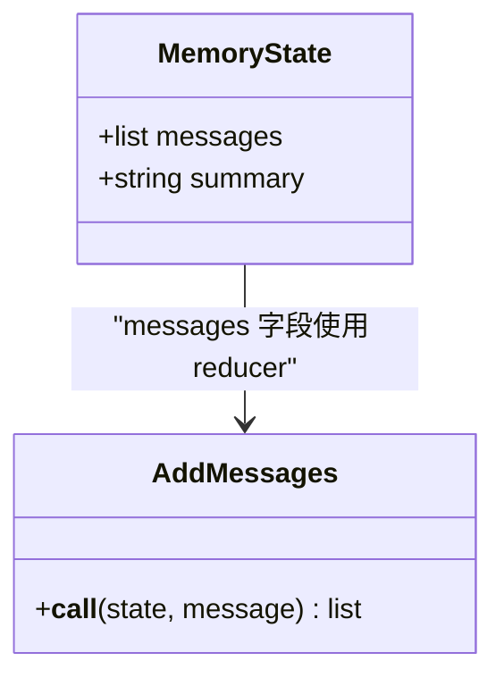
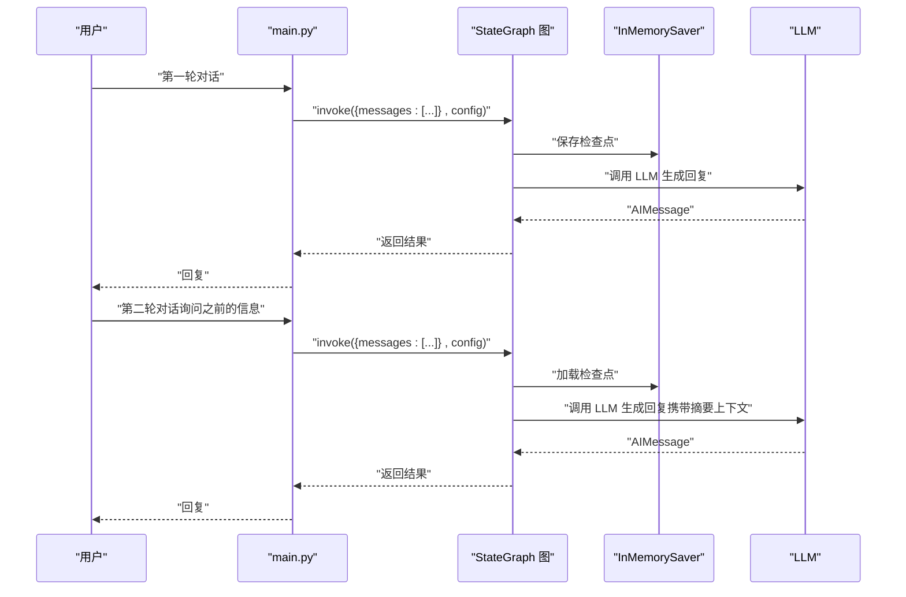
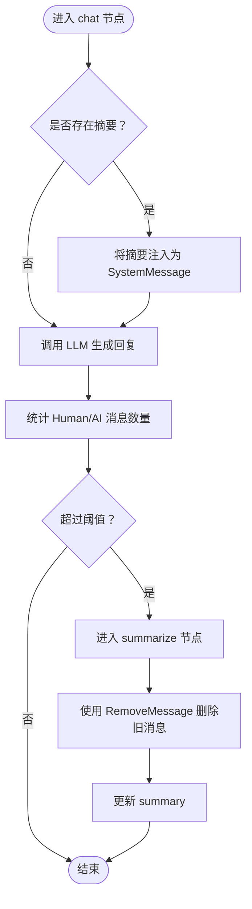
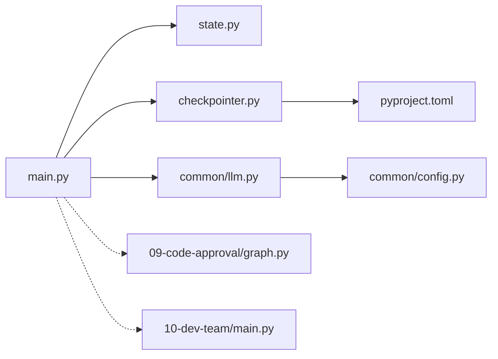

# P8: 持久化记忆助手

<cite>
**本文引用的文件**
- [README.md](file://08-persistent-memory/README.md)
- [checkpointer.py](file://08-persistent-memory/checkpointer.py)
- [main.py](file://08-persistent-memory/main.py)
- [state.py](file://08-persistent-memory/state.py)
- [config.py](file://common/config.py)
- [llm.py](file://common/llm.py)
- [utils.py](file://common/utils.py)
- [pyproject.toml](file://pyproject.toml)
- [graph.py](file://09-code-approval/graph.py)
- [main.py](file://10-dev-team/main.py)
</cite>

## 目录
1. [简介](#简介)
2. [项目结构](#项目结构)
3. [核心组件](#核心组件)
4. [架构总览](#架构总览)
5. [详细组件分析](#详细组件分析)
6. [依赖关系分析](#依赖关系分析)
7. [性能考虑](#性能考虑)
8. [故障排查指南](#故障排查指南)
9. [结论](#结论)
10. [附录](#附录)

## 简介
本项目展示了如何使用 LangGraph 的检查点机制（Checkpointer）实现“有状态”的对话助手，具备以下能力：
- 会话隔离：通过 thread_id 区分不同用户的对话，互不干扰
- 断点恢复：每个节点执行后自动保存状态，程序重启后可继续之前的对话
- 对话摘要压缩：当消息过多时，自动调用 LLM 生成摘要，减少上下文长度
- 状态查询：通过 get_state() 实时查看当前检查点状态，便于调试与监控

本项目的重点在于 StateGraph 中的记忆节点实现、条件路由逻辑、消息管理以及 RemoveMessage 的使用。

## 项目结构
- 08-persistent-memory：本项目源码
  - main.py：入口与演示脚本，包含构建图、节点、演示函数
  - state.py：定义 MemoryState，扩展 messages 字段并新增 summary 字段
  - checkpointer.py：检查点保存器工厂，支持 InMemorySaver 与可选的 SqliteSaver
  - README.md：项目说明与知识点
- common：通用模块
  - config.py：LLM 配置加载
  - llm.py：LLM 实例工厂
  - utils.py：通用工具函数
- 依赖：pyproject.toml 中声明了 langgraph、langgraph-checkpoint-sqlite 等依赖

图表来源
- [main.py:1-308](file://08-persistent-memory/main.py#L1-L308)
- [state.py:1-25](file://08-persistent-memory/state.py#L1-L25)
- [checkpointer.py:1-58](file://08-persistent-memory/checkpointer.py#L1-L58)
- [config.py:1-77](file://common/config.py#L1-L77)
- [llm.py:1-59](file://common/llm.py#L1-L59)
- [utils.py:1-33](file://common/utils.py#L1-L33)
- [pyproject.toml:1-29](file://pyproject.toml#L1-L29)

章节来源
- [README.md:1-41](file://08-persistent-memory/README.md#L1-L41)
- [main.py:1-308](file://08-persistent-memory/main.py#L1-L308)
- [state.py:1-25](file://08-persistent-memory/state.py#L1-L25)
- [checkpointer.py:1-58](file://08-persistent-memory/checkpointer.py#L1-L58)
- [config.py:1-77](file://common/config.py#L1-L77)
- [llm.py:1-59](file://common/llm.py#L1-L59)
- [utils.py:1-33](file://common/utils.py#L1-L33)
- [pyproject.toml:1-29](file://pyproject.toml#L1-L29)

## 核心组件
- 检查点保存器（Checkpointer）
  - InMemorySaver：内存级检查点，适合演示与测试
  - SqliteSaver：SQLite 持久化检查点，适合生产环境
  - 工厂函数 get_checkpointer/use_sqlite 控制选择
- 状态模型（MemoryState）
  - messages：使用 add_messages reducer 自动追加消息
  - summary：对话摘要，用于压缩历史
- StateGraph 图
  - chat 节点：调用 LLM 生成回复，并在有摘要时注入 SystemMessage 上下文
  - summarize 节点：当消息超过阈值时，生成摘要并使用 RemoveMessage 删除旧消息
  - 条件路由 should_summarize：根据消息数量决定是否进入摘要节点
- 会话隔离与状态查询
  - thread_id：区分不同会话
  - get_state(config)：查看当前检查点状态

章节来源
- [checkpointer.py:1-58](file://08-persistent-memory/checkpointer.py#L1-L58)
- [state.py:1-25](file://08-persistent-memory/state.py#L1-L25)
- [main.py:39-151](file://08-persistent-memory/main.py#L39-L151)

## 架构总览
下面的类图展示了 MemoryState 的结构以及与消息管理的关系。

图表来源
- [state.py:13-24](file://08-persistent-memory/state.py#L13-L24)

下面的序列图展示了“同一会话内记忆”的调用流程。

图表来源
- [main.py:154-184](file://08-persistent-memory/main.py#L154-L184)
- [main.py:43-66](file://08-persistent-memory/main.py#L43-L66)

## 详细组件分析

### 检查点机制与会话隔离
- InMemorySaver：在内存中保存检查点，程序重启后丢失，适合演示与测试
- SqliteSaver：在 SQLite 数据库中保存检查点，程序重启后仍可恢复，适合生产
- 工厂函数 get_checkpointer/use_sqlite 控制选择；默认优先尝试 SqliteSaver，若不可用则回退到 InMemorySaver
- thread_id：通过 config 中的 configurable.thread_id 实现多用户会话隔离，相同 thread_id 的多次调用共享同一状态，不同 thread_id 的状态互不干扰

章节来源
- [checkpointer.py:33-48](file://08-persistent-memory/checkpointer.py#L33-L48)
- [main.py:165-184](file://08-persistent-memory/main.py#L165-L184)
- [main.py:194-223](file://08-persistent-memory/main.py#L194-L223)

### StateGraph 中的记忆节点实现
- chat 节点
  - 若存在 summary，将其封装为 SystemMessage 并插入到 messages 列表开头，作为上下文
  - 调用 LLM 生成回复，返回 AIMessage
- summarize 节点
  - 构造摘要提示词，结合已有摘要与新对话生成新的摘要
  - 使用 RemoveMessage 删除旧消息（保留最近若干条），避免上下文过长
  - 更新 state.summary
- 条件路由 should_summarize
  - 仅统计 HumanMessage/AIMessage，忽略 SystemMessage
  - 超过阈值（SUMMARY_THRESHOLD）进入 summarize 节点，否则直接结束

图表来源
- [main.py:43-123](file://08-persistent-memory/main.py#L43-L123)
- [main.py:68-106](file://08-persistent-memory/main.py#L68-L106)

章节来源
- [main.py:43-123](file://08-persistent-memory/main.py#L43-L123)
- [main.py:68-106](file://08-persistent-memory/main.py#L68-L106)

### 消息管理与 RemoveMessage 的使用
- messages 字段使用 add_messages reducer，确保消息追加而非替换
- RemoveMessage 的作用是“从消息列表中删除指定 ID 的消息”，而不是替换
- 在摘要节点中，构造 RemoveMessage 列表，删除除最后若干条之外的历史消息，从而压缩上下文

章节来源
- [state.py:20-21](file://08-persistent-memory/state.py#L20-L21)
- [main.py:92-106](file://08-persistent-memory/main.py#L92-L106)

### 多用户会话隔离与状态查询
- 多会话隔离：通过不同的 thread_id 实现，每个会话拥有独立的检查点状态
- 状态查询：调用 get_state(config) 返回当前检查点的完整状态，包含 messages 列表与 summary，并显示下一步执行计划

章节来源
- [main.py:187-223](file://08-persistent-memory/main.py#L187-L223)
- [main.py:226-250](file://08-persistent-memory/main.py#L226-L250)

### 交互式对话与演示
- 演示 1：同一 thread_id 的多次调用，LLM 能记住之前的对话
- 演示 2：不同 thread_id 的会话互不干扰
- 演示 3：get_state() 查看当前检查点状态
- 演示 4：交互式持久化对话，支持输入 'state' 查看状态

章节来源
- [main.py:154-184](file://08-persistent-memory/main.py#L154-L184)
- [main.py:187-223](file://08-persistent-memory/main.py#L187-L223)
- [main.py:226-250](file://08-persistent-memory/main.py#L226-L250)
- [main.py:253-286](file://08-persistent-memory/main.py#L253-L286)

## 依赖关系分析
- 语言模型与配置
  - llm.py 通过 common/config.py 读取 LLM 配置，统一初始化 ChatOpenAI
- 检查点依赖
  - pyproject.toml 声明了 langgraph 与 langgraph-checkpoint-sqlite 依赖
  - checkpointer.py 动态导入 SqliteSaver，若不可用则回退到 InMemorySaver
- 与其他项目的关系
  - P9 代码审批工作流依赖检查点实现 interrupt() 暂停与恢复
  - P10 多智能体团队同样使用 InMemorySaver 实现持久化与流式输出

图表来源
- [main.py:24-32](file://08-persistent-memory/main.py#L24-L32)
- [state.py:9-10](file://08-persistent-memory/state.py#L9-L10)
- [checkpointer.py:19-28](file://08-persistent-memory/checkpointer.py#L19-L28)
- [config.py:33-56](file://common/config.py#L33-L56)
- [llm.py:13-40](file://common/llm.py#L13-L40)
- [pyproject.toml:7-21](file://pyproject.toml#L7-L21)
- [graph.py:28-29](file://09-code-approval/graph.py#L28-L29)
- [main.py:33-34](file://10-dev-team/main.py#L33-L34)

章节来源
- [pyproject.toml:7-21](file://pyproject.toml#L7-L21)
- [checkpointer.py:24-28](file://08-persistent-memory/checkpointer.py#L24-L28)
- [graph.py:28-29](file://09-code-approval/graph.py#L28-L29)
- [main.py:33-34](file://10-dev-team/main.py#L33-L34)

## 性能考虑
- 上下文窗口控制
  - 使用 SUMMARY_THRESHOLD 控制消息数量，超过阈值时生成摘要并删除旧消息，避免超出 LLM 上下文窗口
- 摘要生成策略
  - 仅对历史消息进行摘要，保留最近若干条消息作为上下文，兼顾准确性与效率
- 检查点存储选择
  - 开发/测试：InMemorySaver，启动快、易清理
  - 生产：SqliteSaver，持久化可靠，但需注意磁盘 IO 与并发访问
- LLM 调用频率
  - 将摘要生成与消息删除放在必要时触发，避免频繁调用 LLM 导致延迟增加
- 状态查询开销
  - get_state() 用于调试与监控，不应在高频路径中频繁调用

[本节为通用指导，无需特定文件来源]

## 故障排查指南
- 无法导入 SqliteSaver
  - 现象：运行时报错找不到 langgraph.checkpoint.sqlite
  - 原因：未安装 langgraph-checkpoint-sqlite
  - 解决：确认 pyproject.toml 中依赖已安装，或在环境中启用相应包
- thread_id 未生效导致会话混淆
  - 现象：不同用户看起来共享同一状态
  - 原因：未在 config 中设置 configurable.thread_id 或使用了相同的 thread_id
  - 解决：为每个用户分配唯一 thread_id，并在每次调用时传入
- 摘要未生效或上下文过长
  - 现象：摘要节点未触发或消息仍然过多
  - 原因：SUMMARY_THRESHOLD 设置不当，或 RemoveMessage 未正确删除旧消息
  - 解决：调整阈值，确保 messages 中存在可删除的历史消息 ID
- get_state() 返回空状态
  - 现象：首次调用后立即 get_state() 为空
  - 原因：检查点尚未保存或 thread_id 不匹配
  - 解决：先执行一次 invoke，再调用 get_state；确保使用相同的 thread_id

章节来源
- [checkpointer.py:24-28](file://08-persistent-memory/checkpointer.py#L24-L28)
- [pyproject.toml:16-16](file://pyproject.toml#L16-L16)
- [main.py:108-123](file://08-persistent-memory/main.py#L108-L123)
- [main.py:226-250](file://08-persistent-memory/main.py#L226-L250)

## 结论
本项目通过 LangGraph 的检查点机制实现了“有状态”的对话助手，具备会话隔离、断点恢复、对话摘要压缩与状态查询等能力。其核心在于：
- 使用 InMemorySaver/SqliteSaver 实现持久化
- 通过 thread_id 实现多用户会话隔离
- 通过 add_messages 与 RemoveMessage 管理消息历史
- 通过条件路由在合适时机生成摘要，控制上下文长度

这些能力为后续的人机协同（P9）与多智能体编排（P10）打下了坚实基础。

[本节为总结性内容，无需特定文件来源]

## 附录

### 代码示例路径（不含具体代码内容）
- 构建图与节点定义
  - [chat 节点实现:43-66](file://08-persistent-memory/main.py#L43-L66)
  - [summarize 节点实现:68-106](file://08-persistent-memory/main.py#L68-L106)
  - [条件路由 should_summarize:108-123](file://08-persistent-memory/main.py#L108-L123)
- 检查点保存器工厂
  - [get_checkpointer 工厂:33-48](file://08-persistent-memory/checkpointer.py#L33-L48)
  - [get_memory_saver 简化版:51-57](file://08-persistent-memory/checkpointer.py#L51-L57)
- 状态模型
  - [MemoryState 定义:13-24](file://08-persistent-memory/state.py#L13-L24)
- 会话隔离与状态查询演示
  - [同一会话记忆演示:154-184](file://08-persistent-memory/main.py#L154-L184)
  - [多会话隔离演示:187-223](file://08-persistent-memory/main.py#L187-L223)
  - [状态查询演示:226-250](file://08-persistent-memory/main.py#L226-L250)
  - [交互式对话演示:253-286](file://08-persistent-memory/main.py#L253-L286)
- LLM 配置与工厂
  - [LLM 配置加载:33-56](file://common/config.py#L33-L56)
  - [LLM 工厂:13-40](file://common/llm.py#L13-L40)

[本节为索引性内容，无需特定文件来源]