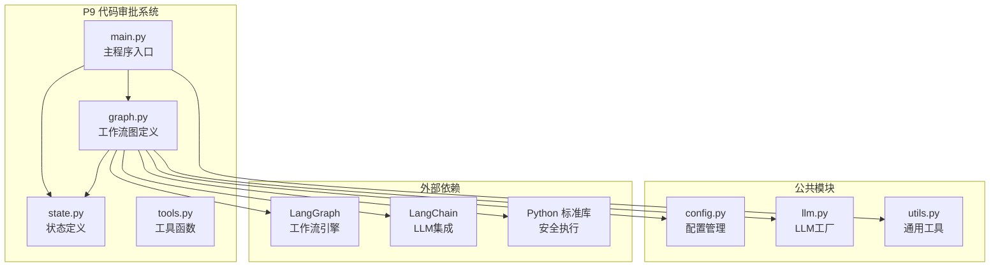
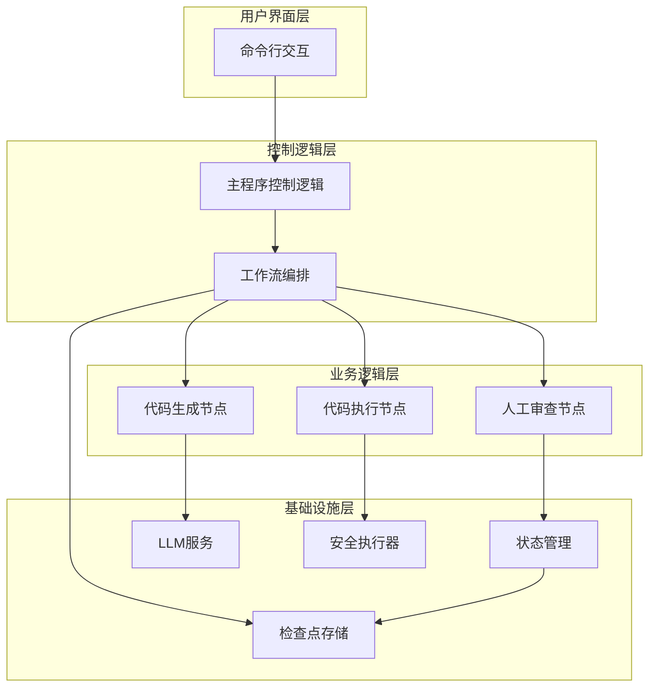
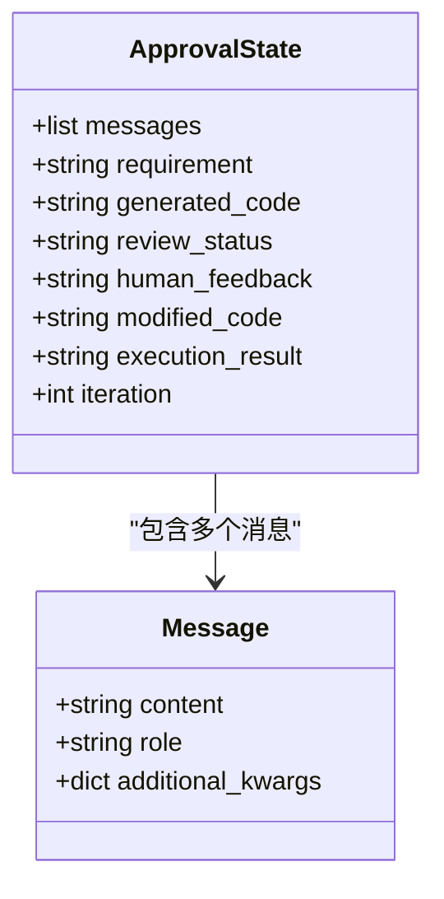
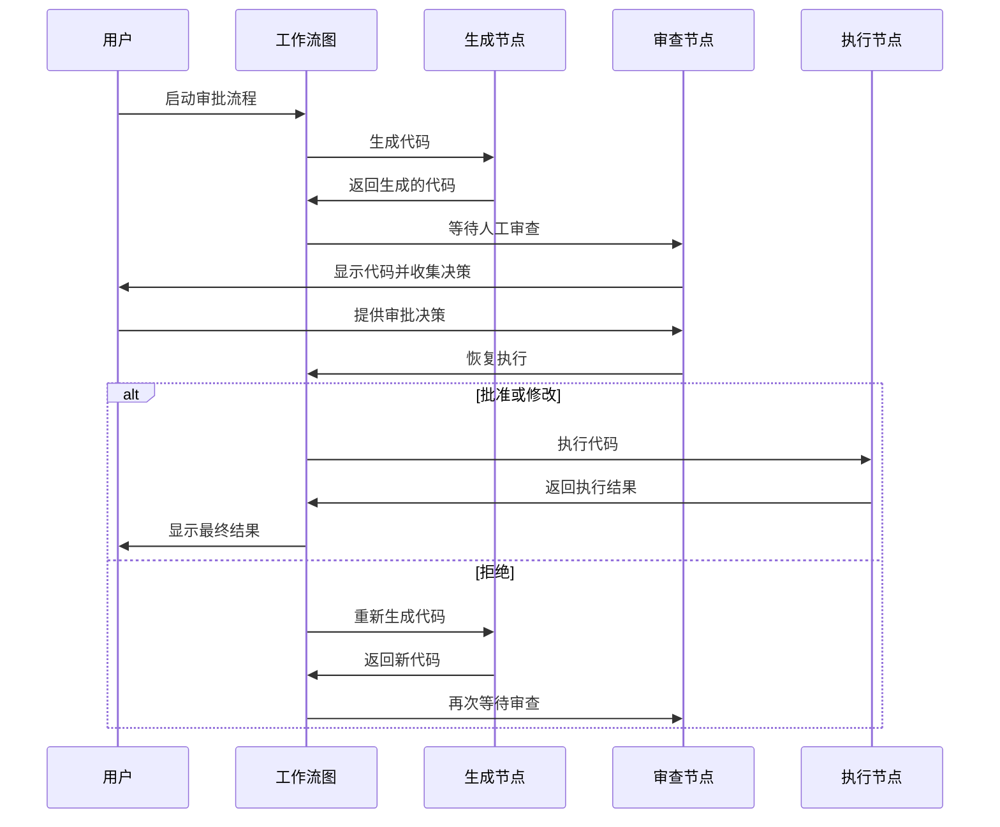
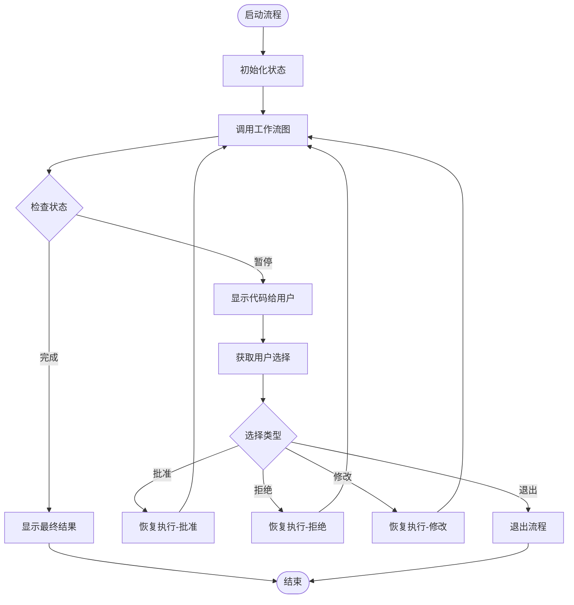
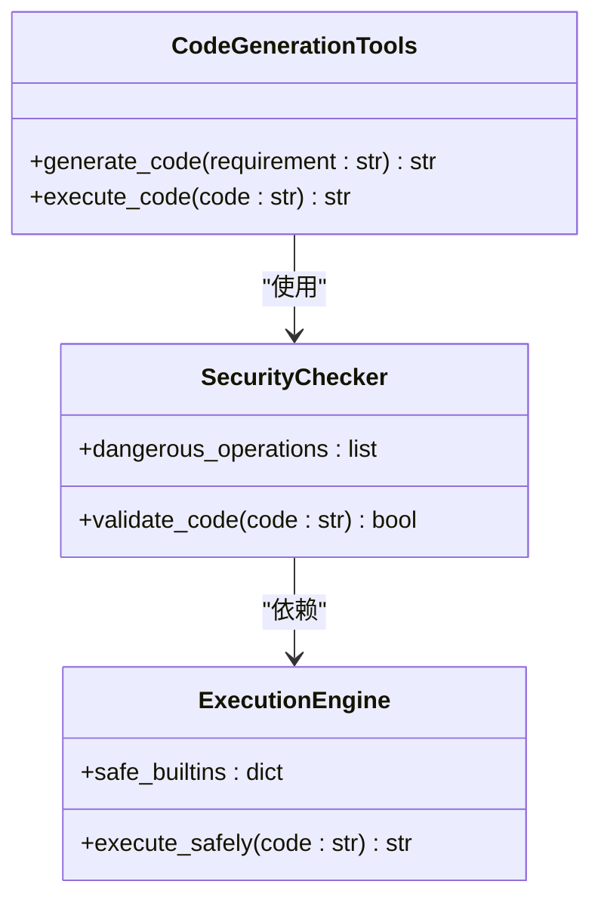
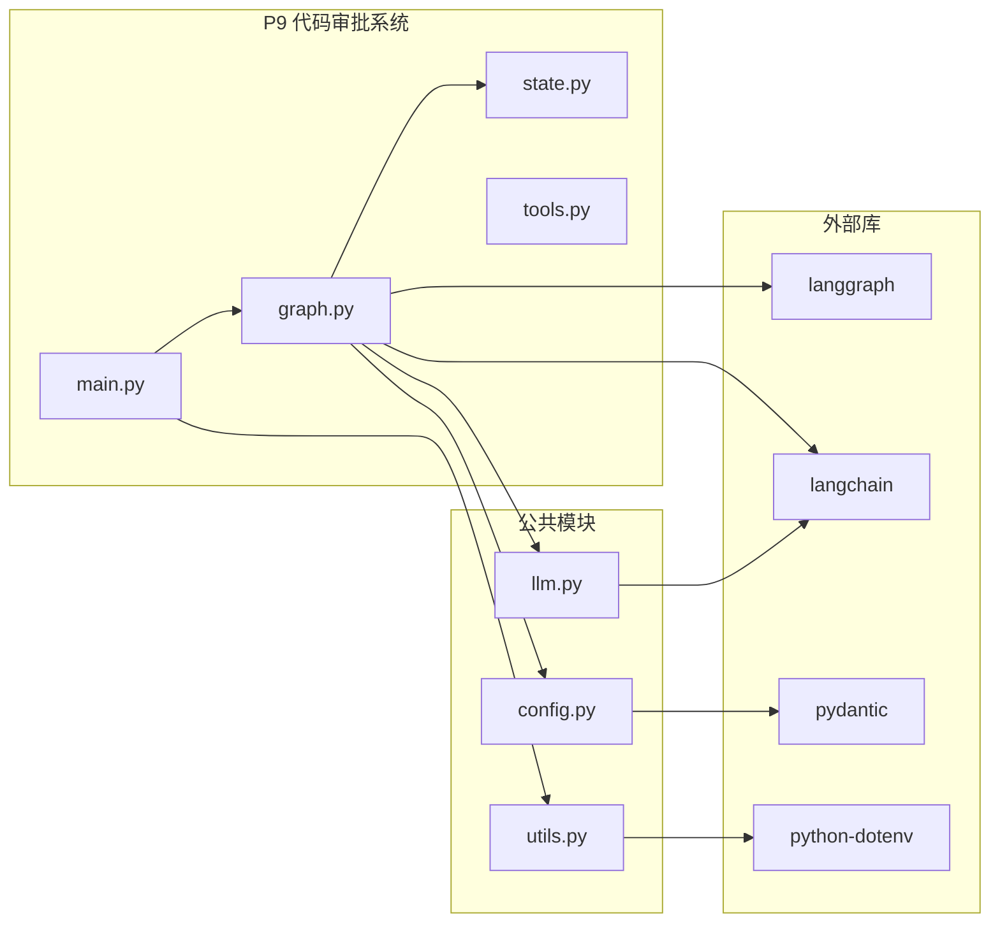

# P9: 代码审批系统 (HITL)

<cite>
**本文引用的文件**
- [main.py](file://09-code-approval/main.py)
- [state.py](file://09-code-approval/state.py)
- [graph.py](file://09-code-approval/graph.py)
- [tools.py](file://09-code-approval/tools.py)
- [config.py](file://common/config.py)
- [llm.py](file://common/llm.py)
- [utils.py](file://common/utils.py)
- [README.md](file://README.md)
- [pyproject.toml](file://pyproject.toml)
</cite>

## 目录
1. [简介](#简介)
2. [项目结构](#项目结构)
3. [核心组件](#核心组件)
4. [架构概览](#架构概览)
5. [详细组件分析](#详细组件分析)
6. [依赖分析](#依赖分析)
7. [性能考虑](#性能考虑)
8. [故障排除指南](#故障排除指南)
9. [结论](#结论)
10. [附录](#附录)

## 简介
P9 代码审批系统是一个基于 LangGraph 的人类在环（Human-in-the-Loop, HITL）工作流系统，实现了完整的代码生成、自动审查和人工审批流程。该系统通过 interrupt/resume 机制，在关键决策点暂停执行并等待人工干预，确保代码质量和安全性。

系统的核心特性包括：
- **中断处理机制**：在代码生成完成后暂停，等待人工审查
- **人工干预流程**：提供批准、拒绝、修改三种决策选项
- **状态管理**：完整的状态跟踪和检查点持久化
- **安全执行**：受控的代码执行环境，防止危险操作
- **多轮交互**：支持多次迭代直到获得满意结果

## 项目结构
P9 代码审批系统采用模块化设计，主要分为以下几个部分：

**图表来源**
- [main.py:1-219](file://09-code-approval/main.py#L1-L219)
- [state.py:1-31](file://09-code-approval/state.py#L1-L31)
- [graph.py:1-225](file://09-code-approval/graph.py#L1-L225)

**章节来源**
- [README.md:89-108](file://README.md#L89-L108)
- [pyproject.toml:1-29](file://pyproject.toml#L1-L29)

## 核心组件
系统由四个核心组件构成，每个组件都有明确的职责分工：

### 状态管理系统
状态系统定义了代码审批流程中的所有可变数据，包括：
- **messages**: 对话历史记录
- **requirement**: 用户的代码需求描述
- **generated_code**: LLM 生成的代码
- **review_status**: 审查状态（pending/approved/rejected/modified）
- **human_feedback**: 人工审查反馈
- **modified_code**: 人工修改后的代码
- **execution_result**: 代码执行结果
- **iteration**: 迭代次数（防止无限循环）

### 工作流图定义
工作流图实现了完整的审批流程，包含三个主要节点：
- **generate_node**: LLM 代码生成节点
- **await_review_node**: 人工审查等待节点（关键的 interrupt 点）
- **execute_node**: 代码安全执行节点

### 主程序控制逻辑
主程序负责协调整个审批流程，包括：
- 用户交互和决策收集
- interrupt/resume 机制的调用
- 多轮迭代的控制
- 错误处理和状态恢复

### 工具函数集合
提供了代码生成和执行的工具函数：
- **generate_code**: 代码生成工具
- **execute_code**: 安全代码执行工具

**章节来源**
- [state.py:9-31](file://09-code-approval/state.py#L9-L31)
- [graph.py:35-162](file://09-code-approval/graph.py#L35-L162)
- [main.py:35-219](file://09-code-approval/main.py#L35-L219)

## 架构概览
系统采用分层架构设计，实现了清晰的关注点分离：

**图表来源**
- [main.py:35-219](file://09-code-approval/main.py#L35-L219)
- [graph.py:180-225](file://09-code-approval/graph.py#L180-L225)
- [state.py:9-31](file://09-code-approval/state.py#L9-L31)

系统的关键设计原则：
1. **分离关注点**: 每个组件只负责特定的功能
2. **状态持久化**: 通过检查点确保中断恢复的可靠性
3. **安全隔离**: 代码执行在受控环境中进行
4. **可扩展性**: 支持添加新的节点和条件路由

## 详细组件分析

### 状态管理系统分析
状态系统采用 TypedDict 定义，确保类型安全和清晰的数据结构：

**图表来源**
- [state.py:9-31](file://09-code-approval/state.py#L9-L31)

状态管理的关键特性：
- **类型注解**: 使用 Annotated 类型确保类型安全
- **消息聚合**: 使用 add_messages 函数聚合对话历史
- **默认值**: 为所有字段提供合理的默认值
- **扩展性**: 易于添加新的状态字段

**章节来源**
- [state.py:9-31](file://09-code-approval/state.py#L9-L31)

### 工作流图实现分析
工作流图定义了完整的审批流程，包含三个核心节点：

**图表来源**
- [graph.py:180-225](file://09-code-approval/graph.py#L180-L225)
- [main.py:35-219](file://09-code-approval/main.py#L35-L219)

#### 生成节点实现
生成节点负责调用 LLM 生成代码，具有以下特点：
- **温度控制**: 使用较低的温度值（0.3）确保代码质量
- **反馈集成**: 将人工反馈整合到生成过程中
- **迭代追踪**: 跟踪生成迭代次数
- **消息记录**: 记录生成过程的消息历史

#### 审查节点实现
审查节点是系统的核心，实现了 interrupt 机制：
- **中断触发**: 调用 interrupt() 暂停执行
- **状态传递**: 将生成的代码和迭代信息传递给调用者
- **决策处理**: 根据人工决策更新状态
- **状态映射**: 将人工决策映射到标准化状态

#### 执行节点实现
执行节点实现了安全的代码执行：
- **安全检查**: 检测危险操作（如导入系统模块）
- **受限执行**: 使用受限的内置函数集
- **输出捕获**: 捕获标准输出作为执行结果
- **异常处理**: 捕获并报告执行错误

**章节来源**
- [graph.py:35-162](file://09-code-approval/graph.py#L35-L162)

### 主程序控制逻辑分析
主程序实现了完整的用户交互和流程控制：

**图表来源**
- [main.py:35-219](file://09-code-approval/main.py#L35-L219)

主程序的关键功能：
- **多轮迭代**: 支持最多5次迭代
- **用户交互**: 提供清晰的菜单选项
- **状态查询**: 动态查询工作流状态
- **错误处理**: 捕获并处理异常情况

**章节来源**
- [main.py:35-219](file://09-code-approval/main.py#L35-L219)

### 工具函数分析
工具函数提供了代码生成和执行的基础能力：

**图表来源**
- [tools.py:17-65](file://09-code-approval/tools.py#L17-L65)

工具函数的设计考虑：
- **代码生成**: 通过 LLM 生成高质量代码
- **安全执行**: 严格的代码安全检查
- **错误隔离**: 将安全检查与执行逻辑分离

**章节来源**
- [tools.py:17-65](file://09-code-approval/tools.py#L17-L65)

## 依赖分析
系统依赖关系清晰，遵循单一职责原则：

**图表来源**
- [pyproject.toml:7-21](file://pyproject.toml#L7-L21)
- [main.py:25-32](file://09-code-approval/main.py#L25-L32)
- [graph.py:26-32](file://09-code-approval/graph.py#L26-L32)

依赖管理策略：
- **版本锁定**: 使用精确版本号确保兼容性
- **最小依赖**: 只引入必要的依赖包
- **类型安全**: 使用 pydantic 确保数据结构正确性
- **配置管理**: 使用 python-dotenv 管理环境变量

**章节来源**
- [pyproject.toml:7-21](file://pyproject.toml#L7-L21)

## 性能考虑
系统在设计时充分考虑了性能和用户体验：

### 中断恢复机制
- **检查点存储**: 使用 InMemorySaver 确保状态持久化
- **状态压缩**: 只存储必要的状态信息
- **内存管理**: 控制检查点数量防止内存泄漏

### 代码执行优化
- **受限执行环境**: 仅暴露必要的内置函数
- **输出缓冲**: 使用 StringIO 高效捕获输出
- **异常快速失败**: 及时检测和报告执行错误

### 用户体验优化
- **进度指示**: 清晰的步骤提示和状态显示
- **超时保护**: 设置最大迭代次数防止无限循环
- **错误恢复**: 提供多种错误处理策略

## 故障排除指南
系统提供了完善的错误处理和调试机制：

### 常见问题及解决方案
1. **LLM 连接失败**
   - 检查 .env 文件配置
   - 验证网络连接
   - 确认模型名称正确

2. **中断机制失效**
   - 确认已配置检查点存储
   - 检查 thread_id 设置
   - 验证状态序列化

3. **代码执行失败**
   - 检查安全规则设置
   - 验证代码格式
   - 查看执行日志

### 调试技巧
- **状态检查**: 使用 graph.get_state() 查看当前状态
- **日志输出**: 添加详细的日志记录
- **单元测试**: 为关键节点编写测试用例

**章节来源**
- [main.py:200-206](file://09-code-approval/main.py#L200-L206)
- [graph.py:221](file://09-code-approval/graph.py#L221)

## 结论
P9 代码审批系统成功实现了人类在环（HITL）机制，通过以下关键特性确保了系统的有效性和可靠性：

### 技术成就
- **完整的中断恢复机制**: 实现了可靠的 interrupt/resume 流程
- **安全的代码执行**: 通过受限环境确保系统安全
- **灵活的人工干预**: 支持多种决策模式和反馈机制
- **状态持久化**: 确保长时间运行的稳定性

### 设计优势
- **模块化架构**: 清晰的职责分离便于维护
- **类型安全**: 使用 Pydantic 确保数据完整性
- **可扩展性**: 易于添加新的节点和功能
- **用户友好**: 直观的命令行界面

### 应用价值
该系统为代码生成和审查提供了完整的解决方案，特别适用于需要人工把关的自动化场景。通过结合 AI 的高效性和人工的判断力，实现了最佳的代码质量保证。

## 附录

### 配置说明
系统支持通过 .env 文件配置 LLM 参数：
- LLM_BASE_URL: LLM 服务地址
- LLM_API_KEY: API 密钥
- LLM_MODEL_NAME: 模型名称

### 扩展建议
1. **数据库集成**: 使用 SQLite 或 PostgreSQL 存储检查点
2. **Web 界面**: 开发基于 Web 的用户界面
3. **权限控制**: 添加用户认证和授权机制
4. **审计日志**: 记录所有人工干预操作
5. **监控告警**: 添加系统健康监控和告警机制

### 最佳实践
- 始终使用检查点存储确保状态持久化
- 在生产环境中实施严格的安全检查
- 提供充足的用户反馈和错误提示
- 定期备份检查点数据
- 监控系统性能指标