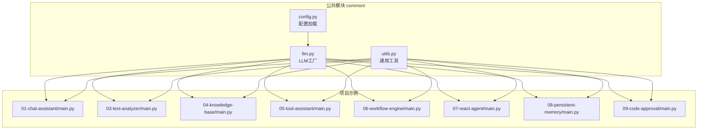
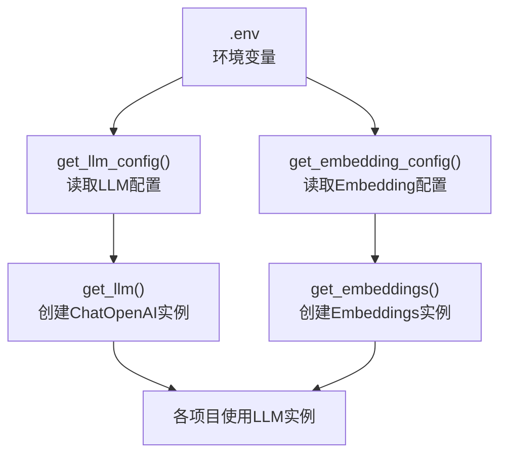
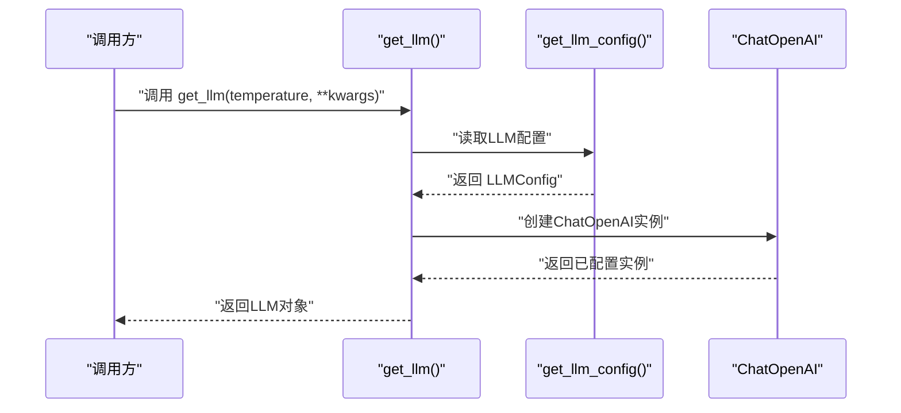
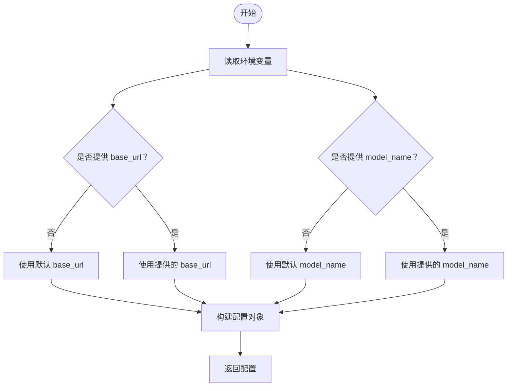
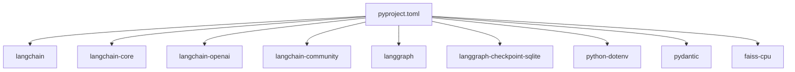

# LLM工厂模式

<cite>
**本文档引用的文件**
- [common/llm.py](file://common/llm.py)
- [common/config.py](file://common/config.py)
- [common/utils.py](file://common/utils.py)
- [README.md](file://README.md)
- [pyproject.toml](file://pyproject.toml)
- [01-chat-assistant/main.py](file://01-chat-assistant/main.py)
- [03-text-analyzer/main.py](file://03-text-analyzer/main.py)
- [04-knowledge-base/main.py](file://04-knowledge-base/main.py)
- [05-tool-assistant/main.py](file://05-tool-assistant/main.py)
- [06-workflow-engine/main.py](file://06-workflow-engine/main.py)
- [07-react-agent/main.py](file://07-react-agent/main.py)
- [08-persistent-memory/main.py](file://08-persistent-memory/main.py)
- [09-code-approval/main.py](file://09-code-approval/main.py)
</cite>

## 目录
1. [简介](#简介)
2. [项目结构](#项目结构)
3. [核心组件](#核心组件)
4. [架构概览](#架构概览)
5. [详细组件分析](#详细组件分析)
6. [依赖分析](#依赖分析)
7. [性能考虑](#性能考虑)
8. [故障排除指南](#故障排除指南)
9. [结论](#结论)
10. [附录](#附录)

## 简介
本文件面向LLM工厂模式的实现与应用，围绕common/llm.py中的工厂函数get_llm展开，系统阐述其初始化流程、配置注入机制与可扩展性设计，并结合多个实战项目展示如何在不同场景中使用该工厂创建和管理LLM实例。文档还覆盖错误处理、重试机制与性能优化建议，帮助读者在实际项目中高效、稳定地集成与扩展LLM能力。

## 项目结构
本仓库采用"公共模块 + 渐进式项目"的组织方式：
- common/：公共模块，包含配置加载与LLM工厂等跨项目共享能力
- 01-10各项目：按阶段递进的学习项目，分别演示不同的LangChain/LangGraph应用场景
- README.md与pyproject.toml：项目说明与依赖声明

**图表来源**
- [common/config.py:1-77](file://common/config.py#L1-L77)
- [common/llm.py:1-59](file://common/llm.py#L1-L59)
- [common/utils.py:1-33](file://common/utils.py#L1-L33)
- [01-chat-assistant/main.py:1-87](file://01-chat-assistant/main.py#L1-L87)
- [03-text-analyzer/main.py:1-240](file://03-text-analyzer/main.py#L1-L240)
- [04-knowledge-base/main.py:1-189](file://04-knowledge-base/main.py#L1-L189)
- [05-tool-assistant/main.py:1-200](file://05-tool-assistant/main.py#L1-L200)
- [06-workflow-engine/main.py:1-238](file://06-workflow-engine/main.py#L1-L238)
- [07-react-agent/main.py:1-173](file://07-react-agent/main.py#L1-L173)
- [08-persistent-memory/main.py:1-308](file://08-persistent-memory/main.py#L1-L308)
- [09-code-approval/main.py:1-219](file://09-code-approval/main.py#L1-L219)

**章节来源**
- [README.md:89-108](file://README.md#L89-L108)
- [pyproject.toml:1-29](file://pyproject.toml#L1-L29)

## 核心组件
- LLM工厂函数get_llm：统一创建ChatOpenAI实例，负责读取配置、注入参数并返回已配置的LLM对象
- 配置模块get_llm_config/get_embedding_config：从环境变量加载LLM与Embedding配置，提供默认值与校验
- 通用工具print_separator/print_step：为各项目提供一致的输出格式与步骤提示

**章节来源**
- [common/llm.py:13-40](file://common/llm.py#L13-L40)
- [common/config.py:33-56](file://common/config.py#L33-L56)
- [common/config.py:59-76](file://common/config.py#L59-L76)
- [common/utils.py:16-32](file://common/utils.py#L16-L32)

## 架构概览
LLM工厂模式的核心在于“集中配置、统一创建、按需扩展”。工厂函数get_llm封装了ChatOpenAI的初始化细节，屏蔽不同LLM提供商的差异；配置模块从.env读取参数，支持默认值与显式传参的优先级策略；各项目通过from common.llm import get_llm复用工厂，实现一致性与可维护性。

**图表来源**
- [common/llm.py:13-40](file://common/llm.py#L13-L40)
- [common/llm.py:43-58](file://common/llm.py#L43-L58)
- [common/config.py:33-56](file://common/config.py#L33-L56)
- [common/config.py:59-76](file://common/config.py#L59-L76)

## 详细组件分析

### LLM工厂与初始化流程
- 配置读取：get_llm_config从环境变量读取base_url、api_key、model_name，若缺失则抛出明确错误
- 实例创建：get_llm根据配置创建ChatOpenAI实例，内置streaming=True与可变温度参数
- 参数优先级：显式传入的kwargs具有最高优先级，可覆盖配置中的默认值
- 返回对象：返回已配置的ChatOpenAI实例，供后续调用invoke/bind_tools等

**图表来源**
- [common/llm.py:13-40](file://common/llm.py#L13-L40)
- [common/config.py:33-56](file://common/config.py#L33-L56)

**章节来源**
- [common/llm.py:13-40](file://common/llm.py#L13-L40)
- [common/config.py:33-56](file://common/config.py#L33-L56)

### 配置注入机制与默认值策略
- 默认值：若未设置LLM_BASE_URL/LLM_MODEL_NAME，将使用本地Ollama默认端点与模型名
- 显式覆盖：调用get_llm时传入的kwargs将直接传递给ChatOpenAI构造函数，优先级最高
- Embedding配置：get_embedding_config支持独立配置，若未设置则回退至LLM配置
- 错误提示：当关键配置缺失时，明确提示用户创建.env并填写必要字段

**图表来源**
- [common/config.py:42-56](file://common/config.py#L42-L56)
- [common/config.py:68-76](file://common/config.py#L68-L76)

**章节来源**
- [common/config.py:42-56](file://common/config.py#L42-L56)
- [common/config.py:68-76](file://common/config.py#L68-L76)

### 不同LLM提供商的特点与适用场景
- 本地Ollama：适合开发与测试，低延迟、离线可用；适合小型模型（如7B）进行基础对话与工具调用
- DeepSeek/OpenAI/通义千问/智谱GLM：适合生产与复杂任务，具备更强的推理与工具调用能力；建议在P5/P7/P10等需要结构化输出与工具调用的场景使用更大模型或API级模型

**章节来源**
- [README.md:77-87](file://README.md#L77-L87)

### 在各项目中的使用示例
- 对话助手（P1）：通过get_llm创建LLM实例，维护消息历史实现多轮对话
- 文本分析（P3）：在LCEL链中使用LLM，演示with_structured_output与多步分析链
- 知识库问答（P4）：构建RAG链，结合retriever与prompt进行检索增强生成
- 工具助手（P5）：bind_tools绑定工具，实现工具调用循环
- 工作流引擎（P6）：在StateGraph中使用LLM驱动节点逻辑
- ReAct代理（P7）：使用create_react_agent简化Agent构建
- 持久化记忆（P8）：结合checkpointer实现会话记忆与摘要压缩
- 代码审批（P9）：在interrupt/resume流程中引入人工审核

**章节来源**
- [01-chat-assistant/main.py:37-72](file://01-chat-assistant/main.py#L37-L72)
- [03-text-analyzer/main.py:37-70](file://03-text-analyzer/main.py#L37-L70)
- [04-knowledge-base/main.py:49-91](file://04-knowledge-base/main.py#L49-L91)
- [05-tool-assistant/main.py:121-128](file://05-tool-assistant/main.py#L121-L128)
- [06-workflow-engine/main.py:55-110](file://06-workflow-engine/main.py#L55-L110)
- [07-react-agent/main.py:39-60](file://07-react-agent/main.py#L39-L60)
- [08-persistent-memory/main.py:41-66](file://08-persistent-memory/main.py#L41-L66)
- [09-code-approval/main.py:68-87](file://09-code-approval/main.py#L68-L87)

## 依赖分析
- LangChain生态：langchain、langchain-core、langchain-openai、langchain-community等
- LangGraph：langgraph及其检查点组件
- 工具库：python-dotenv用于.env加载，pydantic用于结构化输出，faiss用于向量检索

**图表来源**
- [pyproject.toml:7-21](file://pyproject.toml#L7-L21)

**章节来源**
- [pyproject.toml:7-21](file://pyproject.toml#L7-L21)

## 性能考虑
- 流式输出：工厂默认启用streaming，有助于提升交互体验与响应速度
- 温度参数：根据任务特性选择合适温度（严谨/平衡/创意），避免过度随机导致输出不稳定
- 模型选择：在需要复杂推理与工具调用的场景优先选择更大模型或API级模型
- 连接池与并发：当前实现未显式配置连接池参数；如需高并发，可在kwargs中传入连接池相关参数（例如超时、最大连接数等），并结合项目实际负载进行压测与调优
- 缓存与重用：在项目内部尽量复用LLM实例，避免频繁创建销毁带来的开销

## 故障排除指南
- 配置缺失：若出现缺少LLM配置的错误，请在项目根目录创建.env文件并填写LLM_BASE_URL与LLM_MODEL_NAME
- 端点不可达：确认base_url指向的LLM服务正常运行，网络连通性良好
- 工具调用失败：检查工具绑定与参数传递，确保tool_calls正确回传ToolMessage
- RAG链异常：核对retriever与prompt配置，确保上下文拼接与解析逻辑正确
- 交互式流程报错：捕获异常并记录堆栈信息，便于定位具体环节问题

**章节来源**
- [common/config.py:46-50](file://common/config.py#L46-L50)
- [04-knowledge-base/main.py:159-163](file://04-knowledge-base/main.py#L159-L163)
- [05-tool-assistant/main.py:171-175](file://05-tool-assistant/main.py#L171-L175)
- [09-code-approval/main.py:200-206](file://09-code-approval/main.py#L200-L206)

## 结论
LLM工厂模式通过集中配置与统一流程，显著提升了项目的可维护性与可扩展性。结合多种LLM提供商与丰富的应用场景，开发者可以在不同阶段灵活切换与组合能力。建议在生产环境中进一步完善连接池、重试与熔断机制，并持续关注模型选择与性能优化策略。

## 附录
- 快速验证：可通过命令行验证LLM连通性与工厂可用性
- 环境准备：复制.env.example为.env并填写LLM配置
- 依赖安装：使用pip安装项目依赖

**章节来源**
- [README.md:7-24](file://README.md#L7-L24)