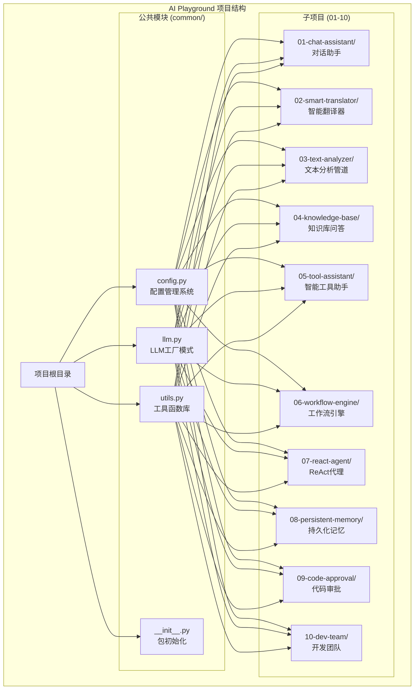
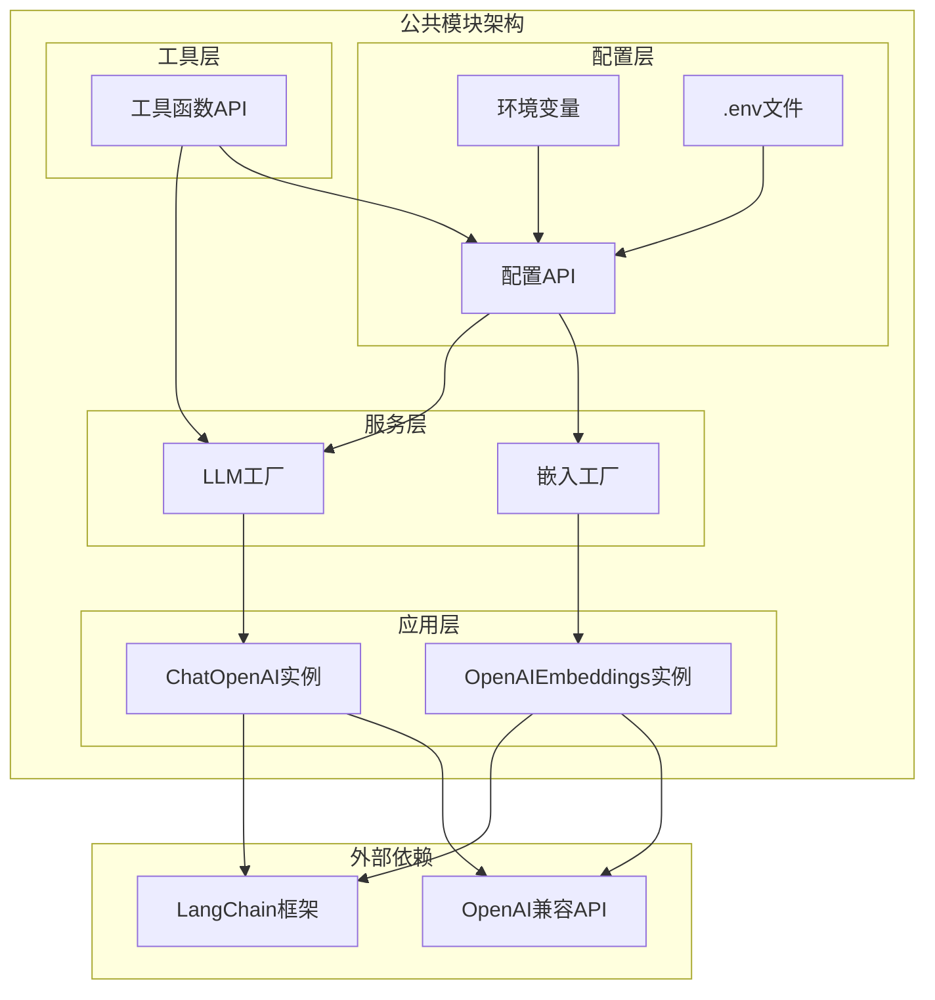
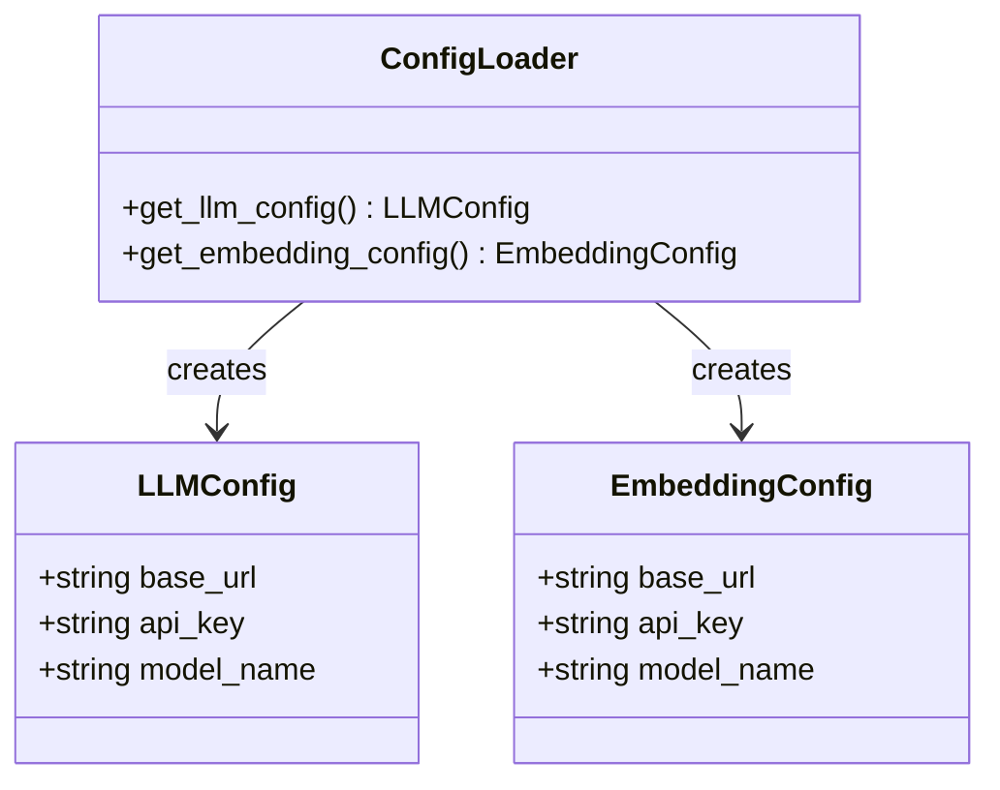
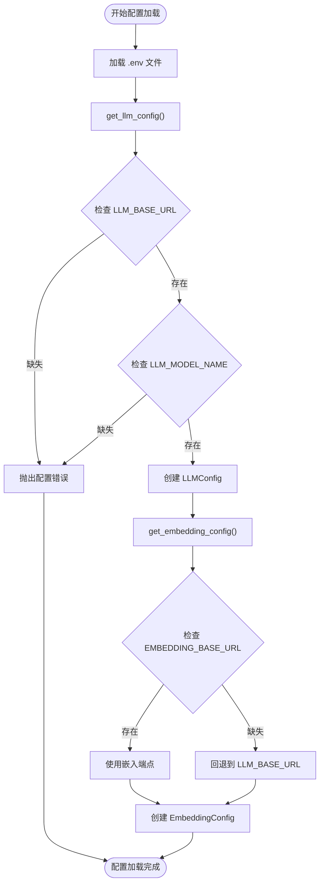
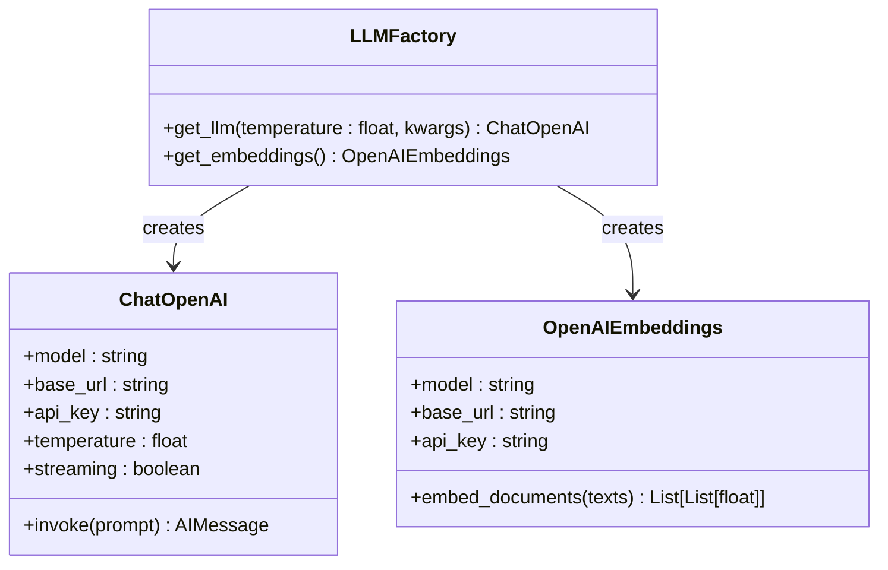
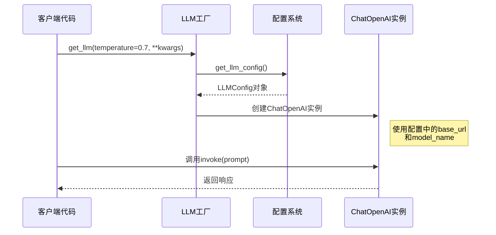
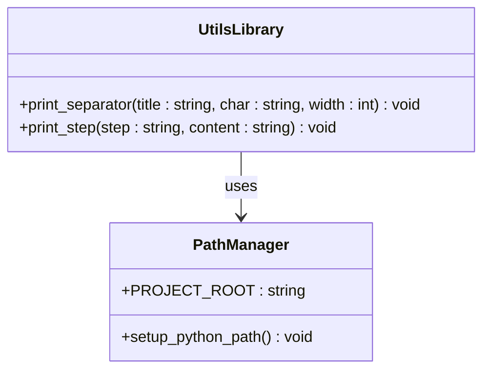
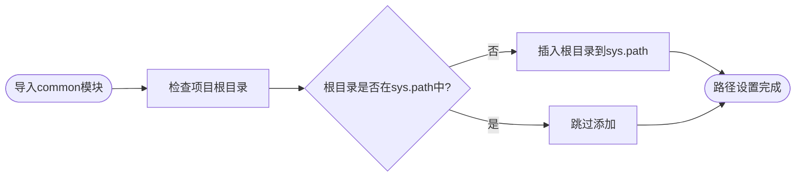
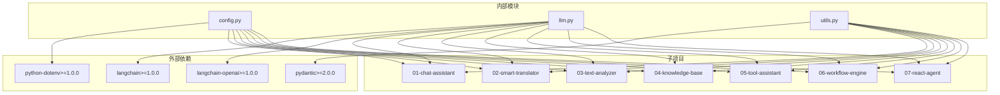
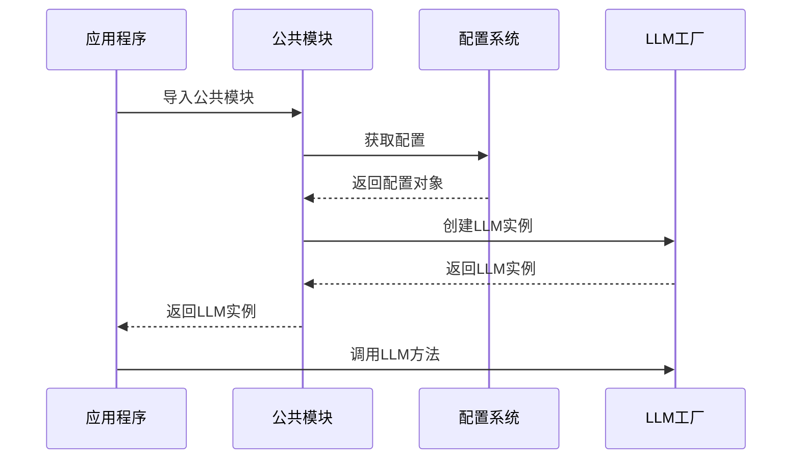

# 公共模块架构

<cite>
**本文档引用的文件**
- [common/config.py](file://common/config.py)
- [common/llm.py](file://common/llm.py)
- [common/utils.py](file://common/utils.py)
- [common/__init__.py](file://common/__init__.py)
- [01-chat-assistant/main.py](file://01-chat-assistant/main.py)
- [02-smart-translator/main.py](file://02-smart-translator/main.py)
- [03-text-analyzer/main.py](file://03-text-analyzer/main.py)
- [04-knowledge-base/main.py](file://04-knowledge-base/main.py)
- [05-tool-assistant/main.py](file://05-tool-assistant/main.py)
- [06-workflow-engine/main.py](file://06-workflow-engine/main.py)
- [07-react-agent/main.py](file://07-react-agent/main.py)
- [README.md](file://README.md)
- [pyproject.toml](file://pyproject.toml)
</cite>

## 目录
1. [简介](#简介)
2. [项目结构](#项目结构)
3. [核心组件](#核心组件)
4. [架构概览](#架构概览)
5. [详细组件分析](#详细组件分析)
6. [依赖关系分析](#依赖关系分析)
7. [性能考虑](#性能考虑)
8. [故障排除指南](#故障排除指南)
9. [结论](#结论)

## 简介

AI Playground 是一个基于 LangChain 和 LangGraph 的渐进式学习项目集合，通过10个循序渐进的项目系统学习大型语言模型应用开发。公共模块（common/）是整个项目的核心基础设施，提供了统一的配置管理、LLM初始化工厂和通用工具函数，确保所有子项目的一致性和可维护性。

该公共模块架构采用模块化设计原则，通过清晰的职责分离和标准化接口，实现了高度的可复用性和扩展性。本文档将深入分析config.py的配置管理系统、llm.py的LLM工厂模式实现和utils.py的工具函数库，解释其设计决策和技术权衡。

## 项目结构

AI Playground 采用清晰的分层项目结构，公共模块位于顶层 common/ 目录，所有子项目都通过标准的导入方式复用这些公共功能。

**图表来源**
- [README.md:89-107](file://README.md#L89-L107)
- [pyproject.toml:27-29](file://pyproject.toml#L27-L29)

**章节来源**
- [README.md:1-108](file://README.md#L1-L108)
- [pyproject.toml:1-29](file://pyproject.toml#L1-L29)

## 核心组件

公共模块包含三个核心组件，每个组件都有明确的职责和接口设计：

### 配置管理系统 (config.py)
负责从环境变量加载和管理LLM及嵌入模型的配置信息，提供类型安全的配置访问接口。

### LLM工厂模式 (llm.py)
提供统一的LLM实例创建接口，支持多种OpenAI兼容API，实现配置驱动的LLM初始化。

### 工具函数库 (utils.py)
提供跨项目复用的通用工具函数，包括命令行输出美化和项目路径管理。

**章节来源**
- [common/config.py:1-77](file://common/config.py#L1-L77)
- [common/llm.py:1-59](file://common/llm.py#L1-L59)
- [common/utils.py:1-33](file://common/utils.py#L1-L33)

## 架构概览

公共模块采用分层架构设计，通过清晰的接口抽象实现了高度的模块化和可扩展性。

**图表来源**
- [common/config.py:33-76](file://common/config.py#L33-L76)
- [common/llm.py:13-58](file://common/llm.py#L13-L58)
- [common/utils.py:10-32](file://common/utils.py#L10-L32)

该架构的核心优势在于：
- **单一职责原则**：每个模块专注于特定功能领域
- **依赖倒置**：上层模块不直接依赖具体实现，而是依赖抽象接口
- **配置驱动**：通过环境变量和配置文件实现灵活的部署适配
- **类型安全**：使用dataclass提供编译时类型检查

## 详细组件分析

### 配置管理系统 (config.py)

#### 数据结构设计

配置系统采用dataclass模式，提供了强类型的配置对象：

**图表来源**
- [common/config.py:17-31](file://common/config.py#L17-L31)
- [common/config.py:33-76](file://common/config.py#L33-L76)

#### 配置加载流程

配置系统遵循"环境变量优先，内置默认值"的设计原则：

**图表来源**
- [common/config.py:33-76](file://common/config.py#L33-L76)

#### 配置验证机制

配置系统实现了多层次的验证机制：

1. **必需字段验证**：确保基础URL和模型名称存在
2. **回退策略**：嵌入配置缺失时自动回退到LLM配置
3. **类型安全**：使用dataclass确保字段类型正确

**章节来源**
- [common/config.py:17-76](file://common/config.py#L17-L76)

### LLM工厂模式 (llm.py)

#### 工厂设计模式

LLM工厂实现了标准的工厂模式，提供统一的LLM实例创建接口：

**图表来源**
- [common/llm.py:13-58](file://common/llm.py#L13-L58)

#### 参数优先级机制

LLM工厂实现了"显式参数优先于配置"的设计原则：

**图表来源**
- [common/llm.py:13-40](file://common/llm.py#L13-L40)
- [common/config.py:33-56](file://common/config.py#L33-L56)

#### 扩展机制

LLM工厂支持灵活的扩展机制：

1. **温度参数控制**：允许在调用时覆盖默认温度设置
2. **关键字参数传递**：支持向底层ChatOpenAI传递额外参数
3. **流式输出支持**：默认启用流式输出提升用户体验

**章节来源**
- [common/llm.py:13-58](file://common/llm.py#L13-L58)

### 工具函数库 (utils.py)

#### 工具函数设计

工具函数库提供了两个核心工具函数：

**图表来源**
- [common/utils.py:16-32](file://common/utils.py#L16-L32)

#### 路径管理机制

工具函数库实现了智能的项目路径管理：

**图表来源**
- [common/utils.py:10-13](file://common/utils.py#L10-L13)

**章节来源**
- [common/utils.py:16-32](file://common/utils.py#L16-L32)

## 依赖关系分析

公共模块的依赖关系设计体现了良好的软件工程原则，实现了松耦合和高内聚。

**图表来源**
- [pyproject.toml:7-21](file://pyproject.toml#L7-L21)

### 依赖注入模式

公共模块采用了依赖注入的设计模式，通过参数传递实现松耦合：

**图表来源**
- [01-chat-assistant/main.py:19-21](file://01-chat-assistant/main.py#L19-L21)
- [02-smart-translator/main.py:18-20](file://02-smart-translator/main.py#L18-L20)

**章节来源**
- [pyproject.toml:7-21](file://pyproject.toml#L7-L21)

## 性能考虑

公共模块在设计时充分考虑了性能优化和资源管理：

### 内存管理
- **按需加载**：配置仅在首次访问时加载，避免不必要的内存占用
- **实例复用**：建议在应用生命周期内复用LLM实例，避免频繁创建销毁

### 网络优化
- **连接池**：底层LangChain框架自动管理HTTP连接池
- **流式响应**：默认启用流式输出，提升用户体验

### 缓存策略
- **配置缓存**：环境变量配置在进程启动时加载并缓存
- **模型缓存**：LLM实例在进程内保持活跃状态

## 故障排除指南

### 常见配置问题

#### 环境变量配置错误
**症状**：运行时抛出配置错误异常
**解决方案**：
1. 检查`.env`文件是否存在且格式正确
2. 验证必需的环境变量是否设置
3. 确认环境变量值的格式符合要求

#### LLM连接失败
**症状**：调用LLM时出现网络连接错误
**解决方案**：
1. 验证`LLM_BASE_URL`指向正确的API端点
2. 检查网络连接和防火墙设置
3. 确认API密钥有效且具有相应权限

### 代码集成问题

#### 导入路径错误
**症状**：无法从`common`模块导入功能
**解决方案**：
1. 确保项目根目录在Python路径中
2. 检查`sys.path`的设置逻辑
3. 验证包的安装状态

#### 版本兼容性问题
**症状**：运行时出现模块导入错误
**解决方案**：
1. 检查`pyproject.toml`中的依赖版本
2. 确保所有依赖包正确安装
3. 验证Python版本兼容性

**章节来源**
- [common/config.py:46-50](file://common/config.py#L46-L50)
- [common/utils.py:10-13](file://common/utils.py#L10-L13)

## 结论

AI Playground的公共模块架构展现了优秀的软件工程实践，通过精心设计的模块化结构实现了高度的可复用性和可维护性。

### 设计优势总结

1. **模块化设计**：清晰的职责分离和接口抽象
2. **配置驱动**：灵活的部署适配和环境隔离
3. **类型安全**：编译时类型检查和运行时验证
4. **扩展性**：支持多种OpenAI兼容API和自定义配置
5. **易用性**：简化的API设计和丰富的使用示例

### 技术决策分析

该架构在多个技术决策上体现了深思熟虑的设计考量：

- **数据类选择**：使用dataclass替代传统类定义，提供更好的类型安全和序列化支持
- **工厂模式**：通过工厂方法实现对象创建的集中管理和配置驱动
- **依赖注入**：通过参数传递实现松耦合和测试友好性
- **环境变量**：采用环境变量配置实现环境隔离和部署灵活性

### 最佳实践建议

1. **配置管理**：始终通过公共配置模块访问LLM设置
2. **实例复用**：在应用生命周期内复用LLM实例
3. **错误处理**：实现适当的异常处理和重试机制
4. **日志记录**：添加详细的日志记录以便调试和监控
5. **性能监控**：监控LLM调用延迟和错误率

该公共模块架构为AI应用开发提供了一个坚实的基础，通过标准化的接口和灵活的配置机制，支持从简单的对话助手到复杂的多智能体系统的各种应用场景。