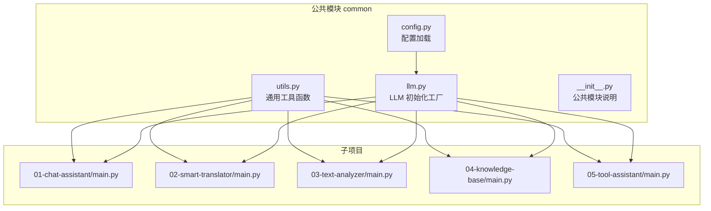
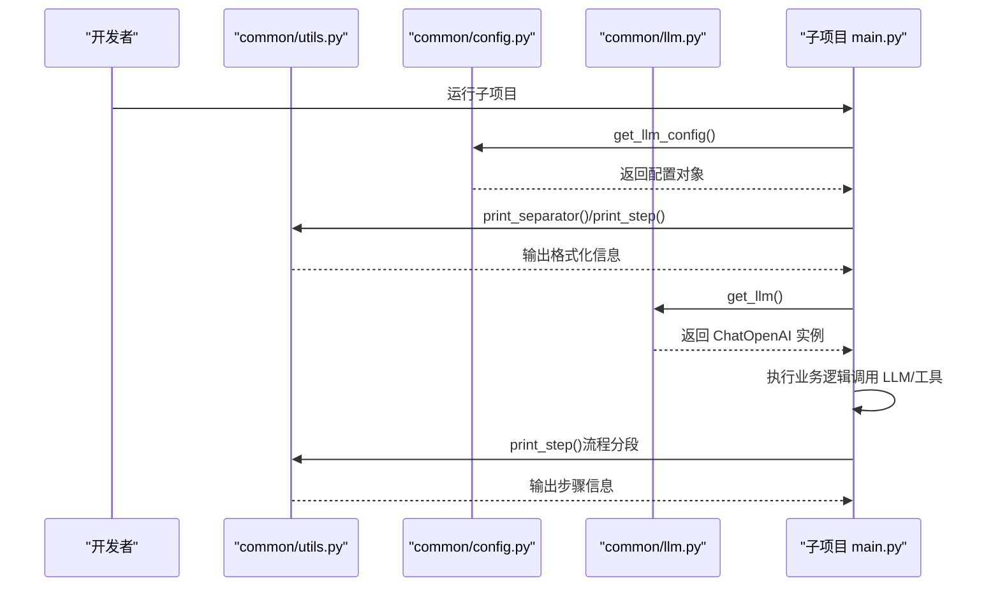
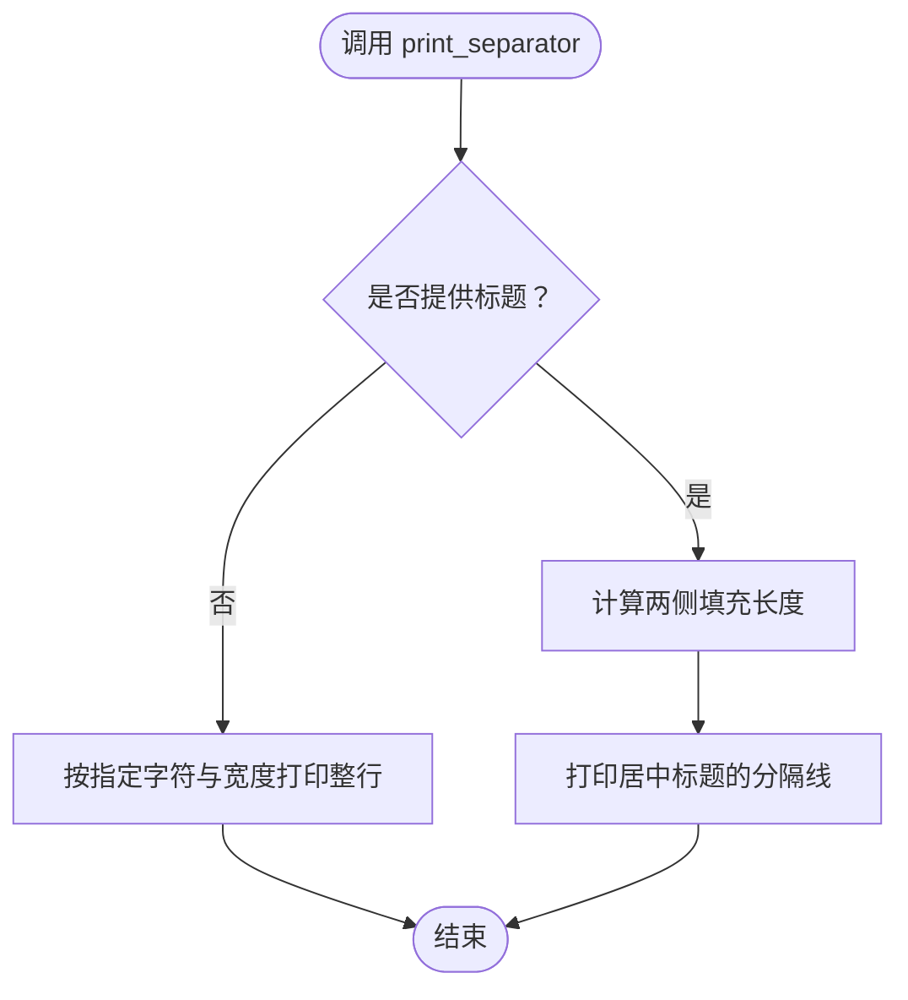
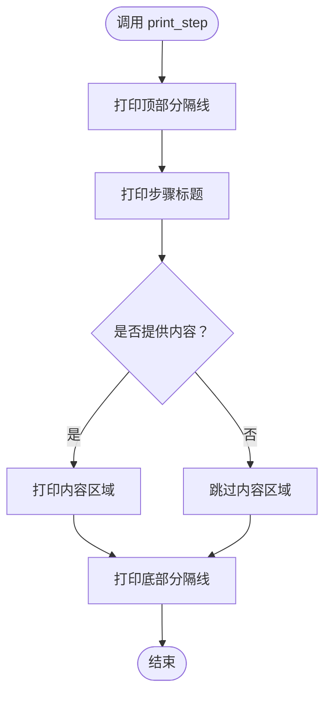
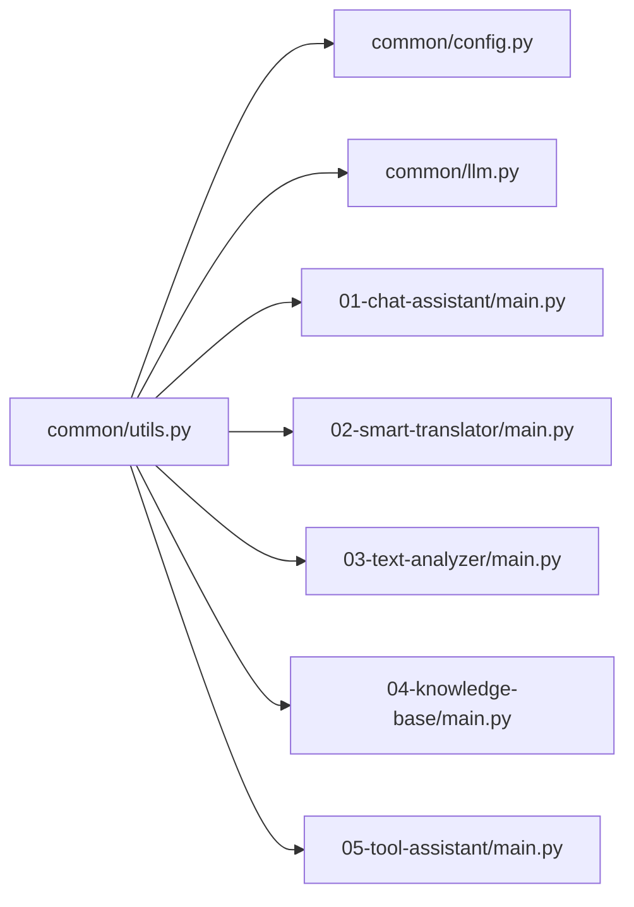

# 工具函数库

<cite>
**本文引用的文件**
- [common/utils.py](file://common/utils.py)
- [common/__init__.py](file://common/__init__.py)
- [common/config.py](file://common/config.py)
- [common/llm.py](file://common/llm.py)
- [01-chat-assistant/main.py](file://01-chat-assistant/main.py)
- [02-smart-translator/main.py](file://02-smart-translator/main.py)
- [03-text-analyzer/main.py](file://03-text-analyzer/main.py)
- [04-knowledge-base/main.py](file://04-knowledge-base/main.py)
- [05-tool-assistant/main.py](file://05-tool-assistant/main.py)
- [README.md](file://README.md)
</cite>

## 目录
1. [简介](#简介)
2. [项目结构](#项目结构)
3. [核心组件](#核心组件)
4. [架构总览](#架构总览)
5. [详细组件分析](#详细组件分析)
6. [依赖分析](#依赖分析)
7. [性能考虑](#性能考虑)
8. [故障排查指南](#故障排查指南)
9. [结论](#结论)
10. [附录](#附录)

## 简介
本文件为工具函数库的详细API文档，聚焦于 common/utils.py 中提供的通用工具函数，包括输出格式化与消息处理两大类能力。文档将逐项说明函数签名、参数、返回值、典型使用场景，并结合实际项目示例展示如何在不同项目中调用这些工具函数。同时阐述设计原则、性能考量、扩展建议、常见使用模式与最佳实践，以及这些工具函数在整个项目架构中的作用与与其他模块的交互关系。

## 项目结构
common/utils.py 位于公共模块 common 下，为所有子项目提供跨项目复用的辅助能力。其典型使用方式是在各子项目中通过 from common.utils import 函数名的方式导入，配合 common/config.py 与 common/llm.py 提供的配置与 LLM 初始化能力，形成统一的输出风格与调试辅助。

图表来源
- [common/utils.py:1-33](file://common/utils.py#L1-L33)
- [common/config.py:1-77](file://common/config.py#L1-L77)
- [common/llm.py:1-59](file://common/llm.py#L1-L59)
- [01-chat-assistant/main.py:1-87](file://01-chat-assistant/main.py#L1-L87)
- [02-smart-translator/main.py:1-179](file://02-smart-translator/main.py#L1-L179)
- [03-text-analyzer/main.py:1-240](file://03-text-analyzer/main.py#L1-L240)
- [04-knowledge-base/main.py:1-189](file://04-knowledge-base/main.py#L1-L189)
- [05-tool-assistant/main.py:1-200](file://05-tool-assistant/main.py#L1-L200)

章节来源
- [README.md:89-108](file://README.md#L89-L108)
- [common/__init__.py:1-7](file://common/__init__.py#L1-L7)

## 核心组件
- 输出格式化与消息处理工具
  - print_separator：打印分隔线，用于美化命令行输出，支持标题居中与自定义字符宽度。
  - print_step：打印步骤信息，用于在长流程中分段展示，提升可读性与调试友好度。

这些函数不依赖外部库，仅使用标准库 sys 与 os，具备极低耦合与高复用性，适合在任何子项目中直接调用。

章节来源
- [common/utils.py:16-32](file://common/utils.py#L16-L32)

## 架构总览
工具函数在项目中的定位是“横切关注点”，贯穿所有子项目，统一输出风格与调试体验。其与配置模块 common/config.py 与 LLM 初始化模块 common/llm.py 的关系如下：
- 通过 common/config.py 获取 LLM 配置，用于在入口处打印模型与端点信息，便于用户确认环境配置正确。
- 通过 common/llm.py 获取 LLM 实例，用于后续的推理与工具调用，工具函数负责输出与调试展示。

图表来源
- [common/utils.py:16-32](file://common/utils.py#L16-L32)
- [common/config.py:33-56](file://common/config.py#L33-L56)
- [common/llm.py:13-40](file://common/llm.py#L13-L40)
- [01-chat-assistant/main.py:31-37](file://01-chat-assistant/main.py#L31-L37)
- [02-smart-translator/main.py:160-164](file://02-smart-translator/main.py#L160-L164)
- [03-text-analyzer/main.py:224-228](file://03-text-analyzer/main.py#L224-L228)
- [04-knowledge-base/main.py:166-170](file://04-knowledge-base/main.py#L166-L170)
- [05-tool-assistant/main.py:178-182](file://05-tool-assistant/main.py#L178-L182)

## 详细组件分析

### print_separator(title: str = "", char: str = "=", width: int = 60)
- 功能：打印一条分隔线，用于美化命令行输出，可选带标题并自动居中。
- 参数
  - title: 可选标题字符串，默认为空字符串。
  - char: 可选分隔字符，默认为等号“=”。
  - width: 可选宽度，默认为60。
- 返回值：无（直接打印到标准输出）。
- 使用场景
  - 项目启动时打印模块标题与配置概览。
  - 流程分段时作为视觉分隔符，提升可读性。
- 典型调用位置
  - [01-chat-assistant/main.py](file://01-chat-assistant/main.py#L32)
  - [02-smart-translator/main.py](file://02-smart-translator/main.py#L162)
  - [03-text-analyzer/main.py](file://03-text-analyzer/main.py#L226)
  - [04-knowledge-base/main.py](file://04-knowledge-base/main.py#L168)
  - [05-tool-assistant/main.py](file://05-tool-assistant/main.py#L180)

图表来源
- [common/utils.py:16-22](file://common/utils.py#L16-L22)

章节来源
- [common/utils.py:16-22](file://common/utils.py#L16-L22)
- [01-chat-assistant/main.py](file://01-chat-assistant/main.py#L32)
- [02-smart-translator/main.py](file://02-smart-translator/main.py#L162)
- [03-text-analyzer/main.py](file://03-text-analyzer/main.py#L226)
- [04-knowledge-base/main.py](file://04-knowledge-base/main.py#L168)
- [05-tool-assistant/main.py](file://05-tool-assistant/main.py#L180)

### print_step(step: str, content: str = "")
- 功能：打印步骤信息，用于在长流程中分段展示，提升可读性与调试友好度。
- 参数
  - step: 步骤标题字符串。
  - content: 可选步骤内容，若提供则在分隔线下方打印。
- 返回值：无（直接打印到标准输出）。
- 使用场景
  - 每个演示或流程阶段的开始与结束标识。
  - 在复杂链路（如 RAG、工具调用循环）中分段展示中间结果。
- 典型调用位置
  - [01-chat-assistant/main.py](file://01-chat-assistant/main.py#L71)
  - [02-smart-translator/main.py](file://02-smart-translator/main.py#L31)
  - [02-smart-translator/main.py](file://02-smart-translator/main.py#L63)
  - [02-smart-translator/main.py](file://02-smart-translator/main.py#L111)
  - [03-text-analyzer/main.py](file://03-text-analyzer/main.py#L35)
  - [03-text-analyzer/main.py](file://03-text-analyzer/main.py#L56)
  - [03-text-analyzer/main.py](file://03-text-analyzer/main.py#L83)
  - [04-knowledge-base/main.py](file://04-knowledge-base/main.py#L96)
  - [05-tool-assistant/main.py](file://05-tool-assistant/main.py#L119)
  - [05-tool-assistant/main.py](file://05-tool-assistant/main.py#L133)
  - [05-tool-assistant/main.py](file://05-tool-assistant/main.py#L145)

图表来源
- [common/utils.py:25-32](file://common/utils.py#L25-L32)

章节来源
- [common/utils.py:25-32](file://common/utils.py#L25-L32)
- [01-chat-assistant/main.py](file://01-chat-assistant/main.py#L71)
- [02-smart-translator/main.py](file://02-smart-translator/main.py#L31)
- [02-smart-translator/main.py](file://02-smart-translator/main.py#L63)
- [02-smart-translator/main.py](file://02-smart-translator/main.py#L111)
- [03-text-analyzer/main.py](file://03-text-analyzer/main.py#L35)
- [03-text-analyzer/main.py](file://03-text-analyzer/main.py#L56)
- [03-text-analyzer/main.py](file://03-text-analyzer/main.py#L83)
- [04-knowledge-base/main.py](file://04-knowledge-base/main.py#L96)
- [05-tool-assistant/main.py](file://05-tool-assistant/main.py#L119)
- [05-tool-assistant/main.py](file://05-tool-assistant/main.py#L133)
- [05-tool-assistant/main.py](file://05-tool-assistant/main.py#L145)

## 依赖分析
- 模块内聚与耦合
  - utils.py 仅依赖标准库 sys 与 os，内聚性高、耦合度低，适合跨项目复用。
- 与配置模块的关系
  - 子项目通过 common/config.py 获取 LLM 配置，随后调用 utils.print_separator 输出配置概览；这体现了“配置—展示”的协作关系。
- 与 LLM 初始化模块的关系
  - 子项目通过 common/llm.py 获取 ChatOpenAI 实例，随后在推理过程中使用 utils.print_step 标注关键步骤，形成“初始化—推理—可视化”的完整链路。
- 与子项目的关系
  - 各子项目均以 from common.utils import 方式导入，统一了输出风格与调试体验，降低了重复代码与维护成本。

图表来源
- [common/utils.py:1-33](file://common/utils.py#L1-L33)
- [common/config.py:1-77](file://common/config.py#L1-L77)
- [common/llm.py:1-59](file://common/llm.py#L1-L59)
- [01-chat-assistant/main.py:1-87](file://01-chat-assistant/main.py#L1-L87)
- [02-smart-translator/main.py:1-179](file://02-smart-translator/main.py#L1-L179)
- [03-text-analyzer/main.py:1-240](file://03-text-analyzer/main.py#L1-L240)
- [04-knowledge-base/main.py:1-189](file://04-knowledge-base/main.py#L1-L189)
- [05-tool-assistant/main.py:1-200](file://05-tool-assistant/main.py#L1-L200)

章节来源
- [common/utils.py:1-33](file://common/utils.py#L1-L33)
- [common/config.py:33-56](file://common/config.py#L33-L56)
- [common/llm.py:13-40](file://common/llm.py#L13-L40)
- [01-chat-assistant/main.py:31-37](file://01-chat-assistant/main.py#L31-L37)
- [02-smart-translator/main.py:160-164](file://02-smart-translator/main.py#L160-L164)
- [03-text-analyzer/main.py:224-228](file://03-text-analyzer/main.py#L224-L228)
- [04-knowledge-base/main.py:166-170](file://04-knowledge-base/main.py#L166-L170)
- [05-tool-assistant/main.py:178-182](file://05-tool-assistant/main.py#L178-L182)

## 性能考虑
- 时间复杂度
  - print_separator：O(1)，仅字符串拼接与打印，常数时间。
  - print_step：O(n)，其中 n 为标题与内容的字符数，主要消耗在字符串拼接与打印。
- 空间复杂度
  - 两者均为 O(n)，取决于标题与内容的长度。
- I/O 行为
  - 两个函数均直接向标准输出打印，属于同步 I/O，不会引入额外的异步开销。
- 适用场景
  - 在长流程中使用 print_step 进行分段输出，有助于快速定位问题与提升可观测性。
  - 在项目启动时使用 print_separator 输出概览，便于用户确认配置与模型信息。

[本节为通用性能讨论，无需特定文件来源]

## 故障排查指南
- 输出异常或乱码
  - 检查终端编码设置，确保支持中文字符与特殊符号（如“📋”、“─”）。
- 标题未居中或宽度不符
  - 确认传入的 title 长度与 width 设置合理，避免超出终端宽度导致换行。
- 调试信息缺失
  - 确认子项目中确实调用了 utils.print_separator 与 utils.print_step，且在关键节点插入。
- 与配置/LLM 初始化的联动
  - 若发现配置错误导致 LLM 初始化失败，请先检查 common/config.py 的环境变量与默认值，再通过 utils.print_separator 输出配置概览进行核对。

章节来源
- [common/utils.py:16-32](file://common/utils.py#L16-L32)
- [common/config.py:33-56](file://common/config.py#L33-L56)

## 结论
common/utils.py 提供了简洁而强大的输出格式化与调试辅助能力，通过 print_separator 与 print_step 两个函数，统一了各子项目的输出风格与调试体验。它们与 common/config.py、common/llm.py 形成“配置—初始化—展示”的协作闭环，适用于从基础对话到复杂工具调用与 RAG 的多种场景。建议在所有子项目中保持一致的使用模式，并在关键流程节点插入 print_step，以提升可读性与可维护性。

[本节为总结性内容，无需特定文件来源]

## 附录

### API 一览表
- print_separator(title: str = "", char: str = "=", width: int = 60)
  - 参数：title、char、width
  - 返回：无
  - 场景：项目启动、流程分段、标题展示
- print_step(step: str, content: str = "")
  - 参数：step、content
  - 返回：无
  - 场景：演示分段、推理步骤、中间结果展示

章节来源
- [common/utils.py:16-32](file://common/utils.py#L16-L32)

### 常见使用模式与最佳实践
- 在项目入口处使用 print_separator 输出模块标题与配置概览，便于用户确认环境。
- 在每个演示或流程阶段使用 print_step 标注步骤标题与内容，提升可读性。
- 在复杂链路（如 RAG、工具调用循环）中，针对关键节点插入 print_step，便于调试与追踪。
- 保持统一的字符与宽度设置，确保跨终端一致性。

章节来源
- [01-chat-assistant/main.py:31-37](file://01-chat-assistant/main.py#L31-L37)
- [02-smart-translator/main.py:160-164](file://02-smart-translator/main.py#L160-L164)
- [03-text-analyzer/main.py:224-228](file://03-text-analyzer/main.py#L224-L228)
- [04-knowledge-base/main.py:166-170](file://04-knowledge-base/main.py#L166-L170)
- [05-tool-assistant/main.py:178-182](file://05-tool-assistant/main.py#L178-L182)

### 扩展建议
- 可增加颜色控制或样式开关，以便在不同环境下突出显示重要信息。
- 可增加日志级别与输出目标（文件/控制台）切换，满足生产环境需求。
- 可增加模板化输出能力，支持动态占位符与格式化选项。

[本节为扩展性建议，无需特定文件来源]