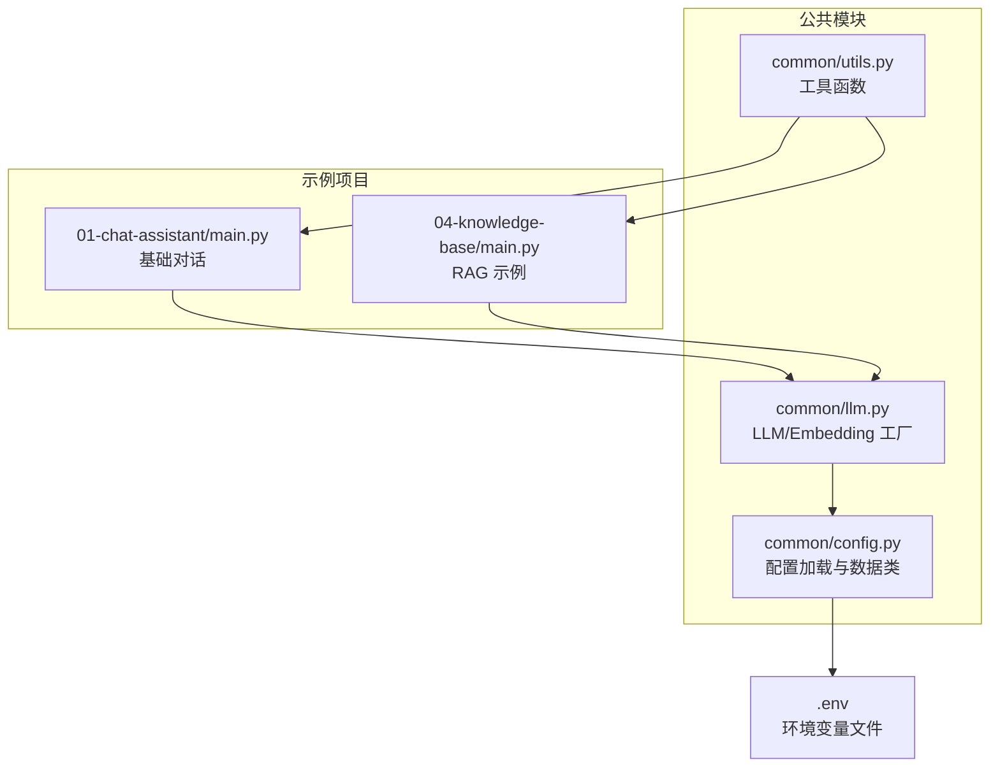
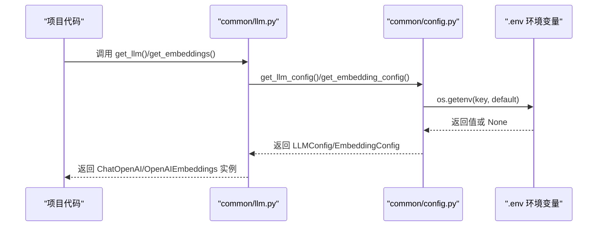
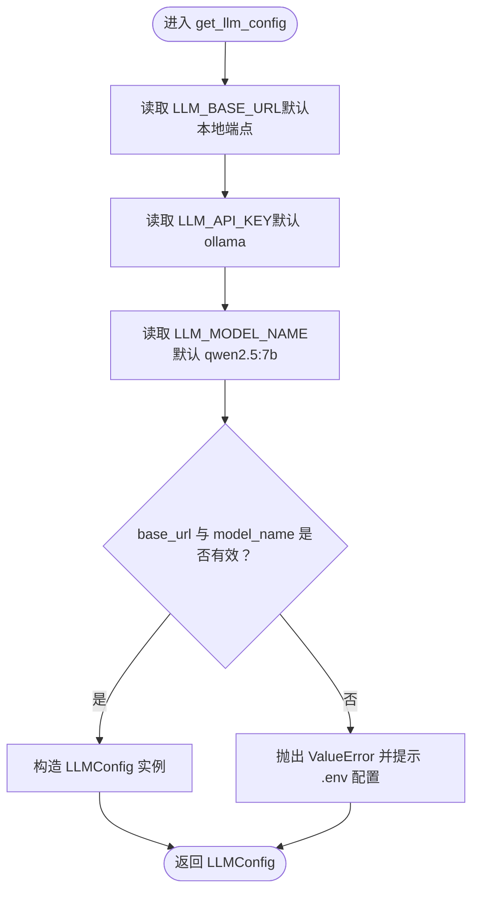
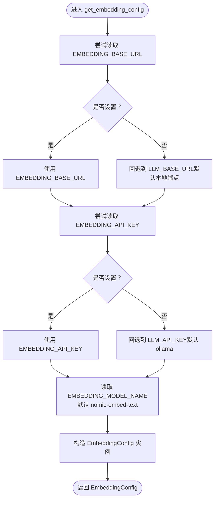
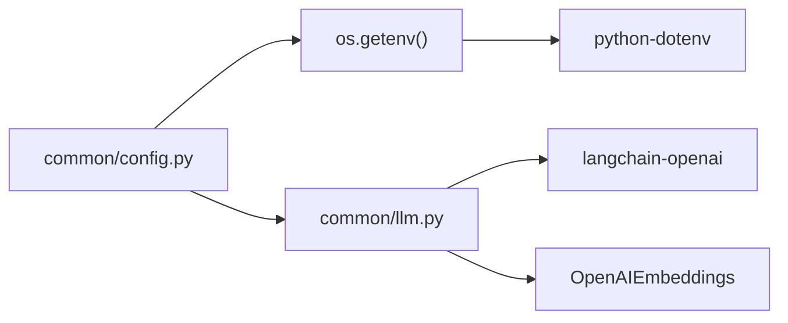

# 配置管理系统

<cite>
**本文引用的文件**
- [common/config.py](file://common/config.py)
- [common/llm.py](file://common/llm.py)
- [common/utils.py](file://common/utils.py)
- [01-chat-assistant/main.py](file://01-chat-assistant/main.py)
- [04-knowledge-base/main.py](file://04-knowledge-base/main.py)
- [README.md](file://README.md)
- [pyproject.toml](file://pyproject.toml)
</cite>

## 目录
1. [简介](#简介)
2. [项目结构](#项目结构)
3. [核心组件](#核心组件)
4. [架构概览](#架构概览)
5. [详细组件分析](#详细组件分析)
6. [依赖分析](#依赖分析)
7. [性能考虑](#性能考虑)
8. [故障排查指南](#故障排查指南)
9. [结论](#结论)
10. [附录](#附录)

## 简介
本文件面向“配置管理系统”的技术文档，聚焦于 common/config.py 中的配置加载机制，涵盖 dotenv 环境变量加载、LLMConfig 和 EmbeddingConfig 数据类的设计理念，以及 get_llm_config() 与 get_embedding_config() 的实现逻辑、默认值与错误处理策略。文档还解释了配置参数的作用域与优先级规则，并提供 .env 文件配置示例、常见错误及解决方案、类型安全最佳实践与扩展指南，帮助开发者在不同项目中正确使用配置。

## 项目结构
配置系统位于 common/config.py，被多个子项目复用；LLM 初始化工厂位于 common/llm.py，负责将配置转换为具体客户端实例；公共工具 common/utils.py 提供项目根路径注入以保证模块导入稳定；README.md 提供整体学习路径与配置说明；pyproject.toml 描述了项目依赖，包括 python-dotenv。

图表来源
- [common/config.py:1-77](file://common/config.py#L1-L77)
- [common/llm.py:1-59](file://common/llm.py#L1-L59)
- [common/utils.py:1-33](file://common/utils.py#L1-L33)
- [01-chat-assistant/main.py:1-87](file://01-chat-assistant/main.py#L1-L87)
- [04-knowledge-base/main.py:1-189](file://04-knowledge-base/main.py#L1-L189)

章节来源
- [README.md:1-108](file://README.md#L1-L108)
- [pyproject.toml:1-29](file://pyproject.toml#L1-L29)

## 核心组件
- 配置加载模块：负责从 .env 文件加载环境变量，提供类型安全的数据类与工厂函数。
- LLMConfig/EmbeddingConfig：封装 LLM 与 Embedding 的基础 URL、API Key、模型名称三要素。
- get_llm_config()/get_embedding_config()：从环境变量读取配置，处理默认值与错误场景。
- LLM 工厂：将配置转换为 ChatOpenAI/OpenAIEmbeddings 实例，供各项目直接使用。

章节来源
- [common/config.py:17-76](file://common/config.py#L17-L76)
- [common/llm.py:13-58](file://common/llm.py#L13-L58)

## 架构概览
配置系统采用“数据类 + 环境变量 + 工厂函数”的分层设计：
- 数据层：LLMConfig/EmbeddingConfig 以类型安全的方式承载配置。
- 加载层：get_llm_config()/get_embedding_config() 从环境变量读取并校验必要字段。
- 应用层：common/llm.py 将配置注入到 LangChain 客户端，供各项目直接调用。

图表来源
- [common/llm.py:13-58](file://common/llm.py#L13-L58)
- [common/config.py:33-76](file://common/config.py#L33-L76)

## 详细组件分析

### dotenv 环境变量加载机制
- 模块启动即执行 dotenv 加载，确保后续 os.getenv() 能读取到 .env 中的键值。
- 若 .env 不存在，os.getenv() 仍可读取系统环境变量，若均无则使用函数内默认值。
- 该机制使得项目可在本地开发、CI/CD 环境与容器中灵活切换配置来源。

章节来源
- [common/config.py:13-14](file://common/config.py#L13-L14)

### LLMConfig 与 EmbeddingConfig 数据类设计理念
- 两者均为不可变数据载体，字段明确且类型单一，便于静态检查与 IDE 补全。
- LLMConfig：base_url、api_key、model_name
- EmbeddingConfig：base_url、api_key、model_name
- 设计遵循“最小可用”原则，仅承载必要字段，避免过度耦合。

章节来源
- [common/config.py:17-31](file://common/config.py#L17-L31)

### get_llm_config() 实现逻辑
- 默认值策略：
  - LLM_BASE_URL 默认指向本地 Ollama 端点
  - LLM_API_KEY 默认为 ollama
  - LLM_MODEL_NAME 默认为 qwen2.5:7b
- 校验与错误处理：
  - 若 base_url 或 model_name 为空，抛出清晰的 ValueError，指引用户创建 .env 并填写必要字段。
- 返回类型：LLMConfig 实例，供 LLM 工厂消费。

图表来源
- [common/config.py:33-56](file://common/config.py#L33-L56)

章节来源
- [common/config.py:33-56](file://common/config.py#L33-L56)

### get_embedding_config() 实现逻辑
- 默认值策略：
  - EMBEDDING_BASE_URL 优先使用自身，否则回退至 LLM_BASE_URL；若均无则使用本地端点
  - EMBEDDING_API_KEY 优先使用自身，否则回退至 LLM_API_KEY；若均无则使用 ollama
  - EMBEDDING_MODEL_NAME 默认为 nomic-embed-text
- 返回类型：EmbeddingConfig 实例，供 Embedding 工厂消费。
- 设计要点：Embedding 默认与 LLM 共享端点，简化 RAG 项目配置复杂度。

图表来源
- [common/config.py:59-76](file://common/config.py#L59-L76)

章节来源
- [common/config.py:59-76](file://common/config.py#L59-L76)

### 配置参数的作用域与优先级规则
- 作用域：
  - LLM 相关：LLM_BASE_URL、LLM_API_KEY、LLM_MODEL_NAME
  - Embedding 相关：EMBEDDING_BASE_URL、EMBEDDING_API_KEY、EMBEDDING_MODEL_NAME
- 优先级（从高到低）：
  - 环境变量：.env 文件 > 系统环境变量
  - 函数默认值：当环境变量缺失时生效
- 回退策略：
  - Embedding 未显式配置时，自动回退到 LLM 的 base_url 与 api_key，确保 RAG 项目开箱即用

章节来源
- [common/config.py:42-70](file://common/config.py#L42-L70)

### 在不同项目中的使用方式
- 基础对话（P1）：通过 common/llm.get_llm() 获取 ChatOpenAI 实例，内部调用 get_llm_config() 读取配置。
- RAG（P4）：同样通过 common/llm.get_llm() 获取 LLM，get_embeddings() 获取嵌入模型，二者均可从配置系统读取。

章节来源
- [01-chat-assistant/main.py:19-37](file://01-chat-assistant/main.py#L19-L37)
- [04-knowledge-base/main.py:26-49](file://04-knowledge-base/main.py#L26-L49)

## 依赖分析
- python-dotenv：用于加载 .env 文件中的键值对，供 os.getenv() 读取。
- langchain-openai：提供 ChatOpenAI 与 OpenAIEmbeddings，作为配置系统的应用层。
- faiss-cpu：RAG 示例中用于向量检索（与配置系统配合使用）。

图表来源
- [common/config.py:8-11](file://common/config.py#L8-L11)
- [common/llm.py:8-10](file://common/llm.py#L8-L10)
- [pyproject.toml:19](file://pyproject.toml#L19)

章节来源
- [pyproject.toml:7-21](file://pyproject.toml#L7-L21)

## 性能考虑
- 环境变量读取为常数时间操作，开销极低。
- 配置加载在模块导入时执行一次，后续重复使用同一实例，避免重复 IO。
- 建议在生产环境中将敏感信息（如 API Key）置于系统环境变量而非 .env，减少磁盘读取与泄露风险。

## 故障排查指南
- 缺少必要字段导致异常
  - 现象：调用 get_llm_config() 抛出 ValueError，提示需要 .env 并填写 LLM_BASE_URL 与 LLM_MODEL_NAME。
  - 解决：在项目根目录创建 .env，参考 README 的配置示例填写对应键值。
- Embedding 未配置但 RAG 项目报错
  - 现象：Embedding 端点或模型不匹配。
  - 解决：显式设置 EMBEDDING_BASE_URL/EMBEDDING_API_KEY/EMBEDDING_MODEL_NAME，或确认 LLM 相关配置正确以便回退。
- 端点与模型不兼容
  - 现象：连接超时或返回错误。
  - 解决：核对 README 中提供的供应商示例，确保 base_url 与 model_name 匹配。

章节来源
- [common/config.py:46-50](file://common/config.py#L46-L50)
- [README.md:75-87](file://README.md#L75-L87)

## 结论
配置管理系统通过 dotenv 加载、数据类封装与工厂函数分离职责，实现了类型安全、可维护且易于扩展的配置方案。LLM 与 Embedding 的默认值与回退策略降低了 RAG 项目的配置门槛，而清晰的错误提示与优先级规则有助于快速定位问题。建议在团队中统一 .env 规范与命名约定，并在 CI/CD 中以系统环境变量覆盖默认值，确保一致性与安全性。

## 附录

### .env 文件配置示例
- 本地 Ollama
  - LLM_BASE_URL=http://localhost:11434/v1
  - LLM_MODEL_NAME=qwen2.5:7b
  - EMBEDDING_MODEL_NAME=nomic-embed-text
- DeepSeek
  - LLM_BASE_URL=https://api.deepseek.com/v1
  - LLM_MODEL_NAME=deepseek-chat
  - LLM_API_KEY=<你的 API Key>
- 通义千问
  - LLM_BASE_URL=https://dashscope.aliyuncs.com/compatible-mode/v1
  - LLM_MODEL_NAME=qwen-plus
  - LLM_API_KEY=<你的 API Key>
- 智谱 GLM
  - LLM_BASE_URL=https://open.bigmodel.cn/api/paas/v4
  - LLM_MODEL_NAME=glm-4
  - LLM_API_KEY=<你的 API Key>
- OpenAI
  - LLM_BASE_URL=https://api.openai.com/v1
  - LLM_MODEL_NAME=gpt-4o
  - LLM_API_KEY=<你的 API Key>

章节来源
- [README.md:77-87](file://README.md#L77-L87)

### 类型安全配置最佳实践
- 使用数据类承载配置，避免字典键拼写错误。
- 在工厂函数中集中处理默认值与校验，保持调用方简洁。
- 将敏感信息放入系统环境变量，不在版本控制中提交 .env。
- 为不同环境（开发/测试/生产）准备独立的 .env 文件并纳入忽略清单。

### 扩展指南
- 新增配置项
  - 在对应数据类中添加字段
  - 在 get_*_config() 中读取 os.getenv(key, default)，并在必要时增加校验
  - 在工厂函数中将新字段映射到客户端初始化参数
- 支持多提供商
  - 通过不同的 base_url 与 model_name 组合适配多家服务
  - 如需差异化 API Key，可新增 PROVIDER_API_KEY 等键
- 分离开发与生产配置
  - 开发阶段使用本地端点与小模型
  - 生产阶段通过系统环境变量覆盖默认值