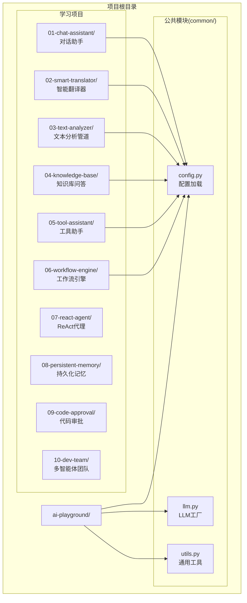
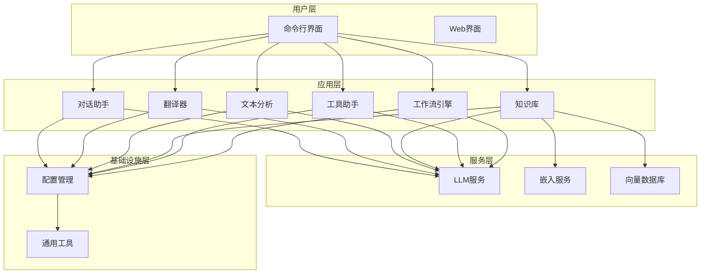
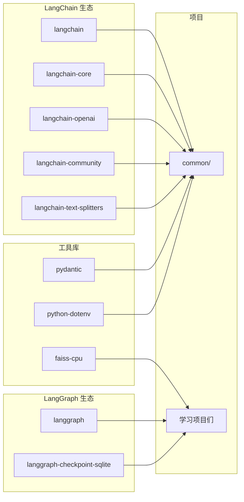

# 快速开始

<cite>
**本文引用的文件**
- [README.md](file://README.md)
- [pyproject.toml](file://pyproject.toml)
- [common/config.py](file://common/config.py)
- [common/llm.py](file://common/llm.py)
- [common/utils.py](file://common/utils.py)
- [01-chat-assistant/main.py](file://01-chat-assistant/main.py)
- [02-smart-translator/main.py](file://02-smart-translator/main.py)
- [03-text-analyzer/main.py](file://03-text-analyzer/main.py)
- [04-knowledge-base/main.py](file://04-knowledge-base/main.py)
- [05-tool-assistant/main.py](file://05-tool-assistant/main.py)
- [06-workflow-engine/main.py](file://06-workflow-engine/main.py)
</cite>

## 目录
1. [简介](#简介)
2. [项目结构](#项目结构)
3. [核心组件](#核心组件)
4. [架构概览](#架构概览)
5. [详细组件分析](#详细组件分析)
6. [依赖分析](#依赖分析)
7. [性能考虑](#性能考虑)
8. [故障排除指南](#故障排除指南)
9. [结论](#结论)
10. [附录](#附录)

## 简介
本指南面向首次接触 AI Playground 项目的开发者，提供从零开始的完整环境搭建流程。项目通过 10 个渐进式项目系统学习 LangChain 和 LangGraph 框架，涵盖 LLM 对话、翻译、文本分析、RAG、工具调用、工作流编排等核心能力。

## 项目结构
AI Playground 采用模块化设计，核心公共模块位于 common 目录，各学习项目独立存放：



**图表来源**
- [README.md:89-108](file://README.md#L89-L108)
- [common/config.py:1-77](file://common/config.py#L1-L77)

**章节来源**
- [README.md:89-108](file://README.md#L89-L108)

## 核心组件
项目的核心在于三个公共模块，它们为所有学习项目提供统一的基础能力：

### 配置管理模块 (config.py)
负责从 .env 文件读取环境变量，提供类型安全的配置访问。支持 LLM 和 Embedding 两种配置类型。

### LLM 工厂模块 (llm.py)
提供 ChatOpenAI 实例的统一创建接口，支持任意 OpenAI 兼容 API，包括本地 Ollama、DeepSeek、通义千问等。

### 通用工具模块 (utils.py)
提供跨项目复用的辅助功能，包括命令行输出美化和路径管理。

**章节来源**
- [common/config.py:1-77](file://common/config.py#L1-L77)
- [common/llm.py:1-59](file://common/llm.py#L1-L59)
- [common/utils.py:1-33](file://common/utils.py#L1-L33)

## 架构概览
项目采用分层架构设计，通过公共模块实现代码复用，各学习项目专注于特定技术栈：



**图表来源**
- [common/config.py:33-76](file://common/config.py#L33-L76)
- [common/llm.py:13-58](file://common/llm.py#L13-L58)

## 详细组件分析

### 环境准备与依赖安装

#### Windows 系统步骤
```bash
# 1. 克隆项目
git clone <repository-url>
cd ai-playground

# 2. 创建虚拟环境
python -m venv venv

# 3. 激活虚拟环境
venv\Scripts\activate

# 4. 安装依赖
pip install -e .

# 5. 验证安装
python -c "from common.llm import get_llm; print('安装成功')"
```

#### Unix/Linux/macOS 系统步骤
```bash
# 1. 克隆项目
git clone <repository-url>
cd ai-playground

# 2. 创建虚拟环境
python -m venv venv

# 3. 激活虚拟环境
source venv/bin/activate

# 4. 安装依赖
pip install -e .

# 5. 验证安装
python -c "from common.llm import get_llm; print('安装成功')"
```

**章节来源**
- [README.md:5-24](file://README.md#L5-L24)
- [pyproject.toml:1-29](file://pyproject.toml#L1-L29)

### 环境变量配置

#### 创建 .env 文件
```bash
# 复制示例配置文件
cp .env.example .env

# 编辑 .env 文件，填入你的 LLM 配置
```

#### 支持的 LLM 提供商配置

| 供应商 | LLM_BASE_URL | LLM_MODEL_NAME |
|--------|-------------|----------------|
| 本地 Ollama | `http://localhost:11434/v1` | `qwen2.5:7b` |
| DeepSeek | `https://api.deepseek.com/v1` | `deepseek-chat` |
| 通义千问 | `https://dashscope.aliyuncs.com/compatible-mode/v1` | `qwen-plus` |
| 智谱 GLM | `https://open.bigmodel.cn/api/paas/v4` | `glm-4` |
| OpenAI | `https://api.openai.com/v1` | `gpt-4o` |

**章节来源**
- [README.md:75-87](file://README.md#L75-L87)
- [common/config.py:42-56](file://common/config.py#L42-L56)

### 基本验证步骤

#### 验证 LLM 连通性
```bash
# 执行基本连通性测试
python -c "from common.llm import get_llm; print(get_llm().invoke('你好').content)"
```

#### 运行第一个示例项目
```bash
# 运行对话助手示例
python 01-chat-assistant/main.py

# 运行智能翻译器示例
python 02-smart-translator/main.py

# 运行文本分析示例
python 03-text-analyzer/main.py
```

**章节来源**
- [README.md:22-24](file://README.md#L22-L24)
- [01-chat-assistant/main.py:27-87](file://01-chat-assistant/main.py#L27-L87)

## 依赖分析

### 核心依赖关系
项目依赖 LangChain 和 LangGraph 生态系统，以及相关的工具库：



**图表来源**
- [pyproject.toml:7-21](file://pyproject.toml#L7-L21)

### 依赖版本要求
- Python >= 3.10
- LangChain >= 1.0.0
- LangGraph >= 1.0.0
- LangChain OpenAI >= 1.0.0

**章节来源**
- [pyproject.toml:4-5](file://pyproject.toml#L4-L5)
- [pyproject.toml:7-21](file://pyproject.toml#L7-L21)

## 性能考虑
- **模型选择建议**：本地小模型（7B）在工具调用和结构化输出时可能不稳定，建议使用 14B+ 模型或 API 级模型
- **内存管理**：合理设置 temperature 参数，平衡生成质量和稳定性
- **并发处理**：使用流式输出处理长文本，避免阻塞
- **缓存策略**：利用 LangGraph Checkpoint 实现状态持久化

## 故障排除指南

### 常见问题及解决方案

#### 1. 依赖安装失败
**问题**：pip install -e . 报错
**解决方案**：
- 确保 Python 版本满足 >= 3.10
- 检查网络连接，必要时使用国内镜像源
- 清理 pip 缓存：pip cache purge

#### 2. LLM 连接超时
**问题**：执行验证命令时报连接错误
**解决方案**：
- 检查 .env 文件中的 LLM_BASE_URL 是否正确
- 验证网络连通性
- 尝试不同的提供商配置

#### 3. 模型加载失败
**问题**：本地 Ollama 模型无法加载
**解决方案**：
- 确认 Ollama 服务已启动
- 检查模型名称是否正确
- 使用 ollama list 查看可用模型

#### 4. 虚拟环境激活问题
**问题**：Windows/Mac/Linux 激活虚拟环境失败
**解决方案**：
- 确认使用正确的激活命令
- 检查 Python 可执行文件路径
- 重新创建虚拟环境

**章节来源**
- [README.md:87-87](file://README.md#L87-L87)

## 结论
通过本快速开始指南，您应该已经成功搭建了 AI Playground 的开发环境，并完成了基本的连通性验证。建议按照 README.md 中的学习路径逐步深入各个项目，从基础的对话助手开始，逐步掌握 LangChain 和 LangGraph 的核心概念和高级特性。

## 附录

### 学习路径概览
项目分为三个阶段，总计约 28-33 小时的学习时间：

#### Phase 1: LangChain 基础 (12-16小时)
- P1: LLM 对话助手
- P2: 智能翻译器  
- P3: 文本分析管道
- P4: 知识库问答 (RAG)
- P5: 智能工具助手

#### Phase 2: LangGraph 基础 (6-8小时)
- P6: 文档审批工作流
- P7: ReAct 研究助手

#### Phase 3: LangGraph 高级 (10-13小时)
- P8: 持久化记忆助手
- P9: 代码审批系统 (HITL)
- P10: 多智能体开发团队

### 快速参考命令
```bash
# 环境准备
python -m venv venv
source venv/bin/activate  # Windows: venv\Scripts\activate
pip install -e .

# 配置环境变量
cp .env.example .env
# 编辑 .env 文件

# 基本验证
python -c "from common.llm import get_llm; print(get_llm().invoke('你好').content)"

# 运行示例
python 01-chat-assistant/main.py
python 02-smart-translator/main.py
python 03-text-analyzer/main.py
```