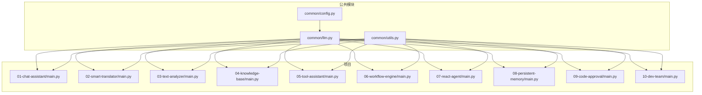
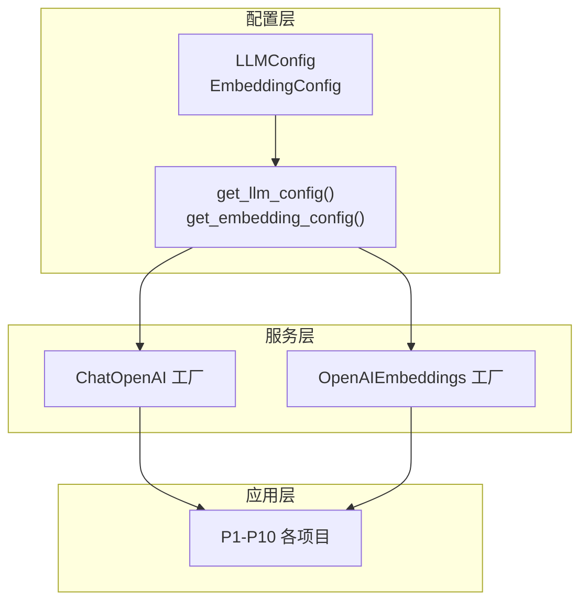
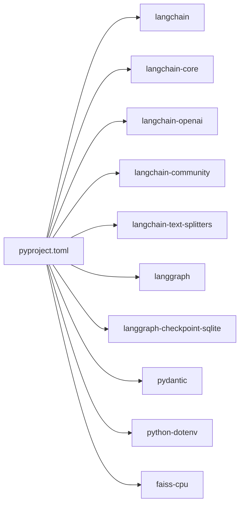

# 最佳实践与扩展指南

<cite>
**本文引用的文件**
- [README.md](file://README.md)
- [pyproject.toml](file://pyproject.toml)
- [common/config.py](file://common/config.py)
- [common/llm.py](file://common/llm.py)
- [common/utils.py](file://common/utils.py)
- [01-chat-assistant/main.py](file://01-chat-assistant/main.py)
- [02-smart-translator/main.py](file://02-smart-translator/main.py)
- [03-text-analyzer/main.py](file://03-text-analyzer/main.py)
- [04-knowledge-base/main.py](file://04-knowledge-base/main.py)
- [05-tool-assistant/main.py](file://05-tool-assistant/main.py)
- [06-workflow-engine/main.py](file://06-workflow-engine/main.py)
- [07-react-agent/main.py](file://07-react-agent/main.py)
- [08-persistent-memory/main.py](file://08-persistent-memory/main.py)
- [09-code-approval/main.py](file://09-code-approval/main.py)
- [10-dev-team/main.py](file://10-dev-team/main.py)
</cite>

## 目录
1. [简介](#简介)
2. [项目结构](#项目结构)
3. [核心组件](#核心组件)
4. [架构总览](#架构总览)
5. [详细组件分析](#详细组件分析)
6. [依赖分析](#依赖分析)
7. [性能考量](#性能考量)
8. [故障排查指南](#故障排查指南)
9. [结论](#结论)
10. [附录](#附录)

## 简介
本指南面向希望在 LangChain/LangGraph 生态中构建生产级应用的工程师，围绕本仓库的渐进式学习路径，系统总结高级主题与最佳实践，覆盖错误处理策略、性能优化技巧、安全考虑、扩展与定制方法，并提供调试、监控、部署与维护建议及常见问题实战案例。

## 项目结构
本仓库采用“项目化学习 + 公共模块复用”的组织方式：
- common 公共模块：统一配置加载、LLM 初始化工厂、通用工具
- 10 个渐进式项目：从基础对话到多智能体团队，层层递进
- 顶层 README 提供学习路径、配置说明与项目结构概览
- pyproject.toml 定义依赖与打包配置

图表来源
- [README.md:89-108](file://README.md#L89-L108)
- [pyproject.toml:1-29](file://pyproject.toml#L1-L29)
- [common/config.py:1-77](file://common/config.py#L1-L77)
- [common/llm.py:1-59](file://common/llm.py#L1-L59)
- [common/utils.py:1-33](file://common/utils.py#L1-L33)

章节来源
- [README.md:89-108](file://README.md#L89-L108)
- [pyproject.toml:1-29](file://pyproject.toml#L1-L29)

## 核心组件
- 配置加载模块：集中管理 LLM/Embedding 的 base_url、api_key、model_name，提供类型安全访问与默认值兜底
- LLM 初始化工厂：统一创建 ChatOpenAI/OpenAIEmbeddings 实例，支持自定义温度与扩展参数
- 通用工具：美化输出、跨项目导入路径注入，便于各项目复用

章节来源
- [common/config.py:17-77](file://common/config.py#L17-L77)
- [common/llm.py:13-59](file://common/llm.py#L13-L59)
- [common/utils.py:16-33](file://common/utils.py#L16-L33)

## 架构总览
整体架构遵循“公共模块 + 项目化实现”的分层设计：
- 低耦合：各项目仅依赖 common 模块，避免重复实现
- 可扩展：新增项目只需引入 common/llm 与 common/config，即可接入统一配置与 LLM 能力
- 可观测：多数项目提供 print_separator/print_step 与异常捕获，便于调试与监控

图表来源
- [common/config.py:33-77](file://common/config.py#L33-L77)
- [common/llm.py:13-59](file://common/llm.py#L13-L59)

## 详细组件分析

### 错误处理策略
- 统一捕获与提示：在交互式演示中对异常进行捕获并输出友好提示，避免程序崩溃
- 配置校验：缺失必要环境变量时抛出明确错误，指导用户补齐 .env
- 限次保护：工具调用循环设置最大迭代次数，防止死循环
- RAG 索引检查：在执行前校验向量索引是否存在，避免运行期报错

章节来源
- [02-smart-translator/main.py:156-158](file://02-smart-translator/main.py#L156-L158)
- [03-text-analyzer/main.py:220-222](file://03-text-analyzer/main.py#L220-L222)
- [05-tool-assistant/main.py:114](file://05-tool-assistant/main.py#L114)
- [04-knowledge-base/main.py:171-177](file://04-knowledge-base/main.py#L171-L177)

### 性能优化技巧
- 选择合适模型与温度：翻译/分析场景使用较低 temperature 提升稳定性；对话场景适度平衡创意与确定性
- LCEL 管道复用：将 prompt、LLM、parser 组合为可复用链，减少重复初始化开销
- RAG 管道优化：使用 RunnablePassthrough 透传输入，避免不必要的拷贝；按需格式化上下文
- 工具调用循环：在循环内尽早判定无工具调用分支，减少无效调用
- 多智能体流式输出：使用 stream_mode="updates" 实时消费，降低等待时间

章节来源
- [02-smart-translator/main.py:33](file://02-smart-translator/main.py#L33)
- [03-text-analyzer/main.py:123-129](file://03-text-analyzer/main.py#L123-L129)
- [04-knowledge-base/main.py:81-89](file://04-knowledge-base/main.py#L81-L89)
- [05-tool-assistant/main.py:74-114](file://05-tool-assistant/main.py#L74-L114)
- [10-dev-team/main.py:133-156](file://10-dev-team/main.py#L133-L156)

### 安全考虑
- 环境变量隔离：敏感信息（api_key/base_url/model_name）通过 .env 管理，避免硬编码
- 供应商兼容：通过 base_url 支持多家 OpenAI 兼容服务，便于切换与迁移
- 输入校验：交互式输入进行空值与退出指令处理，避免异常输入导致的逻辑错误

章节来源
- [README.md:75-87](file://README.md#L75-L87)
- [common/config.py:42-50](file://common/config.py#L42-L50)
- [01-chat-assistant/main.py:51-64](file://01-chat-assistant/main.py#L51-L64)

### 扩展与定制方法
- 新增项目：在 common/ 下新增模块，其他项目通过 from common.xxx import yyy 引入
- 自定义 LLM：通过 get_llm(...) 传入额外参数覆盖默认行为
- 自定义提示模板：在项目内定义 ChatPromptTemplate 并组合 LCEL 链
- 自定义工具：在工具模块中新增工具函数，通过 bind_tools 绑定到 LLM
- 自定义工作流：基于 StateGraph 添加节点与条件边，compile 后复用
- 自定义检查点：在图编译时传入 checkpointer，实现持久化与断点恢复

章节来源
- [common/utils.py:10-13](file://common/utils.py#L10-L13)
- [common/llm.py:32-40](file://common/llm.py#L32-L40)
- [05-tool-assistant/main.py:125](file://05-tool-assistant/main.py#L125)
- [06-workflow-engine/main.py:55-110](file://06-workflow-engine/main.py#L55-L110)
- [08-persistent-memory/main.py:148-149](file://08-persistent-memory/main.py#L148-L149)

### 调试技巧
- 输出美化：使用 print_separator/print_step 区分演示阶段与输出内容
- 交互式调试：在交互循环中逐步输入，观察中间结果
- 检查点状态：通过 get_state 查看当前检查点状态，定位异常位置
- 流式输出：使用 stream_mode="updates" 或 "messages" 观察执行过程与 token 流

章节来源
- [common/utils.py:16-33](file://common/utils.py#L16-L33)
- [08-persistent-memory/main.py:242-248](file://08-persistent-memory/main.py#L242-L248)
- [10-dev-team/main.py:133-156](file://10-dev-team/main.py#L133-L156)
- [10-dev-team/main.py:205-222](file://10-dev-team/main.py#L205-L222)

### 监控方案
- 日志与状态：在关键节点打印状态摘要（如 draft_count、review_score、iteration）
- 异常上报：捕获异常并记录堆栈，便于后续分析
- 指标采集：结合外部监控系统记录执行耗时、调用次数、错误率

章节来源
- [06-workflow-engine/main.py:180-191](file://06-workflow-engine/main.py#L180-L191)
- [09-code-approval/main.py:200-206](file://09-code-approval/main.py#L200-L206)
- [10-dev-team/main.py:139-156](file://10-dev-team/main.py#L139-L156)

### 部署策略
- 依赖管理：通过 pyproject.toml 统一声明依赖，使用 pip install -e . 安装
- 环境变量：在部署环境中配置 .env，确保 LLM/Embedding 端点与密钥正确
- 运行方式：每个项目提供独立入口脚本，可按需部署单个项目或组合运行

章节来源
- [README.md:5-24](file://README.md#L5-L24)
- [pyproject.toml:7-21](file://pyproject.toml#L7-L21)

### 维护建议
- 版本升级：关注 langchain/langgraph 版本变更，及时适配 API
- 配置演进：将常用参数抽象为配置项，避免散落于各项目
- 文档同步：保持 README 与实现一致，补充复杂场景说明

章节来源
- [pyproject.toml:1-29](file://pyproject.toml#L1-L29)
- [README.md:1-108](file://README.md#L1-L108)

## 依赖分析
- LangChain 生态：langchain、langchain-core、langchain-openai、langchain-community、langchain-text-splitters
- LangGraph：langgraph、langgraph-checkpoint-sqlite
- 工具库：pydantic、python-dotenv、faiss-cpu

图表来源
- [pyproject.toml:7-21](file://pyproject.toml#L7-L21)

章节来源
- [pyproject.toml:1-29](file://pyproject.toml#L1-L29)

## 性能考量
- 模型选择与温度：根据任务稳定性需求选择合适 temperature
- LCEL 复用：避免重复构造链，提升启动与执行效率
- RAG 上下文裁剪：仅传递必要片段，减少上下文长度
- 工具调用去冗余：在循环中尽早判断终止条件
- 流式输出：实时消费 token，降低首屏延迟

章节来源
- [02-smart-translator/main.py:33](file://02-smart-translator/main.py#L33)
- [03-text-analyzer/main.py:123-129](file://03-text-analyzer/main.py#L123-L129)
- [04-knowledge-base/main.py:81-89](file://04-knowledge-base/main.py#L81-L89)
- [05-tool-assistant/main.py:74-114](file://05-tool-assistant/main.py#L74-L114)
- [10-dev-team/main.py:133-156](file://10-dev-team/main.py#L133-L156)

## 故障排查指南
- 配置缺失：检查 .env 是否包含 LLM_BASE_URL/LLM_MODEL_NAME 等关键项
- RAG 索引：确认向量索引存在，否则先执行数据入库脚本
- 工具调用：确认工具已绑定且名称匹配，避免找不到工具导致的执行失败
- 会话隔离：使用不同的 thread_id 验证多会话隔离与持久化
- 交互异常：在交互循环中捕获异常并输出堆栈，定位具体环节

章节来源
- [common/config.py:46-50](file://common/config.py#L46-L50)
- [04-knowledge-base/main.py:171-177](file://04-knowledge-base/main.py#L171-L177)
- [05-tool-assistant/main.py:96-110](file://05-tool-assistant/main.py#L96-L110)
- [08-persistent-memory/main.py:165](file://08-persistent-memory/main.py#L165)
- [09-code-approval/main.py:200-206](file://09-code-approval/main.py#L200-L206)

## 结论
本指南基于仓库的实际实现，总结了从配置、链路、工作流到多智能体编排的最佳实践。通过统一的公共模块、清晰的错误处理、合理的性能优化与完善的调试监控手段，可在 LangChain/LangGraph 生态中高效构建可扩展、可观测、可维护的 LLM 应用。

## 附录

### 实战案例：常见开发难题与性能瓶颈
- 案例1：RAG 回答不可信
  - 现象：回答与上下文无关或编造信息
  - 处理：在提示中强调“仅基于上下文回答”，并在链路中显式传递 context 与 question
  - 参考实现路径：[04-knowledge-base/main.py:56-89](file://04-knowledge-base/main.py#L56-L89)
- 案例2：工具调用循环过深
  - 现象：LLM 陷入反复调用工具的死循环
  - 处理：设置最大迭代次数，增加终止条件判断
  - 参考实现路径：[05-tool-assistant/main.py:74-114](file://05-tool-assistant/main.py#L74-L114)
- 案例3：多轮对话历史过长导致上下文超限
  - 现象：响应变慢或截断
  - 处理：在对话节点中引入摘要节点，定期压缩历史
  - 参考实现路径：[08-persistent-memory/main.py:68-106](file://08-persistent-memory/main.py#L68-L106)
- 案例4：多智能体协作卡滞
  - 现象：Supervisor 无法推进到下一阶段
  - 处理：在 supervisor 节点中完善路由逻辑，确保返回有效 next_agent 或 END
  - 参考实现路径：[10-dev-team/main.py:77-90](file://10-dev-team/main.py#L77-L90)