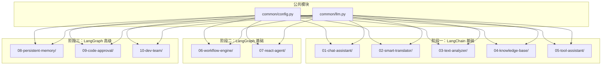
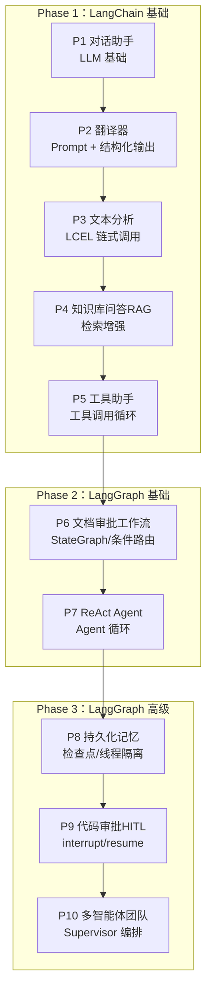
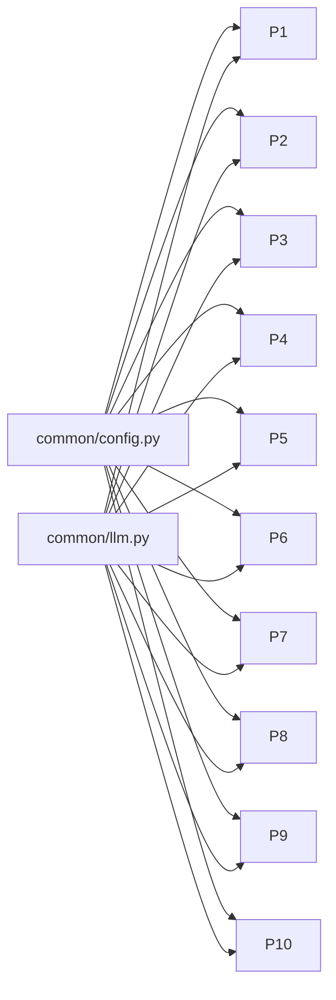

# 学习路径总览

<cite>
**本文引用的文件**
- [README.md](file://README.md)
- [01-chat-assistant/main.py](file://01-chat-assistant/main.py)
- [02-smart-translator/main.py](file://02-smart-translator/main.py)
- [02-smart-translator/models.py](file://02-smart-translator/models.py)
- [03-text-analyzer/main.py](file://03-text-analyzer/main.py)
- [03-text-analyzer/models.py](file://03-text-analyzer/models.py)
- [04-knowledge-base/main.py](file://04-knowledge-base/main.py)
- [04-knowledge-base/models.py](file://04-knowledge-base/models.py)
- [05-tool-assistant/main.py](file://05-tool-assistant/main.py)
- [06-workflow-engine/main.py](file://06-workflow-engine/main.py)
- [07-react-agent/main.py](file://07-react-agent/main.py)
- [08-persistent-memory/main.py](file://08-persistent-memory/main.py)
- [09-code-approval/main.py](file://09-code-approval/main.py)
- [common/config.py](file://common/config.py)
- [common/llm.py](file://common/llm.py)
</cite>

## 目录
1. [简介](#简介)
2. [项目结构](#项目结构)
3. [核心组件](#核心组件)
4. [架构总览](#架构总览)
5. [详细组件分析](#详细组件分析)
6. [依赖分析](#依赖分析)
7. [性能考虑](#性能考虑)
8. [故障排查指南](#故障排查指南)
9. [结论](#结论)
10. [附录](#附录)

## 简介
本学习路径围绕“LangChain + LangGraph 渐进式学习”展开，通过 10 个循序渐进的实战项目，从基础 LLM 调用到复杂多智能体编排，帮助不同背景的开发者建立系统化的 AI 应用开发能力。项目分为三个阶段：
- Phase 1：LangChain 基础（约 12–16 小时）——掌握 LLM、Prompt、LCEL、RAG、工具调用等核心能力
- Phase 2：LangGraph 基础（约 6–8 小时）——掌握 StateGraph、状态、条件路由与 Agent 循环
- Phase 3：LangGraph 高级（约 10–13 小时）——掌握检查点、线程隔离、人机在环（HITL）、多智能体编排

## 项目结构
仓库采用“按阶段分目录”的组织方式，每个项目独立且可单独运行；公共模块（common）在多个项目间复用，降低重复成本。

图表来源
- [README.md:89-108](file://README.md#L89-L108)
- [common/config.py:1-77](file://common/config.py#L1-L77)
- [common/llm.py:1-59](file://common/llm.py#L1-L59)

章节来源
- [README.md:89-108](file://README.md#L89-L108)

## 核心组件
- 公共配置与 LLM 工厂
  - 通过统一的配置加载与 LLM 工厂，屏蔽不同供应商差异，支持任意 OpenAI 兼容 API（本地 Ollama、云端大模型等）
  - 支持温度、流式输出等参数的灵活配置
- 项目内复用
  - 所有项目均通过 common 模块初始化 LLM、读取配置，保证一致性与可移植性

章节来源
- [common/config.py:33-77](file://common/config.py#L33-L77)
- [common/llm.py:13-59](file://common/llm.py#L13-L59)

## 架构总览
学习路径遵循“从简单到复杂、从单体到图编排”的渐进式设计。知识图谱展示了各项目之间的递进关系与技能迁移：

图表来源
- [README.md:53-73](file://README.md#L53-L73)

## 详细组件分析

### Phase 1：LangChain 基础（12–16 小时）

#### P1：LLM 对话助手（基础对话与消息历史）
- 学习要点
  - 从公共模块获取 LLM 实例
  - 构造 System/Human/AI 消息，维护消息历史实现多轮对话
- 关键流程
  - 初始化 LLM 与配置
  - 构造 SystemMessage 设定角色
  - 循环接收用户输入，追加 HumanMessage，调用 LLM，追加 AIMessage
- 技能要求
  - Python 基础、消息类型与调用接口
- 预计耗时：1–2 小时

章节来源
- [01-chat-assistant/main.py:27-83](file://01-chat-assistant/main.py#L27-L83)

#### P2：智能翻译器（Prompt 模板 + 结构化输出）
- 学习要点
  - ChatPromptTemplate 构建提示模板
  - with_structured_output 返回 Pydantic 对象
  - LCEL 管道组合与字符串解析器
- 关键流程
  - 构建模板 → 组装链 → 调用 with_structured_output → 输出结构化对象
- 数据模型
  - TranslationResult：包含源语言、目标语言、原文、译文、置信度、说明
- 技能要求
  - Prompt 工程、Pydantic v2、结构化输出
- 预计耗时：2–3 小时

章节来源
- [02-smart-translator/main.py:29-107](file://02-smart-translator/main.py#L29-L107)
- [02-smart-translator/models.py:11-46](file://02-smart-translator/models.py#L11-L46)

#### P3：文本分析管道（LCEL 链式调用）
- 学习要点
  - LCEL 管道操作符 | 组合链
  - RunnablePassthrough 透传与追加字段
  - with_structured_output + AnalysisReport
- 关键流程
  - 情感分析链 → 关键词链 → 摘要链 → 逐步 assign 汇总 → 结构化报告
- 数据模型
  - SentimentResult、KeywordResult、AnalysisReport
- 技能要求
  - 数据流编排、链式组合、结构化输出
- 预计耗时：2–3 小时

章节来源
- [03-text-analyzer/main.py:33-149](file://03-text-analyzer/main.py#L33-L149)
- [03-text-analyzer/models.py:10-30](file://03-text-analyzer/models.py#L10-L30)

#### P4：知识库问答（RAG）
- 学习要点
  - 使用 LCEL 构建 RAG 链
  - RunnablePassthrough 在 RAG 链中的作用
  - 带来源引用的问答
- 关键流程
  - retriever 检索 → format_docs 格式化 → prompt + llm + parser
- 数据模型
  - RAGAnswer：答案、来源、置信度
- 技能要求
  - 检索增强、上下文注入、来源追踪
- 预计耗时：3–4 小时

章节来源
- [04-knowledge-base/main.py:47-91](file://04-knowledge-base/main.py#L47-L91)
- [04-knowledge-base/models.py:8-13](file://04-knowledge-base/models.py#L8-L13)

#### P5：智能工具助手（工具调用循环）
- 学习要点
  - bind_tools 绑定工具
  - 手动实现工具调用循环：LLM → 工具 → ToolMessage → LLM
  - ToolMessage 回传工具执行结果
- 关键流程
  - 构建工具映射 → 初始化消息历史 → 循环检查 tool_calls → 执行工具 → 回传结果
- 技能要求
  - 工具定义、消息协议、循环控制
- 预计耗时：3–4 小时

章节来源
- [05-tool-assistant/main.py:42-115](file://05-tool-assistant/main.py#L42-L115)

### Phase 2：LangGraph 基础（6–8 小时）

#### P6：文档审批工作流（StateGraph）
- 学习要点
  - StateGraph 创建有向图
  - add_node/add_edge/add_conditional_edges
  - compile() 编译并执行图
- 关键流程
  - START → draft → review → 条件路由 → publish/revise/END
- 技能要求
  - 状态定义、条件路由、图编排
- 预计耗时：3–4 小时

章节来源
- [06-workflow-engine/main.py:44-111](file://06-workflow-engine/main.py#L44-L111)

#### P7：ReAct 研究助手（Agent 循环）
- 学习要点
  - create_react_agent 一行创建 Agent
  - 自动工具调用循环与消息历史管理
  - stream_mode 查看执行过程
- 关键流程
  - create_react_agent(llm, tools) → invoke → 查看消息历史与工具调用次数
- 技能要求
  - 预构建 Agent、消息流、流式执行
- 预计耗时：3–4 小时

章节来源
- [07-react-agent/main.py:35-91](file://07-react-agent/main.py#L35-L91)

### Phase 3：LangGraph 高级（10–13 小时）

#### P8：持久化记忆助手（检查点与会话）
- 学习要点
  - compile(checkpointer=...) 添加检查点
  - thread_id 实现多用户会话隔离
  - 对话摘要压缩长历史
  - get_state() 查看检查点状态
- 关键流程
  - chat → 条件判断 → summarize（必要时）→ END
- 技能要求
  - 检查点、线程隔离、状态管理
- 预计耗时：3–4 小时

章节来源
- [08-persistent-memory/main.py:39-152](file://08-persistent-memory/main.py#L39-L152)

#### P9：代码审批系统（HITL）
- 学习要点
  - interrupt() 暂停图执行等待人工审批
  - Command.resume() 恢复执行并注入人工决策
  - 交互式审批流程：生成 → 审查 → 执行/重新生成
- 关键流程
  - generate → await_review（interrupt）→ 用户决策 → resume → 批准/拒绝/修改
- 技能要求
  - 人机在环、命令注入、状态恢复
- 预计耗时：3–4 小时

章节来源
- [09-code-approval/main.py:35-159](file://09-code-approval/main.py#L35-L159)

#### P10：多智能体开发团队（Supervisor 编排）
- 学习要点
  - Supervisor 编排子智能体
  - 子图与流式输出
- 技能要求
  - 多智能体编排、消息协调、流式输出
- 预计耗时：4–5 小时

章节来源
- [README.md:49-51](file://README.md#L49-L51)

## 依赖分析

### 项目间依赖关系
- 公共依赖
  - 所有项目依赖 common/config.py 与 common/llm.py，确保 LLM 与嵌入配置一致
- 阶段内依赖
  - P1 → P2：消息历史与提示工程
  - P2 → P3：结构化输出与链式组合
  - P3 → P4：RAG 上下文注入
  - P4 → P5：工具调用前置知识
  - P5 → P6：循环控制 → 图编排
  - P6 → P7：Agent 循环
  - P7 → P8：状态持久化
  - P8 → P9：检查点 → 人机在环
  - P9 → P10：HITL → 多智能体编排

图表来源
- [common/config.py:33-77](file://common/config.py#L33-L77)
- [common/llm.py:13-59](file://common/llm.py#L13-L59)

章节来源
- [README.md:26-52](file://README.md#L26-L52)

## 性能考虑
- 模型选择
  - P5/P7/P10 建议使用 14B+ 或 API 级模型，以提升工具调用与结构化输出稳定性
- 流式输出
  - 通过公共模块启用 streaming，改善交互体验
- 检索效率
  - P4 中向量索引需预先构建，避免运行时等待
- 会话压缩
  - P8 中摘要节点在消息过多时自动压缩历史，降低上下文开销

## 故障排查指南
- 配置缺失
  - LLM/Embedding 配置需在 .env 中正确填写，否则会抛出明确错误提示
- 模型不可用
  - 确认 base_url、api_key、model_name 正确；可先运行验证脚本
- RAG 未构建索引
  - P4 需先运行数据入库脚本，再执行问答
- 工具调用失败
  - 检查工具映射与参数；确认 bind_tools 已正确绑定
- 会话状态异常
  - 使用 get_state() 查看当前检查点状态，定位问题

章节来源
- [common/config.py:42-56](file://common/config.py#L42-L56)
- [04-knowledge-base/main.py:171-176](file://04-knowledge-base/main.py#L171-L176)
- [08-persistent-memory/main.py:242-248](file://08-persistent-memory/main.py#L242-L248)

## 结论
该学习路径以“项目驱动 + 渐进式递进”为核心，将 LangChain 的提示工程、链式编排、RAG、工具调用与 LangGraph 的图编排、状态管理、人机在环、多智能体编排有机串联。通过统一的公共模块与清晰的知识图谱，学习者可在不同背景（零基础到有经验）下制定个性化学习计划，并逐步构建从单体应用到复杂智能体系统的工程能力。

## 附录

### 学习时间规划建议
- 初学者（零基础）
  - 建议每天 2–3 小时，分阶段推进：Phase 1（3–4 周）、Phase 2（1–2 周）、Phase 3（2–3 周）
  - 每个项目完成后进行复盘与小结
- 有经验开发者
  - 可跳过部分基础项目，集中攻克 P6–P10，结合自身业务场景定制练习
- 复杂度与模型建议
  - P5/P7/P10 建议使用更强模型或 API 级模型，确保稳定性和准确性

### 知识图谱可视化说明
- Phase 1：从 LLM 基础到 RAG 与工具调用，掌握 Runnable 协议与链式组合
- Phase 2：从工作流到 Agent 循环，理解条件路由与消息历史管理
- Phase 3：从检查点到人机在环再到多智能体编排，实现生产级可运维能力

章节来源
- [README.md:26-73](file://README.md#L26-L73)