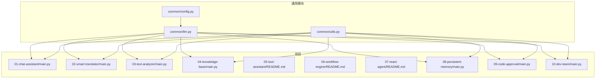
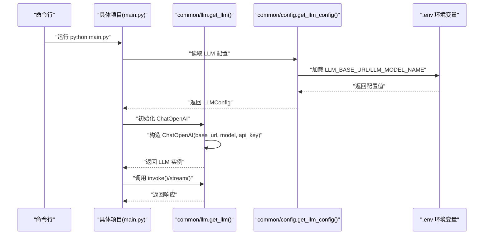
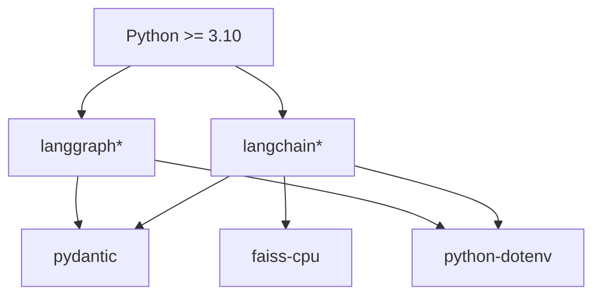

# 快速开始

<cite>
**本文引用的文件**
- [README.md](file://README.md)
- [pyproject.toml](file://pyproject.toml)
- [common/config.py](file://common/config.py)
- [common/llm.py](file://common/llm.py)
- [common/utils.py](file://common/utils.py)
- [01-chat-assistant/main.py](file://01-chat-assistant/main.py)
- [02-smart-translator/main.py](file://02-smart-translator/main.py)
- [03-text-analyzer/main.py](file://03-text-analyzer/main.py)
- [04-knowledge-base/main.py](file://04-knowledge-base/main.py)
- [05-tool-assistant/README.md](file://05-tool-assistant/README.md)
- [06-workflow-engine/README.md](file://06-workflow-engine/README.md)
- [07-react-agent/README.md](file://07-react-agent/README.md)
- [08-persistent-memory/main.py](file://08-persistent-memory/main.py)
- [09-code-approval/main.py](file://09-code-approval/main.py)
- [10-dev-team/main.py](file://10-dev-team/main.py)
</cite>

## 目录
1. [简介](#简介)
2. [项目结构](#项目结构)
3. [核心组件](#核心组件)
4. [架构概览](#架构概览)
5. [详细组件分析](#详细组件分析)
6. [依赖分析](#依赖分析)
7. [性能考虑](#性能考虑)
8. [故障排除指南](#故障排除指南)
9. [结论](#结论)
10. [附录](#附录)

## 简介
本指南面向希望快速上手 AI Playground 项目的开发者，提供从克隆仓库、创建虚拟环境、安装依赖、配置 .env 环境变量，到验证安装成功的完整流程。同时覆盖不同 LLM 提供商的配置示例，并给出常见问题排查建议，帮助新手高效入门，也为有经验的用户提供便捷的配置参考。

## 项目结构
AI Playground 采用“10 个渐进式项目 + 通用模块”的组织方式：
- 通用模块（所有项目复用）：common/config.py、common/llm.py、common/utils.py
- 项目目录：01-chat-assistant、02-smart-translator、03-text-analyzer、04-knowledge-base、05-tool-assistant、06-workflow-engine、07-react-agent、08-persistent-memory、09-code-approval、10-dev-team
- 顶层说明与依赖：README.md、pyproject.toml

图表来源
- [common/config.py:1-77](file://common/config.py#L1-L77)
- [common/llm.py:1-59](file://common/llm.py#L1-L59)
- [01-chat-assistant/main.py:1-87](file://01-chat-assistant/main.py#L1-L87)
- [02-smart-translator/main.py:1-179](file://02-smart-translator/main.py#L1-L179)
- [03-text-analyzer/main.py:1-240](file://03-text-analyzer/main.py#L1-L240)
- [04-knowledge-base/main.py:1-189](file://04-knowledge-base/main.py#L1-L189)
- [08-persistent-memory/main.py:1-308](file://08-persistent-memory/main.py#L1-L308)
- [09-code-approval/main.py:1-219](file://09-code-approval/main.py#L1-L219)
- [10-dev-team/main.py:1-284](file://10-dev-team/main.py#L1-L284)

章节来源
- [README.md:89-108](file://README.md#L89-L108)
- [pyproject.toml:1-29](file://pyproject.toml#L1-L29)

## 核心组件
- 配置加载：从 .env 读取 LLM/Embedding 配置，提供类型安全的访问接口
- LLM 初始化：统一创建 ChatOpenAI 实例，支持任意 OpenAI 兼容 API
- 通用工具：跨项目复用的输出美化与路径注入

章节来源
- [common/config.py:1-77](file://common/config.py#L1-L77)
- [common/llm.py:1-59](file://common/llm.py#L1-L59)
- [common/utils.py:1-33](file://common/utils.py#L1-L33)

## 架构概览
下面的序列图展示了从命令行到 LLM 调用的典型流程，体现“配置 → LLM 工厂 → 具体项目”的分层关系。

图表来源
- [common/llm.py:13-40](file://common/llm.py#L13-L40)
- [common/config.py:33-56](file://common/config.py#L33-L56)
- [01-chat-assistant/main.py:27-83](file://01-chat-assistant/main.py#L27-L83)

## 详细组件分析

### 环境搭建与依赖安装
- 克隆仓库并进入目录
- 创建虚拟环境并激活
- 安装项目与依赖（可编辑安装）

验证安装成功
- 通过统一的 LLM 工厂进行连通性测试

章节来源
- [README.md:5-24](file://README.md#L5-L24)
- [pyproject.toml:1-29](file://pyproject.toml#L1-L29)

### .env 配置文件设置
- 必填项：LLM_BASE_URL、LLM_MODEL_NAME
- 可选项：LLM_API_KEY、EMBEDDING_*（若不单独配置，将回退到 LLM_*）
- 常见提供商示例（来自项目说明）：
  - 本地 Ollama：base_url 指向本地 v1 端点，模型名示例
  - DeepSeek、通义千问、智谱 GLM、OpenAI：对应官方兼容端点与模型名

章节来源
- [README.md:75-87](file://README.md#L75-L87)
- [common/config.py:33-76](file://common/config.py#L33-L76)
- [common/llm.py:13-58](file://common/llm.py#L13-L58)

### 验证安装成功
- 使用统一的 LLM 工厂进行一次简单调用，验证连通性
- 若报错，优先检查 .env 是否正确复制与填写，以及网络可达性

章节来源
- [README.md:22-24](file://README.md#L22-L24)
- [common/llm.py:13-40](file://common/llm.py#L13-L40)

### 常见配置与运行示例
- P1：LLM 对话助手（基础对话）
- P2：智能翻译器（Prompt 模板 + 结构化输出）
- P3：文本分析管道（LCEL 链式调用）
- P4：知识库问答（RAG）——需先运行 ingest 构建向量索引
- P5：智能工具助手（工具定义与调用循环）
- P6：文档审批工作流（StateGraph）
- P7：ReAct 研究助手（Agent 循环）
- P8：持久化记忆助手（Checkpointing）
- P9：代码审批系统（Human-in-the-loop）
- P10：多智能体开发团队（Supervisor 编排）

章节来源
- [01-chat-assistant/main.py:1-87](file://01-chat-assistant/main.py#L1-L87)
- [02-smart-translator/main.py:1-179](file://02-smart-translator/main.py#L1-L179)
- [03-text-analyzer/main.py:1-240](file://03-text-analyzer/main.py#L1-L240)
- [04-knowledge-base/main.py:1-189](file://04-knowledge-base/main.py#L1-L189)
- [05-tool-assistant/README.md:1-48](file://05-tool-assistant/README.md#L1-L48)
- [06-workflow-engine/README.md:1-55](file://06-workflow-engine/README.md#L1-L55)
- [07-react-agent/README.md:1-55](file://07-react-agent/README.md#L1-L55)
- [08-persistent-memory/main.py:1-308](file://08-persistent-memory/main.py#L1-L308)
- [09-code-approval/main.py:1-219](file://09-code-approval/main.py#L1-L219)
- [10-dev-team/main.py:1-284](file://10-dev-team/main.py#L1-L284)

## 依赖分析
- 语言：Python >= 3.10
- 核心框架：LangChain（含 core/openai/community/text-splitters）、LangGraph（含 checkpoint-sqlite）
- 工具库：pydantic、python-dotenv、faiss-cpu
- 包管理：setuptools，仅导出 common 包

图表来源
- [pyproject.toml:7-21](file://pyproject.toml#L7-L21)

章节来源
- [pyproject.toml:1-29](file://pyproject.toml#L1-L29)

## 性能考虑
- 模型选择：P5/P7/P10 对工具调用与结构化输出稳定性要求较高，建议使用 14B+ 或 API 级模型
- 流式输出：在需要实时反馈的场景（如 P1、P3、P10），可结合流式模式提升交互体验
- 持久化与检查点：P8/P9/P10 引入检查点与会话隔离，注意合理设置 thread_id 与内存占用

章节来源
- [README.md:87-87](file://README.md#L87-L87)
- [03-text-analyzer/main.py:1-240](file://03-text-analyzer/main.py#L1-L240)
- [08-persistent-memory/main.py:1-308](file://08-persistent-memory/main.py#L1-L308)
- [09-code-approval/main.py:1-219](file://09-code-approval/main.py#L1-L219)
- [10-dev-team/main.py:1-284](file://10-dev-team/main.py#L1-L284)

## 故障排除指南
- 无法加载 .env：确认已复制 .env.example 为 .env，并位于项目根目录
- LLM 配置缺失：检查 LLM_BASE_URL、LLM_MODEL_NAME 是否填写；必要时补充 LLM_API_KEY
- RAG 报错“向量索引不存在”：先运行 ingest 构建索引
- 网络连通性问题：验证 base_url 可达性与代理设置
- 模型不支持结构化输出：尝试更高参数规模或切换至 API 级模型
- 多智能体/工作流卡住：检查 thread_id 与检查点状态，必要时清理状态或增加日志

章节来源
- [README.md:18-24](file://README.md#L18-L24)
- [common/config.py:46-50](file://common/config.py#L46-L50)
- [04-knowledge-base/main.py:171-176](file://04-knowledge-base/main.py#L171-L176)
- [10-dev-team/main.py:133-141](file://10-dev-team/main.py#L133-L141)

## 结论
通过本快速开始指南，您已掌握从环境准备、依赖安装、.env 配置到验证安装的全流程。建议按 P1→P2→P3→P4→P5 的顺序逐步深入，再过渡到 P6→P7→P8→P9→P10 的高级主题。遇到问题时，优先核对 .env 配置与网络连通性，并结合各项目 README 的运行说明进行定位。

## 附录

### A. 一键安装与验证清单
- 克隆仓库并进入目录
- 创建虚拟环境并激活
- 安装依赖（可编辑安装）
- 复制 .env.example 为 .env 并填写 LLM 配置
- 运行连通性测试命令
- 选择任一项目运行示例脚本

章节来源
- [README.md:5-24](file://README.md#L5-L24)

### B. .env 配置示例（按提供商）
- 本地 Ollama：base_url 指向本地 v1 端点，模型名示例
- DeepSeek：官方兼容端点与模型名
- 通义千问：官方兼容端点与模型名
- 智谱 GLM：官方兼容端点与模型名
- OpenAI：官方端点与模型名

章节来源
- [README.md:77-86](file://README.md#L77-L86)