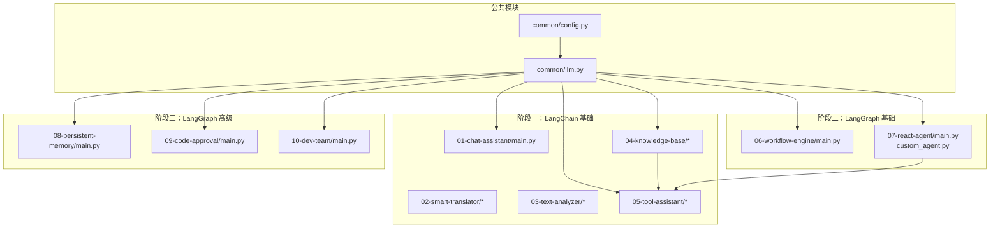
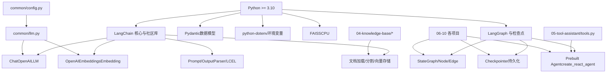
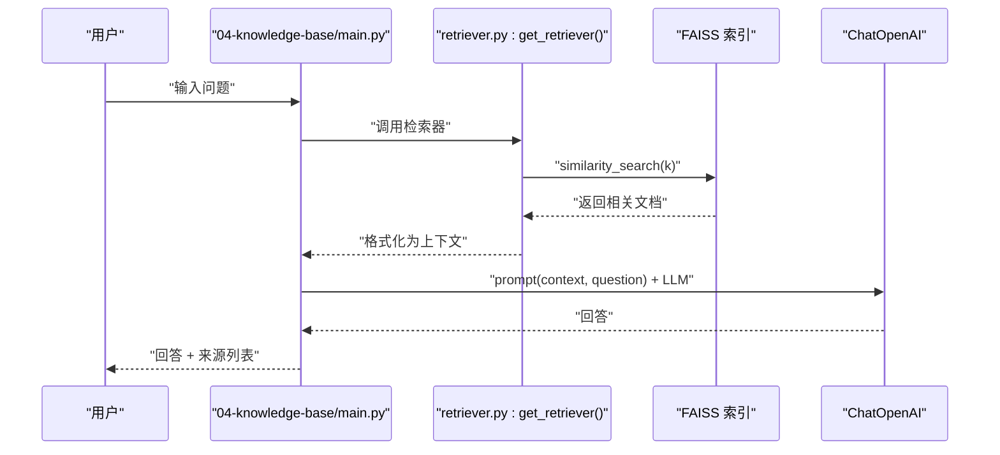
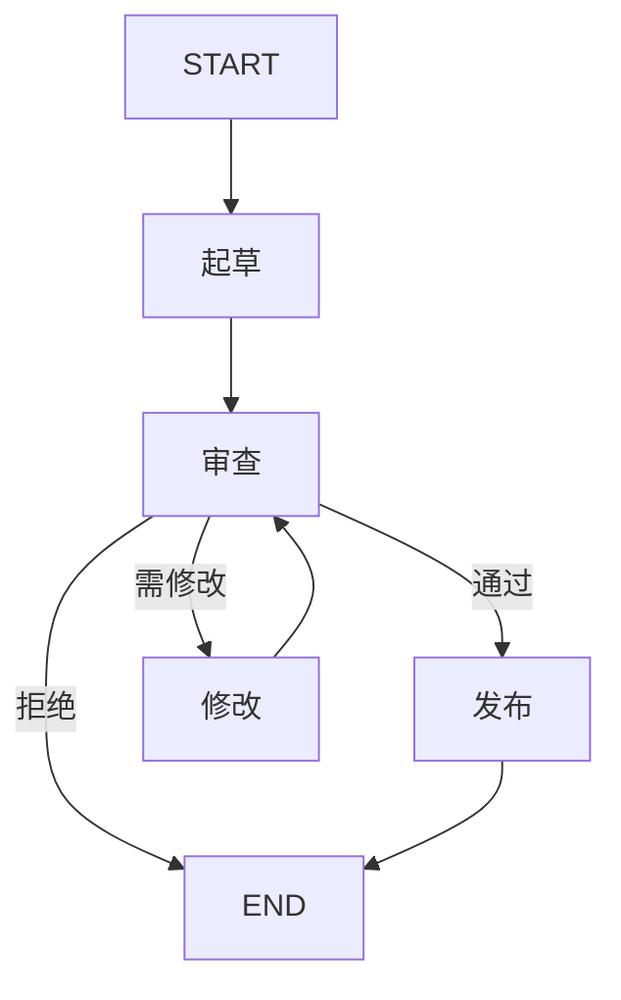
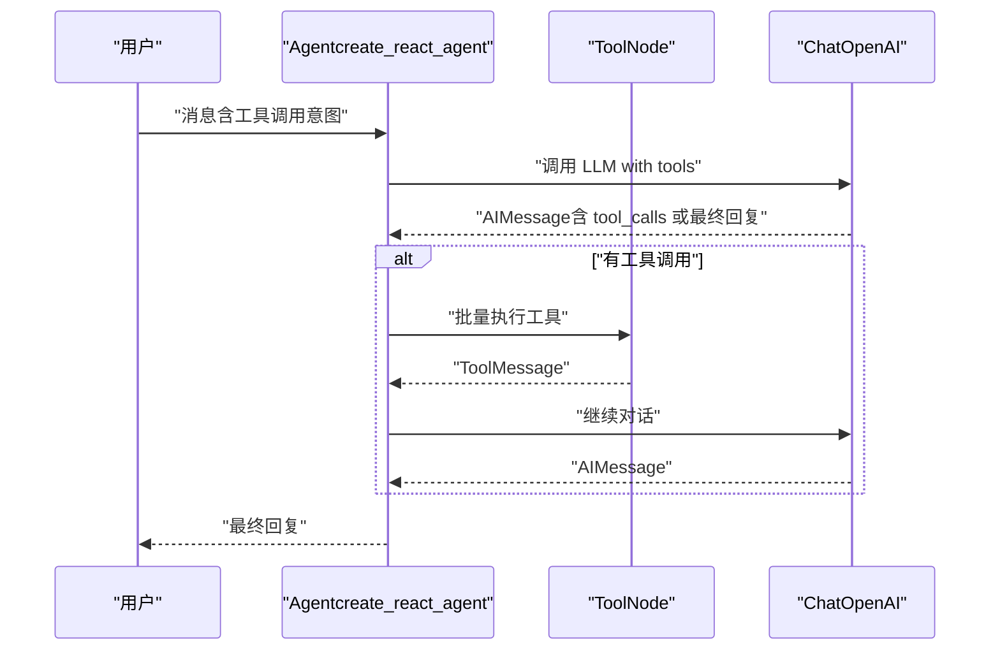
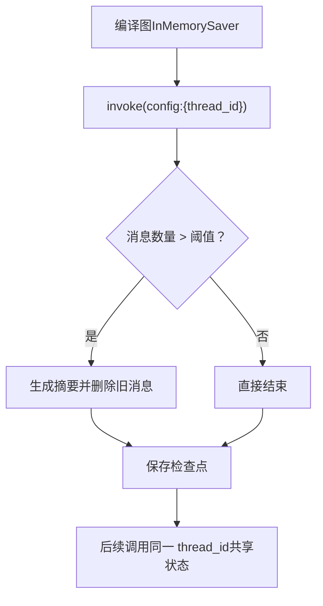
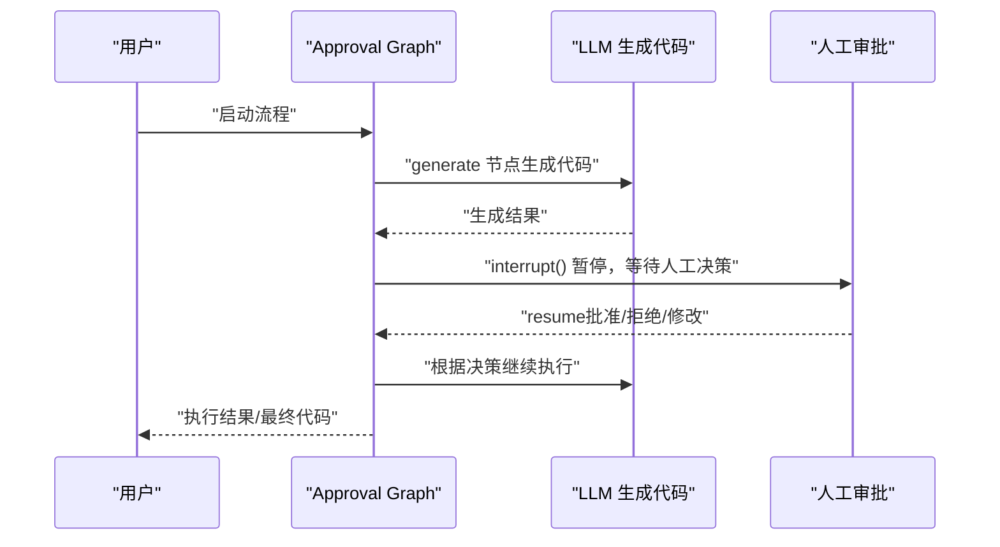
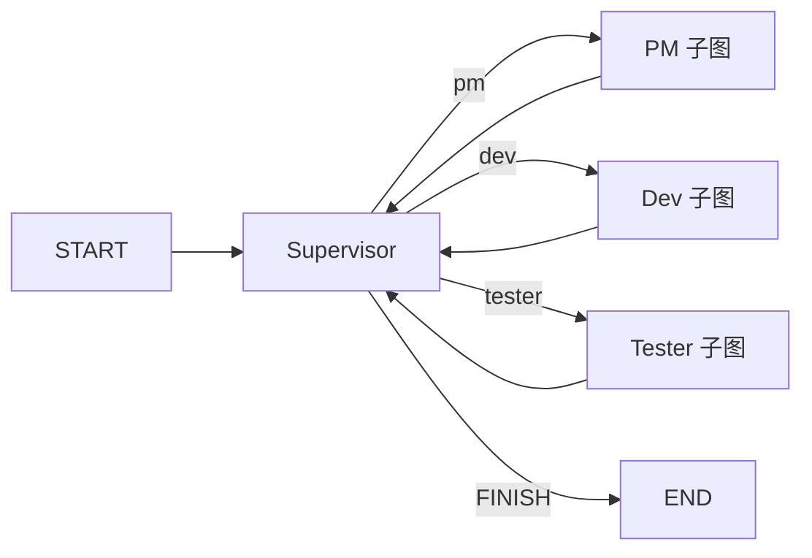
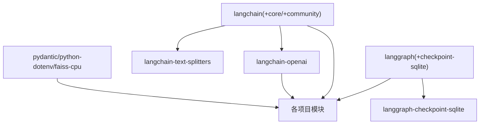

# 技术栈说明

<cite>
**本文引用的文件**
- [pyproject.toml](file://pyproject.toml)
- [README.md](file://README.md)
- [common/config.py](file://common/config.py)
- [common/llm.py](file://common/llm.py)
- [01-chat-assistant/main.py](file://01-chat-assistant/main.py)
- [04-knowledge-base/ingest.py](file://04-knowledge-base/ingest.py)
- [04-knowledge-base/retriever.py](file://04-knowledge-base/retriever.py)
- [04-knowledge-base/main.py](file://04-knowledge-base/main.py)
- [05-tool-assistant/tools.py](file://05-tool-assistant/tools.py)
- [06-workflow-engine/main.py](file://06-workflow-engine/main.py)
- [07-react-agent/main.py](file://07-react-agent/main.py)
- [07-react-agent/custom_agent.py](file://07-react-agent/custom_agent.py)
- [08-persistent-memory/main.py](file://08-persistent-memory/main.py)
- [09-code-approval/main.py](file://09-code-approval/main.py)
- [10-dev-team/main.py](file://10-dev-team/main.py)
</cite>

## 目录
1. [简介](#简介)
2. [项目结构](#项目结构)
3. [核心组件](#核心组件)
4. [架构总览](#架构总览)
5. [详细组件分析](#详细组件分析)
6. [依赖分析](#依赖分析)
7. [性能考虑](#性能考虑)
8. [故障排查指南](#故障排查指南)
9. [结论](#结论)
10. [附录](#附录)

## 简介
本项目为“AI Playground”渐进式学习路径，围绕 LangChain 与 LangGraph 的核心能力展开，通过 10 个循序渐进的实战项目，系统讲解 LLM 应用开发的关键范式：从基础对话、Prompt 与结构化输出，到 RAG 管道、工具调用、状态图工作流、ReAct Agent、持久化记忆、人机协同（HITL）、以及多智能体编排。  
项目对 Python 版本、开发工具与 IDE 配置、第三方服务（向量数据库、LLM 提供商）均有明确要求与最佳实践，便于初学者快速上手并深入理解技术选型。

## 项目结构
项目采用“按阶段分目录”的组织方式，每个项目独立可运行，同时通过 common 模块共享 LLM 初始化、配置与工具。  
- common：公共模块，封装 LLM 与 Embedding 的统一初始化、配置加载与通用工具。
- 01–10：10 个渐进式项目，分别覆盖不同技术要点。
- pyproject.toml：项目元数据与依赖声明。
- README.md：快速开始、学习路径、配置说明与项目结构概览。

图表来源
- [common/config.py:1-77](file://common/config.py#L1-L77)
- [common/llm.py:1-59](file://common/llm.py#L1-L59)
- [01-chat-assistant/main.py:1-87](file://01-chat-assistant/main.py#L1-L87)
- [04-knowledge-base/ingest.py:1-132](file://04-knowledge-base/ingest.py#L1-L132)
- [04-knowledge-base/retriever.py:1-40](file://04-knowledge-base/retriever.py#L1-L40)
- [04-knowledge-base/main.py:1-189](file://04-knowledge-base/main.py#L1-L189)
- [05-tool-assistant/tools.py:1-145](file://05-tool-assistant/tools.py#L1-L145)
- [06-workflow-engine/main.py:1-238](file://06-workflow-engine/main.py#L1-L238)
- [07-react-agent/main.py:1-173](file://07-react-agent/main.py#L1-L173)
- [07-react-agent/custom_agent.py:1-238](file://07-react-agent/custom_agent.py#L1-L238)
- [08-persistent-memory/main.py:1-308](file://08-persistent-memory/main.py#L1-L308)
- [09-code-approval/main.py:1-219](file://09-code-approval/main.py#L1-L219)
- [10-dev-team/main.py:1-284](file://10-dev-team/main.py#L1-L284)

章节来源
- [README.md:89-108](file://README.md#L89-L108)
- [pyproject.toml:1-29](file://pyproject.toml#L1-L29)

## 核心组件
- Python 版本与环境
  - Python >= 3.10（满足现代异步与类型特性）
  - 使用 venv 创建隔离环境，安装项目依赖（可编辑安装）
- LLM 与 Embedding 统一工厂
  - 通过 common/llm.py 提供 ChatOpenAI 与 OpenAIEmbeddings 的工厂方法，支持任意 OpenAI 兼容 API（本地 Ollama、云端厂商等）
  - 配置来自 .env，支持 LLM 与 Embedding 的 base_url、api_key、model_name
- 配置加载
  - common/config.py 从 .env 读取并校验必要配置，提供类型安全的数据类
- 工具与检索
  - 05-tool-assistant/tools.py 定义工具（天气、计算、知识库检索、当前时间），并导出 all_tools
  - 04-knowledge-base 提供文档摄入（Ingest）、向量存储（FAISS）与检索器（retriever）

章节来源
- [README.md:5-24](file://README.md#L5-L24)
- [pyproject.toml:5](file://pyproject.toml#L5)
- [common/llm.py:13-59](file://common/llm.py#L13-L59)
- [common/config.py:33-76](file://common/config.py#L33-L76)
- [05-tool-assistant/tools.py:30-125](file://05-tool-assistant/tools.py#L30-L125)
- [04-knowledge-base/ingest.py:31-112](file://04-knowledge-base/ingest.py#L31-L112)
- [04-knowledge-base/retriever.py:26-40](file://04-knowledge-base/retriever.py#L26-L40)

## 架构总览
整体技术栈围绕 LangChain 与 LangGraph 展开，结合 Pydantic、FAISS、dotenv 等工具库，形成从 LLM 调用、RAG 管道、工具调用、状态图工作流到多智能体编排的完整学习闭环。

图表来源
- [pyproject.toml:7-21](file://pyproject.toml#L7-L21)
- [common/llm.py:8-58](file://common/llm.py#L8-L58)
- [common/config.py:11-76](file://common/config.py#L11-L76)
- [04-knowledge-base/ingest.py:21-23](file://04-knowledge-base/ingest.py#L21-L23)
- [05-tool-assistant/tools.py:16-125](file://05-tool-assistant/tools.py#L16-L125)
- [06-workflow-engine/main.py:28](file://06-workflow-engine/main.py#L28)
- [07-react-agent/main.py:30](file://07-react-agent/main.py#L30)
- [08-persistent-memory/main.py:30](file://08-persistent-memory/main.py#L30)
- [09-code-approval/main.py:30](file://09-code-approval/main.py#L30)
- [10-dev-team/main.py:34](file://10-dev-team/main.py#L34)

## 详细组件分析

### LangChain 与 LangGraph 版本与职责
- LangChain 核心与社区库
  - langchain、langchain-core、langchain-community：提供 LLM、Prompt、OutputParser、LCEL、文档加载/分割/向量存储等基础能力
  - langchain-openai：提供 ChatOpenAI 与 OpenAIEmbeddings，适配 OpenAI 兼容 API
  - langchain-text-splitters：文本分割器（如 RecursiveCharacterTextSplitter）
- LangGraph
  - langgraph：StateGraph、节点与边、条件路由、编译执行
  - langgraph-checkpoint-sqlite：SQLite 检查点（项目中使用 InMemorySaver，此处为可选依赖）

章节来源
- [pyproject.toml:9-16](file://pyproject.toml#L9-L16)
- [common/llm.py:8](file://common/llm.py#L8)
- [06-workflow-engine/main.py:28](file://06-workflow-engine/main.py#L28)
- [07-react-agent/main.py:30](file://07-react-agent/main.py#L30)
- [08-persistent-memory/main.py:30](file://08-persistent-memory/main.py#L30)
- [09-code-approval/main.py:30](file://09-code-approval/main.py#L30)
- [10-dev-team/main.py:34](file://10-dev-team/main.py#L34)

### Python 版本与开发工具
- Python 版本：要求 >= 3.10，满足类型注解、f-string、异常处理等现代特性
- 开发工具与 IDE 建议
  - 推荐使用 VS Code 或 PyCharm，启用 Python 解释器（venv）与 Pylance/Type Checking
  - 安装 Python 扩展，启用断点调试、单元测试与格式化
  - 使用 .env 管理密钥与模型配置，避免硬编码
- 依赖安装
  - 建议使用 pip install -e . 进行可编辑安装，便于本地调试与热更新

章节来源
- [pyproject.toml:5](file://pyproject.toml#L5)
- [README.md:5-24](file://README.md#L5-L24)

### 第三方服务集成说明
- LLM 提供商与兼容性
  - 通过 ChatOpenAI 的 base_url 与 api_key，支持本地 Ollama、DeepSeek、通义千问、智谱 GLM、OpenAI 等 OpenAI 兼容 API
  - README 提供常见提供商的 base_url 与模型名示例
- Embedding 与向量数据库
  - 使用 OpenAIEmbeddings 生成向量，FAISS 作为本地向量存储（CPU 版本）
  - Ingest 流程：加载文档 → 文本分割 → 生成 Embedding → 保存 FAISS 索引
  - 检索流程：从 FAISS 加载索引 → as_retriever → similarity_search/自定义检索策略

章节来源
- [README.md:77-87](file://README.md#L77-L87)
- [common/llm.py:53-58](file://common/llm.py#L53-L58)
- [04-knowledge-base/ingest.py:89-112](file://04-knowledge-base/ingest.py#L89-L112)
- [04-knowledge-base/retriever.py:35-40](file://04-knowledge-base/retriever.py#L35-L40)

### 技术选型背景与替代方案对比
- LangChain vs LlamaIndex/llama.cpp
  - 选型背景：LangChain 生态成熟、文档丰富、与 OpenAI 兼容良好；对于本项目场景（RAG、工具调用、Agent）覆盖充分
  - 替代方案：LlamaIndex 更专注 RAG；llama.cpp 适合纯本地推理，但生态与工具链不如 LangChain 成熟
- LangGraph vs Ray/Dask/自研调度
  - 选型背景：LangGraph 提供 StateGraph、条件路由、检查点与流式执行，天然适合复杂工作流与多智能体
  - 替代方案：Ray/Dask 更偏向分布式计算；自研调度需重复造轮子，维护成本高
- FAISS vs Chroma/Milvus/Pinecone
  - 选型背景：FAISS CPU 版本易部署、适合本地与小规模数据；本项目以 FAISS 作为入门首选
  - 替代方案：Chroma 轻量易用；Milvus/Pinecone 适合大规模生产环境，但需要额外运维

章节来源
- [04-knowledge-base/ingest.py:92-112](file://04-knowledge-base/ingest.py#L92-L112)
- [04-knowledge-base/retriever.py:35-40](file://04-knowledge-base/retriever.py#L35-L40)
- [04-knowledge-base/data/sample.txt:74-85](file://04-knowledge-base/data/sample.txt#L74-L85)

### 项目内关键流程与数据流

#### RAG 主流程（P4）

图表来源
- [04-knowledge-base/main.py:47-91](file://04-knowledge-base/main.py#L47-L91)
- [04-knowledge-base/retriever.py:26-40](file://04-knowledge-base/retriever.py#L26-L40)
- [04-knowledge-base/ingest.py:89-112](file://04-knowledge-base/ingest.py#L89-L112)

#### 工作流引擎（P6：StateGraph）

图表来源
- [06-workflow-engine/main.py:44-111](file://06-workflow-engine/main.py#L44-L111)

#### ReAct Agent（P7：create_react_agent 与手动构建）

图表来源
- [07-react-agent/main.py:51-68](file://07-react-agent/main.py#L51-L68)
- [07-react-agent/custom_agent.py:54-124](file://07-react-agent/custom_agent.py#L54-L124)

#### 持久化记忆（P8：Checkpointer + thread_id）

图表来源
- [08-persistent-memory/main.py:148-151](file://08-persistent-memory/main.py#L148-L151)
- [08-persistent-memory/main.py:108-124](file://08-persistent-memory/main.py#L108-L124)

#### 代码审批（P9：HITL）

图表来源
- [09-code-approval/main.py:46-158](file://09-code-approval/main.py#L46-L158)

#### 多智能体团队（P10：Supervisor 编排）

图表来源
- [10-dev-team/main.py:56-106](file://10-dev-team/main.py#L56-L106)

## 依赖分析
- LangChain 生态
  - langchain、langchain-core：框架核心
  - langchain-openai：LLM 与 Embedding
  - langchain-community：文档加载、向量存储（FAISS）
  - langchain-text-splitters：文本分割
- LangGraph 生态
  - langgraph：StateGraph、节点与边、编译执行
  - langgraph-checkpoint-sqlite：可选 SQLite 检查点（本项目使用 InMemorySaver）
- 工具库
  - pydantic：数据模型与类型安全
  - python-dotenv：环境变量加载
  - faiss-cpu：本地向量存储

图表来源
- [pyproject.toml:7-21](file://pyproject.toml#L7-L21)

章节来源
- [pyproject.toml:7-21](file://pyproject.toml#L7-L21)

## 性能考虑
- LLM 调用
  - 使用 ChatOpenAI 的 streaming=True，提升交互体验；在工具调用与结构化输出场景建议使用更高参数稳定性模型（如 14B+ 或 API 级模型）
- 向量检索
  - FAISS CPU 版本适合本地与小规模数据；大规模场景建议迁移到 Chroma/Milvus/Pinecone
  - 文本分割参数（chunk_size、chunk_overlap）影响召回质量与上下文连续性，需结合业务权衡
- 工作流与 Agent
  - StateGraph 的条件路由与循环应避免过深嵌套；合理使用检查点与流式执行，降低内存占用
- 多智能体
  - Supervisor 编排时控制子图数量与并发；使用流式输出观察执行进度，及时中断异常分支

## 故障排查指南
- 环境变量缺失
  - 现象：启动时报错提示缺少 LLM 配置
  - 处理：复制 .env.example 为 .env，并填写 LLM_BASE_URL 与 LLM_MODEL_NAME
- 向量索引不存在
  - 现象：运行 P4 问答报错提示未生成索引
  - 处理：先运行 ingest.py 生成向量索引，再运行 main.py
- 工具不可用
  - 现象：知识库工具不可用或报错
  - 处理：确认 P4 已完成 ingest；检查 tools.py 中知识库检索器导入路径
- 持久化与会话
  - 现象：不同 thread_id 会话互相影响或无法恢复
  - 处理：确保每次调用携带正确的 configurable.thread_id；检查 InMemorySaver 的使用
- 人工审批（HITL）
  - 现象：流程在 await_review 处卡住
  - 处理：正确使用 Command.resume 注入决策；检查检查点状态与 next 节点

章节来源
- [README.md:18-24](file://README.md#L18-L24)
- [04-knowledge-base/main.py:171-176](file://04-knowledge-base/main.py#L171-L176)
- [05-tool-assistant/tools.py:93-94](file://05-tool-assistant/tools.py#L93-L94)
- [08-persistent-memory/main.py:165](file://08-persistent-memory/main.py#L165)
- [09-code-approval/main.py:82-88](file://09-code-approval/main.py#L82-L88)

## 结论
本项目以 LangChain 与 LangGraph 为核心，结合 FAISS、Pydantic、dotenv 等工具库，构建了从基础对话到多智能体编排的完整学习路径。通过统一的 LLM/Embedding 工厂与配置模块，开发者能够快速切换不同 LLM 提供商与向量数据库；通过渐进式项目，逐步掌握 RAG、工具调用、状态图工作流、持久化记忆与人机协同等关键技术。建议在生产环境中根据数据规模与性能需求，择优迁移至 Chroma/Milvus/Pinecone 与更高参数稳定性的模型。

## 附录
- 快速开始命令
  - 克隆 → 创建 venv → pip install -e . → cp .env.example .env → 配置 LLM 与模型 → 验证连通性
- 学习路径概览
  - Phase 1：LangChain 基础（对话、Prompt、LCEL、RAG、工具调用）
  - Phase 2：LangGraph 基础（StateGraph、条件路由）
  - Phase 3：LangGraph 高级（持久化、HITL、多智能体）

章节来源
- [README.md:5-24](file://README.md#L5-L24)
- [README.md:28-73](file://README.md#L28-L73)