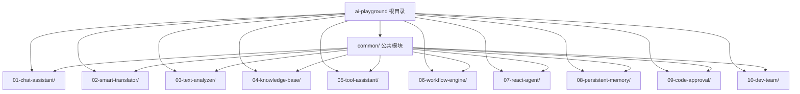
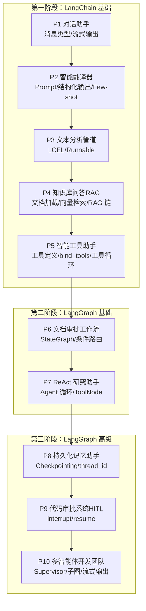
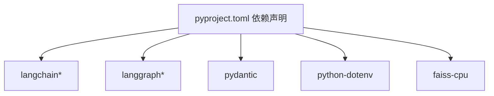

# 项目概述

<cite>
**本文引用的文件**
- [README.md](file://README.md)
- [pyproject.toml](file://pyproject.toml)
- [common/config.py](file://common/config.py)
- [common/llm.py](file://common/llm.py)
- [common/utils.py](file://common/utils.py)
- [01-chat-assistant/README.md](file://01-chat-assistant/README.md)
- [02-smart-translator/README.md](file://02-smart-translator/README.md)
- [03-text-analyzer/README.md](file://03-text-analyzer/README.md)
- [04-knowledge-base/README.md](file://04-knowledge-base/README.md)
- [05-tool-assistant/README.md](file://05-tool-assistant/README.md)
- [06-workflow-engine/README.md](file://06-workflow-engine/README.md)
- [07-react-agent/README.md](file://07-react-agent/README.md)
- [08-persistent-memory/README.md](file://08-persistent-memory/README.md)
- [09-code-approval/README.md](file://09-code-approval/README.md)
- [10-dev-team/README.md](file://10-dev-team/README.md)
</cite>

## 目录
1. [简介](#简介)
2. [项目结构](#项目结构)
3. [核心组件](#核心组件)
4. [架构总览](#架构总览)
5. [详细组件分析](#详细组件分析)
6. [依赖分析](#依赖分析)
7. [性能考虑](#性能考虑)
8. [故障排查指南](#故障排查指南)
9. [结论](#结论)
10. [附录](#附录)

## 简介
AI Playground 是一个基于 LangChain 与 LangGraph 的渐进式学习平台，通过 10 个递进式项目，从零开始系统掌握大模型应用开发的关键能力。项目强调“先 LangChain 后 LangGraph”的学习路径，帮助初学者建立扎实的理论与实践基础，并为有经验的开发者提供快速参考与最佳实践。

- 学习目标：掌握 LLM 输入输出、Prompt 模板、结构化输出、LCEL 链式调用、RAG、工具调用、StateGraph、Agent 循环、Checkpointing、HITL、多智能体编排等核心主题。
- 时间规划：建议总时长约 30-40 小时，分为三个阶段，每阶段按项目预计耗时安排。
- 技术栈：Python 3.10+，LangChain 1.x、LangGraph 1.x、OpenAI 兼容 API（含本地 Ollama、DeepSeek、通义千问、智谱 GLM、OpenAI 等）。

**章节来源**
- [README.md:1-108](file://README.md#L1-L108)

## 项目结构
项目采用“公共模块 + 10 个渐进式项目”的组织方式，公共模块在 common 目录下，所有项目共享 LLM 初始化、配置与通用工具。

**图表来源**
- [README.md:89-108](file://README.md#L89-L108)

**章节来源**
- [README.md:89-108](file://README.md#L89-L108)

## 核心组件
- 配置模块（common/config.py）：统一从 .env 读取 LLM 与 Embedding 的 base_url、api_key、model_name，提供类型安全的配置对象与默认值。
- LLM 工厂（common/llm.py）：封装 ChatOpenAI 与 OpenAIEmbeddings 的初始化，支持自定义 base_url 与模型名，提供流式输出能力。
- 通用工具（common/utils.py）：负责项目根路径注入 sys.path，便于子项目导入 common；提供命令行输出美化工具。

这些组件贯穿所有项目，确保配置一致性与可移植性。

**章节来源**
- [common/config.py:1-77](file://common/config.py#L1-L77)
- [common/llm.py:1-59](file://common/llm.py#L1-L59)
- [common/utils.py:1-33](file://common/utils.py#L1-L33)

## 架构总览
学习路径分为三个阶段，逐步从 LangChain 的核心概念过渡到 LangGraph 的状态图与多智能体编排。

**图表来源**
- [README.md:26-73](file://README.md#L26-L73)

**章节来源**
- [README.md:26-73](file://README.md#L26-L73)

## 详细组件分析

### P1：LLM 对话助手（LangChain 基础）
- 学习要点：消息类型（System/Human/AI）、一次性回复与流式输出、多轮对话上下文维护。
- 关联项目：为 P2 引入 Prompt 模板与结构化输出打下基础。
- 使用场景：基础聊天机器人、多轮对话系统。

**章节来源**
- [01-chat-assistant/README.md:1-37](file://01-chat-assistant/README.md#L1-L37)

### P2：智能翻译器（Prompt 与结构化输出）
- 学习要点：PromptTemplate/ChatPromptTemplate、Few-shot、with_structured_output、LCEL 管道。
- 关联项目：为 P3 的 LCEL 高阶用法与 P4 的 RAG 链做准备。
- 使用场景：结构化数据抽取、规范化输出。

**章节来源**
- [02-smart-translator/README.md:1-37](file://02-smart-translator/README.md#L1-L37)

### P3：文本分析管道（LCEL 与 Runnable）
- 学习要点：RunnableSequence、RunnablePassthrough、RunnableParallel、itemgetter。
- 关联项目：P4 的 RAG 链直接复用 LCEL 思想。
- 使用场景：多维度文本分析、并行特征提取。

**章节来源**
- [03-text-analyzer/README.md:1-48](file://03-text-analyzer/README.md#L1-L48)

### P4：知识库问答（RAG）
- 学习要点：Document Loaders、Text Splitters、Embeddings、Vector Store（FAISS）、Retriever、RAG 链。
- 关联项目：P5 将检索器作为工具被 Agent 调用。
- 使用场景：企业知识问答、文档检索增强。

**章节来源**
- [04-knowledge-base/README.md:1-52](file://04-knowledge-base/README.md#L1-L52)

### P5：智能工具助手（工具调用循环）
- 学习要点：@tool 装饰器、bind_tools、tool_calls、ToolMessage、手动工具循环。
- 关联项目：P6 用 StateGraph 优雅地实现同样的循环。
- 使用场景：外部查询、计算、知识库检索。

**章节来源**
- [05-tool-assistant/README.md:1-48](file://05-tool-assistant/README.md#L1-L48)

### P6：文档审批工作流（StateGraph 基础）
- 学习要点：StateGraph、Node、Edge、条件路由 add_conditional_edges。
- 关联项目：P7 的 ReAct Agent 是带工具调用的循环图。
- 使用场景：业务流程自动化、审批与修订。

**章节来源**
- [06-workflow-engine/README.md:1-55](file://06-workflow-engine/README.md#L1-L55)

### P7：ReAct 研究助手（Agent 循环）
- 学习要点：create_react_agent、ToolNode、条件边实现循环、手动构建 Agent。
- 关联项目：P8 引入 Checkpointing，实现跨会话记忆。
- 使用场景：研究助理、多轮工具调用。

**章节来源**
- [07-react-agent/README.md:1-55](file://07-react-agent/README.md#L1-L55)

### P8：持久化记忆助手（Checkpointing）
- 学习要点：InMemorySaver/SqliteSaver、thread_id 会话隔离、断点恢复、对话摘要压缩。
- 关联项目：P9 的 interrupt/resume 依赖 Checkpointing。
- 使用场景：长对话、跨会话记忆。

**章节来源**
- [08-persistent-memory/README.md:1-41](file://08-persistent-memory/README.md#L1-L41)

### P9：代码审批系统（HITL）
- 学习要点：interrupt/resume、人工介入、条件路由处理人工决策。
- 关联项目：P10 的多智能体编排中可嵌入 HITL 流程。
- 使用场景：高风险决策、合规审核。

**章节来源**
- [09-code-approval/README.md:1-54](file://09-code-approval/README.md#L1-L54)

### P10：多智能体开发团队（Supervisor 编排）
- 学习要点：Supervisor 路由、子图嵌套、多智能体协作、流式输出。
- 知识整合：融合 P2-P9 的全部知识点，形成完整工程化方案。
- 使用场景：团队协作、产品开发流程自动化。

**章节来源**
- [10-dev-team/README.md:1-69](file://10-dev-team/README.md#L1-L69)

## 依赖分析
- 语言与包管理：Python 3.10+，使用 setuptools 构建，安装为可编辑模式以便本地开发。
- 核心依赖：LangChain（含 core、openai、community、text-splitters）、LangGraph（含 checkpoint-sqlite）、Pydantic、python-dotenv、faiss-cpu。
- 配置与运行：通过 .env 注入 LLM 与 Embedding 的 base_url、api_key、model_name；支持多种 OpenAI 兼容服务。

**图表来源**
- [pyproject.toml:1-29](file://pyproject.toml#L1-L29)

**章节来源**
- [pyproject.toml:1-29](file://pyproject.toml#L1-L29)

## 性能考虑
- 模型选择：P5/P7/P10 建议使用 14B+ 或 API 级模型，以提升工具调用与结构化输出的稳定性。
- 向量检索：FAISS 向量库的性能与分片策略、嵌入维度密切相关，需结合数据规模调优。
- 流式输出：在长对话与复杂链路中启用流式输出，改善用户体验并便于调试。
- 会话管理：使用 thread_id 隔离会话，避免状态污染；合理设置 Checkpointing 以平衡性能与可靠性。

[本节为通用指导，无需特定文件引用]

## 故障排查指南
- 环境变量缺失：若 .env 未正确配置 LLM_BASE_URL/LLM_MODEL_NAME，将触发明确错误提示，请参考 .env.example 填写。
- LLM 连通性验证：可通过内置验证命令快速确认 LLM 可用性。
- 依赖安装：使用可编辑安装模式确保 common 模块在子项目中可导入。
- 输出美化：利用 utils.print_separator/print_step 提升命令行交互体验。

**章节来源**
- [README.md:18-24](file://README.md#L18-L24)
- [common/config.py:46-50](file://common/config.py#L46-L50)
- [common/utils.py:16-33](file://common/utils.py#L16-L33)

## 结论
AI Playground 以“10 个项目、三个阶段”的递进式设计，将 LangChain 与 LangGraph 的核心理念与实践方法有机串联。通过统一的公共模块与一致的术语体系，学习者可以在不同项目间建立稳固的知识迁移路径，既适合入门，也能作为工程化参考。

[本节为总结性内容，无需特定文件引用]

## 附录

### 学习目标与时间规划建议
- 第一阶段（约 12-16 小时）：P1-P5，重点掌握 LLM 基础、Prompt、LCEL、RAG、工具调用。
- 第二阶段（约 6-8 小时）：P6-P7，掌握 StateGraph、条件路由与 Agent 循环。
- 第三阶段（约 10-13 小时）：P8-P10，掌握 Checkpointing、HITL、多智能体编排。

**章节来源**
- [README.md:28-52](file://README.md#L28-L52)

### 配置与环境变量
- LLM 与 Embedding 的 base_url、api_key、model_name 通过 .env 注入。
- 支持本地与多家云厂商 OpenAI 兼容 API。

**章节来源**
- [README.md:75-87](file://README.md#L75-L87)
- [common/config.py:33-76](file://common/config.py#L33-L76)