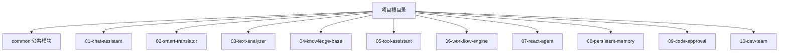
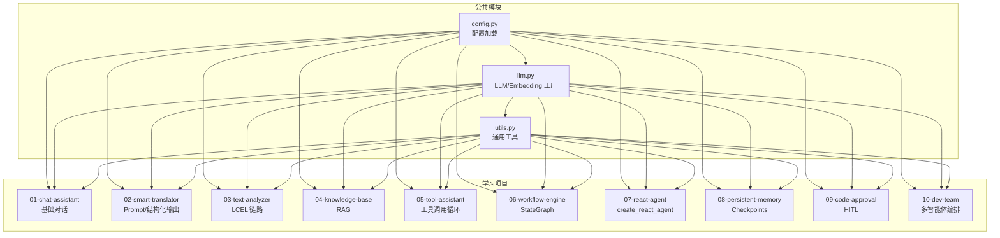
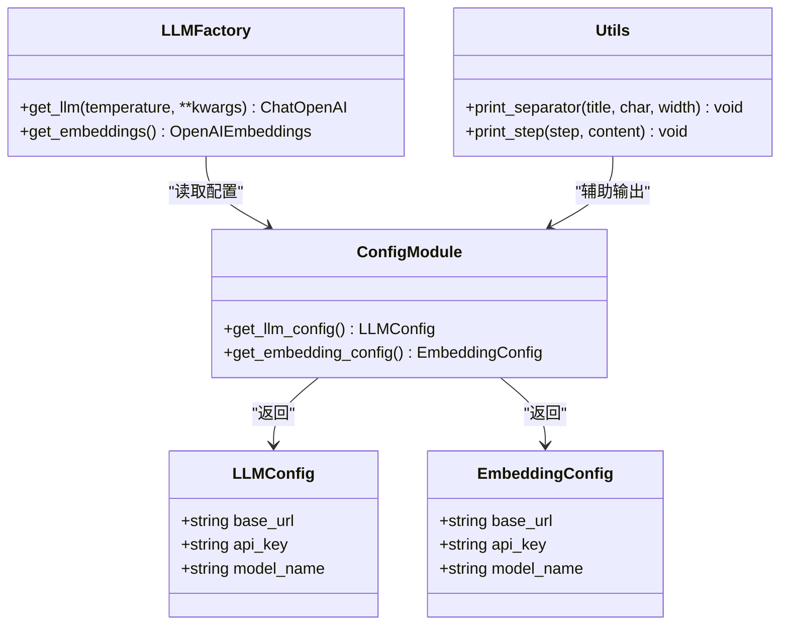
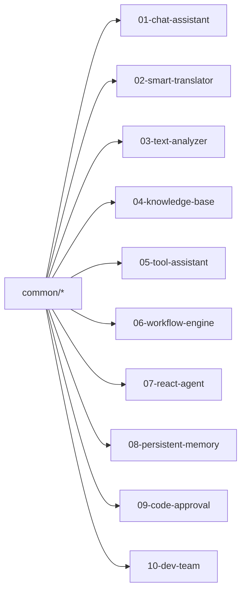
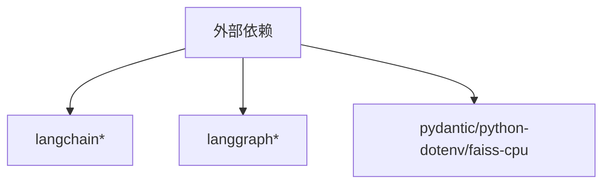

# 项目结构说明

<cite>
**本文引用的文件**
- [README.md](file://README.md)
- [pyproject.toml](file://pyproject.toml)
- [common/__init__.py](file://common/__init__.py)
- [common/config.py](file://common/config.py)
- [common/llm.py](file://common/llm.py)
- [common/utils.py](file://common/utils.py)
- [01-chat-assistant/main.py](file://01-chat-assistant/main.py)
- [02-smart-translator/main.py](file://02-smart-translator/main.py)
- [03-text-analyzer/main.py](file://03-text-analyzer/main.py)
- [04-knowledge-base/main.py](file://04-knowledge-base/main.py)
- [05-tool-assistant/main.py](file://05-tool-assistant/main.py)
- [06-workflow-engine/main.py](file://06-workflow-engine/main.py)
- [07-react-agent/main.py](file://07-react-agent/main.py)
- [08-persistent-memory/main.py](file://08-persistent-memory/main.py)
- [09-code-approval/main.py](file://09-code-approval/main.py)
- [10-dev-team/main.py](file://10-dev-team/main.py)
- [10-dev-team/supervisor.py](file://10-dev-team/supervisor.py)
</cite>

## 目录
1. [简介](#简介)
2. [项目结构](#项目结构)
3. [核心组件](#核心组件)
4. [架构总览](#架构总览)
5. [详细组件分析](#详细组件分析)
6. [依赖分析](#依赖分析)
7. [性能考虑](#性能考虑)
8. [故障排查指南](#故障排查指南)
9. [结论](#结论)
10. [附录](#附录)

## 简介
本项目是一个“渐进式”学习路径，围绕 LangChain 与 LangGraph 框架，通过 10 个循序渐进的实战项目，帮助开发者从基础到高级掌握 LLM 应用开发。项目采用“公共模块复用 + 项目级独立实现”的组织方式，既保证了学习的连贯性，又便于独立探索每个项目的技术要点。

## 项目结构
项目采用“根目录 + 10 个学习项目 + common 公共模块”的扁平式组织结构，配合 pyproject.toml 的包配置，使 common 成为可被所有子项目导入的统一入口。

**图表来源**
- [README.md:89-108](file://README.md#L89-L108)
- [pyproject.toml:27-29](file://pyproject.toml#L27-L29)

**章节来源**
- [README.md:89-108](file://README.md#L89-L108)
- [pyproject.toml:1-29](file://pyproject.toml#L1-L29)

## 核心组件
- common/config.py：集中管理 LLM 与 Embedding 的配置加载，提供类型安全的配置对象与默认值，确保各项目一致的配置体验。
- common/llm.py：提供 LLM 与 Embedding 的工厂方法，屏蔽底层客户端差异，统一接入任意 OpenAI 兼容服务。
- common/utils.py：提供跨项目复用的工具函数（如命令行输出美化、步骤提示），并负责将项目根目录加入 Python 路径，便于相对导入 common。

这些组件构成了所有学习项目的“基础设施层”，确保各项目在配置、初始化与工具层面保持一致性。

**章节来源**
- [common/config.py:1-77](file://common/config.py#L1-L77)
- [common/llm.py:1-59](file://common/llm.py#L1-L59)
- [common/utils.py:1-33](file://common/utils.py#L1-L33)

## 架构总览
项目整体采用“公共模块 + 项目模块”的分层架构：
- 公共模块（common）：配置、LLM 初始化、工具函数
- 项目模块（01-10）：按学习阶段划分，逐步引入 LCEL、工具调用、StateGraph、Agent、Checkpoints、HITL、多智能体编排等主题

**图表来源**
- [common/config.py:1-77](file://common/config.py#L1-L77)
- [common/llm.py:1-59](file://common/llm.py#L1-L59)
- [common/utils.py:1-33](file://common/utils.py#L1-L33)
- [README.md:26-51](file://README.md#L26-L51)

## 详细组件分析

### common 公共模块
- 设计理念
  - 单一职责：配置加载、LLM/Embedding 初始化、通用工具
  - 可插拔：通过环境变量适配任意 OpenAI 兼容服务
  - 类型安全：使用 dataclass 提供清晰的配置结构
  - 低耦合：各项目仅通过 from common.xxx import yyy 引入，避免重复实现
- 复用策略
  - 所有项目在启动时导入 common.config 与 common.llm，确保 LLM 实例与配置一致
  - utils 提供统一的输出美化与步骤提示，提升学习体验的一致性

**图表来源**
- [common/config.py:17-77](file://common/config.py#L17-L77)
- [common/llm.py:13-59](file://common/llm.py#L13-L59)
- [common/utils.py:16-33](file://common/utils.py#L16-L33)

**章节来源**
- [common/config.py:1-77](file://common/config.py#L1-L77)
- [common/llm.py:1-59](file://common/llm.py#L1-L59)
- [common/utils.py:1-33](file://common/utils.py#L1-L33)

### 项目命名规范与功能定位
- 命名规范
  - 采用“序号-主题”的命名，序号递增体现学习路径；主题简洁表达项目核心功能
  - 例如：01-chat-assistant、05-tool-assistant、10-dev-team
- 功能定位（按学习阶段）
  - Phase 1：LangChain 基础（P1-P5）
    - P1：基础对话与消息历史维护
    - P2：Prompt 模板、结构化输出、LCEL 链路
    - P3：文本分析管道、Runnable 组合
    - P4：RAG 管线、检索增强、来源引用
    - P5：工具定义、bind_tools、工具调用循环
  - Phase 2：LangGraph 基础（P6-P7）
    - P6：StateGraph、状态、条件路由
    - P7：create_react_agent、Agent 循环
  - Phase 3：LangGraph 高级（P8-P10）
    - P8：Checkpoints、thread_id、对话摘要
    - P9：HITL、interrupt/resume、人机协作
    - P10：多智能体编排、Supervisor 路由、子图嵌套

**章节来源**
- [README.md:26-51](file://README.md#L26-L51)

### 项目间依赖关系与模块化设计
- 依赖关系
  - 所有项目均依赖 common（config、llm、utils）
  - 部分项目进一步依赖 LangChain/LangGraph 的特定组件（如 LCEL、StateGraph、Agent、Checkpoints）
- 模块化设计
  - 每个项目自包含：独立的 main.py、models.py、nodes.py/state.py 等，便于独立运行与调试
  - 公共逻辑集中在 common，避免重复，降低维护成本

**图表来源**
- [common/config.py:1-77](file://common/config.py#L1-L77)
- [common/llm.py:1-59](file://common/llm.py#L1-L59)
- [common/utils.py:1-33](file://common/utils.py#L1-L33)

**章节来源**
- [README.md:26-51](file://README.md#L26-L51)

### 项目导航指南
- 快速定位
  - 基础对话：01-chat-assistant/main.py
  - Prompt 与结构化输出：02-smart-translator/main.py
  - LCEL 管道：03-text-analyzer/main.py
  - RAG：04-knowledge-base/main.py
  - 工具调用：05-tool-assistant/main.py
  - StateGraph 工作流：06-workflow-engine/main.py
  - ReAct Agent：07-react-agent/main.py
  - Checkpoints 与记忆：08-persistent-memory/main.py
  - HITL 审批：09-code-approval/main.py
  - 多智能体团队：10-dev-team/main.py
- 公共模块
  - 配置与 LLM 初始化：common/config.py、common/llm.py
  - 通用工具：common/utils.py

**章节来源**
- [README.md:26-51](file://README.md#L26-L51)
- [01-chat-assistant/main.py:1-87](file://01-chat-assistant/main.py#L1-L87)
- [02-smart-translator/main.py:1-179](file://02-smart-translator/main.py#L1-L179)
- [03-text-analyzer/main.py:1-240](file://03-text-analyzer/main.py#L1-L240)
- [04-knowledge-base/main.py:1-189](file://04-knowledge-base/main.py#L1-L189)
- [05-tool-assistant/main.py:1-200](file://05-tool-assistant/main.py#L1-L200)
- [06-workflow-engine/main.py:1-238](file://06-workflow-engine/main.py#L1-L238)
- [07-react-agent/main.py:1-173](file://07-react-agent/main.py#L1-L173)
- [08-persistent-memory/main.py:1-308](file://08-persistent-memory/main.py#L1-L308)
- [09-code-approval/main.py:1-219](file://09-code-approval/main.py#L1-L219)
- [10-dev-team/main.py:1-284](file://10-dev-team/main.py#L1-L284)

### 目录结构最佳实践
- 扁平式组织：根目录直接放置 common 与 10 个项目，便于快速浏览与跳转
- 项目内自包含：每个项目拥有独立的入口脚本与资源文件，利于独立运行与教学演示
- 公共模块集中：将配置、LLM 初始化、工具函数收敛到 common，避免重复与分散
- 包配置：pyproject.toml 将 common 声明为可安装包，提升导入稳定性

**章节来源**
- [README.md:89-108](file://README.md#L89-L108)
- [pyproject.toml:27-29](file://pyproject.toml#L27-L29)

## 依赖分析
- 外部依赖
  - LangChain 生态：langchain、langchain-core、langchain-openai、langchain-community、langchain-text-splitters
  - LangGraph：langgraph、langgraph-checkpoint-sqlite
  - 工具库：pydantic、python-dotenv、faiss-cpu
- 内部依赖
  - 所有项目依赖 common（config、llm、utils）
  - 部分项目依赖 LangChain/LangGraph 的特定模块（如 LCEL、StateGraph、Agent、Checkpoints）

**图表来源**
- [pyproject.toml:7-21](file://pyproject.toml#L7-L21)

**章节来源**
- [pyproject.toml:1-29](file://pyproject.toml#L1-L29)

## 性能考虑
- LLM 调用
  - 使用统一的 get_llm 工厂，避免重复初始化带来的开销
  - 对于需要稳定性的任务（翻译、结构化输出），建议降低 temperature
- RAG 与向量化
  - 确保向量索引存在后再运行 RAG 示例，避免首次运行的额外开销
- 检查点与内存
  - 使用 InMemorySaver 时注意会话数量与消息长度，必要时启用摘要压缩或切换持久化方案
- 工具调用循环
  - 控制最大迭代次数，防止无限循环导致资源占用过高

## 故障排查指南
- 环境变量缺失
  - 现象：配置加载时报错，提示缺少 LLM 配置
  - 处理：复制 .env.example 为 .env，并填写 LLM_BASE_URL、LLM_MODEL_NAME 等
- LLM 连接失败
  - 现象：get_llm 调用报错或响应异常
  - 处理：确认 base_url 与 api_key 正确；尝试更换模型或提供商
- RAG 未生成向量索引
  - 现象：运行 P4 报告索引不存在
  - 处理：先运行 ingest.py 生成向量索引
- 多智能体交互异常
  - 现象：Supervisor 路由错误或流程卡死
  - 处理：检查 state 字段完整性与 next_agent 返回值；限制最大迭代次数
- 检查点状态异常
  - 现象：get_state 返回空或状态不一致
  - 处理：确认 thread_id 是否正确；必要时清理检查点或切换存储后端

**章节来源**
- [common/config.py:42-56](file://common/config.py#L42-L56)
- [04-knowledge-base/main.py:171-176](file://04-knowledge-base/main.py#L171-L176)
- [10-dev-team/supervisor.py:40-46](file://10-dev-team/supervisor.py#L40-L46)

## 结论
本项目通过清晰的学习路径与模块化的结构设计，将复杂的 LLM 应用开发拆解为可独立掌握的技能点。common 公共模块统一了配置与初始化，10 个学习项目覆盖了从基础对话到多智能体编排的完整技术栈。遵循本文的导航与最佳实践，开发者可以高效定位所需资源，快速上手并深入理解 LangChain 与 LangGraph 的核心能力。

## 附录
- 快速开始
  - 克隆仓库、创建虚拟环境、安装依赖、配置 .env、验证 LLM 连通性
- 学习路径概览
  - Phase 1：LangChain 基础（P1-P5）
  - Phase 2：LangGraph 基础（P6-P7）
  - Phase 3：LangGraph 高级（P8-P10）

**章节来源**
- [README.md:5-24](file://README.md#L5-L24)
- [README.md:26-73](file://README.md#L26-L73)